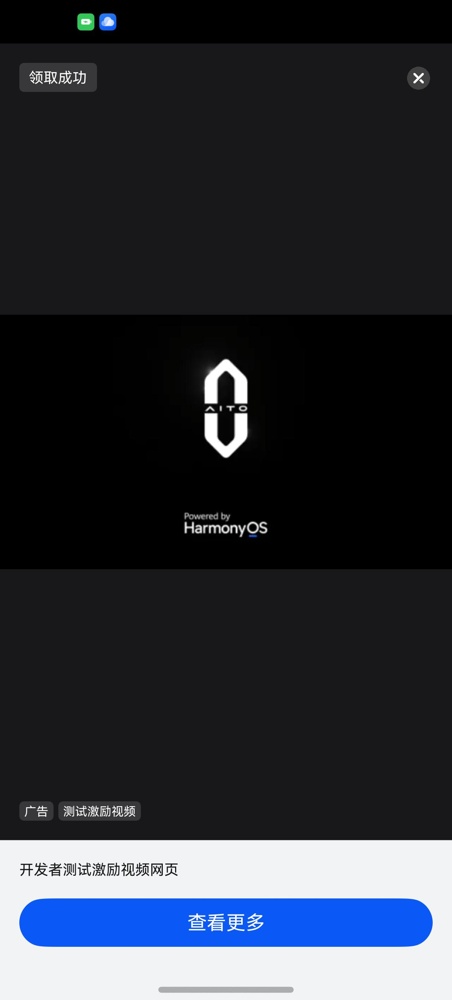

# 激励广告组件快速入门

## 目录

- [简介](#简介)
- [约束与限制](#约束与限制)
- [快速入门](#快速入门)
- [API参考](#API参考)
- [示例代码](#示例代码)

## 简介

本组件提供了展示激励广告的相关功能。



## 约束与限制

### 环境

- DevEco Studio版本：DevEco Studio 5.0.4 Release及以上
- HarmonyOS SDK版本：HarmonyOS 5.0.4 Release SDK及以上
- 设备类型：华为手机（直板机）
- HarmonyOS版本：HarmonyOS 5.0.4 Release及以上

## 使用

1. 安装组件。  
   如果是在DevEvo Studio使用插件集成组件，则无需安装组件，请忽略此步骤。
   如果是从生态市场下载组件，请参考以下步骤安装组件。  
   a. 解压下载的组件包，将包中所有文件夹拷贝至您工程根目录的xxx目录下。  
   b. 在项目根目录build-profile.json5并添加incentive_ad模块。
   ```typescript
   // 在项目根目录的build-profile.json5填写incentive_ad路径。其中xxx为组件存在的目录名
   "modules": [
     {
       "name": "incentive_ad",
       "srcPath": "./xxx/incentive_ad"
     }
   ]
   ```
   c. 在项目根目录oh-package.json5中添加依赖
   ```typescript
   // xxx为组件存放的目录名称
   "dependencies": {
     "incentive_ad": "file:../xxx/incentive_ad",
   }
   ```

2. 引入组件。

   ```typescript
   import { IncentiveAdvertising } from 'incentive_ad';
   ```

3. 调用组件，详细参数配置说明参见[API参考](#API参考)。

   ```typescript
    IncentiveAdvertising({
      adId: adId,
      adType: adType
   })
   ```

## API参考

### 接口

### 接口

IncentiveAdvertising(options?: IncentiveAdvertisingOptions)

搜索菜谱组件。

**参数：**

| 参数名     | 类型                                          | 必填 | 说明       |
|---------|---------------------------------------------|----|----------|
| options | [IncentiveAdvertisingOptions](#IncentiveAdvertisingOptions对象说明) | 否  | 搜索菜谱的参数。 |

### IncentiveAdvertisingOptions对象说明

| 参数名       | 类型     | 是否必填 | 说明         |
|:----------|:-------|:-----|:-----------|
| adType    | number | 是    | 广告类型       |
| adId      | string | 是    | 广告位ID      |
| oaid      | string | 否    | 开放匿名设备标识符  |

详见：[激励广告](https://developer.huawei.com/consumer/cn/doc/harmonyos-guides/ads-publisher-service-reward)

## 示例代码

```typescript
 import { IncentiveAdvertising } from 'incentive_ad';

@Entry
@ComponentV2
struct Index {

   build() {
      Column() {
         IncentiveAdvertising({
            adId:'testx9dtjwj8hp',
            adType:7
         })
      }
   }
}
```

