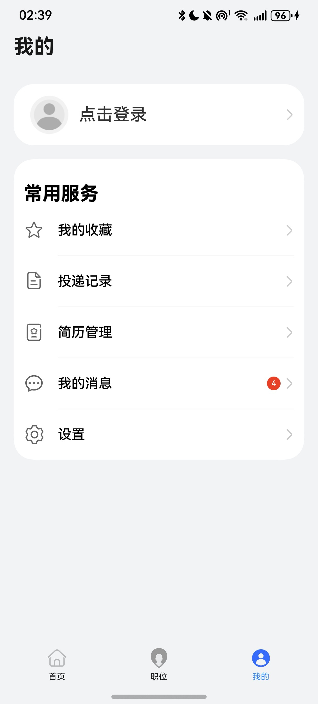

# 企业招聘模板快速入门

## 目录

- [功能介绍](#功能介绍)
- [约束和限制](#约束和限制)
- [快速入门](#快速入门)
- [示例效果](#示例效果)
- [开源许可协议](#开源许可协议)


## 功能介绍

您可以基于此模板直接定制应用，也可以挑选此模板中提供的多种组件使用，从而降低您的开发难度，提高您的开发效率。
此模板提供如下组件，所有组件存放在工程根目录的components下，如果您仅需使用组件，可参考对应组件的指导链接；如果您使用此模板，请参考本文档。

| 组件                         | 描述                   | 使用指导                                            |
|----------------------------|----------------------|-------------------------------------------------|
| 检测应用更新组件（check_app_update） | 提供检测应用是否存在新版本        | [使用指导](./components/check_app_update/README.md) |
| 文件管理组件（file_management）    | 提供文件上传，重命名，删除和文件预览功能 | [使用指导](./components/file_management/README.md)  |
| 消息管理组件（message_manager）    | 提供消息显示，阅读功能          | [使用指导](./components/message_manager/README.md)  |


本模板为企业招聘类应用提供了常用功能的开发样例，模板主要分首页、职位和我的三大模块：

* 首页：提供企业招聘banner轮播图、公司文化信息、企业生活等宣传介绍。

* 职位：支持不同地域和岗位类型的职位搜索、职位详情查看、简历投递和职位收藏功能。

* 我的：支持账号信息、简历信息、职位收藏信息和投递记录的查询和维护。

本模板已集成华为账号一键登录等服务，只需做少量配置和定制即可快速实现华为账号的登录功能。

| 首页                                                     | 职位列表页                                                | 我的                                                |
|--------------------------------------------------------|------------------------------------------------------|---------------------------------------------------|
|  |  |  |


本模板主要页面及核心功能如下所示：

```ts
企业招聘模板
 |-- 首页
 |    |-- 顶部轮播
 |    └-- 企业介绍tab
 |         └-- 关于我们
 |          |    |-- 公司简介
 |          |    |-- 企业文化
 |          |    |-- 企业愿景
 |          |    |-- 企业责任
 |          |    └-- 质量要求
 |          └-- 企业生活
 |               |-- 企业期望
 |               |-- 兴趣小组
 |               └-- 程序猿节
 |-- 职位
 |    └-- 职位搜索
 |     |-- 职位过滤筛选
 |     └-- 职位列表
 |          └-- 职位详情
 |                  └-- 职位收藏
 |                   └-- 简历投递
 |                         └-- 应聘者信息、简历上传
 └-- 我的
      |-- 华为账号一键登录/用户信息
      |-- 我的收藏
      |-- 投递记录
      |-- 简历管理
      |-- 我的消息
      └-- 设置
```


本模板工程代码结构如下所示：

```ts
EnterpriseRecruitment
  |- commons                                       // 公共层
  |   └- component/src/main/ets                    // 公共工具模块(har)
  |        |- clazz 
  |        |     AvoidArea.ets                     // 规避区
  |        |     DeliveryDatabase.ets              // 投递数据类
  |        |     DeliveryRecord.ets                // 投递记录类
  |        |     Divider.ets                       // 分割线
  |        |     FavoriteDatabase.ets              // 职位收藏类
  |        |     JobListItem.ets                   // 职位列表类
  |        |     UserContactInfo.ets               // 用户联系信息
  |        |     UserInfo.ets                      // 用户信息类
  |        |- component
  |        |     AdaptiveButton.ets                // 自适应按钮
  |        |     Avatar.ets                        // 头像
  |        |     FilterButton.ets                  // 过滤按钮
  |        |     LeftReturnComponent.ets           // 返回按钮
  |        |     PromptComponent.ets               // 提示弹框组件
  |        |     SwiperComponent.ets               // 轮播图组件
  |        |     TitleBar.ets                      // 标题Bar
  |        |     TopBar.ets                        // 页面顶部Bar
  |        |- constants 
  |        |     CommonContants.ets                // 公共常量
  |        |     CommonEnums.ets                   // 公共枚举
  |        |     ShowToast.ets                     // 吐司
  |        |- controller 
  |        |     BreakPointController.ets          // 适配折叠屏控制器
  |        |- model 
  |        |     CommonModel.ets                   // 常用模型
  |        └- utils 
  |              AccountUtil.ets                   // 账号管理工具
  |              Logger.ets                        // 日志管理工具
  |              ObjectUtil.ets                    // object工具类
  |              PermissionUtil.ets                // 授权申请类
  |              RouterModule.ets                  // 路由管理类
  |              StringUtil.ets                    // string工具类
  |    
  |- components                                    // 核心组件
  |   |- check_app_update/src/main/ets             // 检测应用是否更新（har）
  |   |    |- components  
  |   |    |     FindNewVersion.ets                // 发现新版本弹窗视图  
  |   |    |
  |   |    |- model  
  |   |    |     Params.ets                        // 向视图中传递的参数  
  |   |    |       
  |   |    |- utils  
  |   |    |     AppUpdateUtil.ets                 // 检测应用新版本工具类
  |   |    |     DialogController.ets              // 弹窗控制器
  |   |    | 
  |   |- file_management/src/main/ets              // 文件管理模块（har）
  |   |    |- components  
  |   |    |     FileManagement.ets                // 文件管理  
  |   |    |     ResumeComponent.ets               // 简历  
  |   |    |  
  |   |    |- model 
  |   |    |     AttachmentDatabase.ets            // 简历管理数据
  |   |    |     BasicDataSource.ets               // 数据操作监听
  |   |    |     DocumentType.ets                  // 文件类型
  |   |    |     FileDataSource.ets                // 懒加载数据
  |   |    |     ResumeEntity.ets                  // 简历类
  |   |    |  
  |   |    └- utils 
  |   |          DateUtil.ets                      // 日期工具类
  |   |
  |   |- message_manager/src/main/ets              // 消息模块（har）
  |   |    |- components  
  |   |    |     ArticleCard.ets                   // 文章卡片 
  |   |    |     ArticleDetail.ets                 // 卡片一详情  
  |   |    |     MessageCard.ets                   // 消息卡片
  |   |    |     MessageDetail.ets                 // 消息详情  
  |   |    |     MessageList.ets                   // 消息列表
  |   |    |     TabButton.ets                     // Tab按钮  
  |   |    |     TopicCard.ets                     // 主题卡片    
  |   |    |  
  |   |    └- model 
  |   |          MessageManagerService.ets         // 消息管理
  |   |          model.ets                         // 模型
  |   |          TabController.ets                 // 管理Tab Controller
  |   |
  |   └- ui_steps/src/main/ets                     // 流程模块（har）
  |        |- common  
  |        |     Constants.ets                     // 常量  
  |        |     StepModel.ets                     // 模型  
  |        |  
  |        └- components 
  |              UISteps.ets                       // 流程视图
  |
  └- product                                       // 应用层  
      └- phone/src/main/ets                        // 主包(hap)
           |- common  
           |      └- LoginConstants.ets            // 登录常量                                                                    
           |- entryability  
           |      └- EntryAbility.ets              //  程序入口                                                   
           |- information                          
           |      |- clazz 
           |      |      └-Article.ets             //  详情类
           |      |- AboutUs.ets                   //  关于我们二层tab
           |      └- Introductions.ets             //  企业生活二层tab
           |- mine                                 //  我的     
           |      └- MineListItem.ets              //  我的常用服务列表         
           └- pages      
                  |- homepage     
                  |   └- CompanyIntroduction.ets   //  公司介绍                              
                  |- jobRoute     
                  |   |- JobDelivery.ets           //  简历投递页面   
                  |   └- JobDetail.ets             //  职位详情页面   
                  └- mine
                      |- common            
                      |   |- Constants.ets         //  我的-一键登录的Constants
                      |   └- ShowToast.ets         //  我的-统一ShowToast
                      |- my_message            
                      |   |- CardHome.ets          //  卡片
                      |   |- JobDetail.ets         //  卡片详情
                      |   |- JobNewList.ets        //  新职位
                      |   |- MessageDetail.ets     //  消息详情
                      |   └- MyMessage.ets         //  我的消息
                      |- AvatarUpload.ets          //  头像修改
                      |- MyDelivery.ets            //  我的简历投递   
                      |- MyFavorite.ets            //  我的收藏岗位  
                      |- PersonalInfo.ets          //  个人信息页
                      |- PersonalSetting.ets       //  个人设置页
                      |- PrivacyAgreement.ets      //  个人隐私  
                      |- QuickLoginPage.ets        //  一键登录页
                      |- RenamePage.ets            //  重命名
                      └- ResumeManagement.ets      //  我的简历管理   
                        Index.ets                  //  入口   
                        Information.ets            //  导航tab（首页 页面）   
                        Job.ets                    //  导航tab（职位 页面）  
                        Mine.ets                   //  导航tab（我的 页面）                                                           
```
## 约束和限制
### 环境
- DevEco Studio版本：DevEco Studio 5.0.1 Release及以上
- HarmonyOS SDK版本：HarmonyOS 5.0.1(13) Release SDK及以上
- 设备类型：华为手机（直板机）
- HarmonyOS版本：HarmonyOS 5.0.1 Release及以上
### 权限
- 网络权限：ohos.permission.INTERNET

## 快速入门
###  配置工程
在运行此模板前，需要完成以下配置：

1. 在AppGallery Connect创建应用，将包名配置到模板中。

   a. 参考[创建HarmonyOS应用](https://developer.huawei.com/consumer/cn/doc/app/agc-help-createharmonyapp-0000001945392297)为应用创建APP ID，并将APP ID与应用进行关联。

   b. 返回应用列表页面，查看应用的包名。

   c. 将模板工程根目录下AppScope/app.json5文件中的bundleName替换为创建应用的包名。

2. 配置华为账号服务。

   a. 将应用的client ID配置到product/phone模块的src/main/module.json5文件，详细参考：[配置Client ID](https://developer.huawei.com/consumer/cn/doc/harmonyos-guides/account-client-id)。

   b. 申请华为账号一键登录所需的quickLoginMobilePhone权限，详细参考：[配置scope权限](https://developer.huawei.com/consumer/cn/doc/harmonyos-guides/account-config-permissions)。

3. 为应用进行[手工签名](https://developer.huawei.com/consumer/cn/doc/harmonyos-guides/ide-signing#section297715173233)。
4. 添加手工签名所用证书对应的公钥指纹，详细参考：[配置应用证书指纹](https://developer.huawei.com/consumer/cn/doc/app/agc-help-signature-info-0000001628566748#section5181019153511)。

### 运行调试工程
1. 用USB线连接调试手机和PC。
2. 菜单选择“Run > Run 'phone' ”或者“Run > Debug 'phone' ”，运行或调试模板工程。

## 示例效果
- [首页-关于我们.jpg](pictures%2F%E9%A6%96%E9%A1%B5-%E5%85%B3%E4%BA%8E%E6%88%91%E4%BB%AC.jpg)
- [首页-企业生活.jpg](pictures%2F%E9%A6%96%E9%A1%B5-%E4%BC%81%E4%B8%9A%E7%94%9F%E6%B4%BB.jpg)
- [职位搜索功能.jpg](pictures%2F%E8%81%8C%E4%BD%8D%E6%90%9C%E7%B4%A2%E5%8A%9F%E8%83%BD.jpg)
- [职位筛选功能.jpg](pictures%2F%E8%81%8C%E4%BD%8D%E7%AD%9B%E9%80%89%E5%8A%9F%E8%83%BD.jpg)
- [职位详情页.jpg](pictures%2F%E8%81%8C%E4%BD%8D%E8%AF%A6%E6%83%85%E9%A1%B5.jpg)
- [简历投递.jpg](pictures%2F%E7%AE%80%E5%8E%86%E6%8A%95%E9%80%92.jpg)
- [我的-头像昵称修改.jpg](pictures%2F%E6%88%91%E7%9A%84-%E5%A4%B4%E5%83%8F%E6%98%B5%E7%A7%B0%E4%BF%AE%E6%94%B9.jpg)
- [我的-职位收藏记录.jpg](pictures%2F%E6%88%91%E7%9A%84-%E8%81%8C%E4%BD%8D%E6%94%B6%E8%97%8F%E8%AE%B0%E5%BD%95.jpg)
- [我的-职位投递记录.jpg](pictures%2F%E6%88%91%E7%9A%84-%E8%81%8C%E4%BD%8D%E6%8A%95%E9%80%92%E8%AE%B0%E5%BD%95.jpg) -
- [我的-简历管理-上传简历.jpg](pictures%2F%E6%88%91%E7%9A%84-%E7%AE%80%E5%8E%86%E7%AE%A1%E7%90%86-%E4%B8%8A%E4%BC%A0%E7%AE%80%E5%8E%86.jpg)
- [我的-简历管理-重命名 删除.jpg](pictures%2F%E6%88%91%E7%9A%84-%E7%AE%80%E5%8E%86%E7%AE%A1%E7%90%86-%E9%87%8D%E5%91%BD%E5%90%8D%20%E5%88%A0%E9%99%A4.jpg)


## 开源许可协议

该代码经过[Apache 2.0 授权许可](http://www.apache.org/licenses/LICENSE-2.0)。

