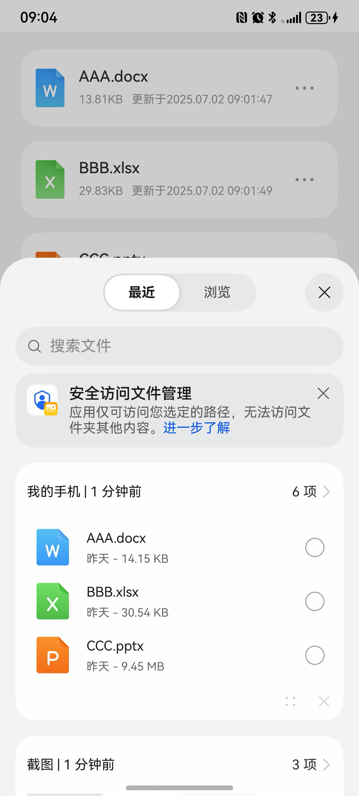
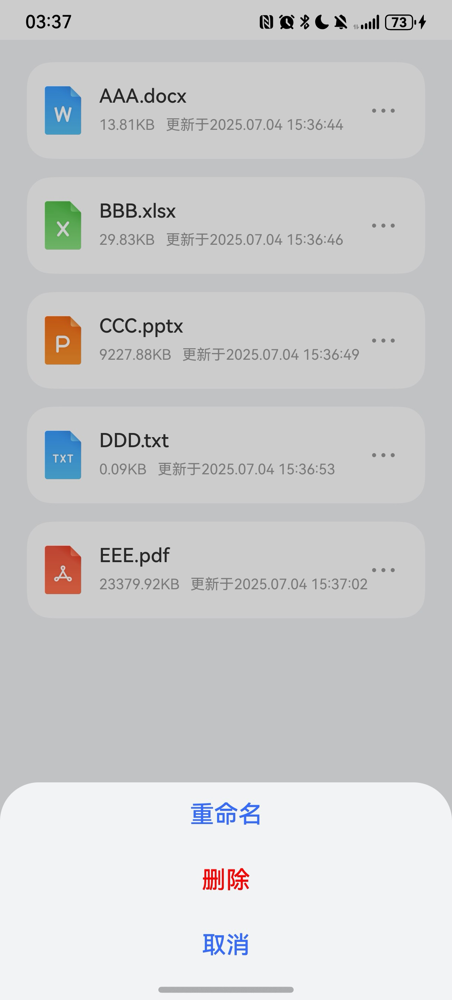
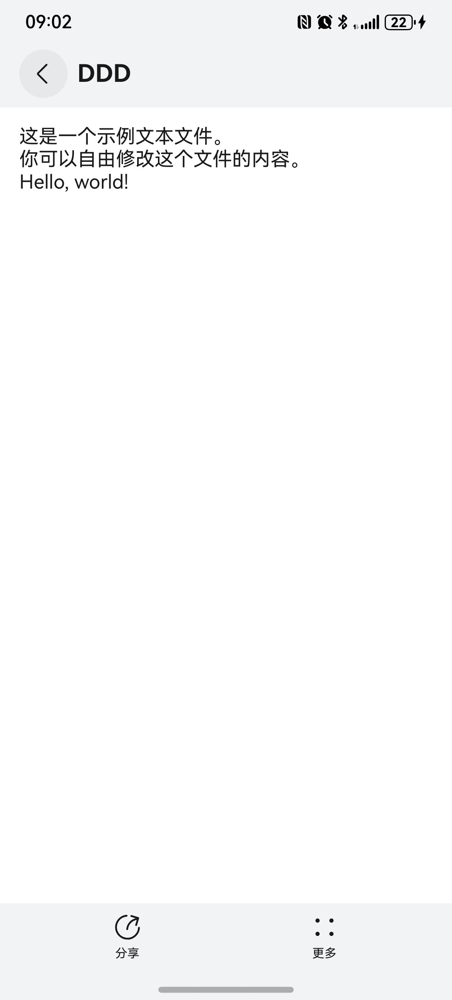
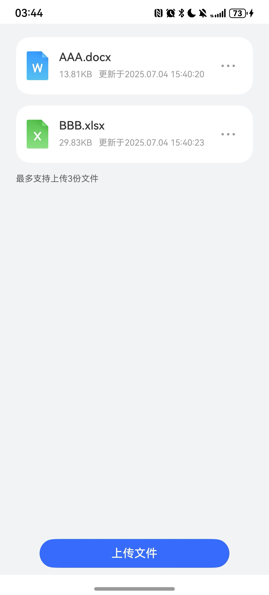
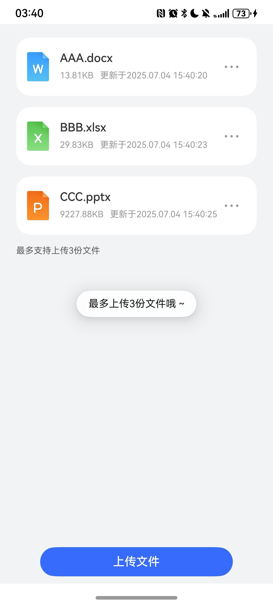

# 文件管理快速入门

## 目录

- [简介](#简介)
- [约束与限制](#约束与限制)
- [快速入门](#快速入门)
- [API参考](#API参考)
- [示例代码](#示例代码)

## 简介

本组件提供了文件上传，重命名，删除和文件预览功能。


| 文件上传                                                      | 设置 | 文件预览                                                         | 
|-----------------------------------------------------------| ---- |--------------------------------------------------------------| 
|  |      |  |    

## 约束与限制
### 环境
* DevEco Studio版本：DevEco Studio 5.0.1 Release及以上
* HarmonyOS SDK版本：HarmonyOS 5.0.1(13) Release SDK及以上
* 设备类型：华为手机（直板机）
* HarmonyOS版本：HarmonyOS 5.0.1 Release及以上


## 快速入门

1. 安装组件。

    如果是在DevEvo Studio使用插件集成组件，则无需安装组件，请忽略此步骤。
	
	如果是从生态市场下载组件，请参考以下步骤安装组件。	
	
	a. 解压下载的组件包，将包中所有文件夹拷贝至您工程根目录的XXX目录下。

    b. 在项目根目录build-profile.json5添加file_management模块。

    ```typescript
    // 在项目根目录build-profile.json5填写file_management路径。其中XXX为组件存放的目录名
    "modules": [
        {
          "name": "file_management",
          "srcPath": "./XXX/file_management",
        }
    ]
    ```
    c. 在项目根目录oh-package.json5中添加依赖。
    ```typescript
    // XXX为组件存放的目录名称
    "dependencies": {
      "file_management": "file:./XXX/file_management"
    }
   ```
   
2. 引入组件。

   ```typescript
   import { DocumentType, FileManagement, FileDataSource, ResumeEntity } from 'file_management';
   ```
   
3. 调用组件，详细参数配置说明参见[API参考](#API参考)。

```typescript
import { DocumentType, FileManagement, FileDataSource, ResumeEntity } from 'file_management';

@Entry
@ComponentV2
struct Index {
  @Local resumeData: FileDataSource<ResumeEntity> = new FileDataSource();

  build() {
    Column(){
      FileManagement({
        resumeData: this.resumeData,
        buttonText: '上传文件',
        documentTypeArray:[DocumentType.PDF, DocumentType.TXT, DocumentType.DOCX, DocumentType.PPTX, DocumentType.XLSX]
      })
    }
    .backgroundColor('#F1F3F5')
      .width('100%')
      .height('100%')
  }
}
```

## API参考

### 子组件

无

### 接口

FileManagement(options: FileManagementOptions)

文件管理组件。

**参数：**

| 参数名  | 类型                                                         | 必填 | 说明       |
| ------- | ------------------------------------------------------------ | ---- |----------|
| options | [FileManagementOptions](#FileManagementOptions对象说明) | 否   | 上传文件的参数。 |

### FileManagementOptions对象说明

| 名称                  | 类型                                                | 必填 | 说明       |
| --------------------- |---------------------------------------------------|----|----------|
| resumeData           | FileDataSource<[ResumeEntity](#ResumeEntity对象说明)> | 否  | 文件集合     |
| buttonText         | string                                            | 是  | 页面按钮文字   |
| documentTypeArray         | Array<[DocumentType](#DocumentType对象说明)>          | 是  | 文件类型枚举   |
| limitCount         | number                                            | 否  | 限制文件上传数量 |

### ResumeEntity对象说明

| 名称         | 类型                | 必填 | 说明           |
|------------|-------------------|----|--------------|
| name       | string            | 是  | 文件名称         |
| suffix     | string            | 是  | 文件后缀         |
| uri        | string            | 是  | 文件沙箱路径       |
| size       | string            | 是  | 文件大小(以KB为单位) |
| updateTime | string            | 是  | 文件修改时间       |


### DocumentType对象说明

| 名称    | 说明     |
|-------|--------|
| PDF   | PDF文件  |
| TXT   | TXT文件  |
| DOC   | DOC文件  |
| DOCX  | DOCX文件 |
| XLS   | XLS文件  |
| XLSX  | XLSX文件 |
| PPT   | PPT文件  |
| PPTX  | PPTX文件 |

## 示例代码
### 示例1（未限制文件上传数量）
```typescript
import { DocumentType, FileManagement, FileDataSource, ResumeEntity } from 'file_management';

@Entry
@ComponentV2
struct Index {
  @Local resumeData: FileDataSource<ResumeEntity> = new FileDataSource();

  build() {
    Column() {
      FileManagement({
        resumeData: this.resumeData,
        buttonText: '上传文件',
        documentTypeArray:[DocumentType.PDF, DocumentType.TXT, DocumentType.DOCX, DocumentType.PPTX, DocumentType.XLSX],
      })
    }
    .backgroundColor('#F1F3F5')
      .width('100%')
      .height('100%');
  }
}
```


| 文件上传                                                      | 设置 | 文件预览                                                         | 
|-----------------------------------------------------------| ---- |--------------------------------------------------------------| 
|  |      |  |


### 示例2（限制文件上传数量）
```typescript
import { DocumentType, FileManagement, FileDataSource, ResumeEntity } from 'file_management';

@Entry
@ComponentV2
struct Index {
  @Local resumeData: FileDataSource<ResumeEntity> = new FileDataSource();

  build() {
    Column() {
      FileManagement({
        resumeData: this.resumeData,
        buttonText: '上传文件',
        documentTypeArray:[DocumentType.PDF, DocumentType.TXT, DocumentType.DOCX, DocumentType.PPTX, DocumentType.XLSX],
        limitCount: 3
      })
    }
    .backgroundColor('#F1F3F5')
      .width('100%')
      .height('100%');
  }
}
```


| 文件上传                                                      | 显示限制上传文件                                                          | 限制文件吐司                                                                     | 
|-----------------------------------------------------------|-------------------------------------------------------------------|--------------------------------------------------------------------------| 
|  |  |  |
