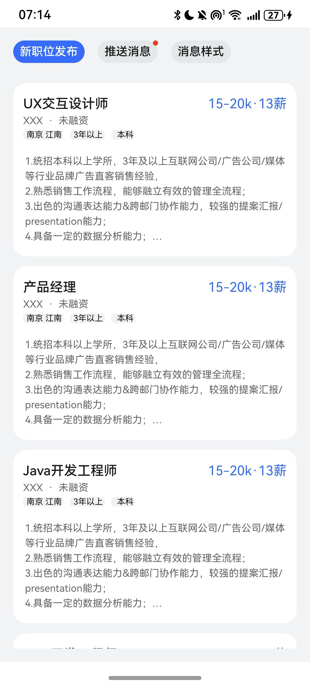
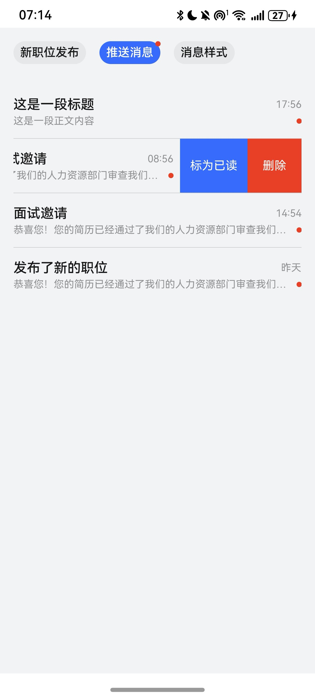
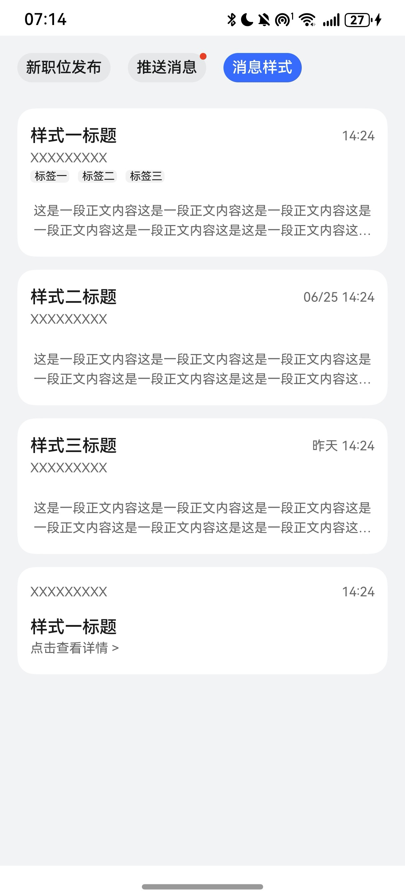

# 消息管理快速入门

## 目录

- [简介](#简介)
- [约束与限制](#约束与限制)
- [快速入门](#快速入门)
- [API参考](#API参考)
- [示例代码](#示例代码)

## 简介

本组件提供了消息展示，已读、未读、删除查看等功能。


| 消息列表                                                            | 标记已读\删除                                                   | 卡片列表                                                           | 
|-----------------------------------------------------------------|-----------------------------------------------------------|----------------------------------------------------------------| 
|  |  |  |    

## 约束与限制
### 环境
* DevEco Studio版本：DevEco Studio 5.0.1 Release及以上
* HarmonyOS SDK版本：HarmonyOS 5.0.1(13) Release SDK及以上
* 设备类型：华为手机（直板机）
* HarmonyOS版本：HarmonyOS 5.0.1 Release及以上


## 快速入门

1. 安装组件。

    如果是在DevEvo Studio使用插件集成组件，则无需安装组件，请忽略此步骤。
	
	如果是从生态市场下载组件，请参考以下步骤安装组件。	
	
	a. 解压下载的组件包，将包中所有文件夹拷贝至您工程根目录的XXX目录下。

    b. 在项目根目录build-profile.json5添加message_manager模块。

    ```typescript
    // 在项目根目录build-profile.json5填写message_manager路径。其中XXX为组件存放的目录名
    "modules": [
        {
          "name": "message_manager",
          "srcPath": "./XXX/message_manager",
        }
    ]
    ```
    c. 在项目根目录oh-package.json5中添加依赖。
    ```typescript
    // XXX为组件存放的目录名称
    "dependencies": {
      "message_manager": "file:./XXX/message_manager"
    }
   ```
   
2. 引入组件句柄。

   ```typescript
   import {  MessageList, TabButton, TabController, MessageManagerService, MessageItem, CardData, ArticleCard, TopicCard } from 'message_manager';
   ```
   
3. 调用组件，详细参数配置说明参见[API参考](#API参考)。

```typescript
import { MessageList, TabButton, TabController, MessageManagerService, MessageItem,
  CardData,
  ArticleCard,
  TopicCard} from 'message_manager'

@Entry
@ComponentV2
export struct MyMessage {
  @Local currentIndex: number = 0;
  messageManagerService:MessageManagerService = MessageManagerService.instance;
  tabList: TabController[] = [
    new TabController('新职位发布'),
    new TabController('推送消息', true),
    new TabController('消息样式')
  ]
  swiperController: SwiperController = new SwiperController();
  messageList: MessageItem[] = this.messageManagerService.getMessageList();
  newJobList: CardData[] = this.messageManagerService.getJobDataList();
  cardList: CardData[] = this.messageManagerService.getCardDataList()

  aboutToAppear(): void {
    this.swiperController.changeIndex(this.currentIndex)
  }

  build() {
    Column({space:24}) {
      Row({space:16}) {
        ForEach(this.tabList, (item: TabController, index: number) => {
          TabButton({
            isActive: index === this.currentIndex,
            tabController:item,
            statusChange:() => {
              this.currentIndex = index;
              this.swiperController.changeIndex(index)
            }
          })
        }, (item:TabController) => JSON.stringify(item))
      }
      .width('100%')

      Swiper(this.swiperController) {
        List({space:12}) {
          ForEach(this.newJobList, (item: CardData) => {
            ArticleCard({
              cardStyle: {
                timeColor:'#376BFC',
                timeFontSize: 16,
                maxLines: 6
              },
              cardData:item,
              itemClick:() => {
                console.log('跳转事件')
              }
            })
          }, (item: CardData) => JSON.stringify(item))
        }
        .scrollBar(BarState.Off)

        MessageList({
          list:this.messageList,
          itemClick:(item:MessageItem) => {
            console.log('跳转事件')
          }
        })

        List({space:12}) {
          ForEach(this.cardList, (item:CardData) => {
            ArticleCard({
              cardStyle: {
                maxLines: 2
              },
              cardData:item,
              itemClick:() => {
                console.log('跳转事件')
              }
            })
          }, (item:CardData) => JSON.stringify(item))
          TopicCard({
            cardData:this.cardList[0],
            itemClick:() => {
              console.log('跳转事件')
            }
          })
        }
        .scrollBar(BarState.Off)
      }
      .width('100%')
      .loop(false)
      .indicator(false)
      .layoutWeight(1)
      .onChange((index:number) => {
        this.currentIndex = index;
      })
    }
    .backgroundColor('#F1F3F5')
    .width('100%')
    .height('100%')
    .padding(16)
  }
}
```

## API参考

### 子组件

ArticleCard

### 接口

ArticleCard(options: ArticleCardOptions)

文件管理组件。

**参数：**

| 参数名  | 类型                                            | 必填 | 说明       |
| ------- |-----------------------------------------------| ---- |----------|
| options | [ArticleCardOptions](#ArticleCardOptions对象说明) | 否   | 卡片组件的参数。 |

### ArticleCardOptions对象说明

| 名称        | 类型                          | 必填 | 说明   |
|-----------|-----------------------------|----|------|
| cardData  | [CardData](#CardData对象说明)   | 是  | 卡片数据 |
| cardStyle | [CardStyle](#CardStyle对象说明) | 否  | 卡片样式 |
| itemClick | Function                    | 是  | 点击事件 |

### CardData对象说明

| 名称          | 类型            | 必填 | 说明 |
|-------------|---------------|----|----|
| title       | string        | 是  | 标题 |
| time        | string        | 是  | 时间 |
| description | string        | 否  | 描述 |
| mark        | Array<string> | 否  | 标签 |
| content     | string        | 是  | 内容 |


### CardStyle对象说明

| 名称                  | 类型              |必填| 说明     |
|---------------------|-----------------|------|--------|
| bgColor             | string/Resource |否     | 卡片背景色  |
| borderRadius        | number/Resource |否     | 卡片圆角   |
| titleFontSize       | number/Resource |否     | 标题字体大小 |
| titleColor          | string/Resource |否     | 标题字体颜色 |
| timeFontSize        | number/Resource |否     | 时间字体大小 |
| timeColor           | string/Resource |否     | 时间字体颜色 |
| descriptionFontSize | number/Resource |否     | 描述字体大小 |
| descriptionColor    | string/Resource |否     | 描述字体颜色 |
| contentFontSize     | number/Resource |否     | 内容字体大小 |
| contentColor        | string/Resource |否     | 内容字体颜色 |
| maxLines            | number          |否     | 展示行数   |

## 示例代码
```typescript
import { MessageList, TabButton, TabController, MessageManagerService, MessageItem,
  CardData,
  ArticleCard,
  TopicCard} from 'message_manager'

@Entry
@ComponentV2
export struct Index {
  @Local currentIndex: number = 0;
  messageManagerService:MessageManagerService = MessageManagerService.instance;
  tabList: TabController[] = [
    new TabController('新职位发布'),
    new TabController('推送消息', true),
    new TabController('消息样式')
  ]
  swiperController: SwiperController = new SwiperController();
  messageList: MessageItem[] = this.messageManagerService.getMessageList();
  newJobList: CardData[] = this.messageManagerService.getJobDataList();
  cardList: CardData[] = this.messageManagerService.getCardDataList()

  aboutToAppear(): void {
    this.swiperController.changeIndex(this.currentIndex)
  }

  build() {
    Column({space:24}) {
      Row({space:16}) {
        ForEach(this.tabList, (item: TabController, index: number) => {
          TabButton({
            isActive: index === this.currentIndex,
            tabController:item,
            statusChange:() => {
              this.currentIndex = index;
              this.swiperController.changeIndex(index)
            }
          })
        }, (item:TabController) => JSON.stringify(item))
      }
      .width('100%')

      Swiper(this.swiperController) {
        List({space:12}) {
          ForEach(this.newJobList, (item: CardData) => {
            ArticleCard({
              cardStyle: {
                timeColor:'#376BFC',
                timeFontSize: 16,
                maxLines: 6
              },
              cardData:item,
              itemClick:() => {
                console.log('跳转事件')
              }
            })
          }, (item: CardData) => JSON.stringify(item))
        }
        .scrollBar(BarState.Off)

        MessageList({
          list:this.messageList,
          itemClick:(item:MessageItem) => {
            console.log('跳转事件')
          }
        })

        List({space:12}) {
          ForEach(this.cardList, (item:CardData) => {
            ArticleCard({
              cardStyle: {
                maxLines: 2
              },
              cardData:item,
              itemClick:() => {
                console.log('跳转事件')
              }
            })
          }, (item:CardData) => JSON.stringify(item))
          TopicCard({
            cardData:this.cardList[0],
            itemClick:() => {
              console.log('跳转事件')
            }
          })
        }
        .scrollBar(BarState.Off)
      }
      .width('100%')
        .loop(false)
        .indicator(false)
        .layoutWeight(1)
        .onChange((index:number) => {
          this.currentIndex = index;
        })
    }
    .backgroundColor('#F1F3F5')
      .width('100%')
      .height('100%')
      .padding(16)
  }
}
```

| 消息列表                                                            | 标记已读\删除                                                   | 卡片列表                                                           | 
|-----------------------------------------------------------------|-----------------------------------------------------------|----------------------------------------------------------------| 
|  |  |  |    
