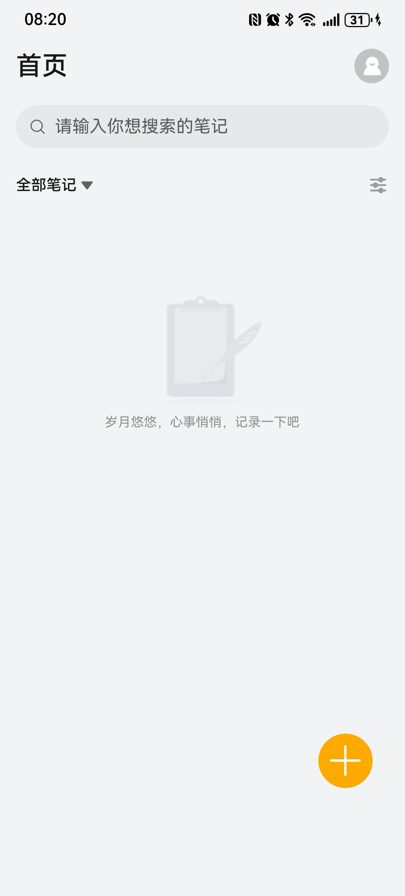
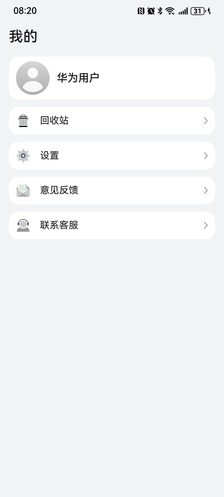
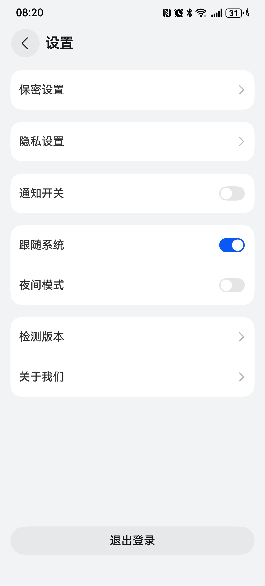

# 商务（笔记）应用模板快速入门

## 目录
- [功能介绍](#功能介绍)
- [约束和限制](#约束和限制)
- [快速入门](#快速入门)
- [示例效果](#示例效果)
- [开源许可协议](#开源许可协议)


## 功能介绍

您可以基于此模板直接定制应用，也可以挑选此模板中提供的多种组件使用，从而降低您的开发难度，提高您的开发效率。

此模板提供如下组件，所有组件存放在工程根目录的components下，如果您仅需使用组件，可参考对应组件的指导链接；如果您使用此模板，请参考本文档。

| 组件                            | 描述    | 使用指导                                             |
|-------------------------------|-------|--------------------------------------------------|
| 应用密码设置组件（secretlock）          | 应用密码设置 | [使用指导](components/secretlock/README.md)      |
| 富文本组件_属性字符串（richeditor）       | 富文本编辑 | [使用指导](components/richeditor/README.md)    |

本模板为笔记类应用提供了常用功能的开发样例，模板主要分首页、我的两大模块：

1、首页：展示全部笔记，分类，搜索，多选，排序，编辑笔记

2、我的：提供回收站，保密设置，夜间模式等


本模板已集成账号服务，只需做少量配置和定制即可快速实现华为账号一键登录。


| 首页                                    | 我的                                | 设置                                                             |
|---------------------------------------|-----------------------------------|----------------------------------------------------------------|
|  |  |  |


本模板主要页面及核心功能如下所示：

```ts
笔记模板
 |-- 首页
 |    |-- 搜索
 |    |-- 笔记分类
 |    |    |-- 新建分类
 |    |    |-- 重命名 
 |    |    └-- 删除分类
 |    |-- 排序
 |    |    |-- 按创建时间排序
 |    |    └-- 按修改时间排序     
 |    |-- 笔记列表
 |    |    |-- 按列表展示
 |    |    |-- 按卡片展示
 |    |    └-- 长按多选
 |    |-- 创建笔记
 |    |    |-- 保存
 |    |    |-- 撤销回退
 |    |    |-- 上传图片
 |    |    |-- 文本样式修改
 |    |    |-- 复制内容
 |    |    └-- 分享笔记
 |    └-- 编辑笔记
 |         |-- 内容回显
 |    |    |-- 复制内容
 |         └-- 分享笔记
 └-- 我的
      |-- 用户信息
      |    |-- 华为账号一键登录
      |    └-- 头像昵称修改
      └-- 回收站
      |    |-- 搜索笔记
      |    |-- 恢复笔记
      |    |-- 排序方式
      |    └-- 彻底删除
      |-- 设置
      |    |-- 保密设置
      |    |    |-- 手势密码
      |    |    └-- 指纹解锁
      |    |-- 隐私设置
      |    |-- 通知开关
      |    |-- 夜间模式
      |    |-- 检测版本
      |    |-- 关于我们
      |    └-- 退出登录
      └-- 联系客服
```


本模板工程代码结构如下所示：

```ts
Notes
  |- common                                        // 公共层
  |   |- datasource/src/main/ets/                  // 数据源
  |   |    |- CategoryService.ets                  // 分类服务
  |   |    |- Data.ets                             // mock数据
  |   |    |- Model.ets                            // 建立模型
  |   |    └- NoteService.ets                      // 笔记服务
  |   |
  |   └- utils/src/main/ets                        // 工具类
  |        |- constants   
  |        |     DateConstants.ets                 // 日期格式化常量     
  |        |- model
  |        |     GlobalInfoModel.ets               // 存储全局变量 
  |        |     NotificationConfig.ets            // 通知工具类,默认配置参数                   
  |        |     NotificationOptions.ets           // 通知工具类,描述通知的请求参数                  
  |        └- utils                                
  |              AppUtil.ets                       // App相关工具类  
  |              BreakpointSystem.ets              // 一多适配工具类  
  |              DateUtil.ets                      // 日期处理工具类
  |              DialogUtil.ets                    // 弹窗工具类
  |              LogUtil.ets                       // 日志工具类   
  |              NotificationUtil.ets              // 通知工具类 
  |              ObjectUtil.ets                    // 对象工具类   
  |              ReadDataUtil.ets                  // 读取数据工具类   
  |              StringUtil.ets                    // 字符串工具类
  |              WantUtil.ets                      // 跳转设置页面工具类
  |              WindowUtil.ets                    // 窗口工具类
  |
  |- components                                    // 公共组件
  |   |- check_app_update/src/main/ets             // 检测应用是否更新
  |   |    |- components  
  |   |    |     FindNewVersion.ets                // 发现新版本弹窗视图
  |   |    |- model  
  |   |    |     Params.ets                        // 向视图中传递的参数        
  |   |    └- utils  
  |   |          AppUpdateUtil.ets                 // 检测应用新版本工具类
  |   |          DialogUtil.ets              // 弹窗控制器
  |   |
  |   |- feed_back/src/main/ets                    // 意见反馈
  |   |    |- components  
  |   |    |     FeedBack.ets                      // 意见反馈视图
  |   |    |- model  
  |   |    |     FeedBackRecordModel.ets           // 意见反馈模型        
  |   |    └- utils  
  |   |          FileSelect.ets                    // 图片选择
  |   |          Logger.ets                        // 日志
  |   |          PreferenceUtil.ets                // 持久化
  |   |
  |   |- login/src/main/ets                        // 登录
  |   |    |- common  
  |   |    |     LoginConstants.ets                // 登录常量
  |   |    |- components  
  |   |    |     RightArrow.ets                    // 右箭头
  |   |    |- model  
  |   |    |     UserInfo.ets                      // 用户模型
  |   |    |- pages  
  |   |    |     QuickLoginPage.ets                // 一键登录页面        
  |   |    |     UserInfoPage.ets                  // 用户信息页面        
  |   |    └- utils  
  |   |          ReadDataUtil.ets                  // 读取数据工具类
  |   |      
  |   |- richeditor/src/main/ets/                  // 富文本组件_属性字符串
  |   |    |- common 
  |   |    |     Constants.ets                     // 公共常量         
  |   |    |- components                           
  |   |    |     RichEditorArea.ets                // 富文本编辑
  |   |    |     SnapshotPreview.ets               // 截图预览
  |   |    |- controller                           
  |   |    |     RichEditorController.ets          // 富文本编辑
  |   |    |     SnapShotController.ets            // 截图预览
  |   |    |- model 
  |   |    |     AlignmentInfo.ets                 // 编辑富文本框段落选项       
  |   |    |     ChangeRecord.ets                  // 操作记录       
  |   |    |     LazyDataSource.ets                // 懒加载       
  |   |    |     MoreFunction.ets                  // 更多下的多项 
  |   |    |     Note.ets                          // 笔记模型       
  |   |    └- util
  |   |          CommonUtils.ets                   // 常用(沉睡/截图)          
  |   |          ImageUtils.ets                    // 图片处理
  |   |          PickerUtil.ets                    // 选择、保存图片    
  |   |          PopupUtils.ets                    // 截图计算
  |   |    
  |   └- secretlock/src/main/ets/                  // 应用密码设置组件
  |        |- components                           
  |        |     SecretLockSwitch.ets              // 密码设置开关
  |        |- model 
  |        |     AuthOptions.ets                   // 认证参数类
  |        |     SecretLock.ets                    // 密码锁-保密设置(持久化)
  |        |- pages                           
  |        |     DrawLock.ets                      // 密码设置绘制页面
  |        └- util                           
  |              AuthUtil.ets                      // 生物识别认证工具类    
  |
  └- product/phone                               
      └---src/main/ets                             // 主包
           |- components
           |     EmptyNotes.ets                    // 空笔记          
           |     EmptyTrash.ets                    // 空回收站        
           |     MineItem.ets                      // 我的页面列表
           |     SearchNoResult.ets                // 搜索无结果                  
           |     SettingComponents.ets             // 设置列表
           |- constants
           |     HomeUiConstant.ets                // 首页UI相关常量
           |     MineUiConstant.ets                // 我的页面UI相关常量
           |- controller
           |     CategoryController.ets            // 分类控制器                    
           |     NoteSearchController.ets          // 笔记搜索控制器                   
           |     SelectedController.ets            // 多选控制器           
           |     SettingController.ets             // 设置页面控制器                
           |     SortController.ets                // 排序控制器          
           |     ThemeController.ets               // 主题控制器  
           |- dialog
           |     CompleteDeleteNoteDialog.ets      // 彻底删除笔记弹窗                    
           |     DeleteNoteDialog.ets              // 删除笔记弹窗             
           |     LogOutDialog.ets                  // 退出登录弹窗           
           |     RecoveryNoteDialog.ets            // 恢复笔记弹窗                          
           |- entryability
           |     EntryAbility.ets                  // 程序入口                                                                                                                       
           └- pages
               mine                                // 我的-相关页面
                   AboutUs.ets                     // 关于我们
                   FeedBackChoose.ets              // 意见反馈
                   FeedBackPage.ets                // 反馈问题
                   FeedBackRecordPage.ets          // 反馈记录
                   MineView.ets                    // 我的
                   PrivacyAgreement.ets            // 隐私协议(隐私政策)
                   PrivacySetting.ets              // 隐私设置
                   SecretSetting.ets               // 保密设置
                   Setting.ets                     // 设置
                   Trash.ets                       // 回收站
               EditorCategory.ets                  // 编辑分类
               EditNotes.ets                       // 编辑笔记
               Index.ets                           // 入口页面
```

## 约束和限制
### 环境
- DevEco Studio版本：DevEco Studio 5.0.3 Release及以上
- HarmonyOS SDK版本：HarmonyOS 5.0.3 Release SDK及以上
- 设备类型：华为手机（包括双折叠和阔折叠）
- 系统版本：HarmonyOS 5.0.3(15)及以上
### 权限
- 网络权限：ohos.permission.INTERNET
- 获取网络信息: ohos.permission.GET_NETWORK_INFO
- 身份认证权限: ohos.permission.ACCESS_BIOMETRIC


## 快速入门
### 配置工程
在运行此模板前，需要完成以下配置：

1. 在AppGallery Connect创建应用，将包名配置到模板中。

   a. 参考[创建HarmonyOS应用](https://developer.huawei.com/consumer/cn/doc/app/agc-help-create-app-0000002247955506)为应用创建APP ID，并将APP ID与应用进行关联。

   b. 返回应用列表页面，查看应用的包名。

   c. 将模板工程根目录下AppScope/app.json5文件中的bundleName替换为创建应用的包名。

2. 配置华为账号服务。

   a. 将应用的client ID配置到product/phone模块的src/main/module.json5文件，详细参考：[配置Client ID](https://developer.huawei.com/consumer/cn/doc/harmonyos-guides/account-client-id)。

   b. 申请华为账号一键登录所需的quickLoginMobilePhone权限，详细参考：[配置scope权限](https://developer.huawei.com/consumer/cn/doc/harmonyos-guides/account-config-permissions)。

3. 为应用进行[手工签名](https://developer.huawei.com/consumer/cn/doc/harmonyos-guides/ide-signing#section297715173233)。
4. 添加手工签名所用证书对应的公钥指纹，详细参考：[配置应用签名证书指纹](https://developer.huawei.com/consumer/cn/doc/app/agc-help-cert-fingerprint-0000002278002933)。


### 运行调试工程
1. 连接调试手机和PC。

2. 菜单选择“Run > Run 'phone' ”或者“Run > Debug 'phone' ”，运行或调试模板工程。

## 示例效果
### 视频播放列表
[功能展示录屏](./screenshots/功能展示录屏.mp4)

## 开源许可协议
该代码经过[Apache 2.0 授权许可](https://www.apache.org/licenses/LICENSE-2.0)。