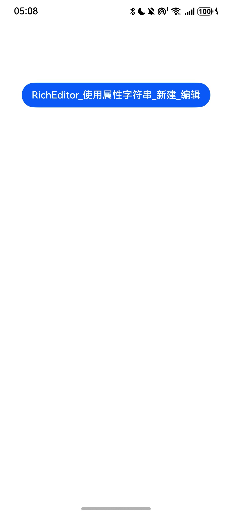
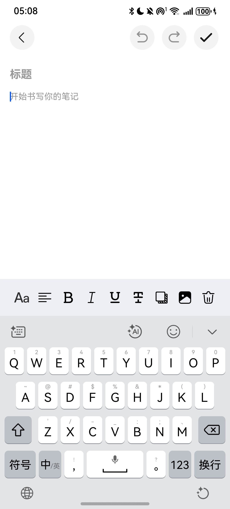
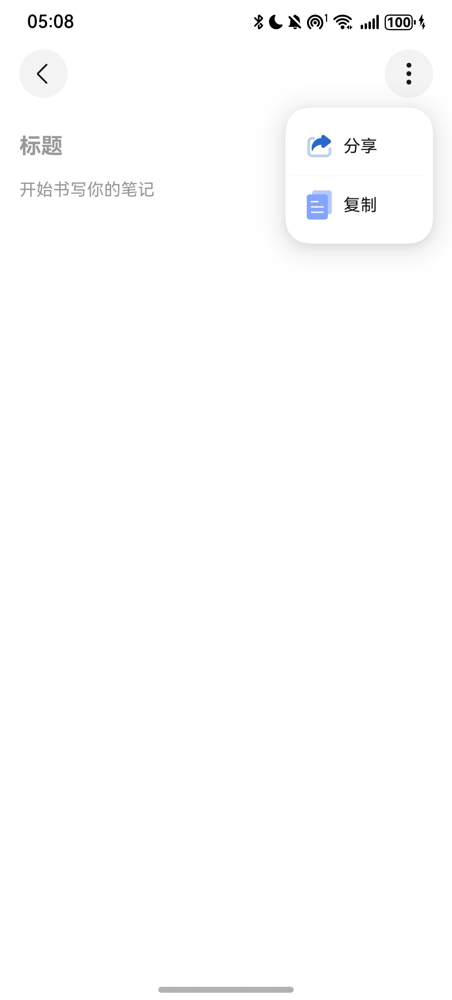

# 富文本组件_属性字符串快速入门

## 目录

- [简介](#简介)
- [约束与限制](#约束与限制)
- [快速入门](#快速入门)
- [API参考](#API参考)
- [示例代码](#示例代码)

## 简介

本组件提供了富文本编辑，保存，回显，分享功能。


| 首页                                                  | 编辑                                                  | 分享                                                    | 
|-----------------------------------------------------|-----------------------------------------------------|-------------------------------------------------------| 
|  |  |  |    

## 约束与限制
### 环境
* DevEco Studio版本：DevEco Studio 5.0.3 Release及以上
* HarmonyOS SDK版本：HarmonyOS 5.0.3 Release SDK及以上
* 设备类型：华为手机（包括双折叠和阔折叠）
* 系统版本：HarmonyOS 5.0.3(15)及以上


## 快速入门

1. 安装组件。

   如果是在DevEvo Studio使用插件集成组件，则无需安装组件，请忽略此步骤。

   如果是从生态市场下载组件，请参考以下步骤安装组件。

   a. 解压下载的组件包，将包中所有文件夹拷贝至您工程根目录的XXX目录下。

   b. 在项目根目录build-profile.json5添加richeditor模块。

 ```typescript
 // 在项目根目录build-profile.json5填写richeditor路径。其中XXX为组件存放的目录名
 "modules": [
     {
       "name": "richeditor",
       "srcPath": "./XXX/richeditor"
     }
 ]
 ```
   c. 在项目根目录oh-package.json5中添加依赖。
 ```typescript
 // XXX为组件存放的目录名称
 "dependencies": {
   "richeditor": "file:./XXX/richeditor"
 }
```

2. 引入组件。

```typescript
import { RichEditorController, RichEditorArea, ChangeRecord, MORE_ACTION_LIST,
   MoreFunction, SnapShotController, ACTION_NAME,
   Note,
   SNAPSHOT_ID} from 'richeditor';
```

3. 调用组件，详细参数配置说明参见[API参考](#API参考)。

```typescript
  RichEditorArea({
      noteTitle: this.currentNote.title,
      noteContent: this.currentNote.styledString,
      snapShotController: this.snapShotController,
      titleChange: (title: string) => {
         this.noteTitle = title;
      },
  })
```

## API参考

### 子组件

无

### 接口

RichEditorArea(options: RichEditorAreaOptions)

富文本编辑组件_属性字符串。

**参数：**

| 参数名  | 类型                                                         | 必填 | 说明                |
| ------- | ------------------------------------------------------------ | ---- |-------------------|
| options | [RichEditorAreaOptions](#RichEditorAreaOptions对象说明) | 否   | 富文本编辑组件_属性字符串的参数。 |

### RichEditorAreaOptions对象说明

| 名称                  | 类型                      | 必填 | 说明       |
| --------------------- |-------------------------|----|----------|
| noteTitle           | string                  | 否  | 标题       |
| noteContent         | MutableStyledString     | 是  | 内容       |
| snapShotController         | [SnapShotController](#SnapShotController对象说明) | 是  | 截图控制器    |

### SnapShotController对象说明

| 名称         | 类型                | 必填 | 说明    |
|------------|-------------------|----|-------|
| snapShotId       | string            | 是  | id    |
| scroller     | Scroller            | 是  | 滑动控制器 |


### 事件
支持以下事件：

**titleChange**
titleChange(callback: (title: string) => void)

修改标题

## 示例代码
> 在 EntryAbility.ets文件的onWindowStageCreate方法中添加如下代码片段(截图分享时使用)
```typescript
let windowClass: window.Window = windowStage.getMainWindowSync();
let size = windowClass.getWindowProperties().windowRect;

AppStorage.setOrCreate('screenHeight', px2vp(size.height));
AppStorage.setOrCreate('screenWidth', px2vp(size.width));

windowClass.on('windowSizeChange', data => {
   AppStorage.setOrCreate('screenHeight', px2vp(data.height));
   AppStorage.setOrCreate('screenWidth', px2vp(data.width));
});
```
> Index.ets
```typescript
import { Note } from 'richeditor';

@Entry
@ComponentV2
struct Index {
   @Local message: string = 'Hello World';
   @Provider('appPathStack') appPathStack: NavPathStack = new NavPathStack();
   @Local currentNote: Note = new Note(new MutableStyledString(''));

   build() {
      Navigation(this.appPathStack){
         Column() {
            Button('RichEditor_使用属性字符串_新建_编辑')
               .onClick(() => {
                  const params: Record<string, Object> = { 'currentNote': this.currentNote};
                  this.appPathStack.pushPathByName('EditNotes', params);
               })
               .margin({top: 100})
         }
         .height('100%')
            .width('100%');
      }
      .hideTitleBar(true)
      .hideToolBar(true)
      .hideBackButton(true)
      .mode(NavigationMode.Stack)
   }
}
```
> 同级目录新建EditNotes.ets
```typescript
import { RichEditorController, RichEditorArea, ChangeRecord, MORE_ACTION_LIST,
  MoreFunction, SnapShotController, ACTION_NAME,
  Note,
  SNAPSHOT_ID} from 'richeditor';
import { KeyboardAvoidMode } from '@kit.ArkUI';
import { unifiedDataChannel } from '@kit.ArkData';
import { pasteboard } from '@kit.BasicServicesKit';
import { JSON } from '@kit.ArkTS';

@Builder
export function EditNotesBuilder() {
  EditNotes();
}

@ComponentV2
struct EditNotes {
  @Consumer('appPathStack') appPathStack: NavPathStack = new NavPathStack();
  private scroller: Scroller = new Scroller();
  richEditorController: RichEditorController = RichEditorController.instance;
  snapShotController: SnapShotController = new SnapShotController(SNAPSHOT_ID, this.scroller);
  @Local noteTitle: string = '';
  @Local isEditNote: boolean = false;
  @Local currentNote: Note = new Note(new MutableStyledString(''));

  
  aboutToAppear(): void {
    // 启用压缩模式避让软键盘
      // 启用压缩模式避让软键盘
      this.getUIContext().setKeyboardAvoidMode(KeyboardAvoidMode.RESIZE_WITH_CARET);
  }

  aboutToDisappear(): void {
    // 还原默认上抬模式
      this.getUIContext().setKeyboardAvoidMode(KeyboardAvoidMode.OFFSET);
      // 清除操作记录
      this.richEditorController.currentIndex = -1;
      this.richEditorController.historyRecordArray = [];
      this.richEditorController.initState();
  }

  copyNoteText() {
    if (this.currentNote?.description === '') {
      this.getUIContext().getPromptAction().showToast({
        message:'请输入内容后复制！',
        alignment: Alignment.Center,
        duration: 1500
      })
      return;
    }
    let copyText = this.currentNote?.description || '';
    let plainTextData = new unifiedDataChannel.UnifiedData();
    let plainText = new unifiedDataChannel.PlainText();
    plainText.details = {
      key: 'delayPlaintext',
      value: copyText,
    };
    plainText.textContent = copyText;
    plainText.abstract = 'delayTextContent';
    plainTextData.addRecord(plainText);
    let systemPasteboard: pasteboard.SystemPasteboard = pasteboard.getSystemPasteboard();
    systemPasteboard.setUnifiedData(plainTextData);
    this.getUIContext().getPromptAction().showToast({
      message:'复制成功',
      alignment: Alignment.Center,
      duration: 1500
    })
  }
  /**
   * 显示更多选项视图
   */
  @Builder
  moreFunctionMenu(){
    Column(){
      List(){
        ForEach(MORE_ACTION_LIST, (item: MoreFunction) => {
          ListItem(){
            Row(){
              Image(item.icon)
                .width(24)
                .height(24)
                .margin({
                  left: 12,
                  right: 8
                })

              Text(item.name)
                .fontSize(14)
                .fontColor($r('sys.color.font_primary'))
            }
            .width('100%')
            .height(48)
            .onClick(() => {
              if (item.name === ACTION_NAME.share) {
                this.snapShotController.onceSnapshot()
              } else if (item.name === ACTION_NAME.copy) {
                this.copyNoteText()
              }
            })
          }
        }, (item: MoreFunction) => JSON.stringify(item))
      }
      .divider({
        strokeWidth: 0.5
      })
      .scrollBar(BarState.Off)
    }
    .width(114)
    .backgroundColor($r('app.color.bg_more_function'))
    .margin({ top: 4, bottom: 4 })
  }

  @Builder
  toolBar() {
    if (this.richEditorController.showMoreFunction === true){
      Row(){
        Image($r('app.media.show_more_function'))
          .width(40)
          .height(40)
          .bindMenu(this.moreFunctionMenu)
      }
      .height('100%')
      .width(150)
      .justifyContent(FlexAlign.End)
      .margin({
        right: 16,
      });
    } else {
      Row({ space: 12 }) {
        Image(this.richEditorController.currentIndex < 1 ? $r('app.media.undo_expire') : $r('app.media.undo_effect'))
          .width(40)
          .height(40)
          .onClick(() => {
            this.richEditorController.onDo();
          });

        Image(this.richEditorController.currentIndex >= this.richEditorController.historyRecordArray.length - 1 ?
        $r('app.media.redo_expire') : $r('app.media.redo_effect'))
          .width(40)
          .height(40)
          .onClick(() => {
            this.richEditorController.reDo();
          });

        Image($r('app.media.save'))
          .height(40)
          .width(40)
          .onClick(() => {
            if (this.saveNote()){
              // 点击保存后退出选中状态
              this.richEditorController.controller.setSelection(0, 0);
              // 退出编辑状态
              this.richEditorController.textInputController.stopEditing();
              this.richEditorController.controller.stopEditing();
              this.richEditorController.showMoreFunction = true;
            }
          });
      }
      .height('100%')
      .width(150)
      .justifyContent(FlexAlign.Center)
      .margin({
        right: 16,
      });
    }
  }

  /**
   * 保存笔记
   */
  saveNote(): boolean {
    let styledString = this.richEditorController.controller.getStyledString();
    let content = styledString.getString();
    // 若新增笔记 内容和标题为空，不保存
    // 修改笔记   内容和标题为空，按返回无响应
    if (content === '' && this.noteTitle === '') {
      return this.isEditNote ? false: true;
    }

    if (this.isEditNote) {
      this.currentNote.updateContent(styledString, this.noteTitle);
    } else {
      this.currentNote.title = this.noteTitle
      this.currentNote.styledString = this.richEditorController.controller.getStyledString();
      this.currentNote.description = this.currentNote.styledString.getString();
      this.isEditNote = true;
    }
    return true;
  }
  
  backDialogController: CustomDialogController = new CustomDialogController({
    builder: () => {
      this.backDialog();
    },
    alignment: DialogAlignment.Center
  });

  @Builder
  backDialog() {
    Column({ space: 18 }) {
      Text('确认返回')
        .fontSize(20)
        .fontWeight(FontWeight.Medium)
        .fontColor($r('sys.color.font_primary'))

      Column(){
        Text('当前笔记尚未保存，立刻返回则')
          .fontSize(14)
          .fontColor($r('sys.color.font_primary'))

        Text('无法保存当前笔记内容，是否确定返回？')
          .fontSize(14)
          .fontColor($r('sys.color.font_primary'))
      }

      Flex({justifyContent: FlexAlign.SpaceAround}){
        Row(){
          Text('取消')
            .fontColor($r('sys.color.icon_emphasize'))
            .fontSize(16)
        }
        .justifyContent(FlexAlign.Center)
        .width('50%')
        .onClick(() => {
          this.backDialogController.close();
        })

        Row(){
          Text('确定')
            .fontColor($r('sys.color.icon_emphasize'))
            .fontSize(16)
        }
        .justifyContent(FlexAlign.Center)
        .width('50%')
        .onClick(() => {
          this.backDialogController.close();
          this.appPathStack.pop()
        })
      }
      .padding({
        top: 10
      })
    }
    .justifyContent(FlexAlign.Center)
    .backgroundColor(Color.White)
    .borderRadius(32)
    .height(158)
    .width('92%')
  }

  build() {
    NavDestination() {
      Column() {
        RichEditorArea({
          noteTitle: this.currentNote.title,
          noteContent: this.currentNote.styledString,
          snapShotController: this.snapShotController,
          titleChange: (title: string) => {
            this.noteTitle = title;
          },
        })
      }
      .height('100%')
      .width('100%');
    }
    .menus(this.toolBar())
    .onReady((cxt: NavDestinationContext) => {
      let params = cxt.pathInfo.param as Record<string, Object>;
      this.currentNote = params.currentNote as Note;
      if (this.currentNote.styledString.getString() === ''){
        this.isEditNote = false;
      } else {
        this.isEditNote = true;
      }

      this.richEditorController.currentIndex = 0;
      this.richEditorController.historyRecordArray.push(new ChangeRecord(this.currentNote.styledString))
    })
    .onBackPressed(() => {
      // 若已处于显示更多选项状态，直接返回，否则先退出编辑态，处于更多选项状态
      if (this.richEditorController.showMoreFunction) {
        this.appPathStack.pop();
        return true;
      }

      // 按返回键弹出弹窗
      this.backDialogController.open();
      return true;
    })
  }
}
```

> 在 src/main/resources/base/profile 下新建 router_map.json, 用于页面跳转
```json
{
  "routerMap": [
    {
      "name": "EditNotes",
      "pageSourceFile": "src/main/ets/pages/EditNotes.ets",
      "buildFunction": "EditNotesBuilder"
    }
  ]
}
```
> **在 src/main/module.json5 下 module中添加  "routerMap": "$profile:router_map",**


| 首页                                                  | 编辑                                                  | 分享                                                      | 
|-----------------------------------------------------|-----------------------------------------------------|---------------------------------------------------------| 
|  |  |  |    
