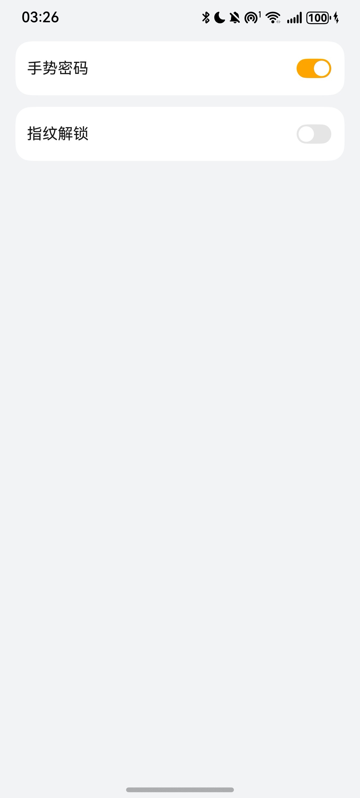
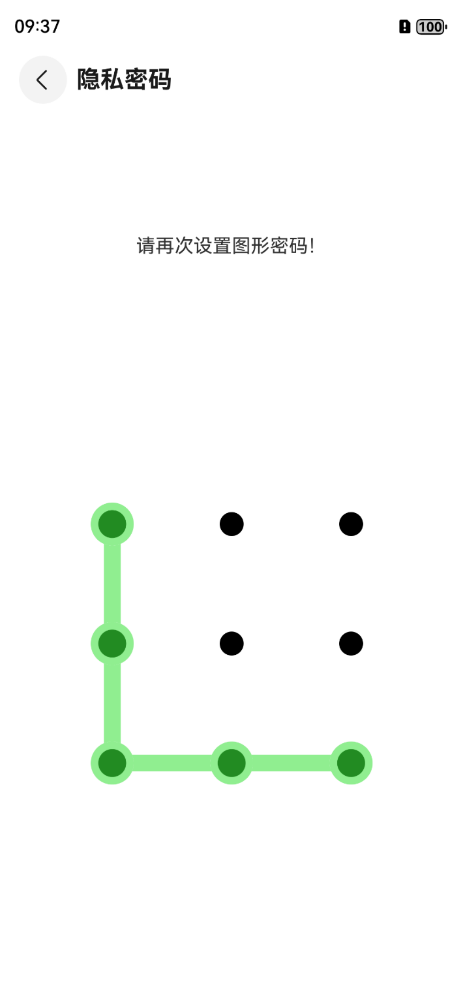

# 应用密码设置组件快速入门

## 目录

- [简介](#简介)
- [约束与限制](#约束与限制)
- [快速入门](#快速入门)
- [API参考](#API参考)
- [示例代码](#示例代码)

## 简介

本组件提供了密码设置功能，密码已进行持久化存储



## 约束与限制
### 环境
* DevEco Studio版本：DevEco Studio 5.0.3 Release及以上
* HarmonyOS SDK版本：HarmonyOS 5.0.3 Release SDK及以上
* 设备类型：华为手机（包括双折叠和阔折叠）
* 系统版本：HarmonyOS 5.0.3(15)及以上


## 快速入门

1. 安装组件。

   如果是在DevEvo Studio使用插件集成组件，则无需安装组件，请忽略此步骤。

   如果是从生态市场下载组件，请参考以下步骤安装组件。

   a. 解压下载的组件包，将包中所有文件夹拷贝至您工程根目录的XXX目录下。

   b. 在项目根目录build-profile.json5添加secretlock模块。
   ```typescript
   // build-profile.json5
   "modules": [
      {
         "name": "secretlock",
         "srcPath": "./XXX/secretlock"
      }
   ]
   ```
   c. 在项目根目录oh-package.json5中添加依赖。
   ```typescript
       // 在项目根目录build-profile.json5填写secretlock路径。其中XXX为组件存放的目录名
      "dependencies": {
         "secretlock": "./XXX/secretlock"
      } 
   ```


2. 引入组件。

```typescript
import { SecretLock, SecretLockSwitch } from 'secretlock';
```

3. 调用组件，详细参数配置说明参见[API参考](#API参考)。

```typescript
SecretLockSwitch({
  appPathStack: this.appPathStack
});
```
4. 可以在应用入口处调用，关闭进程重新进入应用后会跳转到密码绘制页面

```typescript
@Local secretLock: SecretLock = PersistenceV2.connect(SecretLock, () => new SecretLock())!;

aboutToAppear(): void {
 if (this.secretLock.gesture) {
   const params: Record<string, boolean | NavPathStack> = { 'fromEntrance': true, 'appPathStack': this.appPathStack };
   this.appPathStack.pushPathByName('DrawLock', params);
 }
}
``` 


## API参考

### 子组件
无

### 接口
SecretLockSwitch(appPathStack: NavPathStack)

应用密码设置组件。


**参数：**

| 参数名          | 类型                                        | 必填 | 说明    |
|--------------|-------------------------------------------|----|-------|
| appPathStack | NavPathStack                              | 是  | 页面路由栈 |

## 示例代码
**权限配置**
已在 module.json5 中添加如下权限
```typescript
 "requestPermissions": [
   {
     "name": "ohos.permission.ACCESS_BIOMETRIC" //允许应用使用生物特征识别能力进行身份认证。
   }
 ]
```     
```typescript
import { SecretLock, SecretLockSwitch } from 'secretlock';
import { PersistenceV2 } from '@kit.ArkUI';

@Entry
@ComponentV2
export struct Index {
   @Provider('appPathStack') appPathStack: NavPathStack = new NavPathStack();

   @Local secretLock: SecretLock = PersistenceV2.connect(SecretLock, () => new SecretLock())!;

   aboutToAppear(): void {
      if (this.secretLock.gesture) {
        const params: Record<string, Object> = { 'fromEntrance': true, 'appPathStack': this.appPathStack };
        this.appPathStack.pushPathByName('DrawLock', params);
      }
   }

   build() {
      Navigation(this.appPathStack){
         Column(){
            SecretLockSwitch({
               appPathStack: this.appPathStack
            })
         }
         .width('100%')
         .height('100%')
         .padding({left: 16, right: 16})
      }
      .hideTitleBar(true)
      .mode(NavigationMode.Stack)
      .backgroundColor('#F1F3F5')
   }
}
```
