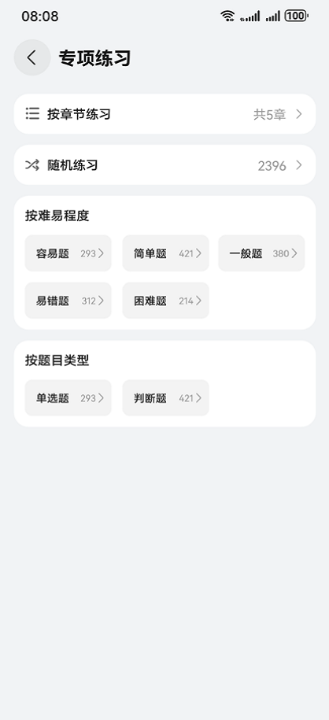

# 汽车（驾考）应用模板快速入门

## 目录

- [功能介绍](#功能介绍)
- [约束和限制](#约束和限制)
- [快速入门](#快速入门)
- [示例效果](#示例效果)
- [开源许可协议](#开源许可协议)


## 功能介绍
您可以基于此模板直接定制应用，也可以挑选此模板中提供的多种组件使用，从而降低您的开发难度，提高您的开发效率。

此模板提供如下组件，所有组件存放在工程根目录的components下，如果您仅需使用组件，可参考对应组件的指导链接；如果您使用此模板，请参考本文档。

| 组件                  | 描述                       | 使用指导                                |
| --------------------- | -------------------------- | --------------------------------------- |
| 考试（exam）组件      | 展示各类考题，可进行考试   | [使用指导](components/exam/README.md)   |
| 考试引导（guide）组件 | 首次引导进入对应类型的考试 | [使用指导](components/guide/README.md)  |
| 搜索（search）组件    | 搜索考题                   | [使用指导](components/search/README.md) |

本模板为驾考类应用提供了常用功能的开发样例，模板主要有引导页、考试和我的三大模块：

* 引导页：提供定位、城市选择、驾照类型选择、学车阶段选择功能。

* 考试：展示科目一、科目二、科目三、科目四各种类型的练习考试以及视频课程。包含模拟考试、专项练习、错题收藏等功能。

* 我的：展示用户信息、个人设置及练习统计等功能。

本模板已集成华为账号、定位服务，只需做少量配置和定制即可快速实现华为账号一键登录、定位、城市选择等功能。


| 引导页                                  | 考试                                    | 我的                              |
|--------------------------------------|---------------------------------------|---------------------------------|
|  |  |  |


| 顺序练习                                   | 练习设置                                     | 专项练习                                        |
|----------------------------------------|------------------------------------------|---------------------------------------------|
|  |  |  |

本模板主要页面及核心功能如下所示：

```ts
汽车驾考模板
 |-- 引导页
 |    |-- 城市选择
 |    |      |-- 搜索
 |    |      |-- 当前定位
 |    |      |-- 最近访问
 |    |      |-- 热门城市
 |    |      |-- 城市列表
 |    |-- 驾照类型选择
 |    |      └-- 驾照类型
 |    |-- 学车阶段选择
 |    |      └-- 学车阶段
 |-- 考试
 |    |-- 城市切换
 |    |-- 搜索
 |    |-- 科目一、科目四
 |    |      |-- 广告图片
 |    |      |-- 顺序练习
 |    |      |-- 练习进度
 |    |      |-- 练习进度
 |    |      |-- 模拟考试
 |    |      |-- 专项练习
 |    |             |-- 章节练习
 |    |             |-- 按难易程度练习
 |    |             └-- 按题目类型练习
 |    |      |-- 视频课程
 |    |      └-- 错题收藏
 |    |             |-- 错题本
 |    |             └-- 收藏题目
 |    |-- 科目二、科目三
 |    |      |-- 广告图片
 |    |      └-- 视频列表
 └-- 我的
      |-- 用户信息
      |-- 个人设置
      |-- 切换题库
      └-- 练习统计
```


本模板工程代码结构如下所示：

```ts
DriverLicenseExam
  |- commons                                       // 公共层
  |   |- commonlib/src/main/ets                    // 公共工具模块(har)
  |   |    |- constants 
  |   |    |     CommonContants.ets                // 公共常量
  |   |    |     CommonEnums.ets                    // 公共枚举
  |   |    |     Constants.ets                     // 异常类常量 
  |   |    |     ShowToast.ets                     // 错误提示处理工具
  |   |    |- model 
  |   |    |     CommonModel.ets                   // 地理位置获取
  |   |    └- utils 
  |   |          AccountUtil.ets                   // 账号管理工具
  |   |          FormatUtil.ets                    // 日历、图片等格式管理工具
  |   |          LocateUtil.ets                    // 定位工具类
  |   |          Logger.ets                        // 日志管理工具
  |   |          PermissionUtil.ets                // 授权申请类
  |   |          PickerUtil.ets                    // 相机工具类
  |   |          PromptActionClass.ets             // 操作管理类
  |   |          RouterModule.ets                  // 路由管理类
  |   |          StringUtil.ets                    // 字符串处理工具
  |   |
  |   |- datasource/src/main/ets                   // 数据管理模块(har)
  |   |    |- ExamService.ets                      // 考试、练习数据处理服务 
  |   |    |- Model.ets                            // 考试相关数据模型
  |   |  
  |   └- network/src/main/ets                      // 网络模块(har)
  |        |- apis                                 
  |        |     HttpApis.ets                      // 通信封装
  |        |     
  |        |- constants                            
  |        |     NetworkEnums.ets                  // 地址常量
  |        |  
  |        |- mocks                                  
  |        |     HttpApisMock.ets                  // 模拟用户信息
  |        |     MockRequestMap.ets                // 模拟用户发送请求
  |        |  
  |        |- models                                 
  |        |     AxiosHttpModel.ets                // 网络请求封装
  |        |     AxiosRequest.ets                  // 请求实例 
  |        |
  |        └- types                                 
  |        |     RequestTypes.ets                  // 请求类型
  |        |     ResponseTypes.ets                 // 响应类型
  |        |    
  |- components                                    // 核心组件
  |   |- exam/src/main/ets                         // 考试模块（har）
  |   |    |- components  
  |   |    |     Exam.ets                          // 答题组件  
  |   |    |     SelectComponent.ets               // 试题组件  
  |   |    |  
  |   |    |- controller 
  |   |    |     ExamController.ets                // 答题设置controller
  |   |    |  
  |   |    └- model 
  |   |          QuestionAnswerRecord.ets          // 答题组件数据模型
  |   |
  |   |- guide/src/main/ets
  |   |    |- components
  |   |    |     GuideView.ets                     // 导引组件
  |   |    |     SelectCard.ets                    // 卡片组件
  |   |    |
  |   |    |- constants
  |   |    |     CommonContants.ets                // 常量配置
  |   |    |
  |   |    └- model
  |   |          GuideService.ets                  // 导引页单例服务
  |   |          model.ets                         // 数据模型 
  |   |    
  |   |- module_city_select/src/main/ets           // 城市选择模块（har）
  |   |    |- common
  |   |    |     Constants.ets                     // 公共常量
  |   |    |     Model.ets                         // 数据模型
  |   |    |     Utils.ets                         // 工具类   
  |   |    |
  |   |    |- components
  |   |    |     SingleBtn.ets                     // 按钮组件
  |   |    |
  |   |    └- pages
  |   |          Index.ets                         // 城市选择组件                           
  |   |
  |   |- search/src/main/ets                       // 搜索（har）
  |   |    |- components
  |   |    |     SearchComponents.ets              // 搜索组件
  |   |    |
  |   |    └- controller
  |   |          SearchController.ets              // 搜索controller
  |- products                                      // 入口模块
  |   |- entry/src/main/ets                   
  |   |    |- common                           
  |   |    |    LoginConstants.ets  
  |   |    |              
  |   |    |- constants                               
  |   |    |    Constants.ets                      // 常量配置
  |   |    | 
  |   |    └- pages
  |   |         |- collection
  |   |         |     CollectionView.ets           // 错题收藏页面
  |   |         |
  |   |         |- guide
  |   |         |     GuidePage.ets                // 导引页面
  |   |         |
  |   |         |- home
  |   |         |     HomeView.ets                 // 考试页面
  |   |         |     SearchPage.ets               // 搜索页面
  |   |         |
  |   |         |- mine
  |   |         |     FeedTitle.ets
  |   |         |     MineView.ets                 // 我的页面
  |   |         |     PersonalInfo.ets             // 个人信息页面
  |   |         |     PrivacyAgreement.ets         // 隐私协议页面
  |   |         |     QuickLoginPage.ets           // 华为账号一键登录页面
  |   |         |     Setting.ets                  // 设置
  |   |         |
  |   |         |- practice
  |   |         |     PracticeView.ets             // 练习考试页面
  |   |         |
  |   |         |- specialExercises
  |   |         |     ChapterListView.ets          // 章节练习
  |   |         |     SpecialExercisesView.ets     // 专项练习
  |   |         |- video
  |   |         |     VideoDetailView.ets          // 视频播放页面
  |   |         |     VideoListView.ets            // 视频列表
  |   |         |
  |   |         |- MainEntry.ets                   // 入口文件
  |   |         └- SelectCityView.ets              // 城市选择页面
  
```


## 约束和限制
### 环境
- DevEco Studio版本：DevEco Studio 5.0.1 Release及以上
- HarmonyOS SDK版本：HarmonyOS 5.0.1(13) Release SDK及以上
- 设备类型：华为手机（直板机）
- HarmonyOS版本：HarmonyOS 5.0.1 Release及以上

### 权限
- 获取位置权限：ohos.permission.APPROXIMATELY_LOCATION，ohos.permission.LOCATION。
- 网络权限：ohos.permission.INTERNET
- 获取网络信息：ohos.permission.GET_NETWORK_INFO

## 快速入门

###  配置工程
在运行此模板前，需要完成以下配置：
1. 在AppGallery Connect创建应用，将包名配置到模板中。

   a. 参考[创建HarmonyOS应用](https://developer.huawei.com/consumer/cn/doc/app/agc-help-createharmonyapp-0000001945392297)为应用创建APP ID，并将APP ID与应用进行关联。

   b. 返回应用列表页面，查看应用的包名。

   c. 将模板工程根目录下AppScope/app.json5文件中的bundleName替换为创建应用的包名。

2. 配置华为账号服务。

   a. 将应用的client ID配置到products/entry模块的src/main/module.json5文件，详细参考：[配置Client ID](https://developer.huawei.com/consumer/cn/doc/harmonyos-guides/account-client-id)。

   b. 申请华为账号一键登录所需的quickLoginMobilePhone权限，详细参考：[配置scope权限](https://developer.huawei.com/consumer/cn/doc/harmonyos-guides/account-config-permissions)。

3. 配置地图服务。

   a. 将应用的client ID配置到products/entry模块的src/main/module.json5文件，如果华为账号服务已配置，可跳过此步骤。

   b. 添加公钥指纹，如果华为账号服务已配置，可跳过此步骤。

   c. [开通地图服务](https://developer.huawei.com/consumer/cn/doc/harmonyos-guides/map-config-agc)。

4. 为应用进行[手工签名](https://developer.huawei.com/consumer/cn/doc/harmonyos-guides/ide-signing#section297715173233)。
5. 添加手工签名所用证书对应的公钥指纹，详细参考：[配置应用证书指纹](https://developer.huawei.com/consumer/cn/doc/app/agc-help-signature-info-0000001628566748#section5181019153511)。

### 运行调试工程
1. 用USB线连接调试手机和PC。

2. 菜单选择“Run > Run 'entry' ”或者“Run > Debug 'entry' ”，运行或调试模板工程。

## 示例效果

[功能展示录屏](./picture/exam_video.mp4)


## 开源许可协议

该代码经过[Apache 2.0 授权许可](http://www.apache.org/licenses/LICENSE-2.0)。

