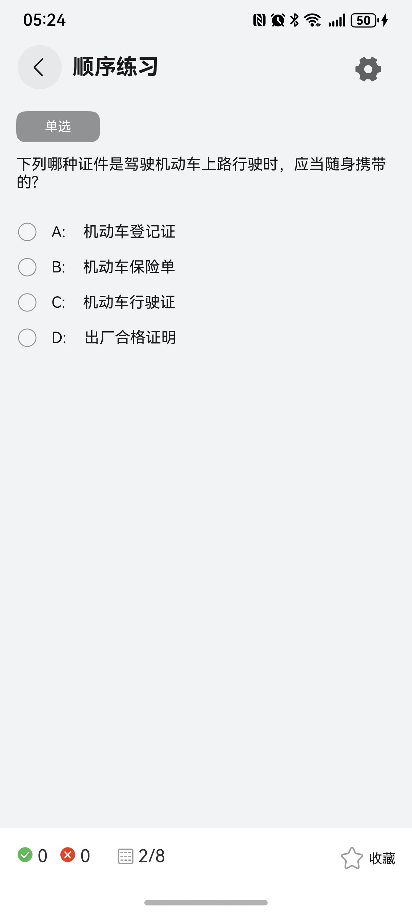
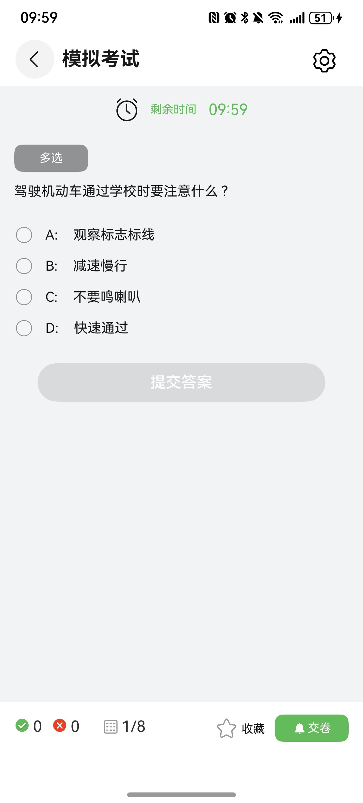

# 驾考-考试组件快速入门

## 目录

- [简介](#简介)
- [约束与限制](#约束与限制)
- [快速入门](#快速入门)
- [API参考](#API参考)
- [示例代码](#示例代码)

## 简介

本组件支持展示各类考题，并可以进行考试。

| 练习 | 设置 | 答题卡 | 模拟考试 |
| ---- | ---- | ------ | -------- |
|      |      |        |          |


## 约束与限制
### 环境
* DevEco Studio版本：DevEco Studio 5.0.1 Release及以上
* HarmonyOS SDK版本：HarmonyOS 5.0.1(13) Release SDK及以上
* 设备类型：华为手机（直板机）
* HarmonyOS版本：HarmonyOS 5.0.1 Release及以上

## 快速入门
1. 安装组件。

   如果是在DevEvo Studio使用插件集成组件，则无需安装组件，请忽略此步骤。

   如果是从生态市场下载组件，请参考以下步骤安装组件。

   a. 解压下载的组件包，将包中所有文件夹拷贝至您工程根目录的XXX目录下。

   b. 在项目根目录build-profile.json5添加exam模块。

    ```typescript
    // 在项目根目录build-profile.json5填写exam路径。其中XXX为组件存放的目录名
    "modules": [
        {
          "name": "exam",
          "srcPath": "./XXX/exam"
        }
    ]
    ```
   c. 在项目根目录oh-package.json5中添加依赖。
    ```typescript
    // XXX为组件存放的目录名称
    "dependencies": {
      "exam": "file:./XXX/exam"
    }
   ```
 
   
2. 引入组件。

```typescript
import { Exam } from 'exam';
 ```

3. 调用组件，详细参数配置说明参见[API参考](#API参考)。

 ```typescript
import { Exam, ExamController, ExamManager, showSettingSheet } from 'exam';
import { generateExamDetail } from './SequencePractice';

@Builder
export function MockExamBuilder() {
   MockExam();
}

@ComponentV2
export struct MockExam {
   @Consumer('appPathStack') appPathStack: NavPathStack = new NavPathStack();
   @Local isShowSetting: boolean = false;
   private examController: ExamController = ExamController.instance;
   @Local examManager: ExamManager = new ExamManager('模拟考试', generateExamDetail());

   aboutToAppear(): void {
      this.examManager.timeLimit = 10;
   }
   build() {
      NavDestination() {
         Column() {
            Exam({
               appPathStack: this.appPathStack,
               examManager: this.examManager,
            });
         }
         .width('100%')
            .height('100%')
      }
      .title('模拟考试')
         .menus(this.toolBar())
         .onBackPressed(() => {
            if (this.examManager.timeLimit !== 0) {
               // 打开模拟考试结束弹窗
               this.examController.isShowMockExamDialog = true;
               return true;
            }
            this.appPathStack.pop();
            return true;
         })
   }

   @Builder
   toolBar() {
      Row() {
         SymbolGlyph($r('sys.symbol.gearshape'))
            .fontSize(27)
      }
      .width(50)
         .height(40)
         .justifyContent(FlexAlign.Center)
         .margin({
            top: 10,
            right: '4%',
         })
         .onClick(() => {
            this.isShowSetting = !this.isShowSetting
         })
         .bindSheet($$this.isShowSetting, showSettingSheet(), {
            height: '25%',
            width: '100%',
            title: { title: '设置' },
            backgroundColor: Color.White,
         });
   }
}
 ```

## API参考
### 子组件
无

### 接口
Exam(options: ExamOptions)

驾考-考试组件。


### ExamOptions对象说明

| 名称          | 类型                              | 必填 | 说明                     |
|-------------|---------------------------------|----|------------------------|
| appPathStack       | NavPathStack                    | 是  | 页面路由栈                  |
| examManager     | [ExamManager](#ExamManager对象说明) | 是  | 考卷                     |
| mockExamCall | Callback<number, void>                    | 否  | 记录模拟考试分数回调，用于计算模拟考试平均分 |

### ExamManager对象说明

| 名称        | 类型                                   | 必填 | 说明                         |
|-----------|--------------------------------------|----|----------------------------|
| id        | string                               | 是  | 考卷Id                       |
| name      | string \| Resource                   | 是  | 考卷名称                       |
| currentQuestionId | number                               | 是  | 当前题目Id, 退出后重新进入时展示退出前的题目id |
| total | number                               | 是  | 题目数量                       |
| timeLimit | number                               | 是  | 时间限制(以分钟为单位)，模拟考试时显示剩余时间 |
| correctNumber | number                               | 是  | 答题正确数量                     |
| errorNumber | number                               | 是  | 答题错误数量                     |
| examDetails | Array<[ExamDetail](#ExamDetail对象说明)> | 是  | 考题                         |
| clearSelectedOption | 方法                                   | 否  | 清空已选项，顺序练习返回时清空已选项        |
| clearRecords | 方法                                   | 否  | 清空记录(是否收藏除外)，答题卡清空记录      |

### ExamDetail对象说明

| 名称        | 类型                                                    | 必填 | 说明                                         |
|-----------|-------------------------------------------------------|----|--------------------------------------------|
| id        | string                                                | 是  | 题目Id                                       |
| question      | string                                                | 是  | 问题                                         |
| questionImage | string                                                | 是  | 问题图片（部分问题下面会有图片），根据图片回答问题                  |
| options | Array<string>                                         | 是  | 全部选项                                       |
| selected | Array<string>                                         | 是  | 已选项                                        |
| answer | Array<string>                                         | 是  | 正确答案                                       |
| isCorrect | boolean                                               | 否  | 是否正确(undefined-未选择, true-选择正确, false-选择错误) |
| questionType | [QuestionTypeEnum](#QuestionTypeEnum对象说明)             | 是  | 题目类型                                       |
| classificationType | [ClassificationTypeEnum](#ClassificationTypeEnum对象说明) | 是  | 难易程度                                       |
| analysis | string                                                | 是  | 题目解析                                       |
| videoExplainUrl | string                                                | 是  | 视频讲题-视频url                                         |
| isCollect | boolean                                               | 是  | 是否收藏                                       |
| chapterName | string                                                | 是  | 章节名称-按章节分类                                         |

### QuestionTypeEnum对象说明

| 名称        | 说明 |
|-----------|----|
| RADIO     | 单选 |
| CHECK_BOX | 多选 |
| JUDGE     | 判断 |

### ClassificationTypeEnum对象说明

| 名称           | 说明 |
|--------------|----|
| EASY         | 容易 |
| SIMPLE       | 简单 |
| MIDDLE       | 一般 |
| HARD         | 困难 |
| EASY_MISTAKE | 易错 |


### 事件

支持以下事件：

#### mockExamCall
mockExamCall: (score: number) => void = (score: number) => {}
// 记录模拟考试分数回调, 用于计算模拟考试平均分

## 示例代码
> Index.ets
```typescript
@Entry
@ComponentV2
struct Index {
   @Provider('appPathStack') appPathStack: NavPathStack = new NavPathStack();

   build() {
      Navigation(this.appPathStack) {
         Column({space: 50}) {
            Text('顺序练习')
               .textAlign(TextAlign.Center)
               .fontSize(24)
               .width('50%')
               .height(64)
               .fontColor(Color.White)
               .backgroundColor(Color.Blue)
               .borderRadius(10)
               .onClick(() => {
                  this.appPathStack.pushPathByName('SequencePractice', undefined)
               })

            Text('模拟考试')
               .textAlign(TextAlign.Center)
               .fontSize(24)
               .width('50%')
               .height(64)
               .fontColor(Color.White)
               .backgroundColor(Color.Blue)
               .borderRadius(10)
               .onClick(() => {
                  this.appPathStack.pushPathByName('MockExam', undefined)
               })
         }
         .padding({
            top: 200
         })
            .width('100%')
            .height('100%')
            .backgroundColor('#F1F3F5')
      }
      .hideTitleBar(true)
      .hideToolBar(true)
      .hideBackButton(true)
      .mode(NavigationMode.Stack)
   }
}
```
> 同级目录新建MockExam.ets
```typescript
import { Exam, ExamController, ExamManager, showSettingSheet } from 'exam';
import { generateExamDetail } from './SequencePractice';

@Builder
export function MockExamBuilder() {
   MockExam();
}

@ComponentV2
export struct MockExam {
   @Consumer('appPathStack') appPathStack: NavPathStack = new NavPathStack();
   @Local isShowSetting: boolean = false;
   private examController: ExamController = ExamController.instance;
   @Local examManager: ExamManager = new ExamManager('模拟考试', generateExamDetail());

   aboutToAppear(): void {
      this.examManager.timeLimit = 10;
   }
   build() {
      NavDestination() {
         Column() {
            Exam({
               appPathStack: this.appPathStack,
               examManager: this.examManager,
            });
         }
         .width('100%')
            .height('100%')
      }
      .title('模拟考试')
         .menus(this.toolBar())
         .onBackPressed(() => {
            if (this.examManager.timeLimit !== 0) {
               // 打开模拟考试结束弹窗
               this.examController.isShowMockExamDialog = true;
               return true;
            }
            this.appPathStack.pop();
            return true;
         })
   }

   @Builder
   toolBar() {
      Row() {
         SymbolGlyph($r('sys.symbol.gearshape'))
            .fontSize(27)
      }
      .width(50)
         .height(40)
         .justifyContent(FlexAlign.Center)
         .margin({
            top: 10,
            right: '4%',
         })
         .onClick(() => {
            this.isShowSetting = !this.isShowSetting
         })
         .bindSheet($$this.isShowSetting, showSettingSheet(), {
            height: '25%',
            width: '100%',
            title: { title: '设置' },
            backgroundColor: Color.White,
         });
   }
}
```
> 同级目录新建SequencePractice.ets
```typescript
import { ClassificationTypeEnum, Exam, ExamDetail, ExamManager, QuestionTypeEnum, showSettingSheet } from 'exam';

@Builder
export function SequencePracticeBuilder() {
   SequencePractice();
}

@ComponentV2
export struct SequencePractice {
   @Consumer('appPathStack') appPathStack: NavPathStack = new NavPathStack();
   @Local isShowSetting: boolean = false;
   @Local examManager: ExamManager = new ExamManager('顺序练习', generateExamDetail());

   build() {
      NavDestination() {
         Column() {
            Exam({
               appPathStack: this.appPathStack,
               examManager: this.examManager,
            });
         }
         .width('100%')
            .height('100%')
      }
      .title('顺序练习')
         .menus(this.toolBar())
   }

   @Builder
   toolBar() {
      Row() {
         SymbolGlyph($r('sys.symbol.gearshape'))
            .fontSize(27)
      }
      .width(50)
         .height(40)
         .justifyContent(FlexAlign.Center)
         .margin({
            top: 10,
            right: '4%',
         })
         .onClick(() => {
            this.isShowSetting = !this.isShowSetting
         })
         .bindSheet($$this.isShowSetting, showSettingSheet(), {
            height: '25%',
            width: '100%',
            title: { title: '设置' },
            backgroundColor: Color.White,
         });
   }
}

/**
 * 生成全部考题
 * @returns 全部考题
 */
export function generateExamDetail(): Array<ExamDetail> {
   let examDetails: Array<ExamDetail> = [];
   examDetails.push(new ExamDetail('驾驶机动车通过学校时要注意什么 ?', '',
      ['观察标志标线',
         '减速慢行',
         '不要鸣喇叭',
         '快速通过'],
      ['观察标志标线', '减速慢行', '不要鸣喇叭'],
      QuestionTypeEnum.CHECK_BOX, ClassificationTypeEnum.SIMPLE,
      '驾驶机动车上路行驶必须随车携带机动车行驶证（' +
         '证明车辆合法上路资格）。其他选项如登记证，保' +
         '险单，合格证无需随车携带。\n' +
         '根据《道路交通安全法》的规定，驾驶机动车上道' +
         '路行驶，应当悬挂机动车号牌，放置检验合格标志' +
         '，保险标志，并随车携带机动车行驶证。',
      '驾驶证和机动车管理规定',
      'https://consumer.huawei.com/content/dam/huawei-cbg-site/cn/mkt/pdp/phones/ah-ultra/video/kv-intro-pop.mp4'));
   examDetails.push(new ExamDetail('下列哪种证件是驾驶机动车上路行驶时，应当随身携带的?', '',
      ['机动车登记证',
         '机动车保险单',
         '机动车行驶证',
         '出厂合格证明'],
      ['机动车登记证'],
      QuestionTypeEnum.RADIO, ClassificationTypeEnum.SIMPLE,
      '驾驶机动车上路行驶必须随车携带机动车行驶证（' +
         '证明车辆合法上路资格）。其他选项如登记证，保' +
         '险单，合格证无需随车携带。\n' +
         '根据《道路交通安全法》的规定，驾驶机动车上道' +
         '路行驶，应当悬挂机动车号牌，放置检验合格标志' +
         '，保险标志，并随车携带机动车行驶证。',
      '驾驶证和机动车管理规定',
      'https://consumer.huawei.com/content/dam/huawei-cbg-site/cn/mkt/pdp/phones/ah-ultra/video/kv-intro-pop.mp4'));

   examDetails.push(new ExamDetail('驾驶这种机动车上路行驶没有违法行为', 'app.media.question_image',
      ['正确',
         '错误'],
      ['错误'],
      QuestionTypeEnum.JUDGE, ClassificationTypeEnum.EASY,
      '驾驶机动车上路行驶必须随车携带机动车行驶证（' +
         '证明车辆合法上路资格）。其他选项如登记证，保' +
         '险单，合格证无需随车携带。\n' +
         '根据《道路交通安全法》的规定，驾驶机动车上道' +
         '路行驶，应当悬挂机动车号牌，放置检验合格标志' +
         '，保险标志，并随车携带机动车行驶证。',
      '驾驶证和机动车管理规定',
      'https://consumer.huawei.com/content/dam/huawei-cbg-site/cn/mkt/pdp/phones/ah-ultra/video/kv-intro-pop.mp4'));

   examDetails.push(new ExamDetail('驾驶机动车行经下列那种路段不得超车?', '',
      ['主要街道',
         '高架路',
         '人行横道',
         '环城高速'],
      ['人行横道'],
      QuestionTypeEnum.RADIO, ClassificationTypeEnum.SIMPLE,
      '驾驶机动车上路行驶必须随车携带机动车行驶证（' +
         '证明车辆合法上路资格）。其他选项如登记证，保' +
         '险单，合格证无需随车携带。\n' +
         '根据《道路交通安全法》的规定，驾驶机动车上道' +
         '路行驶，应当悬挂机动车号牌，放置检验合格标志' +
         '，保险标志，并随车携带机动车行驶证。',
      '驾驶证和机动车管理规定',
      'https://consumer.huawei.com/content/dam/huawei-cbg-site/cn/mkt/pdp/phones/ah-ultra/video/kv-intro-pop.mp4'));

   examDetails.push(new ExamDetail('驾驶人一边驾车，一边打手持电话是违法行为', '',
      ['正确',
         '错误'],
      ['正确'],
      QuestionTypeEnum.JUDGE, ClassificationTypeEnum.MIDDLE,
      '驾驶机动车上路行驶必须随车携带机动车行驶证（' +
         '证明车辆合法上路资格）。其他选项如登记证，保' +
         '险单，合格证无需随车携带。\n' +
         '根据《道路交通安全法》的规定，驾驶机动车上道' +
         '路行驶，应当悬挂机动车号牌，放置检验合格标志' +
         '，保险标志，并随车携带机动车行驶证。',
      '驾驶证和机动车管理规定',
      'https://consumer.huawei.com/content/dam/huawei-cbg-site/cn/mkt/pdp/phones/ah-ultra/video/kv-intro-pop.mp4'));

   examDetails.push(new ExamDetail('驾驶机动车下陡坡时不得有哪些危险行为?', '',
      ['提前减档',
         '空挡滑行',
         '低档减速',
         '制动减速'],
      ['空挡滑行'],
      QuestionTypeEnum.RADIO, ClassificationTypeEnum.SIMPLE,
      '驾驶机动车上路行驶必须随车携带机动车行驶证（' +
         '证明车辆合法上路资格）。其他选项如登记证，保' +
         '险单，合格证无需随车携带。\n' +
         '根据《道路交通安全法》的规定，驾驶机动车上道' +
         '路行驶，应当悬挂机动车号牌，放置检验合格标志' +
         '，保险标志，并随车携带机动车行驶证。',
      '驾驶证和机动车管理规定',
      'https://consumer.huawei.com/content/dam/huawei-cbg-site/cn/mkt/pdp/phones/ah-ultra/video/kv-intro-pop.mp4'));

   examDetails.push(new ExamDetail('机动车驾驶人在实习期内驾驶机动车不得牵引挂车', 'app.media.question_image',
      ['正确',
         '错误'],
      ['正确'],
      QuestionTypeEnum.JUDGE, ClassificationTypeEnum.HARD,
      '驾驶机动车上路行驶必须随车携带机动车行驶证（' +
         '证明车辆合法上路资格）。其他选项如登记证，保' +
         '险单，合格证无需随车携带。\n' +
         '根据《道路交通安全法》的规定，驾驶机动车上道' +
         '路行驶，应当悬挂机动车号牌，放置检验合格标志' +
         '，保险标志，并随车携带机动车行驶证。',
      '道路通行条件及通行规定',
      'https://consumer.huawei.com/content/dam/huawei-cbg-site/cn/mkt/pdp/phones/ah-ultra/video/kv-intro-pop.mp4'));

   examDetails.push(new ExamDetail('驾驶机动车上路前应当检查车辆安全技术性能', '',
      ['正确',
         '错误'],
      ['正确'],
      QuestionTypeEnum.JUDGE, ClassificationTypeEnum.EASY_MISTAKE,
      '驾驶机动车上路行驶必须随车携带机动车行驶证（' +
         '证明车辆合法上路资格）。其他选项如登记证，保' +
         '险单，合格证无需随车携带。\n' +
         '根据《道路交通安全法》的规定，驾驶机动车上道' +
         '路行驶，应当悬挂机动车号牌，放置检验合格标志' +
         '，保险标志，并随车携带机动车行驶证。',
      '道路通行条件及通行规定',
      'https://consumer.huawei.com/content/dam/huawei-cbg-site/cn/mkt/pdp/phones/ah-ultra/video/kv-intro-pop.mp4'));

   return examDetails;
}
```
> 在 src/main/resources/base/profile 下新建 router_map.json, 用于页面跳转
```json
{
   "routerMap": [
      {
         "name": "SequencePractice",
         "pageSourceFile": "src/main/ets/pages/SequencePractice.ets",
         "buildFunction": "SequencePracticeBuilder"
      },
      {
         "name": "MockExam",
         "pageSourceFile": "src/main/ets/pages/MockExam.ets",
         "buildFunction": "MockExamBuilder"
      }
   ]
}
```
> **在 src/main/module.json5 下 module中添加  "routerMap": "$profile:router_map",** 


| 首页                                               | 顺序练习                                 | 模拟考试                                       |
|--------------------------------------------------|--------------------------------------|--------------------------------------------|
|  |  |  |


