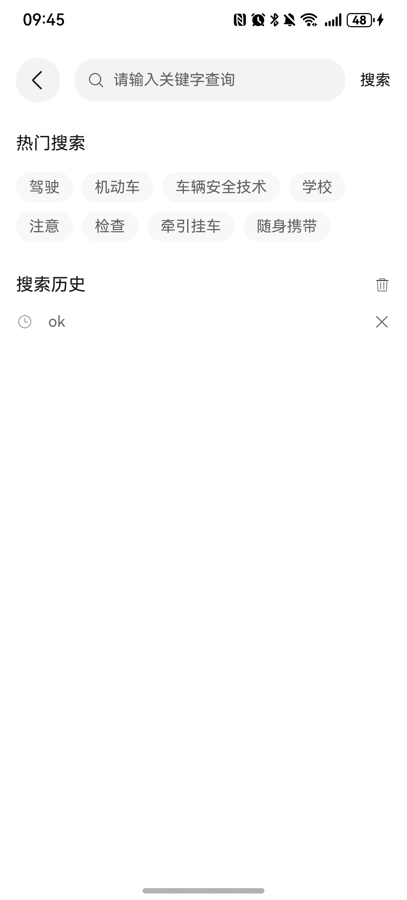
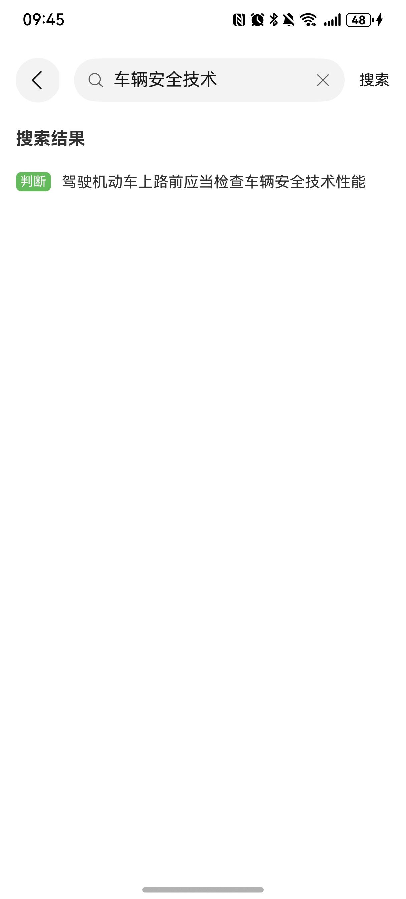
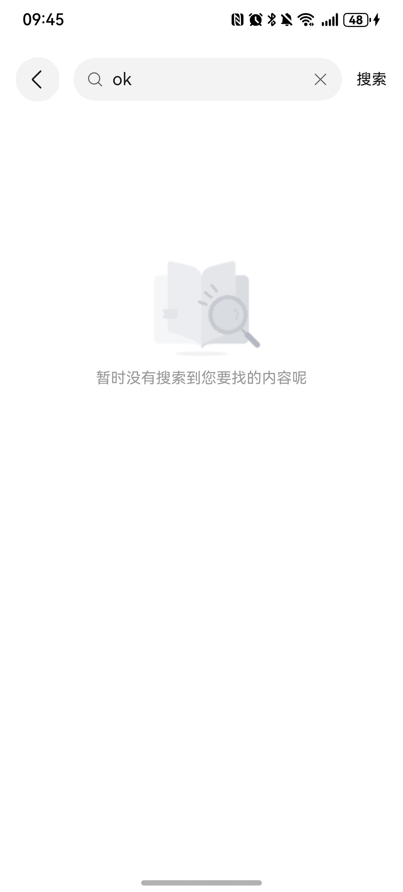

# 搜索组件快速入门

## 目录

- [简介](#简介)
- [使用](#使用)
- [API参考](#API参考)
- [示例代码](#示例代码)

## 简介

本组件提供了搜索功能

| 搜索首页                                          | 搜索有结果                                       | 搜索无结果                                           |
|-----------------------------------------------|---------------------------------------------|-------------------------------------------------|
|  |  |  |


## 使用
1. 安装组件。
   将模板根目录的components下[search](../../components/search)和[exam](../../components/exam)目录拷贝至您工程根目录components/。
```typescript
// entry/oh-package.json5
"dependencies": {
   "search": "../components/search",
   "exam": "../components/exam"
} 
```
```typescript
// build-profile.json5
"modules": [
   {
      "name": "search",
      "srcPath": "./components/search",
   },
   {
      "name": "exam",
      "srcPath": "./components/exam",
   }
]
```

2. 引入组件。

```typescript
import { SearchComponent, SearchController } from 'search';
import { ExamDetail, getQuestionType } from 'exam';
```

3. 调用组件，详细参数配置说明参见[API参考](#API参考)。

```typescript
SearchComponent({
   appPathStack: this.appPathStack,
   hotSearchBuilder: this.hotSearch.bind(this),
   historySearchBuilder: this.historySearch.bind(this),
   searchResultBuilder: this.searchResult,
   getSearchResult: this.getSearchResult.bind(this),
});
```

## API参考

### 接口
SearchComponent(options: SearchComponentOptions)

搜索组件。


### SearchComponentOptions对象说明

| 名称          | 类型           | 必填 | 说明       |
|-------------|--------------|----|----------|
| appPathStack       | NavPathStack | 是  | 页面路由栈       |
| hotSearchBuilder     | Builder      | 是  | 热门搜索视图   |
| historySearchBuilder | Builder | 是  | 搜索历史视图   |
| searchResultBuilder | Builder | 是  | 搜索结果视图   |

### 事件

支持以下事件：

#### getSearchResult
getSearchResult: VoidCallback;
// 获取搜索结果方法

## 示例代码
> Index.ets
```typescript
import { ClassificationTypeEnum, ExamDetail, ExamManager, getQuestionType, QuestionTypeEnum } from 'exam';
import { SearchComponent, SearchController } from 'search';
import { LengthMetrics } from '@kit.ArkUI';


@Entry
@ComponentV2
struct Index {
   @Provider('appPathStack') appPathStack: NavPathStack = new NavPathStack();
   private searchController: SearchController = SearchController.instance;
   @Local searchKey: string = '';
   @Local textWidth: number = 0;

   build() {
      NavDestination() {
         Column() {
            SearchComponent({
               appPathStack: this.appPathStack,
               hotSearchBuilder: this.hotSearch.bind(this),
               historySearchBuilder: this.historySearch.bind(this),
               searchResultBuilder: this.searchResult,
               getSearchResult: this.getSearchResult.bind(this),
            });
         }
         .width('100%')
         .height('100%')
         .padding({
            top: px2vp(AppStorage.get('topRectHeight') || 0) + 12,
            left: '4%',
            right: '4%',
         });
      }
      .hideTitleBar(true)
      .hideToolBar(true)
      .onBackPressed(() => {
         this.searchController.isShowResult = false;
         this.appPathStack.pop();
         return true;
      });
   }

   @Builder
   hotSearch() {
      Column() {
         Row() {
            Text('热门搜索').fontSize(16).fontColor('rgba(0,0,0,0.90)');
         }.justifyContent(FlexAlign.SpaceBetween).margin({ bottom: 17 }).width('100%');

         Flex({ wrap: FlexWrap.Wrap, space: { main: LengthMetrics.vp(8), cross: LengthMetrics.vp(8) } }) {
            ForEach(this.searchController.hotSearch, (item: string) => {
               Text(item)
                  .labelBaseStyle()
                  .onClick(() => {
                     this.searchController.searchCondition = item;
                     this.searchController.isShowResult = true;
                     this.searchController.updateHistorySearch(item);
                     this.getSearchResult();
                  });
            }, (item: string, index) => item + index.toString());
         };
      };
   }

   @Builder
   historySearch() {
      Column() {
         Row() {
            Text('搜索历史').fontSize(16).fontColor('rgba(0,0,0,0.90)');

            Blank();

            Image($r('app.media.trash'))
               .width(16)
               .height(16)
               .onClick(() => {
                  this.searchController.historySearch = [];
               });
         }.justifyContent(FlexAlign.SpaceBetween).margin({ bottom: 12 }).width('100%');

         List() {
            ForEach(this.searchController.historySearch, (item: string, index: number) => {
               ListItem() {
                  Column() {
                     Row() {
                        Image($r('app.media.history_clock'))
                           .width(16);

                        Text(item)
                           .fontSize(14)
                           .fontColor('rgba(0,0,0,0.60)')
                           .maxLines(1)
                           .textOverflow({ overflow: TextOverflow.Ellipsis })
                           .padding({
                              left: '4%',
                           })
                           .width('82%');

                        Blank();

                        Row() {
                           SymbolGlyph($r('sys.symbol.xmark'))
                              .fontSize(16)
                              .fontColor(['rgba(0,0,0,0.60)'])
                              .onClick(() => {
                                 this.searchController.historySearch.splice(index, 1);
                              });
                        }
                        .width('10%')
                        .justifyContent(FlexAlign.End);
                     }
                     .height(25)
                     .width('100%')
                     .margin({
                        top: 7,
                        bottom: 7,
                     });
                  }
                  .onClick(() => {
                     this.searchController.searchCondition = item;
                     this.searchController.isShowResult = true;
                     this.searchController.updateHistorySearch(item);
                     this.getSearchResult();
                  });
               };
            }, (item: string) => JSON.stringify(item));
         }
         .divider({
            strokeWidth: 1
         })
         .scrollBar(BarState.Off)
         .edgeEffect(EdgeEffect.None)
         .layoutWeight(1);
      }
      .padding({
         bottom: px2vp(AppStorage.get('bottomRectHeight')),
      });
   }

   @Builder
   searchResult() {
      Column() {
         if (this.searchController.searchResult.examDetails.length === 0){
            Image($r('app.media.no_search_result_found'))
               .width(120)
               .height(120)
               .margin({
                  top: 120
               })

            Text('暂时没有搜索到您要找的内容呢')
               .fontSize(14)
               .fontColor('rgba(0,0,0,0.40)')
         } else {
            Scroll() {
               Column() {
                  Text('搜索结果')
                     .fontSize(16)
                     .fontWeight(FontWeight.Bold)
                     .alignSelf(ItemAlign.Start)
                     .padding({
                        top: 16,
                        bottom: 16,
                     });
                  List({ space: 15 }) {
                     ForEach(this.searchController.searchResult.examDetails, (item: ExamDetail, index: number) => {
                        ListItem() {
                           Row() {
                              Text(getQuestionType(item.questionType))
                                 .fontSize(12)
                                 .fontColor(Color.White)
                                 .backgroundColor('#64BB5C')
                                 .position({ x: 0, y: 5 })
                                 .padding({
                                    top: 2,
                                    bottom: 2,
                                    left: 4,
                                    right: 4,
                                 })
                                 .borderRadius(5)
                                 .onAreaChange((oldValue, newValue: Area) => {
                                    this.textWidth = Number(newValue.width);
                                 });

                              Text(item.question)
                                 .fontSize(14)
                                 .textIndent(this.textWidth + 10)
                                 .lineHeight(24);
                           };
                        }
                        .onClick(() => {

                        });
                     }, (item: ExamDetail) => JSON.stringify(item.id));
                  }
                  .scrollBar(BarState.Off);
               };
            }
            .scrollBar(BarState.Off);
         }

      }
      .layoutWeight(1);
   }

   getSearchResult() {
      this.searchController.searchResult = new ExamManager('搜索结果',
         generateExamDetail().filter(item => item.question.includes(this.searchController.searchCondition)))
   }
}

@Extend(Text)
function labelBaseStyle() {
   .padding({
      top: 6,
      bottom: 6,
      left: 12,
      right: 12,
   })
   .fontSize(14)
   .borderRadius(15)
   .fontColor('rgba(0,0,0,0.60)')
   .backgroundColor('#F8F8F8')
   .focusable(true)
   .focusOnTouch(true);
}


/**
 * 生成全部考题
 * @returns 全部考题
 */
export function generateExamDetail(): Array<ExamDetail> {
   let examDetails: Array<ExamDetail> = [];
   examDetails.push(new ExamDetail('驾驶机动车通过学校时要注意什么 ?', '',
      ['观察标志标线',
         '减速慢行',
         '不要鸣喇叭',
         '快速通过'],
      ['观察标志标线', '减速慢行', '不要鸣喇叭'],
      QuestionTypeEnum.CHECK_BOX, ClassificationTypeEnum.SIMPLE,
      '驾驶机动车上路行驶必须随车携带机动车行驶证（' +
         '证明车辆合法上路资格）。其他选项如登记证，保' +
         '险单，合格证无需随车携带。\n' +
         '根据《道路交通安全法》的规定，驾驶机动车上道' +
         '路行驶，应当悬挂机动车号牌，放置检验合格标志' +
         '，保险标志，并随车携带机动车行驶证。',
      '驾驶证和机动车管理规定',
      'https://consumer.huawei.com/content/dam/huawei-cbg-site/cn/mkt/pdp/phones/ah-ultra/video/kv-intro-pop.mp4'));
   examDetails.push(new ExamDetail('下列哪种证件是驾驶机动车上路行驶时，应当随身携带的?', '',
      ['机动车登记证',
         '机动车保险单',
         '机动车行驶证',
         '出厂合格证明'],
      ['机动车登记证'],
      QuestionTypeEnum.RADIO, ClassificationTypeEnum.SIMPLE,
      '驾驶机动车上路行驶必须随车携带机动车行驶证（' +
         '证明车辆合法上路资格）。其他选项如登记证，保' +
         '险单，合格证无需随车携带。\n' +
         '根据《道路交通安全法》的规定，驾驶机动车上道' +
         '路行驶，应当悬挂机动车号牌，放置检验合格标志' +
         '，保险标志，并随车携带机动车行驶证。',
      '驾驶证和机动车管理规定',
      'https://consumer.huawei.com/content/dam/huawei-cbg-site/cn/mkt/pdp/phones/ah-ultra/video/kv-intro-pop.mp4'));

   examDetails.push(new ExamDetail('驾驶这种机动车上路行驶没有违法行为', 'app.media.question_image',
      ['正确',
         '错误'],
      ['错误'],
      QuestionTypeEnum.JUDGE, ClassificationTypeEnum.EASY,
      '驾驶机动车上路行驶必须随车携带机动车行驶证（' +
         '证明车辆合法上路资格）。其他选项如登记证，保' +
         '险单，合格证无需随车携带。\n' +
         '根据《道路交通安全法》的规定，驾驶机动车上道' +
         '路行驶，应当悬挂机动车号牌，放置检验合格标志' +
         '，保险标志，并随车携带机动车行驶证。',
      '驾驶证和机动车管理规定',
      'https://consumer.huawei.com/content/dam/huawei-cbg-site/cn/mkt/pdp/phones/ah-ultra/video/kv-intro-pop.mp4'));

   examDetails.push(new ExamDetail('驾驶机动车行经下列那种路段不得超车?', '',
      ['主要街道',
         '高架路',
         '人行横道',
         '环城高速'],
      ['人行横道'],
      QuestionTypeEnum.RADIO, ClassificationTypeEnum.SIMPLE,
      '驾驶机动车上路行驶必须随车携带机动车行驶证（' +
         '证明车辆合法上路资格）。其他选项如登记证，保' +
         '险单，合格证无需随车携带。\n' +
         '根据《道路交通安全法》的规定，驾驶机动车上道' +
         '路行驶，应当悬挂机动车号牌，放置检验合格标志' +
         '，保险标志，并随车携带机动车行驶证。',
      '驾驶证和机动车管理规定',
      'https://consumer.huawei.com/content/dam/huawei-cbg-site/cn/mkt/pdp/phones/ah-ultra/video/kv-intro-pop.mp4'));

   examDetails.push(new ExamDetail('驾驶人一边驾车，一边打手持电话是违法行为', '',
      ['正确',
         '错误'],
      ['正确'],
      QuestionTypeEnum.JUDGE, ClassificationTypeEnum.MIDDLE,
      '驾驶机动车上路行驶必须随车携带机动车行驶证（' +
         '证明车辆合法上路资格）。其他选项如登记证，保' +
         '险单，合格证无需随车携带。\n' +
         '根据《道路交通安全法》的规定，驾驶机动车上道' +
         '路行驶，应当悬挂机动车号牌，放置检验合格标志' +
         '，保险标志，并随车携带机动车行驶证。',
      '驾驶证和机动车管理规定',
      'https://consumer.huawei.com/content/dam/huawei-cbg-site/cn/mkt/pdp/phones/ah-ultra/video/kv-intro-pop.mp4'));

   examDetails.push(new ExamDetail('驾驶机动车下陡坡时不得有哪些危险行为?', '',
      ['提前减档',
         '空挡滑行',
         '低档减速',
         '制动减速'],
      ['空挡滑行'],
      QuestionTypeEnum.RADIO, ClassificationTypeEnum.SIMPLE,
      '驾驶机动车上路行驶必须随车携带机动车行驶证（' +
         '证明车辆合法上路资格）。其他选项如登记证，保' +
         '险单，合格证无需随车携带。\n' +
         '根据《道路交通安全法》的规定，驾驶机动车上道' +
         '路行驶，应当悬挂机动车号牌，放置检验合格标志' +
         '，保险标志，并随车携带机动车行驶证。',
      '驾驶证和机动车管理规定',
      'https://consumer.huawei.com/content/dam/huawei-cbg-site/cn/mkt/pdp/phones/ah-ultra/video/kv-intro-pop.mp4'));

   examDetails.push(new ExamDetail('机动车驾驶人在实习期内驾驶机动车不得牵引挂车', 'app.media.question_image',
      ['正确',
         '错误'],
      ['正确'],
      QuestionTypeEnum.JUDGE, ClassificationTypeEnum.HARD,
      '驾驶机动车上路行驶必须随车携带机动车行驶证（' +
         '证明车辆合法上路资格）。其他选项如登记证，保' +
         '险单，合格证无需随车携带。\n' +
         '根据《道路交通安全法》的规定，驾驶机动车上道' +
         '路行驶，应当悬挂机动车号牌，放置检验合格标志' +
         '，保险标志，并随车携带机动车行驶证。',
      '道路通行条件及通行规定',
      'https://consumer.huawei.com/content/dam/huawei-cbg-site/cn/mkt/pdp/phones/ah-ultra/video/kv-intro-pop.mp4'));

   examDetails.push(new ExamDetail('驾驶机动车上路前应当检查车辆安全技术性能', '',
      ['正确',
         '错误'],
      ['正确'],
      QuestionTypeEnum.JUDGE, ClassificationTypeEnum.EASY_MISTAKE,
      '驾驶机动车上路行驶必须随车携带机动车行驶证（' +
         '证明车辆合法上路资格）。其他选项如登记证，保' +
         '险单，合格证无需随车携带。\n' +
         '根据《道路交通安全法》的规定，驾驶机动车上道' +
         '路行驶，应当悬挂机动车号牌，放置检验合格标志' +
         '，保险标志，并随车携带机动车行驶证。',
      '道路通行条件及通行规定',
      'https://consumer.huawei.com/content/dam/huawei-cbg-site/cn/mkt/pdp/phones/ah-ultra/video/kv-intro-pop.mp4'));

   return examDetails;
}
```


本组件提供了搜索功能

| 搜索首页                                          | 搜索有结果                                      | 搜索无结果                                           |
|-----------------------------------------------|--------------------------------------------|-------------------------------------------------|
|  |  |  |


