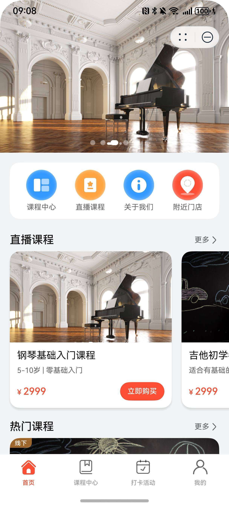
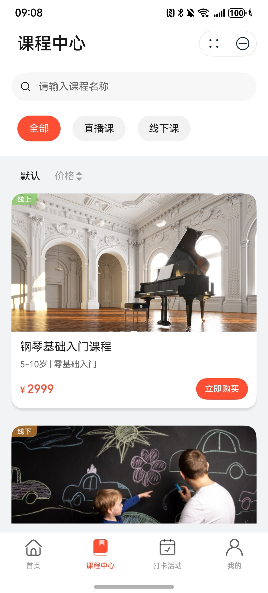
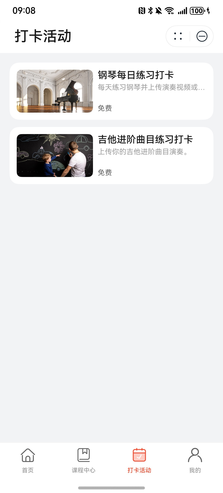
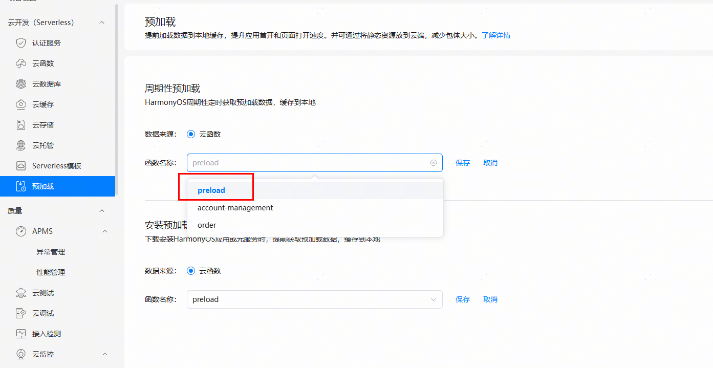

# 教育（艺术培训）行业元服务模板快速入门

## 目录

- [功能介绍](#功能介绍)
- [约束和限制](#约束和限制)
- [快速入门](#快速入门)
- [示例效果](#示例效果)
- [开源许可协议](#开源许可协议)


## 功能介绍

您可以基于此模板直接定制元服务，也可以挑选此模板中提供的多种组件使用，从而降低您的开发难度，提高您的开发效率。

此模板提供如下组件，所有组件存放在工程根目录的components下，如果您仅需使用组件，可参考对应组件的指导链接；如果您使用此模板，请参考本文档。

| 组件                               | 描述                                                         | 使用指导                                              |
| ---------------------------------- | ------------------------------------------------------------ | ----------------------------------------------------- |
| 打卡组件（module_check_in）        | 提供了支持选择图片、视频资源并展示预览效果的打卡组件         | [使用指导](./components/module_check_in/README.md)    |
| 课程列表组件（module_course_list） | 提供了课程列表组件，支持使用垂直、水平展示方向，支持自定义字体、颜色、角标等 | [使用指导](./components/module_course_list/README.md) |
| 商铺地图组件（module_store_map）   | 提供了商铺地图组件，支持展示商铺地理位置和用户所在位置、首次安装时请求地理位置权限等能力 | [使用指导](./components/module_store_map/README.md)   |


本模板为艺术培训类元服务提供了常用功能的开发样例，模板主要分首页、课程中心、打卡活动和我的四大模块：

- 首页：提供课程中心、直播课程、关于我们和附近门店功能入口，展示直播课程列表和热门课程列表，展示门店位置地图和门店信息。
- 课程中心：展示用户可购买的课程列表，支持课程搜索、过滤和排序功能，支持课程详情查看和下单。
- 打卡活动：展示用户可参与的打卡列表，支持参与打卡活动并上传打卡内容，支持查看历史打卡记录。
- 我的：展示用户个人头像及昵称，支持个人资料编辑，支持订单管理、个人课程和打卡活动查看、课程表查看、学员卡查看等。

本模板为端云一体化模板，已集成华为账号、地图、日历、支付等服务，只需做少量配置和定制即可快速实现课程购买、打卡活动参与、课程表查看等功能。

| 首页                                                        | 课程中心                                                        | 打卡活动                                                         | 我的                                                         |
|-----------------------------------------------------------|-------------------------------------------------------------|--------------------------------------------------------------| ------------------------------------------------------------ |
|  |  |  |  |

本模板主要页面及核心功能如下所示：

```ts
艺术培训模板
  |-- 首页
  |    |-- 轮播图
  |    |-- 核心功能入口(专栏列表、热门课程、关于我们、附近门店)
  |    |-- 直播课程列表
  |    |-- 热门课程列表
  |    └-- 商家信息
  |
  |-- 课程中心
  |    |-- 课程列表
  |    |-- 课程详情页
  |    |-- 预下单页
  |    └-- 下单完成页
  |
  |-- 打卡活动
  |    |-- 活动详情页
  |    |-- 打卡详情页
  |    └-- 提交打卡页
  |
  └-- 我的
       |-- 用户信息
       |    └--用户资料页
       |-- 订单
       |    |--订单列表页
       |    └--订单详情页
       |-- 学习工具
       |    |--已购课程页
       |    |--查看课表页
       |    |--个人打卡页
       |    └--学员证
       └-- 商家信息
```

本模板代码工程结构如下图所示：

```ts
ArtTraining
  |-- Application                      // 客户端工程文件
  |    |-- AppScope
  |    |
  |    |-- commons                     // 公共能力层
  |    |     |-- commonlib             // 工具方法、常量、公共类型定义封装
  |    |     |-- componentlib          // 公共组件、弹窗封装
  |    |     └-- network               // 网络库及mock封装
  |    |
  |    |-- components                  // 可分可合组件
  |    |     |-- module_check_in       // 打卡组件
  |    |     |-- module_course_list    // 课程列表组件
  |    |     |-- module_store_map      // 商铺地图组件
  |    |     └-- module_ui_base        // 公共基础包
  |    |
  |    |-- EntryCard
  |    |
  |    |-- feature                     // 基础特性层
  |    |     |-- checkin               // 打卡活动模块
  |    |     |-- courses               // 课程中心模块
  |    |     |-- home                  // 首页模块
  |    |     └-- mine                  // 我的模块
  |    |
  |    |-- products                    // 产品层
  |    |     └-- entry                 // 主入口模块
  |    |
  |    |-- screenshots                 // README.md中的图片和视频资源
  |    |
  |    └-- README.md                   // 项目介绍及启动指导
  |
  └-- CloudProgram                     // 服务端工程文件
       |-- clouddb                     // 云数据库
       |     |-- dataentry             // mock数据
       |     └-- objecttype            // 数据结构定义
       |
       └-- cloudfunctions              // 云函数
             |-- account-management    // 账号管理函数
             |-- order                 // 订单函数
             └-- preload               // 预加载函数
```

## 约束和限制

### 环境

- DevEco Studio版本：DevEco Studio 5.0.2 Release及以上
- HarmonyOS SDK版本：HarmonyOS 5.0.2 Release SDK及以上
- 设备类型：华为手机（直板机）
- HarmonyOS版本：HarmonyOS 5.0.2 Release及以上

### 权限

- 获取位置权限：ohos.permission.APPROXIMATELY_LOCATION，ohos.permission.LOCATION。
- 网络权限：ohos.permission.INTERNET
- 日历读写权限：ohos.permission.READ_CALENDAR, ohos.permission.WRITE_CALENDAR

### 调试

本模板不支持模拟器调试，请使用真机调试

## 快速入门

### 配置工程

在运行此模板前，需要完成以下配置：

1. 在AppGallery Connect创建元服务，将包名配置到模板中。

   a. 参考[创建元服务](https://developer.huawei.com/consumer/cn/doc/app/agc-help-createharmonyapp-0000001945392297)
   为元服务创建APP ID，并将APP ID与元服务进行关联。

   b. 返回应用列表页面，查看元服务的包名。

   c. 将模板工程根目录下AppScope/app.json5文件中的bundleName替换为创建元服务的包名。

2. 配置云侧工程。

   a. 开通“云函数”，“云数据库”，“云存储”服务。若首次开通需设置“数据处理位置”，选择“中国”并将其设为“默认”。

   

   b.
   修改配置文件“CloudProgram/cloud-config.json”。依次修改cloud-config.json中的appId、appName、projectId、projectName和teamId，相关信息查询参考[查看应用基本信息](https://developer.huawei.com/consumer/cn/doc/app/agc-help-appinfo-0000001100014694) 。

   

   c. 在项目中选中CloudProgram，右击选择“Deploy Cloud Program”，即可部署云数据库和云函数，请确保上传完成并成功。IDE提示success后可前往AGC的对应服务查看已部署的数据。

   

   d. 在AppGallery Connect进入“我的项目”，开通认证服务并启用华为账号认证方式。

   

   

   e. 在“项目设置”中下载SDK配置文件，并保存在工程的products/entry/src/main/resources/rawfile文件夹中，替换原示例的
   `agconent-services.json`，不可修改名称。

   

3. 配置华为账号服务。

   a. 将元服务的client
   ID配置到products/entry/src/main路径下的module.json5文件，详细参考：[配置Client ID](https://developer.huawei.com/consumer/cn/doc/atomic-guides/account-atomic-client-id)。

   b.
   如需获取用户真实手机号，需要申请phone权限，详细参考：[配置scope权限](https://developer.huawei.com/consumer/cn/doc/atomic-guides/account-guide-atomic-permissions)
   ，并在端侧使用快速验证手机号码Button进行[验证获取手机号码](https://developer.huawei.com/consumer/cn/doc/atomic-guides/account-guide-atomic-get-phonenumber)。

   c. 如需获取用户真实手机号，需要在云函数“account-management”中配置client_id和client_secret。

   

4. 配置地图服务

   a. 将元服务的client ID配置到products/entry/src/main路径下的module.json5文件，如果华为账号服务已配置，可跳过此步骤。

   b. [开通地图服务](https://developer.huawei.com/consumer/cn/doc/harmonyos-guides/map-config-agc)。

5. 配置支付服务。

   华为支付当前仅支持商户接入，在使用服务前，需要完成商户入网、开发服务等相关配置，本模板仅提供了端侧集成的示例。详细参考：[支付服务接入准备](https://developer.huawei.com/consumer/cn/doc/harmonyos-guides/payment-preparations)。

6. 配置预加载服务。

   a. [开通预加载服务](https://developer.huawei.com/consumer/cn/doc/harmonyos-guides/cloudfoundation-enable-prefetch)。

   b. 为预加载绑定步骤2.c部署的云函数“preload”。

   

7. 对元服务进行[手工签名](https://developer.huawei.com/consumer/cn/doc/harmonyos-guides/ide-signing#section297715173233)。

8. 添加手工签名所用证书对应的公钥指纹。详细参考：[配置应用签名证书指纹](https://developer.huawei.com/consumer/cn/doc/app/agc-help-signature-info-0000001628566748#section5181019153511)

### 运行调试工程

1. 用USB线连接调试手机和PC。

2. 点击"Run"，运行模板工程。

## 示例效果

 

## 开源许可协议

该代码经过[Apache 2.0 授权许可](http://www.apache.org/licenses/LICENSE-2.0)。
