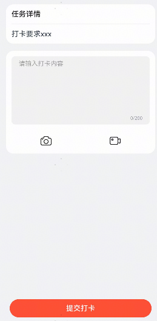

# 打卡组件快速入门

## 目录

- [简介](#简介)
- [约束与限制](#约束与限制)
- [快速入门](#快速入门)
- [API参考](#API参考)
- [示例代码](#示例代码)


## 简介

展示打卡界面，支持选择图片、视频资源并展示预览效果。




## 约束与限制

### 环境

* DevEco Studio版本：DevEco Studio 5.0.2 Release及以上
* HarmonyOS SDK版本：HarmonyOS 5.0.2 Release SDK及以上
* 设备类型：华为手机（直板机）
* HarmonyOS版本：HarmonyOS 5.0.2 Release及以上

### 权限

无


## 快速入门

1. 安装组件。

   如果是在DevEvo Studio使用插件集成组件，则无需安装组件，请忽略此步骤。

   如果是从生态市场下载组件，请参考以下步骤安装组件。

   a. 解压下载的组件包，将包中所有文件夹拷贝至您工程根目录的XXX目录下。

   b. 在项目根目录build-profile.json5添加module_ui_base和module_check_in模块。

   ```json5
   // 在项目根目录build-profile.json5填写module_ui_base和module_check_in路径。其中XXX为组件存放的目录名
   "modules": [
       {
       "name": "module_ui_base",
       "srcPath": "./XXX/module_ui_base",
       },
       {
       "name": "module_check_in",
       "srcPath": "./XXX/module_check_in",
       }
   ]
   ```

   c. 在项目根目录oh-package.json5中添加依赖。

   ```typescript
   // XXX为组件存放的目录名称
   "dependencies": {
     "module_check_in": "file:./XXX/module_check_in"
   }
   ```

2. 引入打卡组件句柄。

   ```typescript
   import { CheckInView } from 'module_check_in';
   ```

3. 调用组件，详细参数配置说明参见[API参考](#API参考)。

   ```ts
   import { CheckInView } from 'module_check_in';
   
   @Entry
   @Component
   struct Index {
     build() {
       Column() {
         CheckInView() {
           Column() {
             Text('打卡要求xxx');
           };
         };
       };
     }
   }
   ```

   

## API参考

### 子组件

无

### 接口

CheckInView(options: CheckInViewOptions)

课程列表组件。

**参数：**

| 参数名  | 类型                                            | 必填 | 说明                 |
| ------- | ----------------------------------------------- | ---- | -------------------- |
| options | [CheckInViewOptions](#CheckInViewOptions对象说明) | 否   | 配置日历组件的参数。 |

### 事件

支持以下事件：

#### handleSubmit

handleSubmit: (course: [CheckInDataModel](#CheckInDataModel接口说明)) => void

点击课程卡片时触发的事件


### CheckInViewOptions对象说明

| 名称              | 类型                                                         | 是否必填 | 说明                            |
| ----------------- | ------------------------------------------------------------ | -------- | ------------------------------- |
| title             | string                                                       | 否       | 标题，默认为`任务详情`。        |
| maxResourceNumber | number                                                       | 否       | 最大可添加的资源数量，默认为9。 |
| bgColor           | [ResourceColor](https://developer.huawei.com/consumer/cn/doc/harmonyos-references-V14/ts-types-V14#resourcecolor) | 否       | 背景颜色，默认为`#f1f3f5`。     |
| textLimit         | number                                                       | 否       | 文本内容限制，默认为200字符。   |
| customDesc        | [CustomBuilder](https://developer.huawei.com/consumer/cn/doc/harmonyos-references-V14/ts-types-V14#custombuilder8) | 是       | 自定义任务描述插槽。            |


### CheckInDataModel 对象说明

| 名称          | 类型                                                         | 是否必填 | 说明                             |
| ------------- | ------------------------------------------------------------ | -------- | -------------------------------- |
| textDetail    | string                                                       | 否       | 文本详情，默认为空字符串。       |
| pictureDetail | [ResourceStr](https://developer.huawei.com/consumer/cn/doc/harmonyos-references-V14/ts-types-V14#resourcestr)[] | 否       | 图片详情资源数组，默认为空数组。 |
| audioDetail   | [ResourceStr](https://developer.huawei.com/consumer/cn/doc/harmonyos-references-V14/ts-types-V14#resourcestr)[] | 否       | 音频详情资源数组，默认为空数组。 |
| videoDetail   | [ResourceStr](https://developer.huawei.com/consumer/cn/doc/harmonyos-references-V14/ts-types-V14#resourcestr)[] | 否       | 视频详情资源数组，默认为空数组。 |
| createTime    | string                                                       | 否       | 创建时间，默认为空字符串。       |


## 示例代码

### 示例一 （提交打卡文字和媒体信息，并进行校验）

```ts
import { CheckInDataModel, CheckInView } from 'module_check_in';

@Entry
@ComponentV2
struct CheckInPage2 {
  build() {
    Column() {
      CheckInView(
        {
          textLimit: 100,
          handleSubmit: (data) => {
            this.handleSubmit(data);
          },
        },
      ) {
        Column() {
          Text('文字要求: 不少于10字').cardContentStyle();
          Text('图片要求: 不少于3张').cardContentStyle();
          Text('视频要求: 至少上传1个打卡视频').cardContentStyle();
        }
        .width('100%')
        .alignItems(HorizontalAlign.Start);
      };
    };
  }

  handleSubmit(data: CheckInDataModel) {
    const promptAction = this.getUIContext().getPromptAction();
    if (data.textDetail.length < 10) {
      promptAction.showToast({ message: `打卡文字不得少于10个字~` });
      return;
    }
    if (data.pictureDetail.length < 3) {
      promptAction.showToast({ message: `打卡图片不得少于3张~` });
      return;
    }
    if (!data.videoDetail.length) {
      promptAction.showToast({ message: '请至少上传一个打卡视频~' });
      return;
    }
    promptAction.showToast({ message: '提交打卡成功~' });
  }
}

@Extend(Text)
function cardContentStyle() {
  .fontSize(12)
  .margin({ bottom: 4 })
  .fontColor('#99000000');
}
```