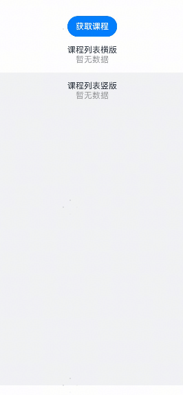

# 课程列表组件快速入门

## 目录

- [简介](#简介)
- [约束与限制](#约束与限制)
- [快速入门](#快速入门)
- [API参考](#API参考)
- [示例代码](#示例代码)


## 简介

展示课程列表信息，支持使用垂直、水平展示方向，支持自定义字体、颜色、角标等。


## 约束与限制

### 环境

* DevEco Studio版本：DevEco Studio 5.0.2 Release及以上
* HarmonyOS SDK版本：HarmonyOS 5.0.2 Release SDK及以上
* 设备类型：华为手机（直板机）
* HarmonyOS版本：HarmonyOS 5.0.2 Release及以上

### 权限

无


## 快速入门

1. 安装组件。

   如果是在DevEvo Studio使用插件集成组件，则无需安装组件，请忽略此步骤。

   如果是从生态市场下载组件，请参考以下步骤安装组件。

   a. 解压下载的组件包，将包中所有文件夹拷贝至您工程根目录的XXX目录下。

   b. 在项目根目录build-profile.json5添加module_ui_base和module_course_list模块。

   ```json5
   // 在项目根目录build-profile.json5填写module_ui_base和module_course_list路径。其中XXX为组件存放的目录名
   "modules": [
       {
       "name": "module_ui_base",
       "srcPath": "./XXX/module_ui_base",
       },
       {
       "name": "module_course_list",
       "srcPath": "./XXX/module_course_list",
       }
   ]
   ```

   c. 在项目根目录oh-package.json5中添加依赖。

   ```typescript
   // XXX为组件存放的目录名称
   "dependencies": {
     "module_course_list": "file:./XXX/module_course_list"
   }
   ```

2. 引入课程列表组件句柄。

   ```typescript
   import { CourseList } from 'module_course_list';
   ```

3. 调用组件，详见[示例代码](#示例代码)详细参数配置说明参见[API参考](#API参考)。

## API参考

### 子组件

无

### 接口

CourseList(options: CourseListOptions)

课程列表组件。

**参数：**

| 参数名  | 类型                                            | 必填 | 说明                 |
| ------- | ----------------------------------------------- | ---- | -------------------- |
| options | [CourseListOptions](#CourseListOptions对象说明) | 否   | 配置日历组件的参数。 |

### 事件

支持以下事件：

#### handleClick

handleClick: (course: [CourseInfo](#CourseInfo接口说明)) => void

点击课程卡片时触发的事件


### CourseListOptions对象说明

| 名称        | 类型                                                         | 是否必填 | 说明                                |
| ----------- | ------------------------------------------------------------ | -------- | ----------------------------------- |
| coursesList | [CourseInfo](#CourseInfo 接口说明)[]                         | 否       | 课程列表。                          |
| isVertical  | boolean                                                      | 否       | 是否垂直展示列表，默认为true。      |
| showTag     | boolean                                                      | 否       | 是否显示左上角的标签，默认为true。  |
| customTag   | [ResourceStr](https://developer.huawei.com/consumer/cn/doc/harmonyos-references-V14/ts-types-V14#resourcestr) | 否       | 自定义标签。                        |
| titleColor  | [ResourceColor](https://developer.huawei.com/consumer/cn/doc/harmonyos-references-V14/ts-types-V14#resourcecolor) | 否       | 标题文字颜色，默认为`#191919`。     |
| titleSize   | [ResourceStr](https://developer.huawei.com/consumer/cn/doc/harmonyos-references-V14/ts-types-V14#resourcestr) \| number | 否       | 标题文字大小，默认为`16fp`。        |
| descColor   | [ResourceColor](https://developer.huawei.com/consumer/cn/doc/harmonyos-references-V14/ts-types-V14#resourcecolor) | 否       | 课程介绍文字颜色，默认为`#990000`。 |
| descSize    | [ResourceStr](https://developer.huawei.com/consumer/cn/doc/harmonyos-references-V14/ts-types-V14#resourcestr) \| number | 否       | 课程介绍文字大小，默认为`12fp`。    |
| themeColor  | [ResourceColor](https://developer.huawei.com/consumer/cn/doc/harmonyos-references-V14/ts-types-V14#resourcecolor) | 否       | 主题颜色，默认为`#FE4F35`。         |
| priceSize   | [ResourceStr](https://developer.huawei.com/consumer/cn/doc/harmonyos-references-V14/ts-types-V14#resourcestr) \| number | 否       | 价格文字大小，默认为`16fp`。        |
| isLoading   | boolean                                                      | 否       | 是否处于加载状态，默认为false。     |


### CourseInfo接口说明

| 名称        | 类型                                                        | 是否必填 | 说明                                          |
| ----------- | ----------------------------------------------------------- | -------- | --------------------------------------------- |
| courseId    | number                                                      | 是       | 课程 ID。                                     |
| type        | number                                                      | 是       | 课程类型。                                    |
| name        | string                                                      | 是       | 课程名称。                                    |
| summary     | string                                                      | 是       | 课程摘要。                                    |
| detail      | string                                                      | 是       | 课程详细描述。                                |
| mainDiagram | [ResourceStr](https://developer.huawei.com/consumer/cn/doc/harmonyos-references-V14/ts-types-V14#resourcestr) | 是       | 课程主图资源路径。                            |
| price       | number                                                      | 是       | 课程价格。                                    |
| expireType  | number                                                      | 是       | 课程过期类型。                                |
| startTime   | string                                                      | 是       | 课程开始时间。                                |
| endTime     | string                                                      | 是       | 课程结束时间。                                |
| orderTime   | string                                                      | 是       | 课程下单时间。                                |
| classHour   | number                                                      | 是       | 课程总课时数。                                |
| status      | number                                                      | 是       | 课程状态（1：未上课，2：在读中，3：已结课）。 |
| currentHour | number                                                      | 是       | 当前课时数。                                  |
| timetable   | [CourseTimetable](#CourseTimetable接口说明)                 | 是       | 课程时间表。                                  |


### CourseTimetable接口说明

| 名称      | 类型     | 是否必填 | 说明                               |
| --------- | -------- | -------- | ---------------------------------- |
| weekdays  | number[] | 是       | 课程安排的星期几（0 表示星期日）。 |
| startTime | string   | 是       | 课程开始时间（格式：hh:mm）。      |
| endTime   | string   | 是       | 课程结束时间（格式：hh:mm）。      |


## 示例代码

### 示例一 （展示用户位置和信息窗，点击导航跳转华为地图）

```ts
import { CourseInfo, CourseList } from 'module_course_list';

const mock1: CourseInfo = {
  courseId: 101,
  type: 1,
  name: '钢琴基础入门课程',
  summary: '5-10岁 | 零基础入门',
  detail: '本课程由专业钢琴教师设计，包含钢琴基础知识、练习曲、音乐理论等内容，帮助你从零开始掌握钢琴演奏技巧。',
  mainDiagram: $r('app.media.img_course_cover1'),
  price: 199,
  expireType: 1,
  startTime: '1741046400000',
  endTime: '1762137600000',
  orderTime: '1735699200000',
  classHour: 15,
  status: 1,
  currentHour: 0,
  timetable: {
    weekdays: [0, 4],
    startTime: '09:00',
    endTime: '10:00',
  },
};

const mock2: CourseInfo = {
  courseId: 102,
  type: 1,
  name: '吉他初学者进阶课程',
  summary: '适合有基础的吉他爱好者，提升演奏技巧。',
  detail: '本课程针对有一定吉他基础的学员，教授吉他进阶技巧、常用和弦和经典吉他曲目。让你在短时间内提高吉他水平。',
  mainDiagram: $r('app.media.img_course_cover2'),
  price: 299,
  expireType: 1,
  startTime: '1741046400000',
  endTime: '1762137600000',
  orderTime: '',
  classHour: 15,
  status: 2,
  currentHour: 10,
  timetable: {
    weekdays: [2, 4],
    startTime: '19:00',
    endTime: '20:00',
  },
};

@Entry
@ComponentV2
struct PreviewPage {
  @Local
  list: CourseInfo[] = [];
  @Local
  isLoading: boolean = false;

  build() {
    Scroll() {
      Column({ space: 16 }) {
        if (!this.list.length) {
          Button('获取课程').onClick(() => {
            this.isLoading = true;
            const timer = setTimeout(() => {
              this.list = [mock1, mock2];
              this.isLoading = false; 
              clearTimeout(timer);
            }, 500);
          });
        }
        Column() {
          Text('课程列表横版');
          CourseList({
            coursesList: this.list,
            isVertical: false,
            isLoading: this.isLoading,
            handleClick: (item: CourseInfo) => {
              this.getUIContext().getPromptAction().showToast({
                message: `点击了课程，名称为${item.name}`,
              });
            },
          });
        };

        Column() {
          Text('课程列表竖版');
          CourseList({
            coursesList: this.list,
            isLoading: this.isLoading,
            handleClick: (item: CourseInfo) => {
              this.getUIContext().getPromptAction().showToast({
                message: `点击了课程，名称为${item.name}`,
              });
            },
          });
        }
        .backgroundColor('#f1f3f5')
        .padding(16)
        .layoutWeight(1);
      };
    };
  }
}
```

