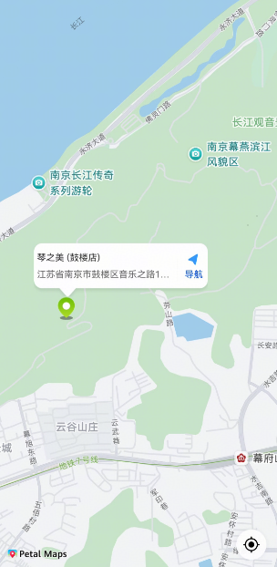

# 商铺地图组件快速入门

## 目录

- [简介](#简介)
- [约束与限制](#约束与限制)
- [快速入门](#快速入门)
- [API参考](#API参考)
- [示例代码](#示例代码)


## 简介

商铺地图组件，支持展示商铺地理位置和用户所在位置，支持在首次安装时请求地理位置权限，可以帮助开发者快速集成地图相关能力并进行定位展示。




## 约束与限制

### 环境

* DevEco Studio版本：DevEco Studio 5.0.2 Release及以上
* HarmonyOS SDK版本：HarmonyOS 5.0.2 Release SDK及以上
* 设备类型：华为手机（直板机）
* HarmonyOS版本：HarmonyOS 5.0.2 Release及以上

### 权限

* 获取位置权限：ohos.permission.APPROXIMATELY_LOCATION，ohos.permission.LOCATION。
* 网络权限：ohos.permission.INTERNET


## 快速入门

1. 使用本组件前请确保工程项目已完成[地图服务配置](https://developer.huawei.com/consumer/cn/doc/harmonyos-guides/map-config-agc)。

1. 安装组件。

   如果是在DevEvo Studio使用插件集成组件，则无需安装组件，请忽略此步骤。

   如果是从生态市场下载组件，请参考以下步骤安装组件。

   a. 解压下载的组件包，将包中所有文件夹拷贝至您工程根目录的XXX目录下。

   b. 在项目根目录build-profile.json5添加module_ui_base和module_store_map模块。

   ```json5
   // 在项目根目录build-profile.json5填写module_ui_base和module_store_map路径。其中XXX为组件存放的目录名
   "modules": [
       {
       "name": "module_ui_base",
       "srcPath": "./XXX/module_ui_base",
       },
       {
       "name": "module_store_map",
       "srcPath": "./XXX/module_store_map",
       }
   ]
   ```

   c. 在项目根目录oh-package.json5中添加依赖。

   ```typescript
   // XXX为组件存放的目录名称
   "dependencies": {
     "module_store_map": "file:./XXX/module_store_map"
   }
   ```

2. 引入商铺地图组件句柄。

   ```typescript
   import { StoreMap } from 'module_store_map';
   ```

3. 调用组件，详细参数配置说明参见[API参考](#API参考)。

   ```typescript
   import { StoreMap } from 'module_store_map';
   
   @Entry
   @Component
   struct Page1 {
     build() {
       Column() {
         StoreMap({
           storeInfo: {
             shopName: '琴之美 (鼓楼店)',
             latitude: 32.0603,
             longitude: 118.7969,
             address: '江苏省南京市鼓楼区音乐之路123号'
           },
           showInfoWindow: false,
           mapHeight: '100%',
         });
       };
     }
   }
   ```


## API参考

### 子组件

无

## API参考

StoreMap(options: StoreMapOptions)

#### StoreMapOptions对象说明

| 名称             | 类型                                                         | 是否必填 | 说明                            |
| ---------------- | ------------------------------------------------------------ | -------- | ------------------------------- |
| mapWidth         | [Length](https://developer.huawei.com/consumer/cn/doc/harmonyos-references/ts-types#length) | 否       | 地图宽度，默认为'100%'。        |
| mapHeight        | [Length](https://developer.huawei.com/consumer/cn/doc/harmonyos-references/ts-types#length) | 否       | 地图高度，默认为200。           |
| showInfoWindow   | boolean                                                      | 否       | 是否显示信息窗口，默认为false。 |
| storeInfo        | [StoreMapInfo](#StoreMapInfo类型说明)                        | 否       | 存储相关信息。                  |
| showUserLocation | boolean                                                      | 否       | 是否显示用户位置，默认为false。 |
| customInfoWindow | ($$: [map.MarkerDelegate](https://developer.huawei.com/consumer/cn/doc/harmonyos-references/map-map#section1852618491550)) => void | 否       | 自定义信息窗口构建函数。        |


#### StoreMapInfo类型说明

| 字段名    | 类型   | 必填 | 说明     |
| --------- | ------ | ---- | -------- |
| shopName  | string | 是   | 商铺名称 |
| latitude  | number | 是   | 纬度     |
| longitude | number | 是   | 经度     |
| address   | string | 是   | 商铺地址 |


## 示例代码

### 示例一 （展示用户位置和信息窗，点击导航跳转华为地图）

```ts
import { StoreMap } from 'module_store_map';

@Entry
@Component
struct Page2 {
  build() {
    Column() {
      StoreMap({
        storeInfo: {
          shopName: '琴之美 (鼓楼店)',
          latitude: 32.0603,
          longitude: 118.7969,
          address: '江苏省南京市鼓楼区音乐之路123号'
        },
        showInfoWindow: true,
        showUserLocation: true,
        mapHeight: '100%',
      });
    };
  }
}
```