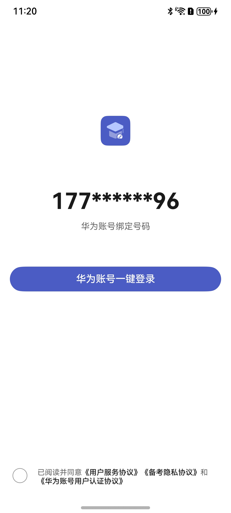

# 登录组件快速入门

## 目录

- [简介](#简介)
- [使用](#使用)
- [API参考](#API参考)
- [示例代码](#示例代码)

## 简介

本组件提供了华为账号一键登录的能力，开发者可以根据业务需要快速实现应用登录。



## 使用

1. 配置华为账号服务。

   a. 将应用的client ID配置到entry模块的module.json5文件，详细参考：[配置Client ID](https://developer.huawei.com/consumer/cn/doc/harmonyos-guides/account-client-id)。
   ```
   ...
   "requestPermissions": [],
   "metadata": [
      {
        "name": "client_id",
        "value": "*****"
        // 配置为获取的Client ID
      },
    ],
    "extensionAbilities": [],
   ...
   ```
   b. [配置签名和指纹](https://developer.huawei.com/consumer/cn/doc/harmonyos-guides/account-sign-fingerprints)。

   c. [申请scope权限](https://developer.huawei.com/consumer/cn/doc/harmonyos-guides/account-config-permissions) 。

2. 在项目中安装组件,需要将模板根目录的components下login_info目录拷贝至您的工程相应目录。
      ```
   // 在项目根目录build-profile.json5填写login_info路径
     "modules": [
       {
         "name": "login_info",
         "srcPath": "./login_info",
       }
     ]
   ```
   ```
   // 在entry目录下oh-package.json5填写依赖情况
   "dependencies": {
      "login_info": "file:../login_info"
     }
   ```

3. 引入登录组件句柄。
   ```
   import { QuickLogin } from 'login_info';
   ```

4. 调用组件，详细参数配置说明参见[API参考](#API参考)

   ```
   import { QuickLogin } from 'login_info';
   import { promptAction } from '@kit.ArkUI';
   
   @Entry
   @Component
   struct Index {
     build() {
       Column() {
         QuickLogin({
           isBindContentCover: true,
           icon: $r("app.media.startIcon"),
           loginBtnBgColor: "#4B5CC4",
           appName: "xxx",
           // 登录回调方法
           onLoginWithHuaweiID: () => {
             promptAction.showToast({ message: '登陆成功', duration: 2000 });
           },
           // 隐私协议方法
           onPrivacyPolicy: () => {
             promptAction.showToast({ message: '隐私协议点击事件', duration: 2000 });
           },
           // 服务协议方法
           onServicePolicy: () => {
             promptAction.showToast({ message: '服务协议点击事件', duration: 2000 });
           },
           // 华为账号用户认证协议
           onHYAccountRouter: () => {
             promptAction.showToast({ message: '华为账号用户认证协议点击事件', duration: 2000 });
           },
         })
       }
       .width('100%')
       .height('100%')
     }
   }
   ```

## API参考

### 接口

QuickLogin({icon:ResourceStr,loginBtnBgColor:ResourceStr,appName:string,isBindContentCover: boolean})

登录组件。

**参数：**

| 参数名                | 类型                                                                                                            | 必填 | 说明                                                                                                                              |
|:-------------------|:--------------------------------------------------------------------------------------------------------------|:---|:--------------------------------------------------------------------------------------------------------------------------------|
| icon               | [ResourceStr](https://developer.huawei.com/consumer/cn/doc/harmonyos-references-V14/ts-types-V14#resourcestr) | 是  | 应用图标，参考[UX设计规范](https://developer.huawei.com/consumer/cn/doc/harmonyos-guides/account-phone-unionid-login#section2558741102912) | | 是  | 登录渠道信息                                                                                                                          |
| loginBtnBgColor    | ResourceStr                                                                                                   | 是  | 一键登录按钮背景色                                                                                                                       | | 否  | 应用路由栈                                                                                                                           |
| appName            | string                                                                                                        | 是  | 应用隐私协议名称                                                                                                                        | | 否  | 应用路由栈                                                                                                                           |
| isBindContentCover | boolean                                                                                                       | 否  | 区分模态和半模态弹窗                                                                                                                      |

### 事件

支持以下事件：

#### onLoginWithHuaweiID

onLoginWithHuaweiID: () => void = () => {}

点击华为账号一键登录时的跳转方法。

#### onPrivacyPolicy

onPrivacyPolicy: () => void = () => {}

点击隐私协议时的跳转方法。

#### onServicePolicy

onServicePolicy: () => void = () => {}

点击服务协议时的跳转方法。

#### onHYAccountRouter

onHYAccountRouter: () => void = () => {}

点击华为用户认证协议时的跳转方法。

## 示例代码

   ```
   import { QuickLogin } from 'login_info';
   import { promptAction } from '@kit.ArkUI';
   
   @Entry
   @Component
   struct Index {
     build() {
       Column() {
         QuickLogin({
           isBindContentCover: true,
           icon: $r("app.media.startIcon"),
           loginBtnBgColor: "#4B5CC4",
           appName: "xxx",
           // 登录回调方法
           onLoginWithHuaweiID: () => {
             promptAction.showToast({ message: '登陆成功', duration: 2000 });
           },
           // 隐私协议方法
           onPrivacyPolicy: () => {
             promptAction.showToast({ message: '隐私协议点击事件', duration: 2000 });
           },
           // 服务协议方法
           onServicePolicy: () => {
             promptAction.showToast({ message: '服务协议点击事件', duration: 2000 });
           },
           // 华为账号用户认证协议
           onHYAccountRouter: () => {
             promptAction.showToast({ message: '华为账号用户认证协议点击事件', duration: 2000 });
           },
         })
       }
       .width('100%')
       .height('100%')
     }
   }
   ```
