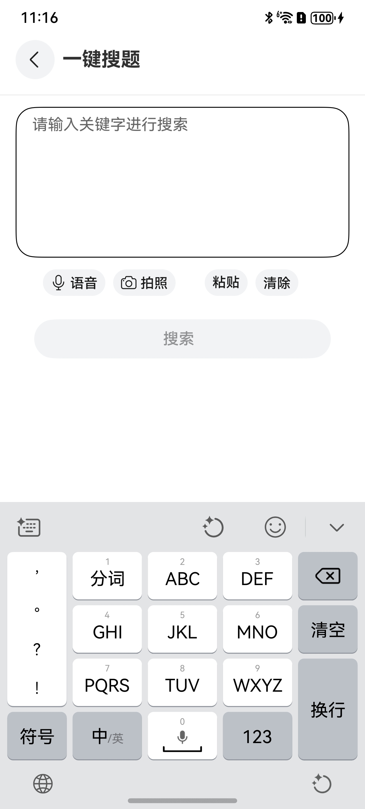

# 一键搜题组件快速入门

## 目录

- [简介](#简介)
- [使用](#使用)
- [API参考](#API参考)
- [示例代码](#示例代码)

## 简介

本组件提供了一键搜题页面的模板，本身集成语音输入，拍照识别，粘贴和清除功能，提供搜索和退出回调方法。



## 使用

1. 在项目中安装组件，需要将模板根目录的components下search_question目录拷贝至您的工程相应目录。
   ```
   // 在项目根目录build-profile.json5填写search_question路径
   "modules": [
   {
   "name": "search_question",
   "srcPath": "./search_question",
   }
   ]
   ```
   ```
     // 在entry目录下oh-package.json5填写依赖情况
   "dependencies": {
      "search_question": "file:../search_question"
     }
   ```

2. 引入一键搜题组件句柄

   ```
   import { SearchQuestionPage } from 'search_question';
   ```

3. 调用组件，详细参数配置说明参见[API参考](#API参考)
   ```
   import { SearchQuestionPage } from 'search_question';
   
   @Entry
   @Component
   struct Index {
     build() {
       Column() {
         SearchQuestionPage({
           //返回搜索框中的data值
           search: (data) => {
             console.log("点击搜索按钮")
           },
           back: () => {
             console.log("点击返回按钮回调事件")
           },
         })
       }
       .width('100%')
       .height('100%')
     }
   }
   ```

## API参考

SearchQuestionPage()

一键搜题组件组件。

### 事件

支持以下事件：

#### search

search: () => void = () => {}

点击搜索的事件

#### back

back: () => void = () => {}

点击返回的事件。

## 示例代码

   ```
   import { SearchQuestionPage } from 'search_question';
   
   @Entry
   @Component
   struct Index {
     build() {
       Column() {
         SearchQuestionPage({
           //返回搜索框中的data值
           search: (data) => {
             console.log("点击搜索按钮")
           },
           back: () => {
             console.log("点击返回按钮回调事件")
           },
         })
       }
       .width('100%')
       .height('100%')
     }
   }
   ```
