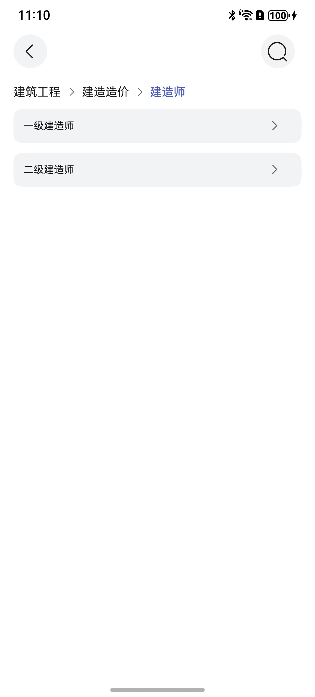
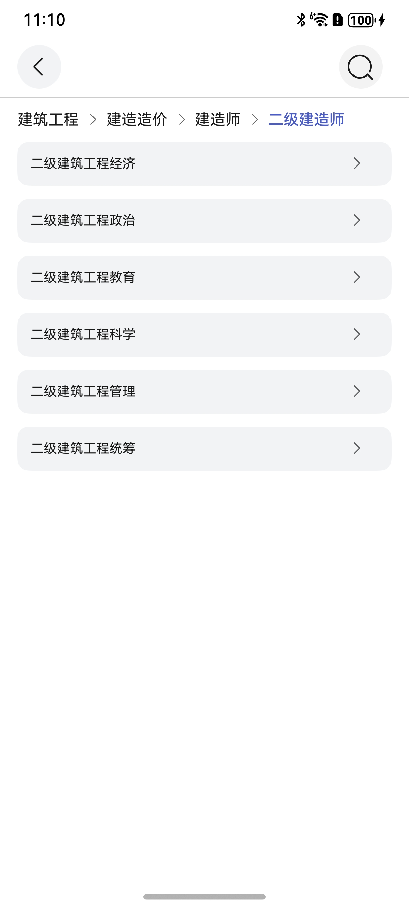

# 多级分栏组件快速入门

## 目录

- [简介](#简介)
- [使用](#使用)
- [API参考](#API参考)
- [示例代码](#示例代码)

## 简介

本组件提供了二级三级分类的能力，开发者可以根据实际业务需要快速实现二三级分类。

| 二级分类组件                                                    | 三级分类组件                                                  | 
|-----------------------------------------------------------|---------------------------------------------------------|
|  |  | 

## 使用

1. 安装组件。需要将模板根目录的components下select_category目录拷贝至您的工程相应目录。

   ```
   // 在项目根目录build-profile.json5填写select_category路径
     "modules": [
       {
         "name": "select_category",
         "srcPath": "./select_category",
       }
     ]
   ```

   ```
   // 在entry目录下oh-package.json5填写依赖情况
   "dependencies": {
      "select_category": "file:../select_category"
   }
   ```

2. 引入组件句柄。
   ```
   import { SelectCategory,ThirdCategory,SecondParam,ThirdParam,ThirdItemModel,ItemDetail } from 'select_category';
   ```

3. 调用组件，详细参数配置说明参见[API参考](#API参考)
   ```
   import { SelectCategory,ThirdCategory,SecondParam,ThirdParam,ThirdItemModel,ItemDetail } from 'select_category';
   
   @Entry
   @ComponentV2 struct Index{
      @Local secondParamObj:SecondParam|undefined = undefined //示例数据
      @Local thirdParamObj:ThirdParam|undefined = undefined //示例数据
   
      aboutToAppear(): void {
       this.secondParamObj = new SecondParam(['建筑工程', '建造造价', '建造师'], {
         'id': '111', 'title': '建造师', 'list': [
           {
             'id': '1111', 'title': '一级建造师', 'list': [
             { 'id': '11111', 'title': '建筑工程经济' }, { 'id': '11112', 'title': '建筑工程政治' },
             { 'id': '11113', 'title': '建筑工程教育' }, { 'id': '11114', 'title': '建筑工程科学' },
             { 'id': '11115', 'title': '建筑工程管理' }, { 'id': '11116', 'title': '建筑工程统筹' }]
           }
           , {
           'id': '1112', 'title': '二级建造师', 'list': [
             { 'id': '11121', 'title': '二级建筑工程经济' }, { 'id': '11122', 'title': '二级建筑工程政治' },
             { 'id': '11123', 'title': '二级建筑工程教育' },
             { 'id': '11124', 'title': '二级建筑工程科学' }, { 'id': '11125', 'title': '二级建筑工程管理' },
             { 'id': '11126', 'title': '二级建筑工程统筹' }]
         }]
       })


       this.thirdParamObj = new ThirdParam(['建筑工程', '建造造价', '建造师', '二级建造师'],
         { 'id': '1112', 'title': '二级建造师', 'list': [
           { 'id': '11121', 'title': '二级建筑工程经济' },
           { 'id': '11122', 'title': '二级建筑工程政治' },
           { 'id': '11123', 'title': '二级建筑工程教育' },
           { 'id': '11124', 'title': '二级建筑工程科学' },
           { 'id': '11125', 'title': '二级建筑工程管理' },
           { 'id': '11126', 'title': '二级建筑工程统筹' }] })
   
   
      }
      
   build(){
      Column(){
         // 二级分类组件
         SelectCategory({
            secondParamObj: this.secondParamObj,
            currentColor: '#4B5CC4',
            contentIcon: $r('app.media.icon_right'),
            goPage: (val:string) => {
               // 点击的标题名称
               console.log(val)
            },
            goThird: (val:ThirdItemModel) => {
               // 跳转三级分类传递的数据
               console.log(JSON.stringify(val))
            }
         }).height('50%')
   
         // 三级分类组件
         ThirdCategory({
            thirdParamObj: this.thirdParamObj,
            currentColor: '#4B5CC4',
            contentIcon: $r('app.media.icon_right'),
            goPage: (val:string) => {
               // 点击的标题名称
               console.log(val)
            },
            // 返回最后选择的对象 包含标题/ID
            goBack: (val:ItemDetail) => {
               console.log(JSON.stringify(val))
            }
         }).height('50%')
      }
      .width('100%')
      .height('100%')
   }
   }
   ```

## API参考

### 接口

SelectCategory({secondParamObj:SecondParam,contentIcon:ResourceStr,currentColor:ResourceStr})

二级分类组件。

**参数：**

| 参数名            | 类型                                                                                                            | 是否必填 | 说明                                                                                                                              |
|:---------------|:--------------------------------------------------------------------------------------------------------------|:-----|:--------------------------------------------------------------------------------------------------------------------------------|
| secondParamObj | [SecondParam](#ItemDetail对象说明)                                                                                | 是    | 一级传递二级分类的数据。                                                                                                                    |                                                                                                                       |
| contentIcon    | [ResourceStr](https://developer.huawei.com/consumer/cn/doc/harmonyos-references-V14/ts-types-V14#resourcestr) | 否    | 应用图标，参考[UX设计规范](https://developer.huawei.com/consumer/cn/doc/harmonyos-guides/account-phone-unionid-login#section2558741102912) | | 是  | 内容的图标                                                                                                                         |
| currentColor   | ResourceStr                                                                                                   | 否    | 左侧栏选中背景色                                                                                                                        | | 否  | 应用路由栈                                                                                                                           |

### 事件

支持以下事件：

#### goPage

goPage: (x: string) => void = (x: string) => {};

点击的标题名称。

#### goThird

goThird: (x: ThirdItemModel) => void = (x: ThirdItemModel) => {};

跳转三级列表页传递数据。

ThirdCategory({thirdParamObj:ThirdParam,contentIcon:ResourceStr,currentColor:ResourceStr})

三级分类组件。

**参数：**

| 参数名           | 类型                                                                                                            | 是否必填 | 说明                                                                                                                              |
|:--------------|:--------------------------------------------------------------------------------------------------------------|:-----|:--------------------------------------------------------------------------------------------------------------------------------|
| thirdParamObj | [ThirdParam]((#ThirdParam对象说明))                                                                               | 是    | 二级传递三级分类的数据。                                                                                                                    |                                                                                                                       |
| contentIcon   | [ResourceStr](https://developer.huawei.com/consumer/cn/doc/harmonyos-references-V14/ts-types-V14#resourcestr) | 否    | 应用图标，参考[UX设计规范](https://developer.huawei.com/consumer/cn/doc/harmonyos-guides/account-phone-unionid-login#section2558741102912) |                                                                                                                         |
| currentColor  | ResourceStr                                                                                                   | 否    | 左侧栏选中背景色                                                                                                                        | | 否  | 应用路由栈                                                                                                                           |

### SecondParam对象说明

| 参数名        | 类型                                      | 是否必填 | 说明             |
|------------|-----------------------------------------|------|----------------|
| secondItem | [SecondItemModel](#SecondItemModel对象说明) | 是    | 跳转二级分类,传递的数据对象 |
| list       | string[]                                | 是    | 顶部分类显示列表       |

#### ThirdParam对象说明

| 参数名       | 类型                                    | 是否必填 | 说明             |
|-----------|---------------------------------------|------|----------------|
| thirdItem | [ThirdItemModel](#ThirdItemModel对象说明) | 是    | 跳转三级分类,传递的数据对象 |
| list      | string[]                              | 是    | 顶部分类显示列表       |

### SecondItemModel对象说明

| 参数名   | 类型                                      | 是否必填 | 说明           |
|-------|-----------------------------------------|------|--------------|
| id    | string                                  | 是    | 二级分类对象的ID    |
| title | string                                  | 是    | 标题           |
| list  | [ThirdItemModel](#ThirdItemModel对象说明)[] | 是    | 二级分类对象下包含的列表 |

### ThirdItemModel对象说明

| 参数名   | 类型                              | 是否必填 | 说明           |
|-------|---------------------------------|------|--------------|
| id    | string                          | 是    | 三级分类对象的ID    |
| title | string                          | 是    | 标题           |
| list  | [ItemDetail](#ItemDetail对象说明)[] | 是    | 三级分类对象下包含的列表 |

### ItemDetail对象说明

| 参数名   | 类型     | 是否必填 | 说明          |
|-------|--------|------|-------------|
| id    | string | 是    | 最后选择的返回对象ID |
| title | string | 是    | 标题          |

### 事件

支持以下事件：

#### goPage

goPage: (x: string) => void = (x: string) => {};

点击的标题名称。

#### goBack

goBack: (x: ItemDetail) => void = (x: ItemDetail) => {};

返回最后点击的对象：包含标题/ID。

## 示例代码

```
import { SelectCategory,ThirdCategory,SecondParam,ThirdParam,ThirdItemModel,ItemDetail } from 'select_category';

@Entry
@ComponentV2 struct Index{
   @Local secondParamObj:SecondParam|undefined = undefined //示例数据
   @Local thirdParamObj:ThirdParam|undefined = undefined //示例数据
   
      aboutToAppear(): void {
       this.secondParamObj = new SecondParam(['建筑工程', '建造造价', '建造师'], {
         'id': '111', 'title': '建造师', 'list': [
           {
             'id': '1111', 'title': '一级建造师', 'list': [
             { 'id': '11111', 'title': '建筑工程经济' }, { 'id': '11112', 'title': '建筑工程政治' },
             { 'id': '11113', 'title': '建筑工程教育' }, { 'id': '11114', 'title': '建筑工程科学' },
             { 'id': '11115', 'title': '建筑工程管理' }, { 'id': '11116', 'title': '建筑工程统筹' }]
           }
           , {
           'id': '1112', 'title': '二级建造师', 'list': [
             { 'id': '11121', 'title': '二级建筑工程经济' }, { 'id': '11122', 'title': '二级建筑工程政治' },
             { 'id': '11123', 'title': '二级建筑工程教育' },
             { 'id': '11124', 'title': '二级建筑工程科学' }, { 'id': '11125', 'title': '二级建筑工程管理' },
             { 'id': '11126', 'title': '二级建筑工程统筹' }]
         }]
       })


    this.thirdParamObj = new ThirdParam(['建筑工程', '建造造价', '建造师', '二级建造师'],
      { 'id': '1112', 'title': '二级建造师', 'list': [
        { 'id': '11121', 'title': '二级建筑工程经济' },
        { 'id': '11122', 'title': '二级建筑工程政治' },
        { 'id': '11123', 'title': '二级建筑工程教育' },
        { 'id': '11124', 'title': '二级建筑工程科学' },
        { 'id': '11125', 'title': '二级建筑工程管理' },
        { 'id': '11126', 'title': '二级建筑工程统筹' }] })


  }
   build(){
      Column(){
         // 二级分类组件
         SelectCategory({
            secondParamObj: this.secondParamObj,
            currentColor: '#4B5CC4',
            contentIcon: $r('app.media.icon_right'),
            goPage: (val:string) => {
               // 点击的标题名称
               console.log(val)
            },
            goThird: (val:ThirdItemModel) => {
               // 跳转三级分类传递的数据
               console.log(JSON.stringify(val))
            }
         }).height('50%')

         // 三级分类组件
         ThirdCategory({
            thirdParamObj: this.thirdParamObj,
            currentColor: '#4B5CC4',
            contentIcon: $r('app.media.icon_right'),
            goPage: (val:string) => {
               // 点击的标题名称
               console.log(val)
            },
            // 返回最后选择的对象 包含标题/ID
            goBack: (val:ItemDetail) => {
               console.log(JSON.stringify(val))
            }
         }).height('50%')
      }
      .width('100%')
      .height('100%')
   }
}
```