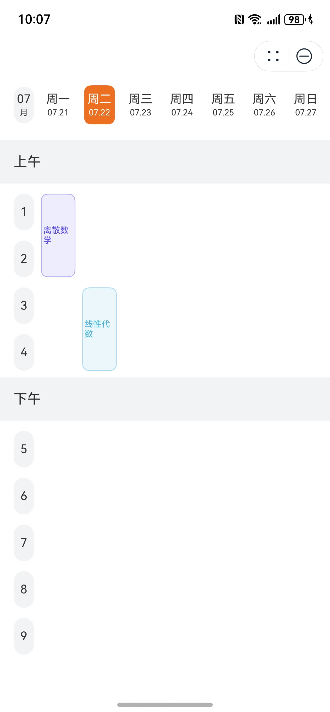

# 课表组件快速入门

## 目录

- [简介](#简介)
- [约束与限制](#约束与限制)
- [快速入门](#快速入门)
- [API参考](#API参考)
- [示例代码](#示例代码)

## 简介

本组件支持根据课程信息及相关配置进行课表UI渲染。

| 课程中心                                                    |
|---------------------------------------------------------|
|  |

## 约束与限制

### 环境

* DevEco Studio版本：DevEco Studio 5.0.3 Release及以上
* HarmonyOS SDK版本：HarmonyOS 5.0.3 Release SDK及以上
* 设备类型：华为手机（直板机）
* HarmonyOS版本：HarmonyOS 5.0.3 Release及以上

## 快速入门

1. 安装组件。

   如果是在DevEvo Studio使用插件集成组件，则无需安装组件，请忽略此步骤。

   如果是从生态市场下载组件，请参考以下步骤安装组件。

   a. 解压下载的组件包，将包中所有文件夹拷贝至您工程根目录的XXX目录下。

   b. 在项目根目录build-profile.json5添加module_course_schedule模块。

   ```
   // 项目根目录下build-profile.json5填写module_course_schedule路径。其中XXX为组件存放的目录名
   "modules": [
     {
       "name": "module_course_schedule",
       "srcPath": "./XXX/module_course_schedule"
     }
   ]
   ```

   ```
   // 在项目根目录oh-package.json5中添加依赖
   "dependencies": {
     "module_course_schedule": "file:./XXX/module_course_schedule"
   }
   ```

2. 引入组件。

   ```
   import { ScheduleInfo, TimeInfo, ScheduleFlow } from 'module_course_schedule';
   ```

3. 调用组件，详细参数配置说明参见[API参考](#API参考)。

   ```
   import { ScheduleInfo, TimeInfo, ScheduleFlow } from 'module_course_schedule';
   
   const MS_PER_DAY: number = 24 * 60 * 60 * 1000;
   
   @Entry
   @ComponentV2
   struct Index {
   
     private scheduleList: ScheduleInfo[] = [
       new ScheduleInfo(
         [1, 2],     // 占用第 1 节至第 2 节课
         1,          // 当前课程处于一周的第 1 天
         '离散数学'
       ),
       new ScheduleInfo(
         [3, 4],     // 占用第 3 节至第 4 节课
         2,          // 当前课程处于一周的第 2 天
         '线性代数'
       )
     ];
   
     private today: Date = new Date();
   
     private monday: Date = (() => {
       // 0: 周日, 1: 周一, ..., 6: 周六
       const day: number = this.today.getDay();
       const diffToMonday: number = day === 0 ? -6 : 1 - day;
       return new Date(this.today.getTime() + diffToMonday * MS_PER_DAY);
     })();
   
     private sunday: Date = new Date(this.monday.getTime() + 6 * MS_PER_DAY);
   
     public build(): void {
       Column() {
         ScheduleFlow({
           currentDate: this.today,
           scheduleWeek: [this.monday, this.sunday],
           divideTimes: [
             new TimeInfo(4, '上午'), // 取 1 ~ 4 节课，划分至上午
             new TimeInfo(9, '下午')  // 取 5 ~ 9 节课，划分至下午
           ],
           scheduleMaxIndex: 9,       // 总共有 9 节课
           scheduleList: this.scheduleList,
           scheduleClick: (scheduleInfo: ScheduleInfo) => {
             this.getUIContext().getPromptAction().showToast({ message: scheduleInfo.scheduleName });
           }
         })
       }
       .width('100%')
       .height('100%')
       .padding({ top: this.getUIContext().getAtomicServiceBar() ? 56 : 0 })
     }
   }
   ```

## API参考

### ScheduleFlow(option: ScheduleFlowOptions)

**ScheduleFlowOptions对象说明**

| 参数名              | 类型                                                    | 必填            | 说明            |
|:-----------------|:------------------------------------------------------|:--------------|:--------------|
| currentDate      | Date                                                  | 是             | 当前日期          |
| scheduleWeek     | Date[]                                                | 是             | 日期所在周时间段，长度为2 |
| divideTimes      | [TimeInfo](#TimeInfo)[]                               | 是             | 时间段分割信息       |
| scheduleMaxIndex | number                                                | 是             | 课程时间段数量       |
| scheduleList     | [ScheduleInfo](#ScheduleInfo)[]                       | 是             | 课程源数据         |
| scheduleClick    | (scheduleInfo: [ScheduleInfo](#ScheduleInfo)) => void | 否             | 课程点击回调事件      |

### TimeInfo

表示时间段分割信息的结构体，用于对课表按照时间段进行分割并显示分割标题。

| 字段名        | 类型                 | 必填  | 说明   |
|------------|--------------------|-----|------|
| divideTime | number             | 是   | 分割下标 |
| periodName | string \| Resource | 是   | 分割标题 |

### ScheduleInfo

表示课程信息的结构体，用于渲染课表UI的源数据。

| 字段名           | 类型       | 必填  | 说明     |
|---------------|----------|-----|--------|
| daySchedule   | number[] | 是   | 日程时间段  |
| weekDay       | number   | 是   | 日程所在日期 |
| scheduleName  | string   | 是   | 日程名称   |

## 示例代码

```
import { ScheduleInfo, TimeInfo, ScheduleFlow } from 'module_course_schedule';

const MS_PER_DAY: number = 24 * 60 * 60 * 1000;

@Entry
@ComponentV2
struct Index {

  private scheduleList: ScheduleInfo[] = [
    new ScheduleInfo(
      [1, 2],     // 占用第 1 节至第 2 节课
      1,          // 当前课程处于一周的第 1 天
      '离散数学'
    ),
    new ScheduleInfo(
      [3, 4],     // 占用第 3 节至第 4 节课
      2,          // 当前课程处于一周的第 2 天
      '线性代数'
    )
  ];

  private today: Date = new Date();

  private monday: Date = (() => {
    // 0: 周日, 1: 周一, ..., 6: 周六
    const day: number = this.today.getDay();
    const diffToMonday: number = day === 0 ? -6 : 1 - day;
    return new Date(this.today.getTime() + diffToMonday * MS_PER_DAY);
  })();

  private sunday: Date = new Date(this.monday.getTime() + 6 * MS_PER_DAY);

  public build(): void {
    Column() {
      ScheduleFlow({
        currentDate: this.today,
        scheduleWeek: [this.monday, this.sunday],
        divideTimes: [
          new TimeInfo(4, '上午'), // 取 1 ~ 4 节课，划分至上午
          new TimeInfo(9, '下午')  // 取 5 ~ 9 节课，划分至下午
        ],
        scheduleMaxIndex: 9,       // 总共有 9 节课
        scheduleList: this.scheduleList,
        scheduleClick: (scheduleInfo: ScheduleInfo) => {
          this.getUIContext().getPromptAction().showToast({ message: scheduleInfo.scheduleName });
        }
      })
    }
    .width('100%')
    .height('100%')
    .padding({ top: this.getUIContext().getAtomicServiceBar() ? 56 : 0 })
  }
}
```
