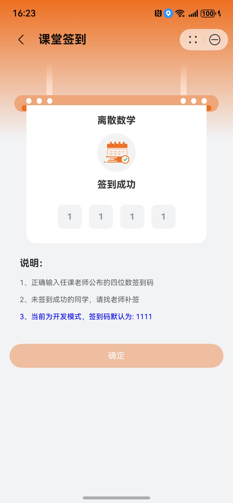

# 签到组件快速入门

## 目录

- [简介](#简介)
- [约束与限制](#约束与限制)
- [快速入门](#快速入门)
- [API参考](#API参考)
- [示例代码](#示例代码)

## 简介

本组件提供课堂签到功能，支持根据实时位置与验证码进行签到。

| 课堂签到                                            |
|-------------------------------------------------|
|  |

## 约束与限制

### 环境

* DevEco Studio版本：DevEco Studio 5.0.3 Release及以上
* HarmonyOS SDK版本：HarmonyOS 5.0.3 Release SDK及以上
* 设备类型：华为手机（直板机）
* HarmonyOS版本：HarmonyOS 5.0.3 Release及以上

### 权限

* 网络权限：ohos.permission.INTERNET
* 位置权限：ohos.permission.LOCATION
* 模糊位置权限：ohos.permission.APPROXIMATELY_LOCATION

## 快速入门

1. 安装组件。

   如果是在DevEvo Studio使用插件集成组件，则无需安装组件，请忽略此步骤。

   如果是从生态市场下载组件，请参考以下步骤安装组件。

   a. 解压下载的组件包，将包中所有文件夹拷贝至您工程根目录的XXX目录下。

   b. 在项目根目录build-profile.json5添加module_secure_checkin模块。

   ```
   // 项目根目录下build-profile.json5填写module_secure_checkin路径。其中XXX为组件存放的目录名
   "modules": [
     {
       "name": "module_secure_checkin",
       "srcPath": "./XXX/module_secure_checkin"
     }
   ]
   ```

   ```
   // 在项目根目录oh-package.json5中添加依赖
   "dependencies": {
     "module_secure_checkin": "file:./XXX/module_secure_checkin"
   }
   ```

   ```
   // 在程序入口模块下的src/main/module.json5中声明权限
    "requestPermissions": [
      {
        "name": "ohos.permission.INTERNET"
      },
      {
        "name": 'ohos.permission.APPROXIMATELY_LOCATION',
        "reason": '$string:permission_reason_location', // 在 string.json 中添加该字段
        "usedScene": {
          "abilities": [
            "EntryAbility"
          ],
          "when": "inuse"
        }
      },
      {
        "name": "ohos.permission.LOCATION",
        "reason": '$string:permission_reason_location', // 在 string.json 中添加该字段
        "usedScene": {
          "abilities": [
            "EntryAbility"
          ],
          "when": "inuse"
        }
      }
    ],
   ```

2. 引入组件。

   ```
   import { goToCheckinPage, CheckinContext } from 'module_secure_checkin';
   ```

3. 调用组件，详细参数配置说明参见[API参考](#API参考)。

   ```
   import { CheckinContext, goToCheckinPage } from 'module_secure_checkin';
   
   @Entry
   @ComponentV2
   struct Index {
   
     private ctx: CheckinContext = {
       courseName: '离散数学',
       courseId: 'li_san_shu_xue',
       studentId: '00001'
     };
   
     private navPathStack: NavPathStack = new NavPathStack()
   
     public build(): void {
       Navigation(this.navPathStack) {
         Column() {
           Button('课堂签到')
             .onClick(() => {
               goToCheckinPage(this.navPathStack, this.ctx);
             })
         }
         .width('100%')
         .height('100%')
         .justifyContent(FlexAlign.Center)
       }
       .hideTitleBar(true)
       .mode(NavigationMode.Stack)
     }
   }
   ```

## API参考

### goToCheckinPage(stack: NavPathStack, ctx: [CheckinContext](#CheckinContext))

**前往签到页面**

### CheckinContext

承载签到页面上下文的结构体。

| 字段名         | 类型     | 必填  | 说明   |
|-------------|--------|-----|------|
| studentId   | string | 是   | 学号   |
| courseId    | string | 是   | 课程编号 |
| courseName  | string | 是   | 课程名称 |

## 示例代码

```
import { CheckinContext, goToCheckinPage } from 'module_secure_checkin';

@Entry
@ComponentV2
struct Index {

  private ctx: CheckinContext = {
    courseName: '离散数学',
    courseId: 'li_san_shu_xue',
    studentId: '00001'
  };

  private navPathStack: NavPathStack = new NavPathStack()

  public build(): void {
    Navigation(this.navPathStack) {
      Column() {
        Button('课堂签到')
          .onClick(() => {
            goToCheckinPage(this.navPathStack, this.ctx);
          })
      }
      .width('100%')
      .height('100%')
      .justifyContent(FlexAlign.Center)
    }
    .hideTitleBar(true)
    .mode(NavigationMode.Stack)
  }
}
```
