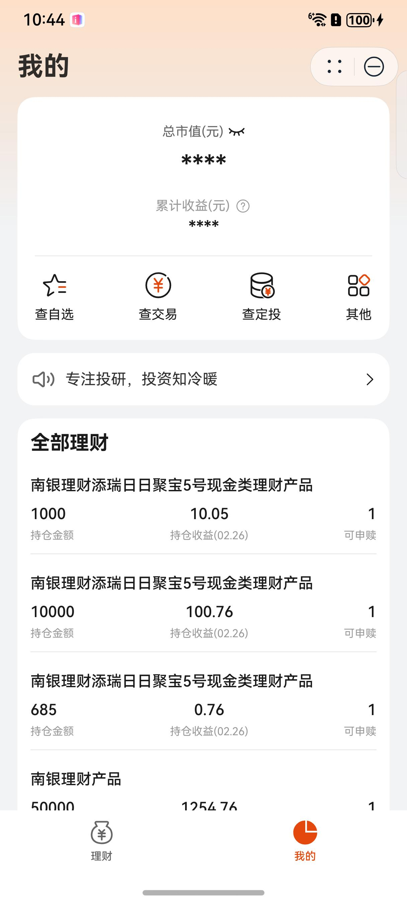
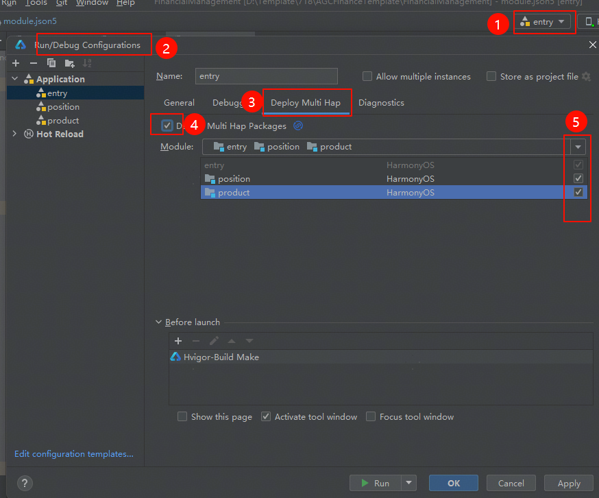
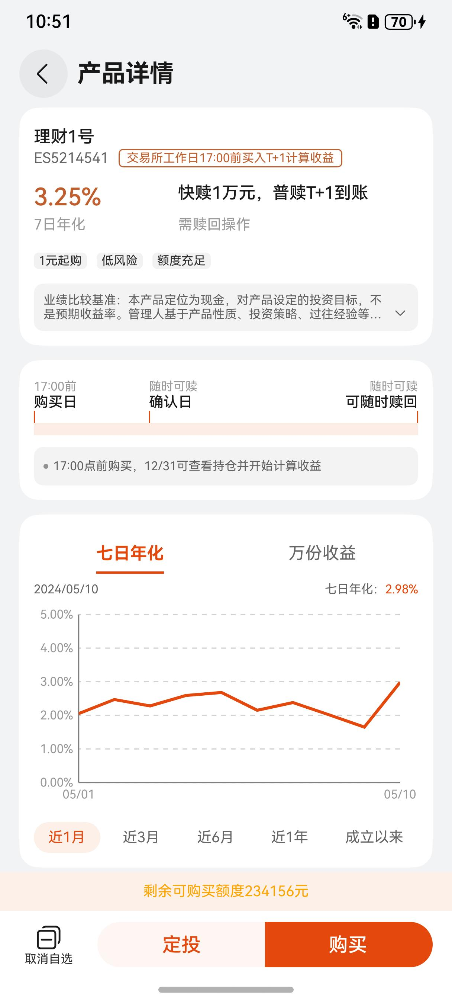
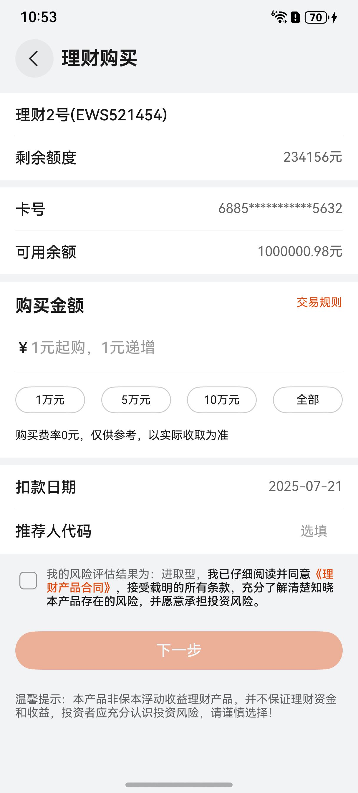
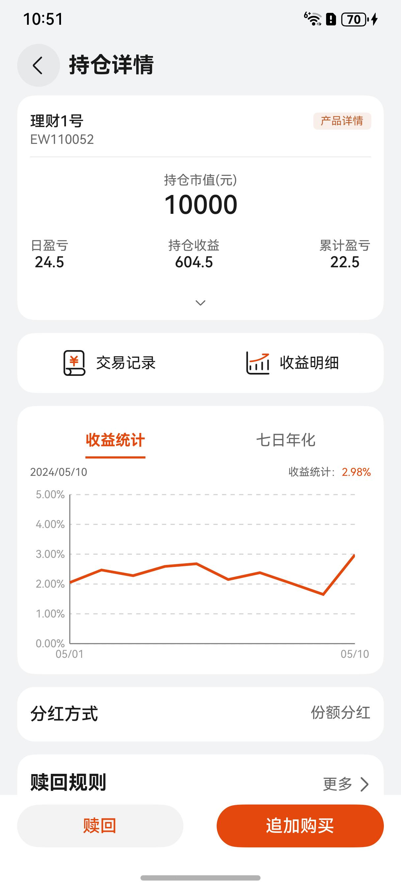

# 金融理财(理财)行业模板快速入门

## 目录

- [功能介绍](#功能介绍)
- [环境要求](#环境要求)
- [快速入门](#快速入门)
- [示例效果](#示例效果)
- [权限要求](#权限要求)
- [开源许可协议](#开源许可协议)

## 功能介绍

您可以基于此模板直接定制应用，也可以挑选此模板中提供的多种组件使用，从而降低您的开发难度，提高您的开发效率。

此模板提供如下组件，所有组件存放在工程根目录的components下，如果您仅需要使用组件，可参考对应组件的指导链接；如果您使用此模板，请参考本文档。

| 组件                          | 描述            | 使用指导                                         |
|:----------------------------|:--------------| :----------------------------------------------- |
| 折线图组件（module_line_chart）    | 提供折线图功能          | [使用指导](components/module_line_chart/README.md)  |
| 消息轮播组件（module_notice_board） | 提供消息轮播功能      | [使用指导](components/module_notice_board/README.md)     |
| 产品列表组件（module_product_list） | 提供产品列表展示和筛选功能 | [使用指导](components/module_product_list/README.md)     |
| 时间轴组件（module_time_line）     | 提供时间轴展示信息功能   | [使用指导](components/module_time_line/README.md) |

本模板为金融理财类应用提供了常用功能的开发样例，模板主要分首页和我的两大模块：

* 首页：提供公告、热销商品的展示。

* 我的：展示持仓、交易、协议，提供账号的管理、产品的赎回、追加购买。

本模板已集成华为账号、支付等服务，只需做少量配置和定制即可快速实现华为账号的登录和购买商品等功能。

| 首页                           | 我的 |
|----------------------------|----|
|  ||

本模板主要页面及核心功能如下所示：

```ts
金融理财模板
 |-- 首页
 |    └-- 顶部轮播
 |    └-- 基础服务
 |    |    └-- 活钱管理
 |    |    |    |-- 产品列表
 |    |    |    |-- 产品详情
 |    |    |    |-- 产品定投
 |    |    |    └-- 购买产品
 |    |    └-- 稳健低波
 |    |    |    |-- 产品列表
 |    |    |    |-- 产品详情
 |    |    |    |-- 产品定投
 |    |    |    └-- 购买产品
 |    |    └-- 稳健增值
 |    |    |    |-- 产品列表
 |    |    |    |-- 产品详情
 |    |    |    |-- 产品定投
 |    |    |    └-- 购买产品
 |    |    └-- 投资增益
 |    |    |    |-- 产品列表
 |    |    |    |-- 产品详情
 |    |    |    |-- 产品定投
 |    |    |    └-- 购买产品
 |    |    └-- 投资回报
 |    |         |-- 产品列表
 |    |         |-- 产品详情
 |    |         |-- 产品定投
 |    |         └-- 购买产品
 |    └-- 滚动公告
 |    └-- 灵活取用
 |    |    |-- 产品列表
 |    |    |-- 产品详情
 |    |    |-- 产品定投
 |    |    └-- 购买产品
 |    └-- 理财夜市
 |    |    |-- 产品列表
 |    |    |-- 产品详情
 |    |    |-- 产品定投
 |    |    └-- 购买产品
 |    └-- 理财资讯
 |         └-- 资讯列表
 └-- 我的
 |    └-- 收益信息
 |    └-- 自选产品
 |    |    |-- 产品列表
 |    |    |-- 产品详情
 |    |    |-- 产品定投
 |    |    └-- 购买产品
 |    └-- 产品交易
 |    |    └-- 交易列表
 |    |    └-- 交易详情
 |    └-- 定投产品
 |    |    └-- 定投列表
 |    |    └-- 定投详情
 |    └-- 设置
 |    |    └-- 账号详情
 |    |    └-- 隐私列表
 |    |    └-- 隐私详情
 |    |    └-- 个人信息
 |    └-- 滚动公告
 |    └-- 持仓列表
           └-- 持仓详情
           └-- 持仓赎回
           └-- 追加购买
```

本模板工程代码结构如下所示：

```ts
FinancialManagement
  |- commons                                       // 公共层
  |   └- lib_foundation/src/main/ets               // 公共基础模块(har)
  |        |- apis                                 // 网络接口  
  |        |- mocks                                // 数据mock   
  |        |- models                               // 网络库封装    
  |        └- types                                // 请求和响应类型   
  |        └- utils                                // 工具类  
  |- components                                    // 公共组件模块(har)
  |   └- module_base/src/main/ets                  // 基础 
  |   |    |- common                               // 常量、工具函数            
  |   |    |- components                           // 基础组件         
  |   |    |- models                               // 路由模型
  |   |    |- types                                // 基础类型
  |   |    └- utils                                // 基础工具类
  |   └- module_line_chart/src/main/ets            // 折线图组件             
  |   |    └- components                           // 基础组件
  |   └- module_notice_board/src/main/ets          // 消息轮播组件            
  |   |    |- components                           // 基础组件         
  |   |    └- types                                // 基础类型
  |   └- module_product_list/src/main/ets          // 产品列表组件 
  |   |    |- common                               // 常量、工具函数            
  |   |    |- components                           // 基础组件         
  |   |    |- http                                 // 数据请求
  |   |    |- types                                // 基础类型
  |   |    |- utils                                // 基础工具类
  |   |    └- viewModel                            // 对应的vm层
  |   └- module_time_line/src/main/ets             // 时间轴组件            
  |        └- components                           // 基础组件               
  |
  |- products                                      // 应用层主包(hap)  
  |   └- entry/src/main/ets                                               
  |        |- entryability                                                               
  |        |- entryformability                                                        
  |        |- pages                              
  |        |   └- MainEntry.ets                    // 主页面
  |        |- types                                // interface接口定义
  |        |- viewmodels                           // 与页面一一对应的vm层          
  |        └- widget                               // 卡片页面 
  |                                            
  |- scenes                                        // 特性层
  |   |- business_home/src/main/ets                // 首页模块(har)
  |   |    |- components                           // 抽离组件         
  |   |    |- pages                               
  |   |    |   |- HomePage.ets                     // 首页
  |   |    |   └- InformationInfo.ets              // 咨询详情页
  |   |    |- types                                // interface类型定义
  |   |    └- viewmodels                           // 与页面一一对应的vm层
  |   |- business_mine/src/main/ets                // 我的模块(har)
  |   |    |- components                           // 抽离组件         
  |   |    |- pages                               
  |   |    |   |- EditPage.ets                     // 编辑页
  |   |    |   |- MinePage.ets                     // 我的页
  |   |    |   |- PersonalInformationPage.ets      // 个人信息页
  |   |    |   └- QuickLoginPage.ets               // 快速登录页
  |   |    |- types                                // interface类型定义
  |   |    └- viewmodels                           // 与页面一一对应的vm层
  |   |- position/src/main/ets                     // 持仓模块(hsp)
  |   |    |- common                               // 常量
  |   |    |- components                           // 抽离组件         
  |   |    |- pages                               
  |   |    |    FinancialAccount.ets               // 账号页
  |   |    |    FinancialAgreement.ets             // 协议页
  |   |    |    MyRegularChoice.ets                // 自选列表页
  |   |    |    MyRegularInvestment.ets            // 定投列表页
  |   |    |    MyRegularInvestmentInfo.ets        // 定投详情页
  |   |    |    Other.ets                          // 其他页
  |   |    |    Position.ets                       // 持仓页
  |   |    |    PositionInfo.ets                   // 持仓详情页
  |   |    |    PositionRecord.ets                 // 持仓记录页
  |   |    |    Preview.ets                        // 预览页
  |   |    |    Redemption.ets                     // 赎回页
  |   |    |    RevenueInfo.ets                    // 收益详情页
  |   |    |    TransactionRecordInfo.ets          // 交易记录详情页
  |   |    |    TransactionRecordList.ets          // 交易记录列表页
  |   |    |- types                                // interface类型定义
  |   |    └- viewmodels                           // 与页面一一对应的vm层          
  |   |     
  |   |- product/src/main/ets                      // 产品模块(hsp)
  |   |    |- components                           // 抽离组件   
  |   |    |- mapper                               // 接口数据到页面数据类型映射 
  |   |    |- models                               // class类型定义     
  |   |    |- pages                               
  |   |    |    DollarCostAveraging.ets            // 定投页
  |   |    |    FinancialInformation.ets           // 理财资讯页
  |   |    |    HistoricalPerformance.ets          // 历史收益页
  |   |    |    Product.ets                        // 首页
  |   |    |    ProductInfo.ets                    // 产品详情页
  |   |    |    ProductList.ets                    // 产品列表页
  |   |    |    ProductSearch.ets                  // 产品搜索页
  |   |    |    Profile.ets                        // 产品档案页
  |   |    |    Purchase.ets                       // 购买页
  |   |    |    Rule.ets                           // 产品规则页
  |   |    └- viewmodels                           // 与页面一一对应的vm层  
```

## 环境要求

### 软件

* DevEco Studio版本：DevEco Studio 5.0.0 Release及以上
* HarmonyOS SDK版本：HarmonyOS 5.0.0 Release SDK及以上

### 硬件

* 设备类型：华为手机（直板机）
* HarmonyOS版本：HarmonyOS 5.0.0 Release及以上

## 快速入门

### 配置工程

在运行此模板前，需要完成以下配置：

1. 在AppGallery Connect创建应用，将包名配置到模板中。

   a. 参考[创建HarmonyOS应用](https://developer.huawei.com/consumer/cn/doc/app/agc-help-createharmonyapp-0000001945392297)为应用创建APP ID，并将APP ID与应用进行关联。

   b. 返回应用列表页面，查看应用的包名。

   c. 将AppScope/app.json5文件中的bundleName替换为创建应用的包名。

2. 配置华为账号服务。

   a. 将应用的client ID配置到products/entry/src/main路径下的module.json5文件，详细参考：[配置Client ID](https://developer.huawei.com/consumer/cn/doc/harmonyos-guides/account-client-id)。

   b. 申请华为账号一键登录所需的quickLoginMobilePhone权限，详细参考：[配置scope权限](https://developer.huawei.com/consumer/cn/doc/harmonyos-guides/account-config-permissions)。

3. 配置支付服务。

   华为支付当前仅支持商户接入，在使用服务前，需要完成商户入网、开发服务等相关配置，本模板仅提供了端侧集成的示例。详细参考：[支付服务接入准备](https://developer.huawei.com/consumer/cn/doc/harmonyos-guides/payment-preparations)。

4. 对应用进行[手工签名](https://developer.huawei.com/consumer/cn/doc/harmonyos-guides/ide-signing#section297715173233)。

5. 添加手工签名所用证书对应的公钥指纹。详细参考：[配置应用签名证书指纹](https://developer.huawei.com/consumer/cn/doc/app/agc-help-signature-info-0000001628566748#section5181019153511)

### 运行调试工程

1. 连接调试手机和PC。

2. 配置多模块调试：由于本模板存在多个模块，运行时需确保所有模块安装至调试设备。

   a. 运行模块选择“entry”。

   b. 下拉框选择“Edit Configurations”，在“Run/Debug Configurations”界面，选择“Deploy Multi Hap”页签，勾选上模板中所有模块。

   

   c. 点击"Run"，运行模板工程。

## 示例效果

| 产品列表                                                 | 产品详情                                                 | 购买                                                   | 持仓详情                                                 |
|------------------------------------------------------|------------------------------------------------------|------------------------------------------------------|------------------------------------------------------|
|  |  |  |  |

## 权限要求

* 网络权限：ohos.permission.INTERNET

## 开源许可协议

该代码经过[Apache 2.0 授权许可](http://www.apache.org/licenses/LICENSE-2.0)。
