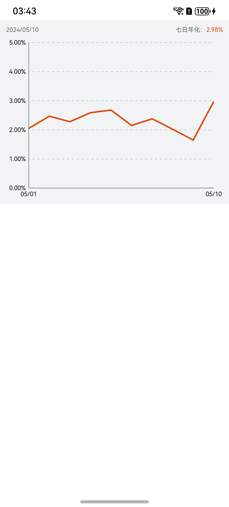

# 折线图组件快速入门

## 目录

- [简介](#简介)
- [约束与限制](#约束与限制)
- [快速入门](#快速入门)
- [API参考](#API参考)
- [示例代码](#示例代码)

## 简介

本组件提供折线图相关功能。



## 约束与限制

### 环境

* DevEco Studio版本：DevEco Studio 5.0.0 Release及以上
* HarmonyOS SDK版本：HarmonyOS 5.0.0 Release SDK及以上
* 设备类型：华为手机（直板机）
* HarmonyOS版本：HarmonyOS 5.0.0 Release及以上

### 权限

* 网络权限：ohos.permission.INTERNET

## 快速入门

1. 安装组件。

   如果是在DevEvo Studio使用插件集成组件，则无需安装组件，请忽略此步骤。

   如果是从生态市场下载组件，请参考以下步骤安装组件。

   a. 解压下载的组件包，将包中所有文件夹拷贝至您工程根目录的XXX目录下。

   b. 在项目根目录build-profile.json5添加module_line_chart和module_base模块。

    ```
    // 在项目根目录build-profile.json5填写module_line_chart和module_base路径。其中XXX为组件存放的目录名
    "modules": [
        {
        "name": "module_line_chart",
        "srcPath": "./XXX/module_line_chart",
        },
        {
        "name": "module_base",
        "srcPath": "./XXX/module_base",
        }
    ]
    ```
   c. 在项目根目录oh-package.json5中添加依赖。
    ```
    // XXX为组件存放的目录名称
    "dependencies": {
      "module_line_chart": "file:./XXX/module_line_chart"
    }
   ```

2. 引入组件与折线图组件句柄。

   ```
   import { CommonCharts } from 'module_line_chart';
   ```

3. 调用组件，详细参数配置说明参见[API参考](#API参考)。
   ```
   @Entry
   @ComponentV2
   struct Sample {
     @Local xData: string[] =
       ["2024/05/01", "2024/05/02", "2024/05/03", "2024/05/04", "2024/05/05", "2024/05/06", "2024/05/07", "2024/05/08",
         "2024/05/09", "2024/05/10"]
     @Local seriesData: number[] = [2.05, 2.47, 2.28, 2.59, 2.68, 2.15, 2.38, 2.02, 1.65, 2.98]
   
     build() {
       Column() {
         CommonCharts({ xData: this.xData, seriesData: this.seriesData, label: '七日年化' })
       }
       .backgroundColor('#F1F3F5')
       .padding(10)
       .width('100%')
       .height(300)
     }
   }
   ```

## API参考

### 子组件

### 接口

CommonCharts(options?: CommonChartsOptions)

折线图组件。

**参数：**

| 参数名  | 类型                                              | 必填 | 说明                 |
| ------- |-------------------------------------------------| ---- | -------------------- |
| options | [CommonChartsOptions](#CommonChartsOptions对象说明) | 否   | 配置折线图组件的参数。 |

### CommonChartsOptions对象说明

| <div style="width:200px" align="left">参数</div> | <div style="width:200px" align="left">类型</div> | <div style="width:80px" align="left">必填</div> | <div style="width:200px" align="left">说明</div> |
|:-----------------------------------------------|:-----------------------------------------------|:----------------------------------------------|:-----------------------------------------------|
| label                                          | string                                         | 是                                             | 折线图标签                                           |
| xData                                          | string[]                                       | 是                                             | 折线图横坐标                                          |
| seriesData                                     | number[]                                       | 是                                             | 折线图数据                                           |

## 示例代码
```
import { CommonCharts } from 'module_line_chart'

@Entry
@ComponentV2
struct Sample {
  @Local xData: string[] =
    ["2024/05/01", "2024/05/02", "2024/05/03", "2024/05/04", "2024/05/05", "2024/05/06", "2024/05/07", "2024/05/08",
      "2024/05/09", "2024/05/10"]
  @Local seriesData: number[] = [2.05, 2.47, 2.28, 2.59, 2.68, 2.15, 2.38, 2.02, 1.65, 2.98]

  build() {
    Column() {
      CommonCharts({ xData: this.xData, seriesData: this.seriesData, label: '七日年化' })
    }
    .backgroundColor('#F1F3F5')
    .padding(10)
    .width('100%')
    .height(300)
  }
}
```