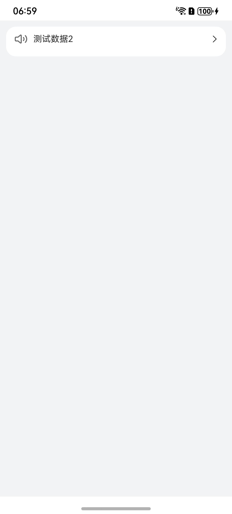

# 消息轮播组件快速入门

## 目录

- [简介](#简介)
- [约束与限制](#约束与限制)
- [快速入门](#快速入门)
- [API参考](#API参考)
- [示例代码](#示例代码)

## 简介

本组件提供消息轮播相关功能。



## 约束与限制

### 环境

* DevEco Studio版本：DevEco Studio 5.0.0 Release及以上
* HarmonyOS SDK版本：HarmonyOS 5.0.0 Release SDK及以上
* 设备类型：华为手机（直板机）
* HarmonyOS版本：HarmonyOS 5.0.0 Release及以上

### 权限
无
## 快速入门

1. 安装组件。

   如果是在DevEvo Studio使用插件集成组件，则无需安装组件，请忽略此步骤。

   如果是从生态市场下载组件，请参考以下步骤安装组件。

   a. 解压下载的组件包，将包中所有文件夹拷贝至您工程根目录的XXX目录下。

   b. 在项目根目录build-profile.json5添加module_notice_board和module_base模块。

    ```
    // 在项目根目录build-profile.json5填写module_notice_board和module_base路径。其中XXX为组件存放的目录名
    "modules": [
        {
        "name": "module_notice_board",
        "srcPath": "./XXX/module_notice_board",
        },
        {
        "name": "module_base",
        "srcPath": "./XXX/module_base",
        }
    ]
    ```
   c. 在项目根目录oh-package.json5中添加依赖。
    ```
    // XXX为组件存放的目录名称
    "dependencies": {
      "module_notice_board": "file:./XXX/module_notice_board"
    }
   ```

2. 引入组件与消息轮播组件句柄。

   ```
   import { CommonNoticeBoard, INoticeItem } from 'module_notice_board'
   ```

3. 调用组件，详细参数配置说明参见[API参考](#API参考)。
   ```
   @Entry
   @ComponentV2
   struct Sample {
     @Local noticeList: INoticeItem[] = [
       {
         id: 1,
         name: '测试数据1',
         img: '',
         date: '2024.03.29',
       },
       {
         id: 2,
         name: '测试数据2',
         img: '',
         date: '2024.03.29',
       },
       {
         id: 3,
         name: '测试数据3',
         img: '',
         date: '2024.03.29',
       }
     ]
     build() {
       Column() {
         CommonNoticeBoard({ noticeList: this.noticeList })
       }
       .backgroundColor('#F1F3F5')
       .padding(10)
       .width('100%')
       .height('100%')
     }
   }
   ```

## API参考

### 子组件

### 接口

CommonNoticeBoard(options?: CommonNoticeBoardOptions)

消息轮播组件。

**参数：**

| 参数名  | 类型                                              | 必填 | 说明                 |
| ------- |-------------------------------------------------| ---- | -------------------- |
| options | [CommonNoticeBoardOptions](#CommonNoticeBoardOptions对象说明) | 否   | 配置消息轮播组件的参数。 |

### CommonNoticeBoardOptions对象说明

| <div style="width:200px" align="left">参数</div> | <div style="width:200px" align="left">类型</div> | <div style="width:80px" align="left">必填</div> | <div style="width:200px" align="left">说明</div> |
|:-----------------------------------------------|:-----------------------------------------------|:----------------------------------------------|:-----------------------------------------------|
| noticeList                                     | INoticeItem[]                                  | 是                                             | 消息列表                                           |

**INoticeItem对象说明**

| <div style="width:200px" align="left">参数</div> | <div style="width:200px" align="left">类型</div> | <div style="width:80px" align="left">必填</div> | <div style="width:200px" align="left">说明</div> |
|:-----------------------------------------------|:-----------------------------------------------|:----------------------------------------------|:-----------------------------------------------|
| id                                             | number                                         | 是                                             | id                                             |
| name                                           | string                                         | 是                                             | 名称                                             |
| img                                            | ResourceStr                                    | 是                                             | 图片                                             |
| date                                           | string                                         | 是                                             | 日期                                             |

## 示例代码

```
import { CommonNoticeBoard, INoticeItem } from 'module_notice_board'
@Entry
@ComponentV2
struct Sample {
  @Local noticeList: INoticeItem[] = [
    {
      id: 1,
      name: '测试数据1',
      img: '',
      date: '2024.03.29',
    },
    {
      id: 2,
      name: '测试数据2',
      img: '',
      date: '2024.03.29',
    },
    {
      id: 3,
      name: '测试数据3',
      img: '',
      date: '2024.03.29',
    }
  ]
  build() {
    Column() {
      CommonNoticeBoard({ noticeList: this.noticeList })
    }
    .backgroundColor('#F1F3F5')
    .padding(10)
    .width('100%')
    .height('100%')
  }
}
```
