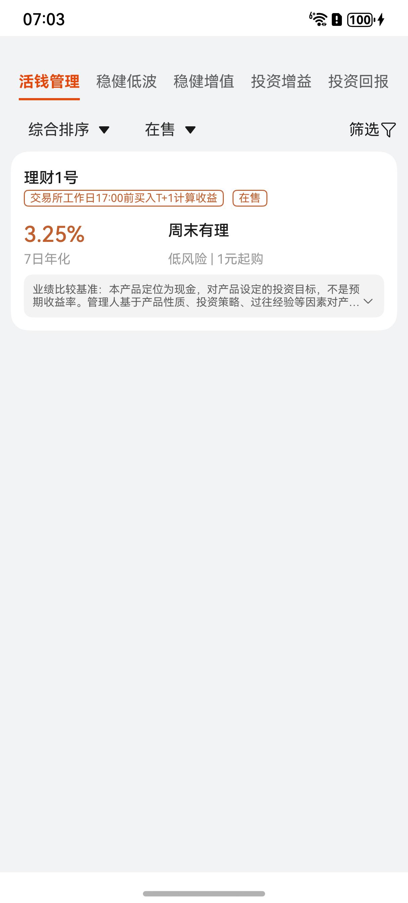

# 产品列表组件快速入门

## 目录

- [简介](#简介)
- [约束与限制](#约束与限制)
- [快速入门](#快速入门)
- [API参考](#API参考)
- [示例代码](#示例代码)

## 简介

本组件提产品列表相关功能。



## 约束与限制

### 环境

* DevEco Studio版本：DevEco Studio 5.0.0 Release及以上
* HarmonyOS SDK版本：HarmonyOS 5.0.0 Release SDK及以上
* 设备类型：华为手机（直板机）
* HarmonyOS版本：HarmonyOS 5.0.0 Release及以上

### 权限
无
## 快速入门

1. 安装组件。

   如果是在DevEvo Studio使用插件集成组件，则无需安装组件，请忽略此步骤。

   如果是从生态市场下载组件，请参考以下步骤安装组件。

   a. 解压下载的组件包，将包中所有文件夹拷贝至您工程根目录的XXX目录下。

   b. 在项目根目录build-profile.json5添加module_product_list和module_base模块。

    ```
    // 在项目根目录build-profile.json5填写module_product_list和module_base路径。其中XXX为组件存放的目录名
    "modules": [
        {
        "name": "module_product_list",
        "srcPath": "./XXX/module_product_list",
        },
        {
        "name": "module_base",
        "srcPath": "./XXX/module_base",
        }
    ]
    ```
   c. 在项目根目录oh-package.json5中添加依赖。
    ```
    // XXX为组件存放的目录名称
    "dependencies": {
      "module_product_list": "file:./XXX/module_product_list"
    }
   ```

2. 引入组件与产品列表组件句柄。

   ```
   import { ModuleProductList } from 'module_product_list'
   ```

3. 调用组件，详细参数配置说明参见[API参考](#API参考)。
   ```
   @Entry
   @ComponentV2
   struct Sample {
     @Local productType: number = 1
     @Local currentIndex: number = 0
   
     build() {
       Column() {
         ModuleProductList({
           productType: this.productType, selectedIndex: this.currentIndex
         })
       }
       .backgroundColor('#F1F3F5')
       .padding(10)
       .width('100%')
       .height('100%')
     }
   }
   ```

## API参考

### 子组件

### 接口
ModuleProductList(options?: ModuleProductListOptions)

产品列表组件。

**参数：**

| 参数名  | 类型                                              | 必填 | 说明           |
| ------- |-------------------------------------------------| ---- |--------------|
| options | [ModuleProductListOptions](#ModuleProductListOptions对象说明) | 否   | 配置产品列表组件的参数。 |

### ModuleProductListOptions对象说明

| <div style="width:200px" align="left">参数</div> | <div style="width:200px" align="left">类型</div> | <div style="width:80px" align="left">必填</div> | <div style="width:200px" align="left">说明</div> |
|:-----------------------------------------------|:-----------------------------------------------|:----------------------------------------------|:-----------------------------------------------|
| productType                                          | number                                         | 是                                             | 产品类型                                           |
| currentIndex                                          | number                                         | 是                                             | tab索引值                                         |

## 示例代码

```
import { ModuleProductList } from 'module_product_list'

@Entry
@ComponentV2
struct Sample {
  @Local productType: number = 1
  @Local currentIndex: number = 0

  build() {
    Column() {
      ModuleProductList({
        productType: this.productType, selectedIndex: this.currentIndex
      })
    }
    .backgroundColor('#F1F3F5')
    .padding(10)
    .width('100%')
    .height('100%')
  }
}
```
