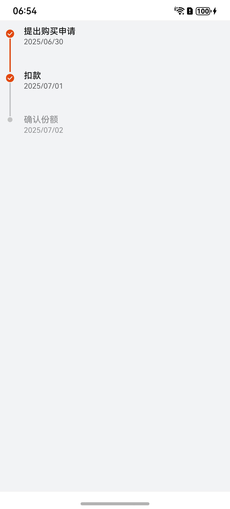

# 时间轴组件快速入门

## 目录

- [简介](#简介)
- [约束与限制](#约束与限制)
- [快速入门](#快速入门)
- [API参考](#API参考)
- [示例代码](#示例代码)

## 简介

本组件提供时间轴相关功能。

 

## 约束与限制

### 环境

* DevEco Studio版本：DevEco Studio 5.0.0 Release及以上
* HarmonyOS SDK版本：HarmonyOS 5.0.0 Release SDK及以上
* 设备类型：华为手机（直板机）
* HarmonyOS版本：HarmonyOS 5.0.0 Release及以上

### 权限
无
## 快速入门

1. 安装组件。

   如果是在DevEvo Studio使用插件集成组件，则无需安装组件，请忽略此步骤。

   如果是从生态市场下载组件，请参考以下步骤安装组件。

   a. 解压下载的组件包，将包中所有文件夹拷贝至您工程根目录的XXX目录下。

   b. 在项目根目录build-profile.json5添加module_time_line模块。

    ```
    // 在项目根目录build-profile.json5填写module_time_line路径。其中XXX为组件存放的目录名
    "modules": [
        {
        "name": "module_time_line",
        "srcPath": "./XXX/module_time_line",
        }
    ]
    ```
   c. 在项目根目录oh-package.json5中添加依赖。
    ```
    // XXX为组件存放的目录名称
    "dependencies": {
      "module_time_line": "file:./XXX/module_time_line"
    }
   ```

2. 引入组件与时间轴组件句柄。

   ```
   import { CommonTimeLine, OrderDetailBean } from 'module_time_line'
   ```

3. 调用组件，详细参数配置说明参见[API参考](#API参考)。

   ```
   @Entry
   @ComponentV2
   struct Sample {
     @Local timeLineList: OrderDetailBean[] = [
       {
         nodeName:'提出购买申请',
         nodeStatus:1,
         nextNodeStatus:1,
         nodeTime:'2025/06/30'
       },
       {
         nodeName:'扣款',
         nodeStatus:1,
         nextNodeStatus:0,
         nodeTime:'2025/07/01'
       },
       {
         nodeName:'确认份额',
         nodeStatus:0,
         nodeTime:'2025/07/02'
       }
     ]
     @Local totalSize:number = 3
   
     build() {
       Column() {
         CommonTimeLine({ timeLineList: this.timeLineList, totalSize: this.totalSize })
       }
       .backgroundColor('#F1F3F5')
       .padding(10)
       .width('100%')
       .height('100%')
     }
   }
   ```

## API参考

### 子组件

### 接口

CommonTimeLine(options?: CommonTimeLineOptions)

时间轴组件。

**参数：**

| 参数名     | 类型                                                  | 必填 | 说明          |
|---------|-----------------------------------------------------|----|-------------|
| options | [CommonTimeLineOptions](#CommonTimeLineOptions对象说明) | 否  | 配置时间轴组件的参数。 |

### CommonTimeLineOptions对象说明

| <div style="width:200px" align="left">参数</div> | <div style="width:200px" align="left">类型</div> | <div style="width:80px" align="left">必填</div> | <div style="width:200px" align="left">说明</div> |
|:-----------------------------------------------|:-----------------------------------------------|:----------------------------------------------|:-----------------------------------------------|
| timeLineList                                   | OrderDetailBean[]                              | 是                                             | 时间轴数据                                          |
| totalSize                                      | number                                         | 是                                             | 时间轴总数                                          |

**OrderDetailBean对象说明**

| <div style="width:200px" align="left">参数</div> | <div style="width:200px" align="left">类型</div> | <div style="width:80px" align="left">必填</div> | <div style="width:200px" align="left">说明</div> |
|:-----------------------------------------------|:-----------------------------------------------|:----------------------------------------------|:-----------------------------------------------|
| nodeStatus                                     | number                                         | 是                                             | 当前节点状态                                         |
| nextNodeStatus                                 | number                                         | 是                                             | 下一个节点的状态                                       |
| nodeName                                       | string                                         | 是                                             | 节点名称                                           |
| nodeTime                                       | string                                         | 是                                             | 节点时间                                           |

## 示例代码

```
import { CommonTimeLine, OrderDetailBean } from 'module_time_line'

@Entry
@ComponentV2
struct Sample {
  @Local timeLineList: OrderDetailBean[] = [
    {
      nodeName:'提出购买申请',
      nodeStatus:1,
      nextNodeStatus:1,
      nodeTime:'2025/06/30'
    },
    {
      nodeName:'扣款',
      nodeStatus:1,
      nextNodeStatus:0,
      nodeTime:'2025/07/01'
    },
    {
      nodeName:'确认份额',
      nodeStatus:0,
      nodeTime:'2025/07/02'
    }
  ]
  @Local totalSize:number = 3

  build() {
    Column() {
      CommonTimeLine({ timeLineList: this.timeLineList, totalSize: this.totalSize })
    }
    .backgroundColor('#F1F3F5')
    .padding(10)
    .width('100%')
    .height('100%')
  }
}
```