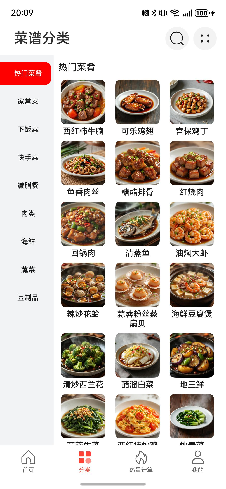
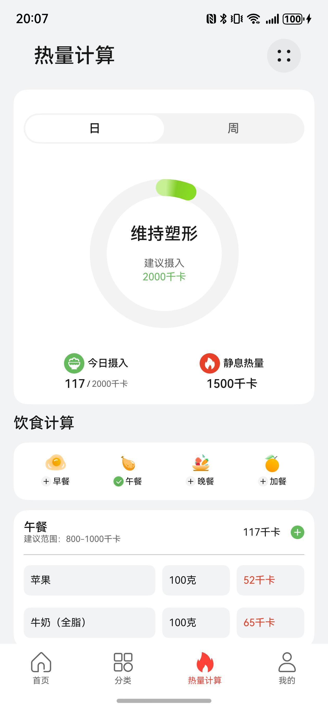
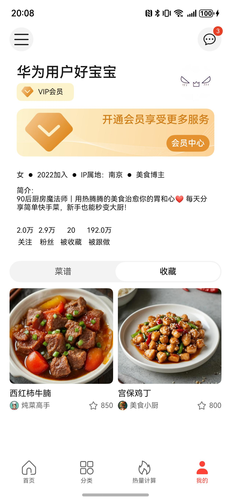

# 美食（菜谱）应用模板快速入门

## 目录

- [功能介绍](#功能介绍)
- [组件](#组件)
- [环境要求](#环境要求)
- [快速入门](#快速入门)
- [示例效果](#示例效果)
- [权限要求](#权限要求)
- [开源许可协议](#开源许可协议)

## 功能介绍

本模板为美食菜谱类应用提供了常用功能的开发样例，模板主要分首页、分类和我的三大模块：

- 首页：展示菜谱信息，支持按名称、类别搜索菜谱。
- 分类：按类别展示菜谱，支持查看详情、收藏菜谱、加入菜篮子和管理菜篮子。
- 热量计算：展示每日热量和每周热量，支持按时间段增加饮食计划，展示计划饮食的热量。
- 我的：展示账号相关信息，展示我的菜谱和上传菜谱，展示收藏的菜谱，展示浏览记录，以及设置等功能。

本模板已集成华为账号服务，只需做少量配置和定制即可快速实现华为账号的登录等功能。

| 首页                                                                | 分类                                                                    | 热量计算                                                                   | 我的                                                                |
|-------------------------------------------------------------------|-----------------------------------------------------------------------|----------------------------------------------------------------------|-------------------------------------------------------------------|
|  |  |  |  |

本模板主要页面及核心功能清单如下所示：

```ts
美食菜谱模板
 |-- 开屏页
 |-- 广告
 |-- 首页
 |    |-- banner
 |    |-- 搜索
 |    |-- 分类搜索
 |    |    |-- 综合搜索
 |    |    |-- 收藏最多
 |    |    └-- 浏览最多
 |    |-- 菜谱瀑布流
 |    |-- 博主详情
 |    └-- 博主关注
 |-- 分类
 |    |-- 分类列表
 |    |-- 菜谱详情
 |    |    |-- 收藏
 |    |    └-- 加入菜篮子
 |    └-- 菜篮子
 |         |-- 全部用料
 |         |-- 菜谱用料
 |         |-- 菜谱新增用料
 |         └-- 删除菜谱
 |-- 热量计算
 |    |-- 日/周热量
 |    └-- 饮食计算
 |         |-- 管理饮食计划
 |         |-- 食物自定义重量
 |         |-- 搜索食物
 |         └-- 添加自定义食物
 └-- 我的
      |-- 用户信息
      |    |-- 登录
      |    |-- 用户信息
      |    └-- 开通会员
      |         └-- 支付
      |-- 我的菜谱
      |    |-- 新增菜谱
      |-- 我的收藏
      |-- 服务
      |    |-- 浏览记录
      |    |-- 菜篮子
      |    └-- 设置
      |         |-- 个人信息
      |         |-- 隐私协议
      |         |-- 用户协议
      |         |-- 清除缓存
      |         └-- 退出登录
      └-- 通知
           
```

本模板工程代码结构如下所示：

```
Recipes
  ├─commons/commonlib/src/main
  │  ├─ets
  │  │  ├─components
  │  │  │      BaseHeader.ets                 // 一级页面标题组件
  │  │  │      BuildTitleBar.ets              // 二级页面标题组件
  │  │  │      HeaderMenuBuilder.ets          // 标题菜单内容组件
  │  │  │      MenuItemBuilder.ets            // 下拉菜单选项
  │  │  ├─constants
  │  │  │      CommonContants.ets             // 公共常量
  │  │  │      CommonEnums.ets                // 公共枚举值
  │  │  ├─types
  │  │  │      Types.ets                      // 公共抽象类
  │  │  └─utils
  │  │         AccountUtil.ets                // 账号工具类
  │  │         DialogUtil.ets                 // 弹窗工具类
  │  │         FormatUtil.ets                 // 格式化工具类
  │  │         Logger.ets                     // 日志工具类
  │  │         PermissionUtil.ets             // 权限获取工具类
  │  │         PreferenceUtil.ets             // 数据持久化工具类
  │  │         RouterModule.ets               // 路由工具类
  │  │         WindowUtil.ets                 // 窗口管理工具类
  │  └─resources
  ├─commons/network/src/main
  │  ├─ets
  │  │  ├─apis
  │  │  │      APIList.ets                    // 网络请求API
  │  │  │      HttpRequest.ets                // 网络请求
  │  │  ├─mocks
  │  │  │  └─MockData
  │  │  │         Calories.ets                // 热量mock数据
  │  │  │         Mine.ets                    // 我的mock数据
  │  │  │         Notice.ets                  // 通知mock数据
  │  │  │         RecipeList.ets              // 菜谱mock数据
  │  │  │      AxiosMock.ets                  // mock请求
  │  │  │      RequestMock.ets                // mock API
  │  │  └─types
  │  │         Calories.ets                   // 热量抽象类
  │  │         Member.ets                     // 会员抽象类
  │  │         Notice.ets                     // 通知抽象类
  │  │         Recipe.ets                     // 菜谱抽象类
  │  └─resources
  │─components/aggregated_ads/src/main   
  │  ├─ets
  │  │  ├─common
  │  │  │      Constant.ets                   // 常量类
  │  │  ├─components
  │  │  │      AdServicePage.ets              // 广告服务组件
  │  │  │      HwAdService.ets                // 华为广告
  │  │  ├─util
  │  │  │      UIUtil.ets                     // UI工具类
  │  │  └─viewmodel
  │  │         AggreagetedAdVM.ets            // 广告页面数据模型
  │  └─resources
  │─components/aggregated_login/src/main   
  │  ├─ets
  │  │  ├─common
  │  │  │      Constant.ets                   // 常量类
  │  │  │      Logger.ets                     // 日志类
  │  │  ├─components
  │  │  │      AgreementDialog.ets            // 协议弹窗组件
  │  │  │      LoginService.ets               // 登录组件
  │  │  ├─model
  │  │  │      Index.ets                      // 数据类型
  │  │  │      WXApiWrap.ets                  // 微信登录数据类型
  │  │  └─viewmodel
  │  │         AggregatedLoginVM.ets          // 登录组件数据模型
  │  └─resources
  │─components/aggregated_payment/src/main   
  │  ├─ets
  │  │  ├─common
  │  │  │      Constant.ets                   // 常量类
  │  │  ├─components
  │  │  │      AggregatedPaymentPicker.ets    // 支付组件
  │  │  ├─model
  │  │  │      Index.ets                      // 数据类型
  │  │  │      WXApiWrap.ets                  // 微信支付数据类型
  │  │  └─viewmodel
  │  │         AggregatedPaymentVM.ets        // 支付组件数据模型
  │  └─resources
  │─components/base_ui/src/main   
  │  ├─ets
  │  │  ├─components
  │  │  │      BaseTabs.ets                   // Tabs组件
  │  │  └──types
  │  │         Index.ets                      // 数据类型
  │  └─resources
  │─components/calorie_calculation/src/main   
  │  ├─ets
  │  │  ├─components
  │  │  │      BarChart.ets                   // 协议弹窗组件
  │  │  │      CalorieCalculation.ets         // 热量计算组件
  │  │  │      CaloriesSummary.ets            // 热量汇总组件
  │  │  │      FoodDiary.ets                  // 饮食计划组件
  │  │  ├─types
  │  │  │      Index.ets                      // 数据类型
  │  │  └─viewModels
  │  │         CaloriesSummaryVM.ets          // 热量计算数据模型
  │  └─resources
  │─components/featured_recipes/src/main   
  │  ├─ets
  │  │  ├─components
  │  │  │      FeaturedRecipes.ets            // 菜谱瀑布流组件
  │  │  │      RecommendedCard.ets            // 菜谱卡片
  │  │  │─types
  │  │  │      Index.ets                      // 数据类型
  │  │  └─utils
  │  │         LazyDataSource.ets             // 懒加载对象
  │  │         Logger.ets                     // 日志工具
  │  │         ObservedArray.ets              // 数组监听工具
  │  └─resources
  │─components/home_search/src/main   
  │  ├─ets
  │  │  ├─components
  │  │  │      HomeSearch.ets                 // 搜索组件
  │  │  │      SearchKeys.ets                 // 热搜词组件
  │  │  │      SearchResult.ets               // 搜索结果组件
  │  │  └─types
  │  │         Index.ets                      // 数据类型
  │  └─resources
  │─components/link_category/src/main   
  │  ├─ets
  │  │  ├─components
  │  │  │      LinkCategory.ets               // 分类列表组件
  │  │  └─types
  │  │         Index.ets                      // 数据类型
  │  └─resources
  │─components/personal_homepage/src/main   
  │  ├─ets
  │  │  ├─components
  │  │  │      BloggerInfomation.ets          // 个人介绍组件
  │  │  │      PersonalHomepage.ets           // 个人中心组件
  │  │  └─types
  │  │         Index.ets                      // 数据类型
  │  └─resources
  │─components/shopping_basket/src/main   
  │  ├─ets
  │  │  ├─components
  │  │  │      IngredientList.ets             // 用料列表
  │  │  │      PurchaseIngredients.ets        // 用料组件
  │  │  │      ShoppingBasket.ets             // 菜篮子组件
  │  │  └─types
  │  │         Index.ets                      // 数据类型
  │  └─resources
  │─components/upload_recipe/src/main   
  │  ├─ets
  │  │  ├─components
  │  │  │      UploadRecipe.ets               // 上传菜谱组件
  │  │  ├─types
  │  │  │      Index.ets                      // 数据类型
  │  │  └─viewmodel
  │  │         UploadRecipeVM.ets             // 上传菜谱数据模型
  │  └─resources
  │─features/calories/src/main   
  │  ├─ets
  │  │  ├─pages
  │  │  │      CaloriesPage.ets               // 热量页面
  │  │  │      DietPlanPage.ets               // 饮食计划食物列表页面
  │  │  │      SearchFoodPage.ets             // 食物搜索页面
  │  │  ├─types
  │  │  │      Index.ets                      // 数据对象
  │  │  └─viewModels
  │  │         CaloriesPageVM.ets             // 热量页面数据模型
  │  │         DietPlanPageVM.ets             // 食物列表页面数据模型
  │  │         SearchFoodPageVM.ets           // 食物搜索页面数据模型
  │  └─resources
  │─features/classification/src/main   
  │  ├─ets
  │  │  ├─constants
  │  │  │      Enums.ets                      // 枚举数据
  │  │  ├─pages
  │  │  │      ClassificationPage.ets         // 分类页面
  │  │  │      DishesPage.ets                 // 菜谱详情页面
  │  │  │      ShoppingBasketPage.ets         // 菜篮子页面
  │  │  ├─types
  │  │  │      Index.ets                      // 菜谱数据对象
  │  │  └─viewModels
  │  │         ClassificationVM.ets           // 分类页面数据模型
  │  │         DishesVM.ets                   // 菜谱详情页面数据模型
  │  └─resources
  │─features/home/src/main   
  │  ├─ets
  │  │  ├─pages
  │  │  │      BloggerProfilePage.ets         // 博主信息页面
  │  │  │      FollowersPage.ets              // 博主关注页面
  │  │  │      HomePage.ets                   // 首页页面
  │  │  │      SearchPage.ets                 // 搜索页面
  │  │  ├─types
  │  │  │      Index.ets                      // 首页数据对象
  │  │  └─viewModels
  │  │         BloggerProfilePageVM.ets       // 博主信息页面数据模型
  │  │         FollowersPageVM.ets            // 博主关注页面数据模型
  │  │         HomePageVM.ets                 // 首页页面数据模型
  │  │         SearchPageVM.ets               // 搜索页面数据模型
  │─features/mine/src/main   
  │  ├─ets
  │  │  ├─components
  │  │  │      ConfirmDialogComponent.ets     // 确认弹窗组件
  │  │  │      Recipes.ets                    // 菜谱卡片组件
  │  │  ├─mapper
  │  │  │      Index.ets                      // 数据映射
  │  │  ├─model
  │  │  │      Index.ets                      // 数据类型
  │  │  ├─pages
  │  │  │      BrowsingHistory.ets            // 浏览历史页面
  │  │  │      MemberCenterPage.ets           // 会员中心页面
  │  │  │      MinePage.ets                   // 我的页面
  │  │  │      MyCollection.ets               // 我的收藏页面
  │  │  │      NoticeCenterPage.ets           // 通知中心页面
  │  │  │      NoticeDetailPage.ets           // 通知详情页面
  │  │  │      PersonalInfo.ets               // 个人信息页面
  │  │  │      PrivacyPolicyDetailPage.ets    // 用户协议页面
  │  │  │      QuickLoginPage.ets             // 一键登录页面
  │  │  │      SettingsPage.ets               // 设置页面
  │  │  │      SideBarPage.ets                // 服务菜单页面
  │  │  │      TermsOfServicePage.ets         // 隐私政策页面
  │  │  │      UploadRecipe.ets               // 上传菜谱页面
  │  │  ├─types
  │  │  │      Index.ets                      // 抽象类
  │  │  ├─util
  │  │  │      MockApi.ets                    // 支付mock数据
  │  │  │      OrderInfoUtil.ets              // 支付mock参数工具
  │  │  │      SignUtils.ets                  // 支付mock签名工具
  │  │  └─viewModels
  │  │         BrowsingHistoryVM.ets          // 浏览历史页面数据模型
  │  │         MemberCenterPageVM.ets         // 会员中心页面数据模型
  │  │         MinePageVM.ets                 // 我的页面数据模型
  │  │         MyCollectionVM.ets             // 我的收藏页面数据模型
  │  │         MyRecipeVM.ets                 // 我的菜谱页面数据模型
  │  │         NoticeCenterPageVM.ets         // 通知中心页面数据模型
  │  │         SettingsPageVM.ets             // 设置页面数据模型
  │  │         UploadRecipeVM.ets             // 上传菜谱页面数据模型
  │  └─resources
  └─products/entry/src/main   
     ├─ets
     │  ├─entryability
     │  │      EntryAbility.ets               // 应用程序入口
     │  ├─entryformability
     │  │      EntryFormAbility.ets           // 卡片程序入口
     │  ├─pages
     │  │      Index.ets                      // 入口页面
     │  │      LaunchAdPage.ets               // 广告页面
     │  │      LaunchPage.ets                 // 开屏页面
     │  │      MainEntry.ets                  // 主页面
     │  │      PrivacyPolicyPage.ets          // 隐私协议页面
     │  ├─types
     │  │      Types.ets                      // 抽象类
     │  ├─viewModels
     │  │      MainEntryVM.ets                // 入口页面数据
     │  └─widget/pages
     │         WidgetCard.ets                 // 卡片页面
     └─resources
```

## 组件

本模板中提供了多种组件，您可以按需选择合适的组件进行使用，所有组件存放在工程根目录的components下。

| 组件                          | 描述                | 使用指导                                             |
|-----------------------------|-------------------|--------------------------------------------------|
| 广告组件（aggregated_ads）        | 展示开屏广告            | [使用指导](components/aggregated_ads/README.md)      |
| 登录组件（aggregated_login）      | 支持华为一键登录和微信登录     | [使用指导](components/aggregated_login/README.md)    |
| 支付组件（aggregated_payment）    | 支持华为支付，微信支付，支付宝支付 | [使用指导](components/aggregated_payment/README.md)  |
| 基础组件（base_ui）               | 展示基础tab组件         | [使用指导](components/base_ui/README.md)             |
| 热量计算组件（calorie_calculation） | 提供了统计饮食计划的卡路里     | [使用指导](components/calorie_calculation/README.md) |
| 菜谱瀑布流组件（featured_recipes）   | 提供了展示菜谱列表瀑布流      | [使用指导](components/featured_recipes/README.md)    |
| 搜索组件（home_search）           | 本组件提供了菜谱搜索的相关功能   | [使用指导](components/home_search/README.md)         |
| 分类列表组件（link_category）       | 提供了按分类展示菜谱列表      | [使用指导](components/link_category/README.md)       |
| 个人中心组件（personal_homepage）   | 提供了个人中心页面展示       | [使用指导](components/personal_homepage/README.md)   |
| 菜篮子组件（shopping_basket）      | 本组件提供了菜篮子相关功能     | [使用指导](components/shopping_basket/README.md)     |
| 上传菜谱组件（upload_recipe）       | 提供了上传菜谱的功能        | [使用指导](components/upload_recipe/README.md)       |

## 环境要求

### 软件

* DevEco Studio版本：DevEco Studio 5.0.0 Release及以上
* HarmonyOS SDK版本：HarmonyOS 5.0.0 Release SDK及以上

### 硬件

* 设备类型：华为手机（直板机）
* HarmonyOS版本：HarmonyOS 5.0.0 Release及以上

## 快速入门

### 配置工程

在运行此模板前，需要完成以下配置：

1. 在DevEco Studio中打开此模板。

2. 在AppGallery Connect创建应用，将包名配置到模板中。

   a. 参考[创建应用](https://developer.huawei.com/consumer/cn/doc/app/agc-help-createharmonyapp-0000001945392297)为应用创建APPID，并进行关联。

   b. 返回应用列表页面，查看应用的包名。

   c. 将模板工程根目录下AppScope/app.json5文件中的bundleName替换为创建应用的包名。

3. 配置华为账号服务。

   a. 将应用的client ID配置到entry模块的module.json5文件，详细参考：[配置Client ID](https://developer.huawei.com/consumer/cn/doc/harmonyos-guides/account-client-id)。

   b. 添加公钥指纹，详细参考：[配置应用证书指纹](https://developer.huawei.com/consumer/cn/doc/app/agc-help-signature-info-0000001628566748#section5181019153511)。

   c. 如需使用华为账号一键登录，需要申请quickLoginMobilePhone权限，详细参考：[配置scope权限](https://developer.huawei.com/consumer/cn/doc/harmonyos-guides/account-config-permissions) 。在端侧使用“华为账号登录”按钮完成[用户登录](https://developer.huawei.com/consumer/cn/doc/harmonyos-guides/account-unionid-login-button)。
4. 配置支付服务。

   华为支付当前仅支持商户接入，在使用服务前，需要完成商户入网、开发服务等相关配置，本模板仅提供了端侧集成的示例。详细参考：[支付服务接入准备](https://developer.huawei.com/consumer/cn/doc/harmonyos-guides/payment-preparations)。
### 运行调试工程

1. 连接调试手机和PC。

2. 对应用[手工签名](https://developer.huawei.com/consumer/cn/doc/harmonyos-guides/ide-signing)。

3. 菜单选择“Run > Run 'entry' ”或者“Run > Debug 'entry' ”，运行或调试模板工程。

## 示例效果

1. 应用启动功能  
   [主要功能展示](screenshots/ScreenRecord_0.mp4)
2. 首页主要功能  
   [主要功能展示](screenshots/ScreenRecord_1.mp4)
3. 分类页面主要功能  
   [主要功能展示](screenshots/ScreenRecord_2.mp4)
4. 热量计算页面主要功能  
   [主要功能展示](screenshots/ScreenRecord_3.mp4)
5. 我的页面主要功能  
   [主要功能展示](screenshots/ScreenRecord_4.mp4)

## 权限要求

- 网络权限：ohos.permission.INTERNET

## 开源许可协议

该代码经过[Apache 2.0 授权许可](http://www.apache.org/licenses/LICENSE-2.0)。
