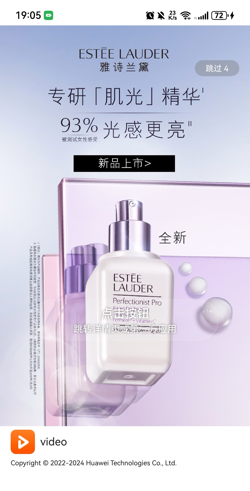

# 广告组件快速入门

## 目录

- [简介](#简介)
- [使用](#使用)
- [API参考](#API参考)
- [示例代码](#示例代码)

## 简介
本组件提供了通过华为广告平台展示开屏广告的能力，开发者可以根据业务需要实现通过开屏广告变现。




## 使用

1. 开发者需要前往[鲸鸿动能媒体服务平台](https://developer.huawei.com/consumer/cn/doc/monetize/zhucerenzheng-0000001132395957)注册开发者账号并认证，并参考[展示位创建](https://developer.huawei.com/consumer/cn/doc/monetize/zhanshiweichuangjian-0000001132700049)创建广告展示位用于开发调试。
2. 引入广告组件句柄。
   ```typescript
   import { AdServicePage, AdType, ChannelType } from 'aggregated_ads';
   ```

3. 调用组件，详细参数配置说明参见[API参考。](#API参考)

   ```typescript
   // 华为广告使用
   AdServicePage({
       channelType: ChannelType.HUAWEI_AD,
       adId: 'testq6zq98hecj',
       adType: AdType.SPLASH_AD,
       closeCallBack: () => {
         // 广告结束跳转页面
       },
     });
   ```

## API参考

### 子组件

无

###  接口

AdServicePage(channelType:ChannelType,adId:string,adType:AdType,appId:string,appName:string,closeCallBack:() => void)

广告组件。

**参数：**

| 参数名  | 类型                              | 必填 | 说明                 |
| :------ |:--------------------------------| :--- | :------------------- |
| channelType | [ChannelType](#ChannelType枚举说明) | 是 | 广告渠道信息数组 |
| adId | string                          | 是 | 广告位ID |
| adType | [AdType](#AdType枚举说明)                        | 是 | 广告类型 |
| appId | string                          | 否 | 应用ID |
| appName | string                          | 否 | 应用名称 |
| closeCallBack | () => void                      | 是 | 关闭广告回调函数 |

#### ChannelType枚举说明
| 名称    | 值       | 说明       |
| :------ | :-------- |:-------- |
| HUAWEI_AD     |  0     |    华为广告          |

#### AdType枚举说明
| 名称    | 值 | 说明   |
| :------ |:--|:-----|
| SPLASH_AD     | 1 | 开屏广告 |


### 事件

支持以下事件：

#### closeCallBack

closeCallBack: () => void = () => {}

广告关闭时的回调函数。

## 示例代码

使用华为广告

```typescript
// 华为广告使用
AdServicePage({
   channelType: ChannelType.HUAWEI_AD,
   adId: 'testq6zq98hecj',
   adType: AdType.SPLASH_AD,
   closeCallBack: () => {
      // 广告结束跳转页面
   },
});
```
