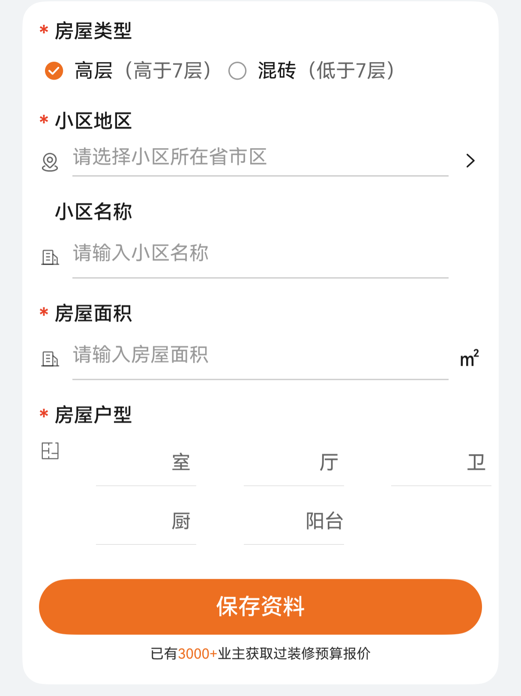

# 装修表单组件快速入门

## 目录

- [简介](#简介)
- [使用](#使用)
- [API参考](#API参考)
- [示例代码](#示例代码)

## 简介

本组件提供装修表单组件。



## 使用

1. 安装组件。

   需要将模板根目录的components下module_decoration_form目录拷贝至您工程根目录components/，并添加依赖和module声明。

    ```
    // entry/oh-package.json5
    "dependencies": {
      "module_decoration_form": "file:../components/module_decoration_form"
    }

    // build-profile.json5
    "modules": [
      {
        "name": "module_decoration_form",
        "srcPath": "./components/module_decoration_form"
      }
    ]
    ```

2. 引入组件。

    ```
    import { FormDecoration } from 'module_decoration_form';
    ```

## API参考

### FormDecoration(option: FormDecorationOptions)

#### FormDecorationOptions对象说明

| 参数名          | 类型                                                    | 是否必填 | 说明                              |
|:-------------|:------------------------------------------------------|:-----|:--------------------------------|
| buttonText   | string                                                | 否    | 提交按钮文本                          |
| homeType     | string                                                | 否    | 所选中房屋类型对应value，默认值第一个选项对应的value |
| address      | string                                                | 否    | 小区地区                            |
| cellName     | string                                                | 否    | 小区名称                            |
| area         | string                                                | 否    | 房屋面积                            |
| homeLayout   | [HomeLayout](#HomeLayout对象说明)                         | 否    | 房屋户型                            |
| typeOptions  | [TypeOption](#TypeOption对象说明)[]                       | 否    | 房屋类型选项信息                        |
| onFormSubmit | (data: [DecorationData](#DecorationData对象说明)) => void | 否    | 表单提交的回调事件                       |

#### TypeOption对象说明

| 参数名   | 类型     | 是否必填 | 说明      |
|:------|:-------|:-----|:--------|
| label | string | 是    | 房屋类型名称  |
| value | string | 是    | 房屋类型对应值 |
| desc  | string | 是    | 补充说明    |

#### HomeLayout对象说明

| 参数名      | 类型     | 是否必填 | 说明    |
|:---------|:-------|:-----|:------|
| room     | string | 是    | 卧室数量  |
| hall     | string | 是    | 客厅数量  |
| washroom | string | 是    | 卫生间数量 |
| kitchen  | string | 是    | 厨房数量  |
| balcony  | string | 是    | 阳台数量  |

#### DecorationData对象说明

| 参数名        | 类型                            | 说明              |
|:-----------|:------------------------------|:----------------|
| homeLayout | [HomeLayout](#HomeLayout对象说明) | 小区户型            |
| homeType   | string                        | 所选中房屋类型对应value值 |
| address    | string                        | 小区地区            |
| cellName   | string                        | 小区名称            |
| area       | string                        | 房屋面积            |

## 示例代码

```
import { promptAction } from '@kit.ArkUI';
import { FormDecoration } from 'module_decoration_form';

@Entry
@ComponentV2
struct Index {
  build() {
    Column() {
      FormDecoration({
        onFormSubmit: (data) => {
          console.log('填写的房屋信息为', JSON.stringify(data));
          promptAction.showToast({ message: '提交成功！' });
        },
      });
    }.backgroundColor($r('sys.color.background_secondary')).padding(16).height('100%');
  }
}
```
