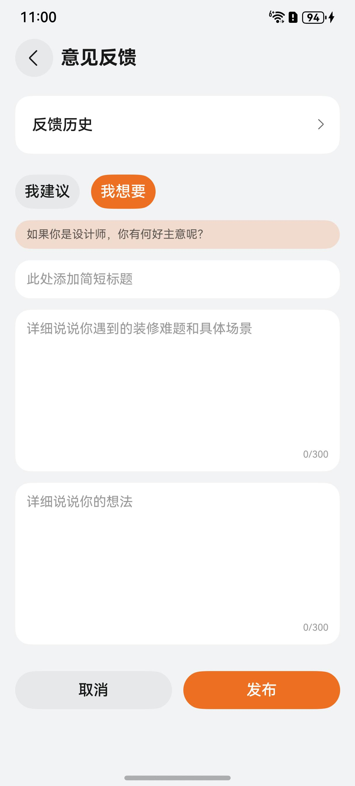
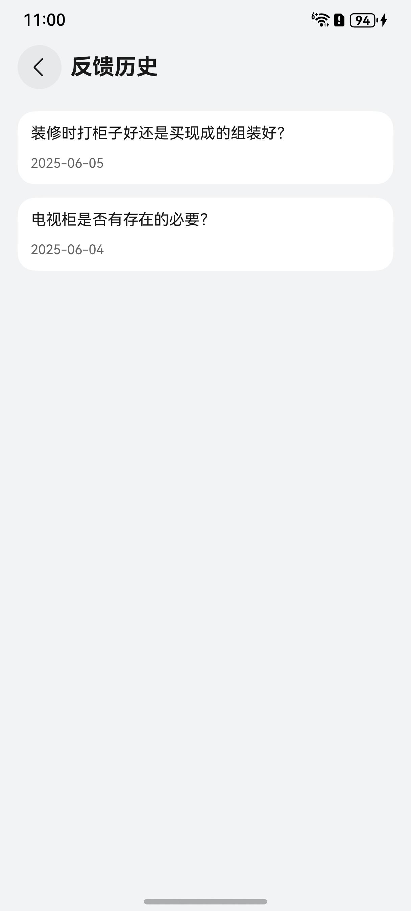
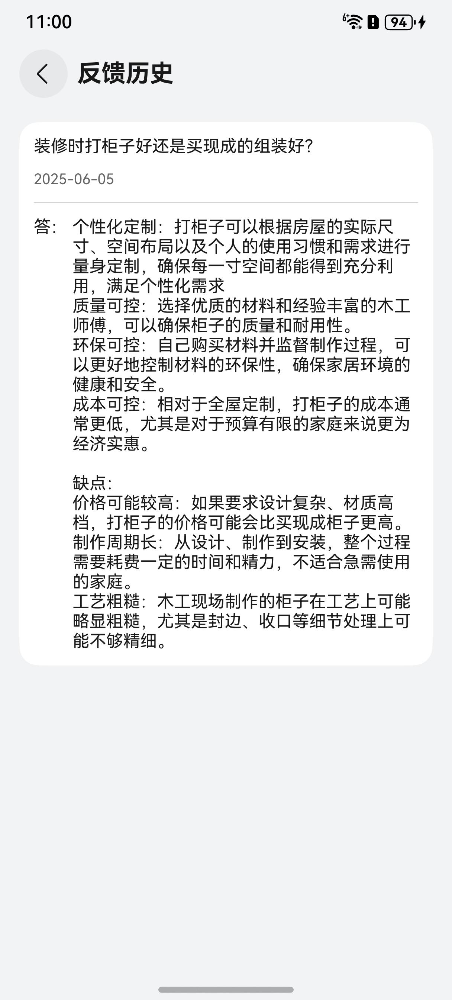

# 意见反馈组件快速入门

## 目录

- [简介](#简介)
- [使用](#使用)
- [API参考](#API参考)
- [示例代码](#示例代码)

## 简介

本组件提供填写意见、发布意见的功能。

| 意见反馈                                             | 反馈历史                                            | 反馈历史详情                                         |
|--------------------------------------------------|-------------------------------------------------|------------------------------------------------|
|  |  |  |


## 使用

1. 本组件基于全屏模式适配，使用组件需要在入口文件进行如下配置。
    ```
    // entry/src/main/ets/entryability/EntryAbility.ets
    ...
    onWindowStageCreate(windowStage: window.WindowStage): void {
     windowStage.getMainWindow((err, data) => {
          data.setWindowLayoutFullScreen(true)
        });
    }
    ...
    ```
2. 安装组件。

   将模板根目录的components下[module_posting](../module_posting)目录拷贝至您工程根目录components/，并添加依赖和module声明。

    ```
    // entry/oh-package.json5
    "dependencies": {
      "module_posting": "file:../components/module_posting"
    }

    // build-profile.json5
    "modules": [
      {
        "name": "module_posting",
        "srcPath": "./components/module_posting"
      }
    ]
    ```
3. 引入组件。

    ```
   import { UrlMap,WindowUtil } from 'module_posting'
    ```

## API参考

不涉及。

## 示例代码

```
import { UrlMap,WindowUtil } from 'module_posting'

@Entry
@ComponentV2
struct Index {
  stack: NavPathStack = new NavPathStack()

  aboutToAppear(): void {
    WindowUtil.initWindowUtil()
  }

  build() {
    Navigation(this.stack) {
     Column(){
       Blank().height(WindowUtil.avoidAreaSize.top)
       Column({ space: 10 }) {
         Text('意见反馈').fontSize(20).fontWeight(FontWeight.Bold)
         Button('go').width('100%').onClick(() => {
           this.stack.pushPath({
             name: UrlMap.FEEDBACK_PAGE
           })
         })
       }
       .justifyContent(FlexAlign.Center)
       .layoutWeight(1)
       Blank().height(WindowUtil.avoidAreaSize.bottom)
     }

    }
    .hideTitleBar(true)
    .mode(NavigationMode.Stack)
  }
}
```
