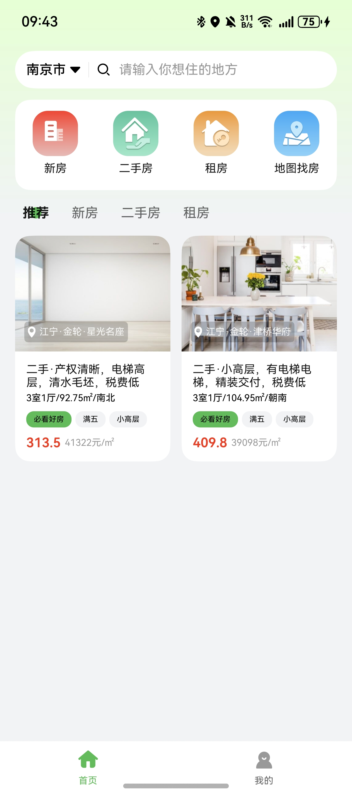
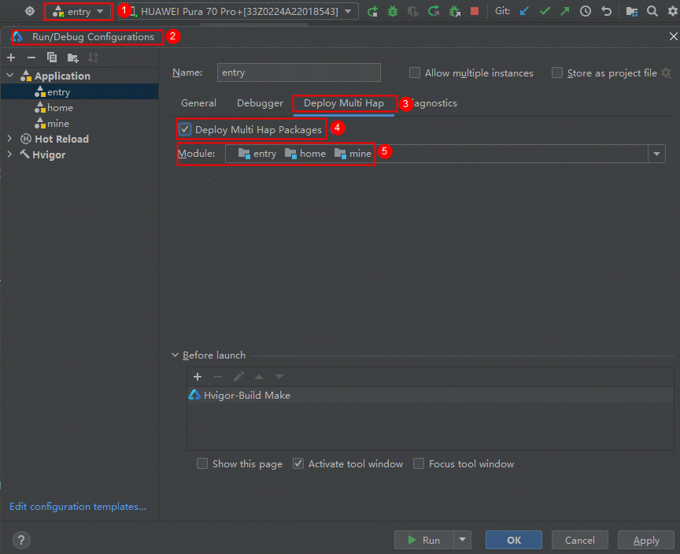
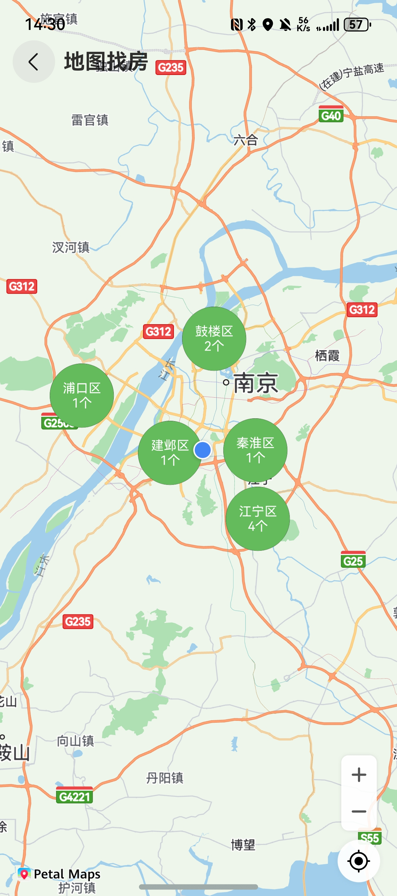
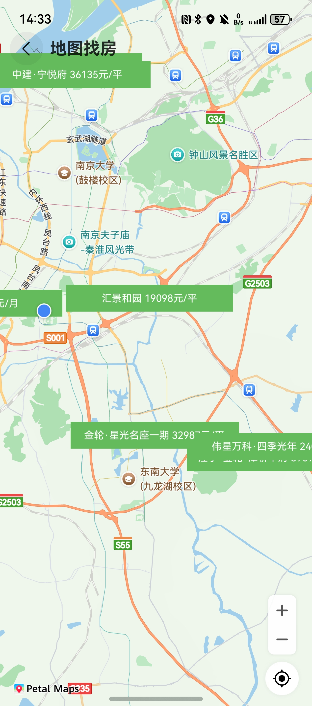
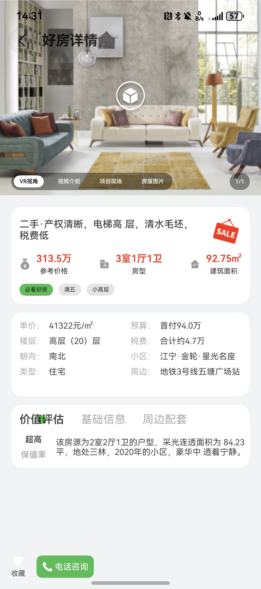
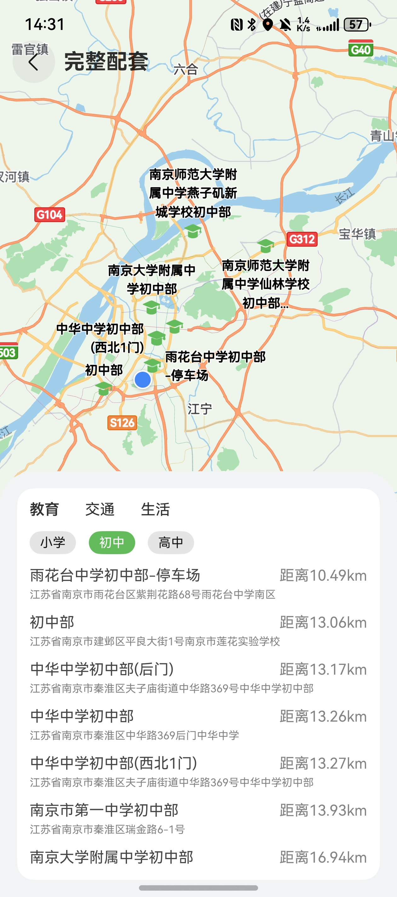

# 房产与装修（租房买房）应用模板快速入门

## 目录

- [功能介绍](#功能介绍)
- [环境要求](#环境要求)
- [快速入门](#快速入门)
- [示例效果](#示例效果)
- [权限要求](#权限要求)
- [开源许可协议](#开源许可协议)

## 功能介绍

您可以基于此模板直接定制应用，也可以挑选此模板中提供的多种组件使用，从而降低您的开发难度，提高您的开发效率。

此模板提供如下组件，所有组件存放在工程根目录的components下，如果您仅需使用组件，可参考对应组件的指导链接；如果您使用此模板，请参考本文档。

| 组件                          | 描述                    | 使用指导 |
|-----------------------------|-----------------------| -------- |
| 聚合登录组件（aggregated_login）    | 提供应用华为账号一键登录和微信登录功能。  |  [使用指导](components/aggregated_login/README.md)        |
| 城市选择组件（city_select）         | 提供城市选择和城市搜索功能。        |  [使用指导](components/city_select/README.md)        |
| 聚合轮播组件（aggregated_swiper）   | 提供vr、视频、图片等聚合内容的轮播功能。 |  [使用指导](components/aggregated_swiper/README.md)        |
| 地图找房组件（house_map）           | 提供房源按区聚合并展示全部房源的功能。   |  [使用指导](components/house_map/README.md)        |
| 房源周边配套组件（surround_facility） | 提供房屋周边配套查询与展示功能。      |  [使用指导](components/surround_facility/README.md)        |

本模板为租房买房类应用提供了常用功能的开发样例，模板主要分首页、我的两大模块：

* 首页：找新房、找二手房、租房、房源搜索、热门房屋推荐、地图找房。
* 我的：一键登录、修改个人信息、查看我的关注、查看并管理浏览历史。

本模板已集成华为账号、通话、地图、定位等服务，只需做少量配置和定制即可快速实现华为账号的登录、一键拨打服务电话、城市定位选择、根据地图找房等功能。

| 首页                                                    | 我的                                                    |
|-------------------------------------------------------|-------------------------------------------------------|
|  |  |


本模板主要页面及核心功能如下所示：

```ts
租房买房
 |-- 首页
 |    |-- 定位与搜索
 |    |-- 找房功能
 |    |    └-- 新房列表
 |    |         └-- 新房详情
 |    |    └-- 二手房列表
 |    |         └-- 二手房详情
 |    |    └-- 租房列表
 |    |         └-- 租房详情
 |    |    └-- 地图找房
 |    |-- 热门房源
 |    |    |-- 推荐房源
 |    |    |-- 推荐新房
 |    |    |-- 推荐二手房
 |    |    |-- 推荐租房
 └-- 我的
      |-- 个人信息
      |    └-- 应用登录
      |    └-- 个人信息修改
      |-- 我的关注
      |    └-- 关注列表
      |-- 浏览记录
      |    └-- 浏览记录列表
      |    └-- 浏览记录管理
      └-- 个人设置
           └-- 隐私政策
           └-- 用户协议
           └-- 退出登录
```

本模板工程代码结构如下所示：

```ts
RentAndBuy
  |- commons                                               // 公共能力层                                     
  |  |- foundation/src/main/ets/constants                   // 常量
  |  |    |- Constant.ets                                  // 公共常量定义 
  |  |    |- Enum.ets                                      // 公共枚举定义 
  |  |- foundation/src/main/ets/http                        // 网络请求 
  |  |    |- HttpApis                                      // 请求定义
  |  |    |- HttpApisMock                                  // mock请求定义
  |  |    |- MockData                                      // mock接口返回数据
  |  |    |- MockRequestMap                                // mock请求map
  |  └- foundation/src/main/ets/model                       // 模型定义
  |  |    |- AxiosHttp                                     // 请求方法定义类   
  |  |    |- AxiosRequest                                  // 请求类  
  |  |    |- Index                                         // 公共模型  
  |  |    |- IRequest                                      // 请求参数模型  
  |  |    |- IResponse                                     // 接口返回模型  
  |  |    |- ObeservedModel                                // 端侧接口返回监听模型 
  |  |    |- UserInfo                                      // 个人信息模型   
  |  └- foundation/src/main/ets/router                      // 公共路由 
  |  |    |- RouterModule                                  // 路由模块类
  |  └- foundation/src/main/ets/uicomponent                 // 公共ui组件
  |  |    |- CustomServiceDialog                           // 一键拨号弹窗
  |  |    |- FullLoadingComponent                          // 全屏loading
  |  |    |- HouseCard                                     // 房屋列表卡片
  |  |    |- TitleBar                                      // 自定义页面TitleBar
  |  └- foundation/src/main/ets/util                        // 公共util 
  |  |    |- AppStorageBank                                // 应用级持久化存储管理类
  |  |    |- AvoidAreaUtil                                 // 避让区管理类
  |  |    |- Logger                                        // 日志类
  |  |    |- Utils                                         // 公共工具类
  |      
  |- components                                            // 可分可合组件层
  |   |- aggregated_login/src/main/ets                     // 登录组件(har)
  |   |    |- common                                       // 登录组件公共模块     
  |   |    |    Constant.ets                               // 登录组件常量
  |   |    |    Logger.ets                                 // 日志打印类
  |   |    |- components                                   // 公共组件
  |   |    |    AgreementDialog.ets                        // 同意协议弹窗
  |   |    |- model                                        // 登录组件模型 
  |   |    |    Index.ets                                  // 公共模型
  |   |    |    WXApiWrap.ets                              // 微信相关模型  
  |   |    |- pages                                        // 登录页面
  |   |    |    LoginService.ets                           // 聚合登录页面
  |   |    |- viewmodel                                    // 组件页面
  |   |    |    AggregatedLoginVM.ets                      // 与页面一一对应的vm层             
  |   |    
  |   |- aggregated_swiper/src/main/ets                    // 聚合轮播组件(har)
  |   |    |- components                                   // 组件
  |   |    |    AggregatedSwiper.ets                       // 聚合轮播  
  |   |    |- model                                        // 轮播组件模型 
  |   |    |    Index.ets                                  // 模型定义    
  |   |    └- utils                                        // 日历工具类
  |   |    |    Logger.ets                                 // 日志打印  
  |   |    |    Utils.ets                                  // 模型定义  
  |   |    └- viewmodel                               
  |   |    |    AggregatedSwiperVM.ets                     // 与页面一一对应的vm层  
  |   |- city_select/src/main/ets                          // 城市选择组件(har)
  |   |    |- common
  |   |    |    Constant.ets                               // 常量定义      
  |   |    |    Model.ets                                  // 模型定义  
  |   |    |    Utils.ets                                  // 方法定义
  |   |    |- components
  |   |    |    SingleBtn.ets                              // 按钮组件
  |   |    |- pages
  |   |    |    Index.ets                                  // 城市选择主体
  |   |- house_map/src/main/ets                            // 地图找房组件(har)    
  |   |    |- pages
  |   |    |    HouseMap.ets                               // 地图找房
  |   |    |- viewmodel
  |   |    |    HouseMapVM.ets                             // 与页面一一对应的vm层 
  |   |- module_base/src/main/ets                          // 周边配套组件(har)
  |   |    |- constants
  |   |    |    Constant.ets                               // 常量类
  |   |    |    Enum.ets                                   // 枚举类
  |   |    |- http
  |   |    |    HttpApis.ets                               // 请求定义
  |   |    |    HttpApisMock.ets                           // mock请求定义
  |   |    |    MockData.ets                               // mock接口返回数据
  |   |    |    MockRequestMap.ets                         // mock请求定义
  |   |    |- model
  |   |    |    Index.ets                                  // 模型定义
  |   |    |    AxiosHttp.ets                              // 请求方法定义类
  |   |    |    AxiosRequest.ets                           // 请求参数定义类
  |   |    |    IResponse.ets                              // 模型返回定义
  |   |    |- uicomponent
  |   |    |    TitleBar.ets                               // 自定义页面TitleBar
  |   |    |- util
  |   |    |    AggregateClusterOverlayParams.ets          // 地图聚合增强类 
  |   |    |    AppStorageBank.ets                         // 应用级持久化存储管理类 
  |   |    |    MakerCanvasUtil.ets                        // 信息窗样式绘制类 
  |   |    |    MapUtil.ets                                // 地图工具类 
  |   |    |    SystemUtil.ets                             // 系统工具类
  |   |- surround_facility/src/main/ets                    // 周边配套组件(har)
  |   |    |- components
  |   |    |    Surrounding.ets                            // 周边配套组件
  |   |    |- constants
  |   |    |    Constant.ets                               // 常量类
  |   |    |- model
  |   |    |    Index.ets                                  // 模型定义
  |   |    |- pages
  |   |    |    FullSurrounding.ets                        // 全部配套页面
  |   |    |- viewmodel
  |   |    |    SurroundVM.ets                             // 与页面一一对应的vm层      
  |                                           
  |- features                                              // 基础特性层
  |   |- home/src/main/ets                                 // 首页模块(har)
  |   |    |- components                                   // 抽离组件
  |   |    |    Action.ets                                 // 一键拨号组件
  |   |    |    BasicInfo.ets                              // 房屋基本信息组件
  |   |    |    HotHouse.ets                               // 热门房源卡片组件
  |   |    |    Layouts.ets                                // 户型组件
  |   |    |    Value.ets                                  // 房源价值组件
  |   |    |- constant                              
  |   |    |    Constant.ets                               // 首页常量类
  |   |    |- model      
  |   |    |    Index.ets                                  // 首页模型
  |   |    |- pages                              
  |   |    |    CitySelect.ets                             // 城市选择页
  |   |    |    Home.ets                                   // 首页
  |   |    |    HouseList.ets                              // 房源列表页
  |   |    |    HouseSearch.ets                            // 房源搜索页
  |   |    |    NewDetail.ets                              // 新房详情页
  |   |    |    RentDetail.ets                             // 租房详情页
  |   |    |    SecondDetail.ets                           // 二手房详情页
  |   |    └- util                                         // 首页工具类
  |   |    |    Util.ets                                   // 工具类
  |   |    └- viewmodel                                    // 与页面一一对应的vm层
  |   |    |    HomeVM.ets                                 // 首页viewmodel
  |   |- mine/src/main/ets                                 // 我的模块(har)
  |   |    |- constant                              
  |   |    |    Constant.ets                               // 我的常量类 
  |   |    |- model      
  |   |    |    Index.ets                                  // 我的页模型
  |   |    |- pages                              
  |   |    |    History.ets                                // 历史记录页
  |   |    |    Mine.ets                                   // 我的页
  |   |    |    MyFollow.ets                               // 我的关注页
  |   |    |    PrivacyPolicyPage.ets                      // 隐私政策页
  |   |    |    QuickLoginPage.ets                         // 一键登录页
  |   |    |    Setting.ets                                // 个人设置页
  |   |    |    TermsOfServicePage.ets                     // 用户协议页
  |   |    |    UserProfile.ets                            // 个人信息页
  |   |    └- viewmodel                                    // 与页面一一对应的vm层  
  |   |    |    MineVM.ets                                 // 我的页viewmodel
  |
  |- product                                               // 产品架构层
  |   |- entry                                             // 主包(hap)
  |   |    └- entry/src/main/ets    
  |   |    |       |- constant                             // 主页常量                                                  
  |   |    |       |- entryability                         // UIAbility实例
  |   |    |       |- entrybackupability                   // 备份实例                                                                                                             
  |   |    |       |- pages                                // 基础层(har) 
  |   |    |       |    Index.ets                          // 主页面                
```

## 环境要求

### 软件
* DevEco Studio版本：DevEco Studio 5.0.5 Release及以上
* HarmonyOS SDK版本：HarmonyOS 5.0.5 Release SDK及以上

### 硬件
* 设备类型：华为手机（直板机）
* HarmonyOS版本：HarmonyOS 5.0.1 Release及以上

## 快速入门

###  配置工程
在运行此模板前，需要完成以下配置：
1. 在AppGallery Connect创建应用，将包名配置到模板中。

   a. 参考[创建应用](https://developer.huawei.com/consumer/cn/doc/app/agc-help-create-app-0000002247955506)为应用创建APP ID，并将APP ID与应用进行关联。

   b. 返回应用列表页面，查看我的包名。

   c. 将模板工程根目录下AppScope/app.json5文件中的bundleName替换为创建应用的包名。

2. 配置华为账号服务。

   a. 将应用的client ID配置到products/entry/src/main路径下的module.json5文件中，详细参考：[配置Client ID](https://developer.huawei.com/consumer/cn/doc/harmonyos-guides/account-client-id)。

   b. 申请华为账号一键登录所需的quickLoginMobilePhone权限，详细参考：[配置scope权限](https://developer.huawei.com/consumer/cn/doc/harmonyos-guides/account-config-permissions)。

3. 配置地图服务。

   a. 将应用的client ID配置到product/entry/src/main/module.json5文件，如果华为账号服务已配置，可跳过此步骤。

   b. 添加公钥指纹，如果华为账号服务已配置，可跳过此步骤。

   c. [开通地图服务](https://developer.huawei.com/consumer/cn/doc/harmonyos-guides/map-config-agc)。

4. 对应用进行[手工签名](https://developer.huawei.com/consumer/cn/doc/harmonyos-guides/ide-signing#section297715173233)。

5. 添加手工签名所用证书对应的公钥指纹。详细参考：[配置应用签名证书指纹](https://developer.huawei.com/consumer/cn/doc/app/agc-help-cert-fingerprint-0000002278002933)。

###  运行调试工程
1. 连接调试手机和PC。

2. 配置多模块调试：由于本模板存在多个模块，运行时需确保所有模块安装至调试设备。

   a. 在DevEco Studio菜单选择“Run > Edit Configurations”，进入“Run/Debug Configurations”界面。

   b. 左侧导航选择“entry”模块，选择“Deploy Multi Hap”页签，勾选上模板中所有模块。

   

   c. 点击"Run"，运行模板工程。

## 示例效果

1. 地图找房

   | 按区聚合                                                       | 全部房源                                                  |
   |------------------------------------------------------------|-------------------------------------------------------|
   |  |  |

2. 房源详情

   

3. 周边全部配套

   

## 权限要求

- 获取位置权限：ohos.permission.APPROXIMATELY_LOCATION、ohos.permission.LOCATION。
- 网络权限：ohos.permission.INTERNET

## 开源许可协议

该代码经过[Apache 2.0 授权许可](http://www.apache.org/licenses/LICENSE-2.0)。

