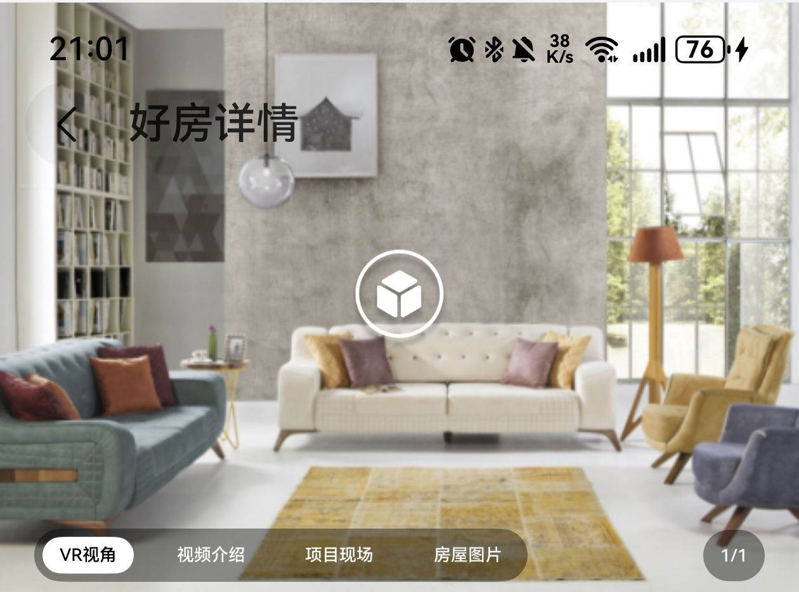

# 聚合轮播组件快速入门

## 目录

- [简介](#简介)
- [约束与限制](#约束与限制)
- [快速入门](#快速入门)
- [API参考](#API参考)
- [示例代码](#示例代码)

## 简介

本组件提供了vr、视频、图片等聚合内容的轮播功能，支持视频和图片的全屏展示。



## 约束与限制
### 环境
* DevEco Studio版本：DevEco Studio 5.0.5 Release及以上
* HarmonyOS SDK版本：HarmonyOS 5.0.5 Release SDK及以上
* 设备类型：华为手机（直板机）
* HarmonyOS版本：HarmonyOS 5.0.1 Release及以上

## 快速入门

1. 安装组件。
   如果是在DevEvo Studio使用插件集成组件，则无需安装组件，请忽略此步骤。

   如果是从生态市场下载组件，请参考以下步骤安装组件。

   a. 解压下载的组件包，将包中所有文件夹拷贝至您工程根目录的xxx目录下。

   b. 在项目根目录build-profile.json5添加aggregated_swiper和module_base模块。
   ```
   "modules": [
      {
         "name": "aggregated_swiper",
         "srcPath": "./xxx/aggregated_swiper",
      },
      {
         "name": "module_base",
         "srcPath": "./xxx/module_base",
      }
   ]
   ```
   c. 在项目根目录oh-package.json5中添加依赖
   ```
   "dependencies": {
      "aggregated_swiper": "file:./xxx/aggregated_swiper",
      "module_base": "file:./xxx/module_base"
   }
   ```

2. 引入组件及相关模型。
   ```typescript
   import { AggregatedSwiper, SwiperOption, SwiperType, SwiperContentType } from 'aggregated_swiper';
   ```

3. 调用组件，详细参数配置说明参见[API参考](#API参考)

   ```typescript
   AggregatedSwiper({ swiperOptions: this.swiperOptions });
   ```

## API参考

### 子组件

无

### 接口

AggregatedSwiper(swiperOptions:SwiperOption[])

聚合轮播组件。

**参数：**

| 参数名           | 类型                                  | 是否必填 | 说明       |
|:--------------|:------------------------------------|:---|:---------|
| swiperOptions   | [SwiperOption](#SwiperOption对象说明)[] | 是  | 聚合轮播内容数组 |

#### SwiperOption对象说明

| 参数名       | 类型                                                                                                                  | 是否必填 | 说明         |
|:----------|:--------------------------------------------------------------------------------------------------------------------|:---|:-----------|
| swiperType      | [SwiperType](#SwiperType枚举说明)     | 是  | 轮播分组名      |
| contents      | [SwiperContent](https://developer.huawei.com/consumer/cn/doc/harmonyos-references-V14/ts-types-V14#resourcestr)[]|  是 | 轮播分组内容，可混排 |

#### SwiperType枚举说明

| 名称        | 值 |
|:----------|:--|
| ANALYSIS | 探房分析 |
| REAL | 实景图 |
| EFFECT | 效果图 |
| LOCATION | 位置图 |
| PROGRAM | 项目现场 |
| VR | VR视角 |
| HOUSE | 房屋图片 |
| VIDEO | 视频介绍 |

#### SwiperContent对象说明

| 参数名    | 类型                     | 是否必填 | 说明                                |
|:-------|:-----------------------|:---|:----------------------------------|
| SwiperContentType | [SwiperContentType](#SwiperContentType枚举说明)   | 是  | 轮播内容类型                            |
| content | string                 | 是  | 轮播内容                              |
| preview | string                 | 否  | 轮播内容预览图，当SwiperContentType=0或1时必传 |

#### SwiperContentType枚举说明

| 名称        | 值 | 说明   |
|:----------|:--|:---------|
| IMAGE | 0 | 图片内容     |
| VIDEO | 1 | 视频内容     |
| WEB | 2 | web或vr内容 |

## 示例代码

```typescript
import { AggregatedSwiper, SwiperOption, SwiperType, SwiperContentType } from 'aggregated_swiper';

@Entry
@ComponentV2
struct Index {
   @Local swiperOptions: SwiperOption[] = [{
      swiperType: SwiperType.ANALYSIS,
      contents: [{
         type: SwiperContentType.IMAGE,
         content: 'resourceImage://new_house1',
         preview: 'resourceImage://new_house2',
      },
         {
            type: SwiperContentType.IMAGE,
            content: 'resourceImage://new_house2',
            preview: 'resourceImage://new_house1',
         }],
   },
      {
         swiperType: SwiperType.REAL,
         contents: [{
            type: SwiperContentType.IMAGE,
            content: 'resourceImage://new_house1',
            preview: 'resourceImage://new_house2',
         },
            {
               type: SwiperContentType.IMAGE,
               content: 'resourceImage://new_house2',
               preview: 'resourceImage://new_house1',
            }],
      }];

   build() {
      Column() {
         AggregatedSwiper({ swiperOptions: this.swiperOptions });
      };
   }
}
```
