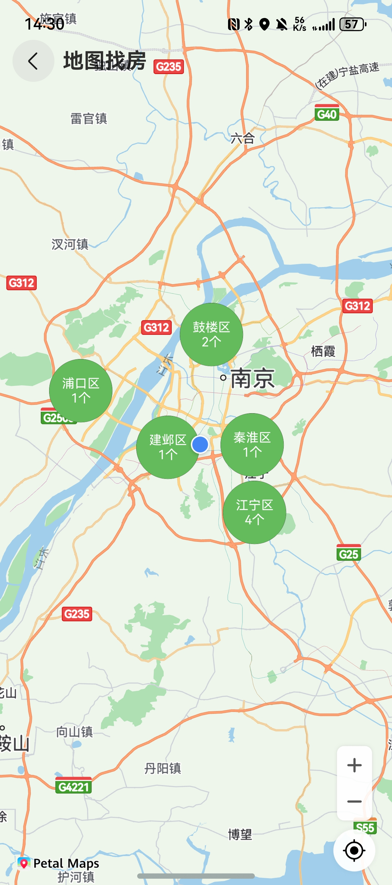

# 地图找房组件快速入门

## 目录

- [简介](#简介)
- [约束与限制](#约束与限制)
- [快速入门](#快速入门)
- [API参考](#API参考)
- [示例代码](#示例代码)

## 简介

本组件基于华为地图能力，提供了按区查找和查找全部房源的功能。

| 按区聚合                                              | 全部房源                                           |
|---------------------------------------------------|------------------------------------------------|
|  |  |

## 约束与限制
### 环境
* DevEco Studio版本：DevEco Studio 5.0.5 Release及以上
* HarmonyOS SDK版本：HarmonyOS 5.0.5 Release SDK及以上
* 设备类型：华为手机（直板机）
* HarmonyOS版本：HarmonyOS 5.0.1 Release及以上

## 快速入门

1. 安装组件。
   如果是在DevEvo Studio使用插件集成组件，则无需安装组件，请忽略此步骤。

   如果是从生态市场下载组件，请参考以下步骤安装组件。

   a. 解压下载的组件包，将包中所有文件夹拷贝至您工程根目录的xxx目录下。

   b. 在项目根目录build-profile.json5添加house_map和module_base模块。
   ```
   "modules": [
      {
         "name": "house_map",
         "srcPath": "./xxx/house_map",
      },
      {
         "name": "module_base",
         "srcPath": "./xxx/module_base",
      }
   ]
   ```
   c. 在项目根目录oh-package.json5中添加依赖
   ```
   "dependencies": {
      "house_map": "file:./xxx/house_map",
      "module_base": "file:./xxx/module_base"
   }
   ```

2. 在主工程的src/main路径下的module.json5文件中配置如下信息：

   a. 配置应用的client ID，详细参考：[配置Client ID](https://developer.huawei.com/consumer/cn/doc/harmonyos-guides/account-client-id)。

   b.在requestPermissions字段中添加如下权限。
   ```typescript
   "requestPermissions": [
   ...
   {
     "name": "ohos.permission.LOCATION",
     "reason": "$string:app_name",
     "usedScene": {
        "abilities": [
          "EntryAbility"
        ],
     "when": "inuse"
     }
   },
   {
     "name": "ohos.permission.APPROXIMATELY_LOCATION",
     "reason": "$string:app_name",
     "usedScene": {
       "abilities": [
       "EntryAbility"
     ],
     "when": "inuse"
     }
   }
   ...
   ],
   ```

3. 使用该组件需要开通地图服务，详见[开通地图服务](https://developer.huawei.com/consumer/cn/doc/harmonyos-guides/map-config-agc)。

4. 引入地图工具类。
   ```typescript
   import { AppStorageBank, https } from 'module_base';
   ```

5. 在合适的时机初始化当前城市及当前位置的经纬度，如下为示例：
   ```typescript
   AppStorageBank.setCurrentLocation(31.896741, 118.912613);
   AppStorageBank.setCurrentCity('南京市');
   ```

6. 在合适的位置通过Navigation路由栈跳转到本组件页面，如下为示例：
   ```typescript
   Button('跳转地图').onClick(() => {
     let city = AppStorageBank.getCurrentCity();
     this.pathInfo.pushPathByName('HouseMap',
          [https.getNewHouseList(city), https.getSecondHouseList(city), https.getRentHouseList(city)]);
   });
   ```

## API参考

### 子组件

无

### 接口

HouseMap()

地图找房组件。

## 示例代码

```typescript
import { AppStorageBank, https } from 'module_base';

@Entry
@ComponentV2
struct Index {
   pathInfo: NavPathStack = new NavPathStack();

   aboutToAppear(): void {
      AppStorageBank.setCurrentLocation(31.896741, 118.912613);
   }

   build() {
      Navigation(this.pathInfo) {
         Column() {
            Button('跳转地图').onClick(() => {
               let city = '南京市';
               this.pathInfo.pushPathByName('HouseMap',
                  [https.getNewHouseList(city), https.getSecondHouseList(city), https.getRentHouseList(city)]);
            });
         };
      }.title('地图找房');
   }
}
```
