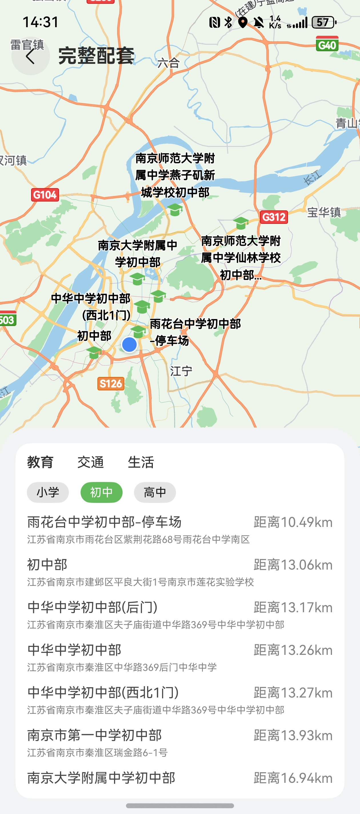

# 房源周边配套组件快速入门

## 目录

- [简介](#简介)
- [约束与限制](#约束与限制)
- [快速入门](#快速入门)
- [API参考](#API参考)
- [示例代码](#示例代码)

## 简介

本组件基于华为地图能力，提供了房源周边配套设施查询和展示的功能。



## 约束与限制
### 环境
* DevEco Studio版本：DevEco Studio 5.0.5 Release及以上
* HarmonyOS SDK版本：HarmonyOS 5.0.5 Release SDK及以上
* 设备类型：华为手机（直板机）
* HarmonyOS版本：HarmonyOS 5.0.1 Release及以上

## 快速入门

1. 安装组件。
   如果是在DevEvo Studio使用插件集成组件，则无需安装组件，请忽略此步骤。

   如果是从生态市场下载组件，请参考以下步骤安装组件。

   a. 解压下载的组件包，将包中所有文件夹拷贝至您工程根目录的xxx目录下。

   b. 在项目根目录build-profile.json5添加surround_facility和module_base模块。
   ```
   "modules": [
      {
      "name": "surround_facility",
      "srcPath": "./xxx/surround_facility",
      },
      {
         "name": "module_base",
         "srcPath": "./xxx/module_base",
      }
   ]
   ```
   c. 在项目根目录oh-package.json5中添加依赖
   ```
   "dependencies": {
      "surround_facility": "file:./xxx/surround_facility",
      "module_base": "file:./xxx/module_base"
   }
   ```

2. 在主工程的src/main路径下的module.json5文件中配置如下信息：

   a. 配置应用的client ID，详细参考：[配置Client ID](https://developer.huawei.com/consumer/cn/doc/harmonyos-guides/account-client-id)。

   b. 在requestPermissions字段中添加如下权限。
   ```typescript
   "requestPermissions": [
   ...
   {
     "name": "ohos.permission.LOCATION",
     "reason": "$string:app_name",
     "usedScene": {
        "abilities": [
          "EntryAbility"
        ],
     "when": "inuse"
     }
   },
   {
     "name": "ohos.permission.APPROXIMATELY_LOCATION",
     "reason": "$string:app_name",
     "usedScene": {
       "abilities": [
         "EntryAbility"
       ],
     "when": "inuse"
     }
   }
   ...
   ],
   ```
3. 使用该组件需要开通地图服务，详见[开通地图服务](https://developer.huawei.com/consumer/cn/doc/harmonyos-guides/map-config-agc)。

4. 引用组件和地图工具类。
   ```typescript
   import { Surrounding } from 'surround_facility';
   ```

5. 在合适的时机初始化当前房源的经纬度，如下为示例。
   ```typescript
   this.mu.initMap(31.896741, 118.912613);
   ```

## API参考

### 子组件

无

### 接口

Surrounding(facilityOptions:Facility[],pathStack:NavPathStack)

房屋周边配套组件。

**参数：**

| 参数名           | 类型                                                                                                                       | 是否必填 | 说明          |
|:--------------|:-------------------------------------------------------------------------------------------------------------------------|:---|:------------|
| facilityOptions   | [Facility](#Facility对象说明)[]             | 是  | 配套设施种类      |
| pathStack          | NavPathStack                                                                                                | 是  | 路由栈信息       |

#### Facility对象说明

| 参数名    | 类型                                | 是否必填 | 说明     |
|:-------|:----------------------------------|:---|:-------|
| type | [FacilityType](#FacilityType对象说明) | 是  | 配套种类   |
| name | string      | 是  | 配套名称   |
| sites | [<site.Site>](https://developer.huawei.com/consumer/cn/doc/harmonyos-references/map-site#section75488253219)[]                 | 否  | 配套地点列表 |
| keyword | string      | 是  | 关键字    |

#### FacilityType枚举说明

| 名称        | 值  |
|:----------|:---|
| EDUCATION | 教育 |
| TRANSPORT | 交通 |
| LIFE | 生活 |
| LEISURE | 休闲 |
| MEDICAL | 医疗 |

## 示例代码

```typescript
import { site } from '@kit.MapKit';
import { MapUtil } from 'module_base';
import { Surrounding } from 'surround_facility';

export interface Facility {
  type: FacilityType,
  name: string,
  sites?: Array<site.Site>,
  keyword: string
}

export enum FacilityType {
  EDUCATION = '教育',
  TRANSPORT = '交通',
  LIFE = '生活'
}

@Entry
@ComponentV2
struct Index {
   mu: MapUtil = MapUtil.instance;
   pathInfo: NavPathStack = new NavPathStack();
   @Local facilities: Facility[] = [
      {
         type: FacilityType.TRANSPORT,
         name: '交通情况',
         sites: [],
         keyword: '地铁站,公交站',
      },
      {
         type: FacilityType.EDUCATION,
         name: '教育情况',
         sites: [],
         keyword: '小学,初中,高中',
      },
      {
         type: FacilityType.LIFE,
         name: '生活配套',
         sites: [],
         keyword: '商场',
      },
   ];

   aboutToAppear(): void {
      this.mu.initMap(31.896741, 118.912613);
   }

   build() {
      Navigation(this.pathInfo) {
         Column() {
            Surrounding({
               title: 'xx小区',
               pathStack: this.pathInfo,
               facilityOptions: this.facilities,
            });
         };
      }.title('周边配套');
   }
}
```
