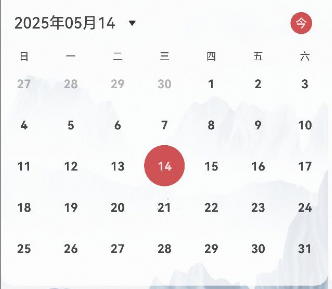

# 日历组件快速入门

## 目录

- [简介](#简介)
- [使用](#使用)
- [API参考](#API参考)
- [示例代码](#示例代码)

## 简介

本组件提供了展示当前日期日历、自定义选中颜色、选中图标形状、周首日、是否展示休息日、是否展示农历、是否显示头部、自定义头部项插槽、节日、节气展示颜色等相关的能力，可以帮助开发者快速集成日历相关的能力。


## 使用

1. 由于BaseCalendar组件依赖base_apis har包以及lunar、dayjs三方库，所以需要将模板根目录的components下base_apis 目录拷贝至您的工程相应目录。

   ```typescript
   // base_calendar组件内部依赖情况
   "dependencies": {
      "dayjs": "^1.11.13",
       "lunar": "^1.0.0",
      "base_apis": "file:../base_apis"
   }
   ```

2. 安装组件。 由于日历组件依赖**dayjs**三方库以及**base_apis** har包，所以需要将模板根目录的components下**base_calendar**和**base_apis**目录拷贝至您的工程相应目录。
   ```typescript
   // 在项目根目录build-profile.json5填写base_calendar和base_apis路径
     "modules": [
       {
         "name": "base_calendar",
         "srcPath": "./base_calendar",
       },
       {
         "name": "base_apis",
         "srcPath": "./base_apis",
       }
     ]
   ```

   ```typescript
   "dependencies": {
     "base_calendar": "file:../base_calendar"
   }
   ```

3. 引入组件与日历组件句柄。

   ```typescript
   import { BaseCalendar,CalendarController} from 'base_calendar';
   ```

4. 调用组件，详细参数配置说明参见[API参考](#API参考)。

   ```typescript
   import { BaseCalendar } from 'base_calendar';
   
   @Entry
   @Component
   struct Index {
     build() {
       Column() {
         BaseCalendar({
           currentDate: '2025-06-01',
           selectedStyle: 'squares',
           startWeekday: 'sunday',
           showHoliday: true,
           isShowLunar: true,
           festivalColor: '#C4272B',
           selectedColor: '#C4272B',
           onCurrentDateSelected: (date: string) => {
             console.log('当前选择的日期是' + date);
           },
         });
       }
     }
   }
   ```

## API参考

### 子组件

无

### 接口

BaseCalendar(options?: BaseCalendarOptions)

日历组件。

**参数：**

| 参数名  | 类型                                                         | 必填 | 说明                 |
| ------- | ------------------------------------------------------------ | ---- | -------------------- |
| options | [BaseCalendarOptions](#BaseCalendarOptions对象说明) | 否   | 配置日历组件的参数。 |

### BaseCalendarOptions对象说明

| 名称                  | 类型                                                         | 必填 | 说明                                 |
| --------------------- | ------------------------------------------------------------ | ---- |------------------------------------|
| currentDate           | string                                                       | 否   | 日历当前选中时间,时间格式为‘YYYY-MM-DD          |
| selectedColor         | [ResourceStr](https://developer.huawei.com/consumer/cn/doc/harmonyos-references-V14/ts-types-V14#resourcestr) | 否   | 自定义选中颜色，默认值#C4272B                 |
| selectedStyle         | 'circle' \| 'squares'                                        | 否   | 图标形状，默认值circle                     |
| startWeekday          | 'sunday' \| 'monday'                                         | 否   | 周首日 sunday=周日, monday=周一，默认值monday |
| showHoliday           | boolean                                                      | 否   | 是否展示休息日，默认值false                   |
| isShowLunar           | boolean                                                      | 否   | 是否展示农历，默认值false                    |
| isShowHeader          | boolean                                                      | 否   | 是否显示头部，默认值true                     |
| calendarHeaderBuilder | [CustomBuilder](https://developer.huawei.com/consumer/cn/doc/harmonyos-references-V14/ts-types-V14#custombuilder8) | 否   | 自定义头部项插槽                           |
| festivalColor         | [ResourceStr](https://developer.huawei.com/consumer/cn/doc/harmonyos-references-V14/ts-types-V14#resourcestr) \| [ResourceColor](https://developer.huawei.com/consumer/cn/doc/harmonyos-references-V14/ts-types-V14#resourcecolor) | 否   | 节日、节气展示颜色，默认值Color.Red             |

### CalendarController

BaseCalendar组件的控制器，用于控制BaseCalendar组件进行日期选择。不支持一个CalendarController控制多个BaseCalendar组件。

#### constructor

constructor()

CalendarController的构造函数。

#### setSelectDate

setSelectDate(date: Date): void

改变当前日历日期

#### getTodayYiJi

getTodayYiJi(): void

获取当日宜忌

### 事件

支持以下事件：

#### onCurrentDateSelected

onCurrentDateSelected: (date: string) => void = () => {}

选择日期时触发该事件。

## 示例代码

### 示例1（自定义选中颜色）

本示例通过selectedColor实现自定义选中日期颜色功能。

```typescript
   import { BaseCalendar, CalendarController } from 'base_calendar';
   
   @Entry
   @Component
   struct Index {
     calendarController: CalendarController = new CalendarController();
   
     build() {
       Column() {
         BaseCalendar({
           currentDate: '2025-5-28',
           selectedColor: Color.Blue,
         });
       }
     }
   }
```



### 示例2（自定义头部项插槽）

本示例通过calendarHeaderBuilder实现自定义日历头部。


```typescript
   import { BaseCalendar } from 'base_calendar';
   
   @Entry
   @Component
   struct Index {
     @Builder
     calendarHeader() {
       Row() {
         Text('自定义头')
         Text('自定义尾部')
       }
       .width('100%')
       .justifyContent(FlexAlign.SpaceBetween)
       .margin({ top: 16, bottom: 16 })
     }
   
     build() {
       Column() {
         BaseCalendar({
           currentDate: '2025-5-28',
           calendarHeaderBuilder: () => {
             this.calendarHeader();
           },
         });
       }
     }
   }
```


### 示例3（周首日设置）

本示例通过startWeekday实现自定义周首日。

```typescript
   import { BaseCalendar, CalendarController } from 'base_calendar';
   
   @Entry
   @Component
   struct Index {
     calendarController: CalendarController = new CalendarController();
   
     build() {
       Column() {
         BaseCalendar({
           currentDate: '2025-5-28',
           startWeekday: 'sunday'
         });
       }
     }
   }
```


### 示例4（句柄使用）

本示例通过CalendarController实现修改日历日期。

```typescript
// 引入组件
import { BaseCalendar, CalendarController } from 'base_calendar';

@Entry
@Component
struct Index {
   calendarController: CalendarController = new CalendarController();

   build() {
      Column() {
         BaseCalendar({
            currentDate: '2025-5-28',
            selectedStyle: 'squares',
            startWeekday: 'monday',
            showHoliday: true,
            isShowLunar: true,
            festivalColor: Color.Red,
         });
         Button('修改日历日期')
            .onClick(() => {
               this.calendarController.setSelectDate(new Date('2025-10-1'))
            })
      }
   }
}
```