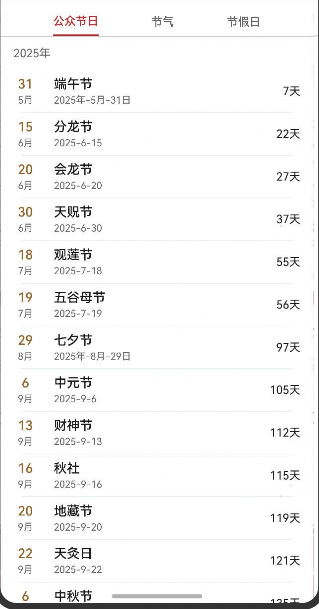
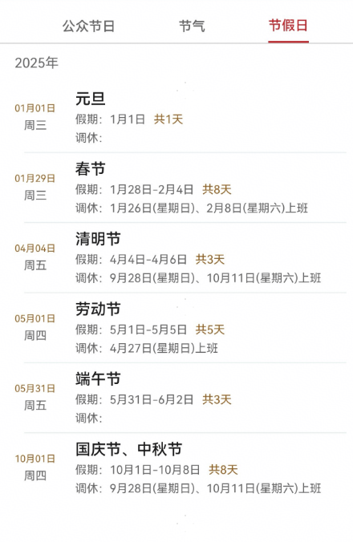

# 节日节气组件快速入门

## 目录

- [简介](#简介)
- [使用](#使用)
- [API参考](#API参考)
- [示例代码](#示例代码)

## 简介

本组件提供了节日、节气展示的相关功能。



## 使用

1. 组件依赖

   由于FestivalSolar组件依赖**base_apis** har包以及**lunar**以及**dayjs**三方库，所以需要将模板根目录的components下**base_apis** 目录拷贝至您的工程相应目录。

   ```typescript
    // festival_solar har包依赖情况 
   "dependencies": {
       "lunar": "^1.0.0",
       "dayjs": "^1.11.13",
       "base_apis": "file:../base_apis",
   }
   ```

2. 安装组件。

      ```typescript
   // 在项目根目录build-profile.json5填写festival_solar和base_apis路径
     "modules": [
       {
         "name": "festival_solar",
         "srcPath": "./festival_solar",
       },
       {
         "name": "base_apis",
         "srcPath": "./base_apis",
       }
     ]
   ```

   ```typescript
   "dependencies": {
     "festival_solar": "file:../festival_solar"
   }
   ```

3. 引入组件。

   ```typescript
   import { FestivalSolar } from 'festival_solar';
   ```

4. 调用组件，详细参数配置说明参见[API参考](#API参考)。

```typescript
   import { FestivalSolar } from 'festival_solar';
   
   @Entry
   @Component
   struct Index {
     build() {
       Column() {
         FestivalSolar({
           selectedDate: new Date(),
         });
       }
     }
   }
   
```

## API参考

### 接口

FestivalSolar(options?: FestivalSolarOptions)

节日节气展示组件。

**参数：**

| 参数名  | 类型                                                  | 必填 | 说明                     |
| ------- | ----------------------------------------------------- | ---- | ------------------------ |
| options | [FestivalSolarOptions](#FestivalSolarOptions对象说明) | 否   | 节日节气展示组件的参数。 |

### FestivalSolarOptions对象说明

| 名称         | 类型 | 必填 | 说明     |
| ------------ | ---- | ---- | -------- |
| selectedDate | Date | 是   | 当前日期 |

### 事件

支持以下事件：

#### onFestivalCardClick

onFestivalCardClick(callback: (festivalInfo: [HolidayInfo](#HolidayInfo对象说明)) => void)

公众节日卡片事件，返回节日信息

#### onSolarCardClick

onFestivalCardClick(callback: (solarInfo: [SolarInfo](#SolarInfo对象说明)) => void)

节气卡片事件，返回节日信息

#### onHolidayCardClick

onFestivalCardClick(callback: (festivalInfo: [HolidayInfo](#HolidayInfo对象说明)) => void)

公众假日卡片事件，返回节日信息

### HolidayInfo对象说明

| 名称        | 类型     | 必填 | 说明               |
| ----------- | -------- | ---- | ------------------ |
| solarDate   | string   | 是   | 阳历日期           |
| lunarDate   | string   | 是   | 农历日期           |
| holidayName | string[] | 是   | 假期名称集合       |
| daysUntil   | number   | 是   | 距离今天还剩多少天 |
| month       | string   | 是   | 月                 |
| day         | string   | 是   | 日                 |

### SolarInfo对象说明

| 名称      | 类型   | 必填 | 说明       |
| --------- | ------ | ---- | ---------- |
| solarDate | string | 是   | 阳历日期   |
| lunarDate | string | 是   | 农历日期   |
| solarTerm | string | 是   | 节气名称 |

## 示例代码

### 示例1

本示例通过selectedDate实现不同节假日信息展示。

```typescript
   import { FestivalSolar } from 'festival_solar';
   
   @Entry
   @Component
   struct Index {
     build() {
       Column() {
         FestivalSolar({
           selectedDate: new Date(),
         });
       }
     }
   }
   
```

