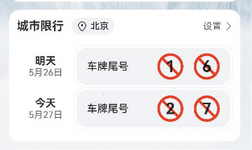
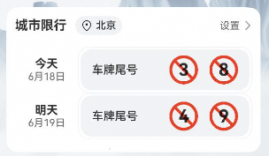

# 城市限行组件快速入门

## 目录

- [简介](#简介)
- [使用](#使用)
- [API参考](#API参考)
- [示例代码](#示例代码)

## 简介

本组件提供了城市限行组件，当前尾号限行数据均为mock数据，实际开发请填充业务真实数据



## 使用

1. 安装组件。
   ```typescript
   // 在项目根目录build-profile.json5填写base_apis和traffic_restriction路径
     "modules": [
       {
         "name": "traffic_restriction",
         "srcPath": "./traffic_restriction",
       },
       {
         "name": "base_apis",
         "srcPath": "./base_apis",
       }
     ]
   ```
   ```typescript
   "dependencies": {
     "traffic_restriction": "file:../traffic_restriction"
   }
   ```

2. 引入组件。

   ```typescript
     import { TrafficRestriction } from 'traffic_restriction';
   ```

3. 调用组件，详细参数配置说明参见[API参考](#API参考)

   ```typescript
   import { TrafficRestriction } from 'traffic_restriction';
   @Entry
   @Component
   struct Index {
    build() {
    	Column() {
      	   TrafficRestriction()
    	}
    }
   }		
   ```

## API参考

### 子组件

无

### 接口

TrafficRestriction(options?: TrafficRestrictionOptions)

城市限行组件。

**参数：**

| 参数名  | 类型                                                   | 必填 | 说明           |
| :------ | :----------------------------------------------------- | ---- | -------------- |
| options | [TrafficRestrictionOptions](#LoginInfoOptions对象说明) | 否   | 城市限行组件。 |

### TrafficRestrictionOptions对象说明

| 名称       | 类型 | 必填 | 说明     |
| :--------- | :--- | ---- | -------- |
| selectDate | Date | 否   | 当前日期 |

## 示例代码

### 示例1（

本示例通过selectDate实现不同日期的限行查询

```typescript
import { TrafficRestriction } from 'traffic_restriction';
@Entry
@Component
struct Index {
  build() {
    Column() {
      TrafficRestriction({
         selectDate:new Date('2025-6-18')
      })
    }
  }
}		
```



```

```