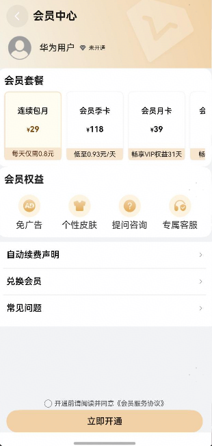

# 会员中心组件快速入门

## 目录

- [简介](#简介)
- [使用](#使用)
- [API参考](#API参考)
- [示例代码](#示例代码)

## 简介

本组件提供了用户会员开通功能，**其中开通会员中的华为支付、支付宝支付、微信之后功能暂未对接三方sdk的支付能力，所开通数据均为mock数据，实际开发中可以做借鉴使用，具体支付请对接实际业务**



## 使用

1. 组件依赖

   由于VipCenter组件依赖**base_apis**以及根目录下sdk文件夹中的**aggregated_payment** har包并且依赖**cashier_alipay** sdk，所以需要将模板根目录的components下**base_apis** 目录以及根目录下sdk文件夹中的**aggregated_payment**拷贝至您的工程相应目录。

   ```typescript
   // vip_center har包依赖情况
   "dependencies": {
       'aggregated_payment': 'file:../../sdk/aggregated_payment',
       "@cashier_alipay/cashiersdk": "^15.8.29",
       "base_apis": "file:../base_apis"
   }
   // 在项目根目录build-profile.json5填写aggregated_payment和base_apis路径
     "modules": [
       {
         "name": "aggregated_payment",
         "srcPath": "./sdk/aggregated_payment",
       },
       {
         "name": "base_apis",
         "srcPath": "./base_apis",
       }
     ]
   ```

2. 安装组件。

   ```typescript
   // 在项目根目录build-profile.json5填写vip_center路径
     "modules": [
       {
         "name": "vip_center",
         "srcPath": "./vip_center",
       }
     ]
   ```

   ```typescript
   "dependencies": {
     "vip_center": "file:../vip_center"
   }
   ```

3. 引入组件。

   ```typescript
   import { VipCenter } from 'vip_center';
   ```

4. 调用组件，详细参数配置说明参见[API参考](#API参考)。

   ```typescript
   import { VipCenter } from 'vip_center';
   import { promptAction } from '@kit.ArkUI';
   
   @Entry
   @Component
   struct Index {
     pageInfo: NavPathStack = new NavPathStack()
   
     build() {
       Navigation(this.pageInfo) {
         VipCenter({
           userName:'张三',
           avatar:'',
           routerModule:this.pageInfo,
           onVipOpen: () => {
             promptAction.showToast({ message: '兑换成功' })
           },
         })
       }
        .hideTitleBar(true)
     }
   }
   ```

## API参考

### 子组件

无

### 接口

VipCenter(options?: VipCenterOptions)

用户信息组件。

**参数：**

| 参数名  | 类型                                          | 必填 | 说明           |
| ------- | --------------------------------------------- | ---- | -------------- |
| options | [VipCenterOptions](#VipCenterOptions对象说明) | 否   | 会员开通组件。 |

### VipCenterOptions对象说明

| 名称       | 类型      | 必填 | 说明     |
| :--------- |:--------| ---- |--------|
| userName | string  | 否   | 用户名称   |
| avatar | string  | 否   | 用户头像   |
| isVip | boolean | 否   | 是否会员   |
| vipType | string    | 否   | 会员类型   |
| routerModule | [NavPathStack](https://developer.huawei.com/consumer/cn/doc/harmonyos-references/ts-basic-components-navigation#navpathstack10) | 是   | 传入当前组件所在路由栈 |
### 事件

支持以下事件：

#### onVipOpen

onLogin(callback: () => void)

开通事件