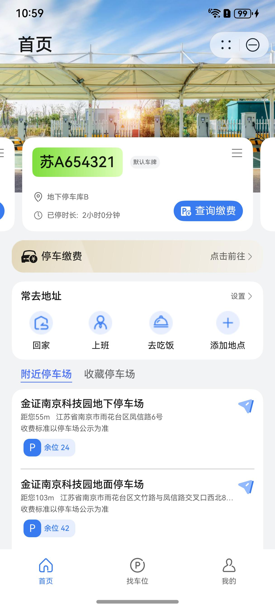
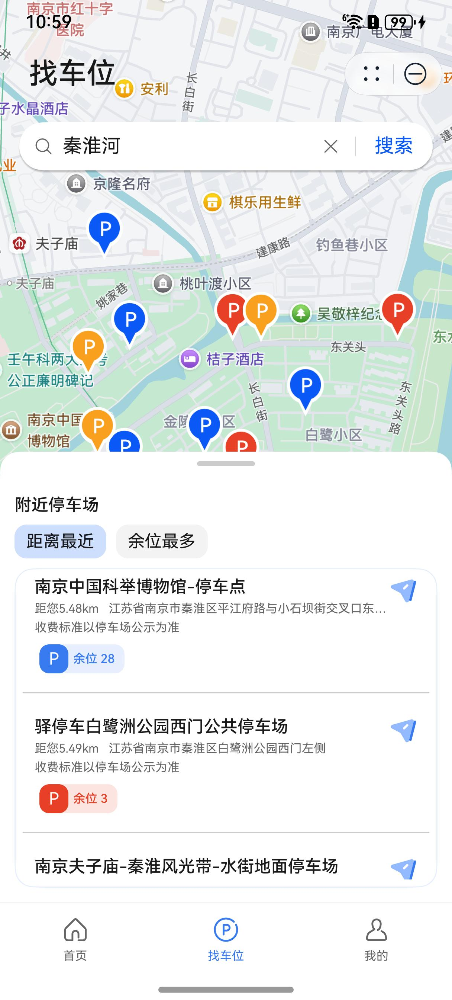
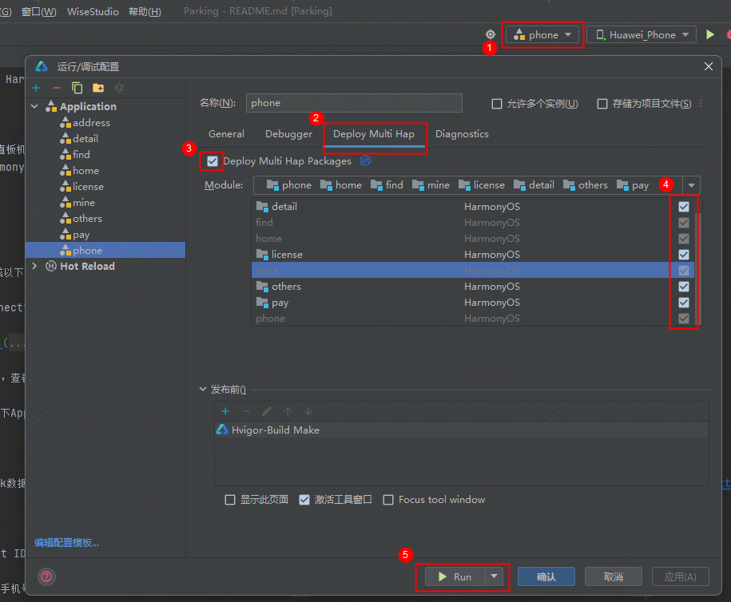
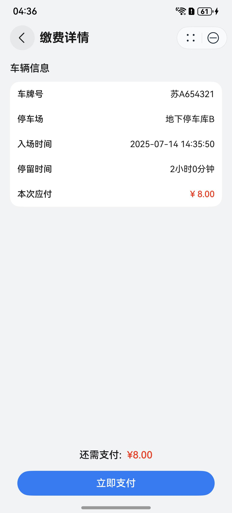
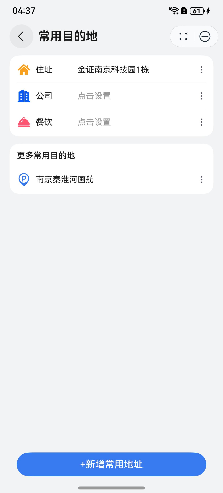
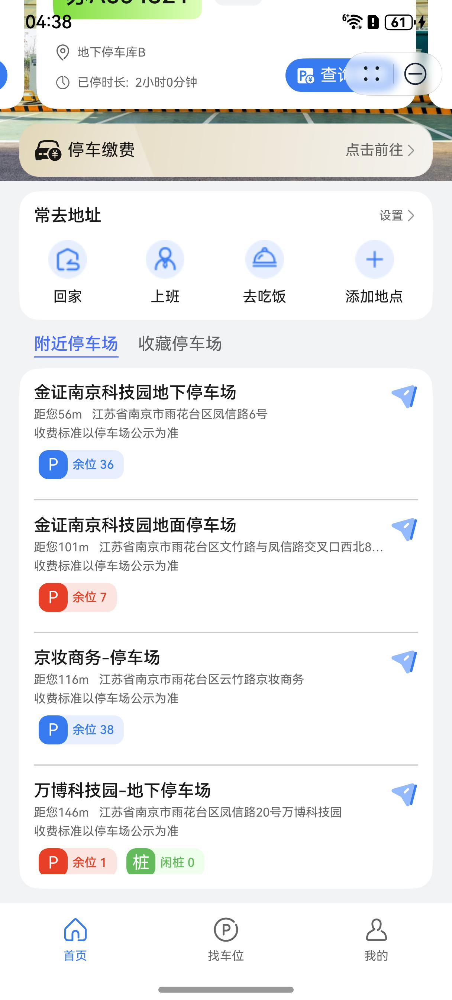
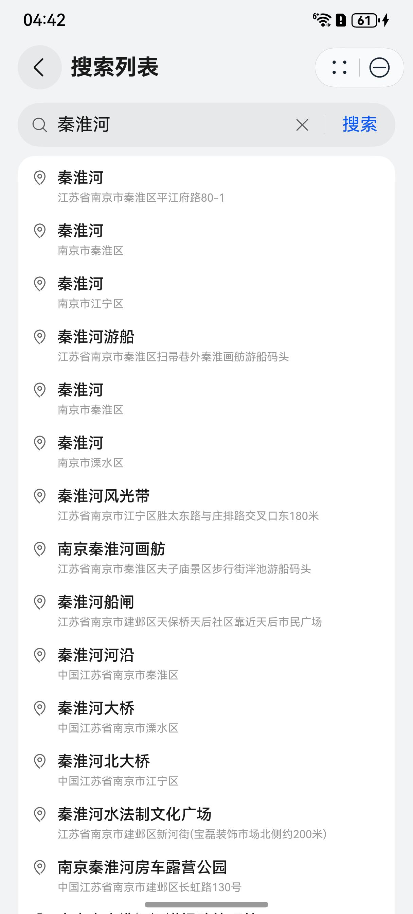

# 出行导航（停车）元服务模板快速入门

## 目录

- [功能介绍](#功能介绍)
- [环境要求](#环境要求)
- [快速入门](#快速入门)
- [示例效果](#示例效果)
- [权限要求](#权限要求)
- [开源许可协议](#开源许可协议)

## 功能介绍

您可以基于此模板直接定制元服务，也可以挑选此模板中提供的多种组件使用，从而降低您的开发难度，提高您的开发效率。

此模板中还提供了如下组件，您可以按需选择使用，所有组件存放在工程根目录的components下。

| 组件                                | 描述                                      | 使用指导                                                   |
|-----------------------------------|-----------------------------------------|--------------------------------------------------------|
| 地址搜索联想补全组件（module_address_search） | 本组件提供搜索词条的地址联想补全功能，并实现搜索记录的历史存储。        | [使用指导](./components/module_address_search/README.md)   |
| 车牌查询组件（module_license_keyboard）   | 本组件根据我的车牌、最近使用车牌分类，实现车牌的快速输入查询。         | [使用指导](./components/module_license_keyboard/README.md) |
| 停车场卡片组件（module_parking_base）      | 本组件提供停车场搜索方法以及停车场卡片组件。                  | [使用指导](./components/module_parking_base/README.md)     |
| 停车场地图列表组件（module_parking_map）     | 本组件提供停车场的地图标注显示和列表展示显示，提供滑动地图以及指定经纬度刷新。 | [使用指导](./components/module_parking_map/README.md)      |
| 附近停车场组件（module_parking_spots）     | 本组件提供附近停车场以及收藏停车场的列表显示，根据当前设备位置定位、下拉刷新。 | [使用指导](./components/module_parking_spots/README.md)    |
| 图片轮播预览组件（module_swiper_preview）   | 本组件提供图片轮播以及大图预览的功能。                     | [使用指导](./components/module_swiper_preview/README.md)   |

本模板为停车缴费元服务提供了常用功能的开发样例，模板主要分首页、找车位和我的三大模块：

* 首页：主要提供车牌轮播、停车缴费、常去地址、附近和收藏停车场展示等功能。

* 找车位：主要提供停车场的地图标注和列表展示功能，支持联想搜索和地图查找。

* 我的：展示个人信息，车牌、订单和收藏的管理以及联系客服功能。

本模板已集成华为账号、地图、通话、支付等服务，只需做少量配置和定制即可快速实现华为账号登录、地图定位搜索、一键拨号、停车缴费等功能。

| 首页                                                           | 找车位                                                           | 我的                                                           |
|--------------------------------------------------------------|---------------------------------------------------------------|--------------------------------------------------------------|
|  |  |  |

本模板主要页面及核心功能如下所示：

```
停车缴费模板
├──首页                         
│    ├──车牌轮播
│    │    ├──信息展示                          
│    │    ├──刷新删除                        
│    │    ├──查询缴费入口                        
│    │    └──新增车牌入口             
│    ├──停车缴费
│    │    ├──订单查询页面                        
│    │    │    ├──车牌输入                     
│    │    │    ├──绑定车牌                      
│    │    │    └──最近车牌                     
│    │    └──订单结果页面
│    │         └──华为支付                     
│    ├──常去地址
│    │    ├──设置地址入口                        
│    │    │    ├──基础地址                     
│    │    │    └──其他地址                     
│    │    └──目标地址跳转
│    └──车场展示
│         ├──附近停车场                          
│         └──收藏停车场     
│      
├──找车位                         
│    ├──地址搜索
│    │    ├──自动联想                          
│    │    └──历史搜索             
│    ├──地图展示
│    │    ├──绘制标注                                          
│    │    ├──点击凸显                                          
│    │    ├──个人定位                                          
│    │    └──滑动更新
│    └──列表展示
│         ├──排序切换                                           
│         └──详情入口  
│              ├──基本信息
│              ├──车位信息
│              ├──收费信息
│              └──收藏/导航/拨号
│                     
└──我的    
     ├──信息展示
     │    ├──账号关联                          
     │    └──取消关联             
     ├──车牌管理
     │    ├──查看                                          
     │    ├──新增                                          
     │    ├──删除                                          
     │    └──设为默认
     ├──订单管理       
     │    ├──删除订单    
     │    └──列表展示  
     │         └──查看订单详情    
     ├──收藏管理       
     │    ├──取消收藏    
     │    └──列表展示  
     │         └──跳转车场详情
     ├──联系客服       
     │    └──快捷拨号  
     ├──个人设置       
     │    └──信息修改
     └──隐私协议
```

本模板工程代码结构如下所示：

```
Parking                                        
├──commons                                     // 公共层
│    ├──common/src/main/ets                    // 公共工具模块(har)
│    │    ├──components                          
│    │    │    CommonButtom.ets                // 公共按钮组件    
│    │    │    CommonHeader.ets                // 公共标题组件    
│    │    ├──constatns                         
│    │    │    CommonConstants.ets             // 公共常量       
│    │    │    CommonEnum.ets                  // 公共枚举  
│    │    │    CommonStyles.ets                // 公共样式         
│    │    ├──types                             
│    │    │    Address.ets                     // 地址类型
│    │    │    License.ets                     // 车牌类型
│    │    │    Order.ets                       // 订单类型 
│    │    │    ParkSpot.ets                    // 停车场类型   
│    │    │    UserInfo.ets                    // 用户类型     
│    │    └──utils                             
│    │         AccountUtil.ets                 // 账号管理工具       
│    │         AddressUtil.ets                 // 常用地址管理工具       
│    │         CollectUtil.ets                 // 收藏停车场管理工具       
│    │         FormatUtil.ets                  // 格式化工具      
│    │         FullLoading.ets                 // 全局弹窗工具       
│    │         LicenseUtil.ets                 // 车牌管理工具       
│    │         Logger.ets                      // 日志打印工具  
│    │         RouterModule.ets                // 路由管理工具        
│    │         WidgetUtil.ets                  // 卡片管理工具      
│    │         WindowUtil.ets                  // 窗口管理工具
│    │                                         
│    └──network/src/main/ets                   // 公共网络模块(har)
│         ├──apis                              
│         │    HttpRequestApi                  // 请求api
│         ├──mocks                             
│         │    └──mockData                     // 模拟数据
│         │    Constants.ets                   // 相关常量 
│         │    HttpRequestApiMock.ets          // 模拟api          
│         │    MockRequestMap.ets              // api映射表            
│         ├──models                            // 请求模型
│         │    AxiosHttp.ets                     
│         │    AxiosRequest.ets                     
│         ├──pages                             
│         │    BindPhonePage.ets               // 账号关联页面      
│         ├──types                             
│         │    └──responseTypes                // 响应类型   
│         │    AxiosRequestParam.ets           // 请求类型         
│         │    BaseResponse.ets                // 响应基本类型    
│         │    HttpRequestConfig.ets           // 请求相关类型               
│         └──utils                             
│              AssociateUtil.ets               // 账号关联工具
│                                              
├──components                                  // 组件层
│    ├──module_address_search/src/main/ets     // 地址搜索补全组件(har）
│    │    ├──types                             
│    │    │    Address.ets                     // 地址类型
│    │    ├──utils                             
│    │    │    CommonUtil.ets                  // 公共方法   
│    │    │    HistoryUtil.ets                 // 搜索历史管理工具   
│    │    │    Logger.ets                      // 日志打印工具   
│    │    ├──viewmodels                        
│    │    │    SearchVM.ets                    // 搜索视图模型
│    │    └──views                              
│    │         AddressSearch.ets               // 地址搜索补全组件封装
│    │                                         
│    ├──module_license_keyboard/src/main/ets   // 车牌快速查询组件(har）
│    │    ├──components                             
│    │    │    CommonKeyboard.ets              // 车牌输入组件
│    │    ├──utils                             
│    │    │    LicenseUtil.ets                 // 最近输入车牌管理工具   
│    │    └──views                              
│    │         QueryKeyboard.ets               // 车牌快速查询组件封装
│    │                                         
│    ├──module_parking_base/src/main/ets       // 停车场基础组件(har)
│    │    ├──components                          
│    │    │    CommonSpotItem.ets              // 停车场卡片组件      
│    │    ├──types                             
│    │    │    ParkSpot.ets                    // 停车场类型
│    │    └──utils                             
│    │         CommonUtil.ets                  // 公共方法   
│    │         FormatUtil.ets                  // 格式化工具  
│    │         LocationUtil.ets                // 定位管理工具    
│    │         Logger.ets                      // 日志打印工具
│    │         ServiceUtil.ets                 // 搜索停车场方法
│    │                                         
│    ├──module_parking_map/src/main/ets        // 停车场地图列表组件(har)
│    │    ├──components                          
│    │    │    BottomPart.ets                  // 停车场列表组件  
│    │    ├──constatns                         
│    │    │    Constants.ets                   // 相关常量 
│    │    ├──viewmodels                        
│    │    │    MapListVM.ets                   // 停车场地图组件视图模型
│    │    └──views                             
│    │         ParkingMapList.ets              // 停车场地址列表组件封装
│    │                                         
│    ├──module_parking_spots/src/main/ets      // 停车场tab组件(har)
│    │    ├──components                          
│    │    │    TabComp.ets                     // 自定义tab组件
│    │    ├──viewmodels                        
│    │    │    SpotsTabVM.ets                  // 停车场tab组件视图模型  
│    │    └──views                             
│    │         SpotsTab.ets                    // 停车场tab组件封装
│    │                                         
│    ├──module_phone_call/src/main/ets         // 电话拨号半模态组件(har)           
│    │    └──utils                             
│    │         Logger.ets                      
│    │         TelUtil.ets                     // 电话拨号方法
│    │                                         
│    └──module_swiper_preview/src/main/ets     // 图片轮播预览组件(har)              
│         └──view                              
│              SwiperPicsPreview.ets           // 图片轮播预览组件封装
│                                              
├──features/service                            
│    ├──address/src/main/ets                   // 地址管理模块(hsp)
│    │    ├──components                         
│    │    │    CommonAddressListItem.ets       // 常用地址列表项             
│    │    ├──pages                              
│    │    │    CommonAddressPage.ets           // 常用地址设置页                          
│    │    └──viewmodels                        
│    │         AddressPageVM.ets               // 常用地址视图模型
│    │                                         
│    ├──detail/src/main/ets                    // 停车场详情模块(hsp)
│    │    ├──pages                             
│    │    │    SiteDetailPage.ets              // 停车场详情页                       
│    │    └──viewmodels                        
│    │         SiteDetailPageVM.ets            // 详情页视图模型
│    │                                         
│    ├──license/src/main/ets                   // 车牌管理模块(hsp)
│    │    ├──components                        
│    │    │    MyLicenseCard.ets               // 车牌卡片组件
│    │    ├──pages                             
│    │    │    AddLicensePage.ets              // 新增车牌页                         
│    │    │    MyLicensepage.ets               // 我的车牌页                       
│    │    └──viewmodels                        
│    │         LicensePageVM.ets               // 车牌页视图模型
│    │                                         
│    ├──others/src/main/ets                    // 其他相关模块(hsp)
│    │    ├──collect                           
│    │    │    CollectPage.ets                 // 收藏停车场页面
│    │    ├──order                             
│    │    │    ├──components                                         
│    │    │    │    OrderCardItem.ets          // 订单卡片组件                               
│    │    │    ├──pages                                         
│    │    │    │    OrderDetailPage.ets        // 订单详情页                                 
│    │    │    │    OrderListPage.ets          // 订单列表页                               
│    │    │    └──viewmodels                                         
│    │    │         OrderPageVM.ets            // 订单视图模型                             
│    │    └──privacypolicy                     
│    │         PrivacyPolicyPage.ets           // 隐私政策页面
│    │                                         
│    └──pay/src/main/ets                       // 查询支付模块(hsp)
│         ├──pages                             
│         │    PayPage.ets                     // 订单结果页                 
│         │    QueryPage.ets                   // 订单查询页                  
│         └──viewmodels                        
│              QueryPayPageVM.ets              // 搜索页视图模型
│                                              
├──features/tab                                 
│    ├──find/src/main/ets                      // 找车位tab模块(hsp)
│    │    ├──components                          
│    │    │    TopPart.ets                     // 找车位顶部区
│    │    ├──pages                             
│    │    │    FindPage.ets                    // 找车位Tab页                  
│    │    │    SearchPage.ets                  // 搜索地址页                    
│    │    └──viewmodels                        
│    │         SearchPageVM.ets                // 找车位视图模型
│    │                                         
│    ├──home/src/main/ets                      // 首页tab模块(hsp)
│    │    ├──components                        
│    │    │    CommonAddress.ets               // 常用地址项
│    │    │    LicenseCardItem.ets             // 车牌卡片项
│    │    │    LicenseSwiper.ets               // 车牌轮播
│    │    ├──constants                         
│    │    │    Constatns.ets                   // 相关常量
│    │    ├──pages                             
│    │    │    HomePage.ets                    // 首页Tab页
│    │    ├──types                             
│    │    │    Types.ets                       // 相关类型                
│    │    └──viewmodels                        
│    │         HomePageVM.ets                  // 首页视图模型
│    │                                         
│    └──mine/src/main/ets                      // 我的tab模块(hsp)
│         ├──components                         
│         │    AvatarButton.ets                // 头像选择按钮                     
│         │    HeaderPart.ets                  // 我的信息展示
│         │    Settings.ets                    // 我的更多设置
│         ├──constants                         
│         │    Constants.ets                   // 相关常量
│         ├──pages                             
│         │    MinePage.ets                    // 我的Tab页                  
│         │    ProfileEditPage.ets             // 信息编辑页
│         ├──utils                             
│         │    Utils.ets                       // 电话相关方法        
│         └──viewmodels                        
│              MinePageVM.ets                  // 我的视图模型
│                                                                                           
└──products                                    // 产品层                  
     └──phone/src/main/ets                     // 应用入口模块(hap)
          ├──constants                         
          │    Constants.ets                   // 相关常量                   
          ├──entryability                      
          │    EntryAbility.ets                // 主进程生命周期
          ├──pages                             
          │    MainEntry.ets                   // 主页面                   
          ├──phoneformability                  
          │    PhoneFormAbility.ets            // 卡片生命周期
          ├──types                             
          │    Types.ets                       // 相关类型           
          ├──viewmodels                        
          │    MainEntryVM.ets                 // 主页面视图模型                
          ├──widget1x2                         
          │    └──pages                        
          │         Widget1x2Card.ets          // 1x2卡片布局                     
          └──widget2x2                         
               └──pages                        
                    Widget2x2Card.ets          // 2x2卡片布局
```

## 环境要求

### 软件

* DevEco Studio版本：DevEco Studio 5.0.0 Release及以上
* HarmonyOS SDK版本：HarmonyOS 5.0.0 Release SDK及以上

### 硬件

* 设备类型：华为手机（直板机）
* HarmonyOS版本：HarmonyOS 5.0.0 Release及以上

## 快速入门

### 配置工程

在运行此模板前，需要完成以下配置：

1. 在AppGallery Connect创建元服务，将包名配置到模板中。

   a. 参考[创建元服务](https://developer.huawei.com/consumer/cn/doc/app/agc-help-create-atomic-service-0000002247795706)为元服务创建APP ID，并将APP ID与元服务进行关联。

   b. 返回应用列表页面，查看元服务的包名。

   c. 将模板工程根目录下AppScope/app.json5文件中的bundleName替换为创建元服务的包名。

2. 配置服务器域名。

   本模板接口均采用mock数据，由于元服务包体大小有限制，部分图片资源将从云端拉取，所以需为模板项目[配置服务器域名](https://developer.huawei.com/consumer/cn/doc/atomic-guides/agc-help-harmonyos-server-domain)，“httpRequest合法域名”需要配置为：`https://agc-storage-drcn.platform.dbankcloud.cn`

3. 配置华为账号服务。

   a. 将元服务的client ID配置到products/phone/src/main路径下的module.json5文件，详细参考：[配置Client ID](https://developer.huawei.com/consumer/cn/doc/atomic-guides/account-atomic-client-id)。

   b. 如需获取用户真实手机号，需要申请phone权限，详细参考：[配置scope权限](https://developer.huawei.com/consumer/cn/doc/atomic-guides/account-guide-atomic-permissions)，并在端侧使用快速验证手机号码Button进行[验证获取手机号码](https://developer.huawei.com/consumer/cn/doc/atomic-guides/account-guide-atomic-get-phonenumber)。

4. 配置地图服务。

   a. 将元服务的client ID配置到phone/src/main路径下的module.json5文件，如果华为账号服务已配置，可跳过此步骤。

   b. [开通地图服务](https://developer.huawei.com/consumer/cn/doc/harmonyos-guides/map-config-agc)。

5. 配置支付服务。

   华为支付当前仅支持商户接入，在使用服务前，需要完成商户入网、开发服务等相关配置，本模板仅提供了端侧集成的示例。详细参考：[支付服务接入准备](https://developer.huawei.com/consumer/cn/doc/harmonyos-guides/payment-preparations)

6. 对元服务进行[手工签名](https://developer.huawei.com/consumer/cn/doc/harmonyos-guides/ide-signing#section297715173233)。

7. 添加手工签名所用证书对应的公钥指纹。详细参考：[配置应用签名证书指纹](https://developer.huawei.com/consumer/cn/doc/app/agc-help-cert-fingerprint-0000002278002933)

### 运行调试工程

1. 用USB线连接调试手机和PC。

2. 配置多模块调试：由于本模板存在多个模块，运行时需确保所有模块安装至调试设备。

   a. 运行模块选择“phone”。

   b. 下拉框选择“Edit Configurations”，在“Run/Debug Configurations”界面，选择“Deploy Multi Hap”页签，勾选上模板中所有模块。

   

   c. 点击"Run"，运行模板工程。

## 示例效果

| 查询缴费                                                            | 常用地址                                                              | 附近收藏                                                             | 寻找车位                                                             |
|-----------------------------------------------------------------|-------------------------------------------------------------------|------------------------------------------------------------------|------------------------------------------------------------------|
|  |  |  |  |

## 权限要求

* 网络权限：ohos.permission.INTERNET
* 位置权限：ohos.permission.LOCATION
* 模糊位置权限：ohos.permission.APPROXIMATELY_LOCATION

## 开源许可协议

该代码经过[Apache 2.0 授权许可](http://www.apache.org/licenses/LICENSE-2.0)。