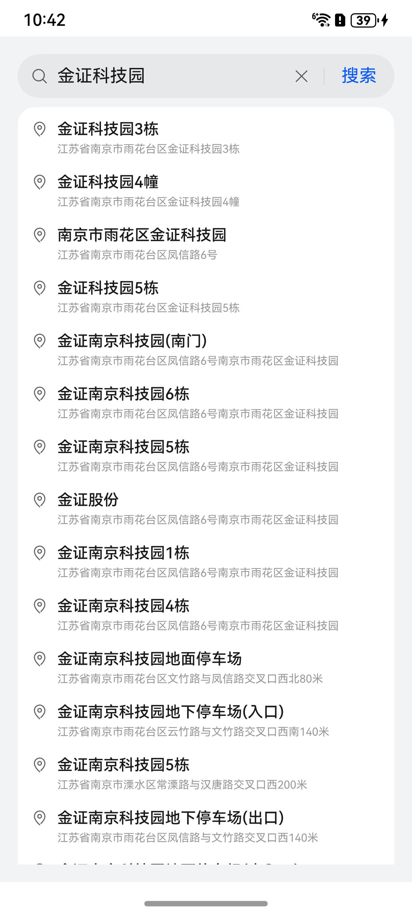

# 地址搜索联想补全组件快速入门

## 目录

- [简介](#简介)
- [约束与限制](#约束与限制)
- [快速入门](#快速入门)
- [API参考](#API参考)
- [示例代码](#示例代码)

## 简介

本组件提供了搜索词条的地址联想、自动补全功能，展示对应的真实地址列表。自定义点击事件、并实现搜索记录的持久化存储。
同时还可以设置默认文本展示与结果搜索。



## 约束与限制

### 环境

* DevEco Studio版本：DevEco Studio 5.0.0 Release及以上
* HarmonyOS SDK版本：HarmonyOS 5.0.0 Release SDK及以上
* 设备类型：华为手机（直板机）
* HarmonyOS版本：HarmonyOS 5.0.0 Release及以上

### 权限

无

## 快速入门

1. 安装组件。

   如果是在DevEvo Studio使用插件集成组件，则无需安装组件，请忽略此步骤。

   如果是从生态市场下载组件，请参考以下步骤安装组件。

   a. 解压下载的组件包，将包中所有文件夹拷贝至您工程根目录的XXX目录下。

   b. 在项目根目录build-profile.json5添加module_address_search模块。

   ```
   // 项目根目录下build-profile.json5填写module_address_search路径。其中XXX为组件存放的目录名
   "modules": [
      {
      "name": "module_address_search",
      "srcPath": "./XXX/module_address_search"
      }
   ]
   ```

   ```
   // 在项目根目录oh-package.json5中添加依赖
   "dependencies": {
      "module_address_search": "file:./XXX/module_address_search"
   }
   ```

2. 引入组件句柄。

   ```
   import { AddressSearch } from 'module_address_search';
   ```

3. 开始地址搜索。详细入参配置说明参见[API参考](#API参考)。

   ```
   AddressSearch({click: (address) => {}})
   ```

## API参考

### 子组件

无

### 接口

AddressSearch(options?:AddressSearchOptions)

地址搜索组件。

**参数：**

| 参数名     | 类型                                                | 必填 | 说明           |
|---------|---------------------------------------------------|----|--------------|
| options | [AddressSearchOptions](#AddressSearchOptions对象说明) | 否  | 配置地址搜索组件的参数。 |

### AddressSearchOptions对象说明

| 参数       | 类型                                               | 是否必填 | 说明     |
|----------|--------------------------------------------------|------|--------|
| textInit | string                                           | 否    | 初始搜索   |
| click    | (address: [IAddressInfo](#IAddressInfo)) => void | 否    | 点击回调事件 |


### IAddressInfo

搜索地址结果类型。

| 字段名             | 类型                                                                                                                     | 说明     |
|-----------------|------------------------------------------------------------------------------------------------------------------------|--------|
| siteId          | string                                                                                                                 | ID     |
| name            | string                                                                                                                 | 简称     |
| addr            | string                                                                                                                 | 全称     |
| location        | [mapCommon.LatLng](https://developer.huawei.com/consumer/cn/doc/harmonyos-references/map-common#section20691173773810) | 经纬度    |

## 示例代码

本示例通过AddressSearch地址搜索组件，实现地址搜索。

```
import { AddressSearch } from 'module_address_search';

@Entry
@ComponentV2
struct Index {
  build() {
    Column() {
      AddressSearch({
        textInit: '金证南京科技园',
        click: (address) => {
          AlertDialog.show({ alignment: DialogAlignment.Center, message: JSON.stringify(address, null, 2) })
        },
      })
    }
    .padding(16)
    .backgroundColor('#F1F3F5')
    .width('100%')
    .height('100%')
  }
}
```
