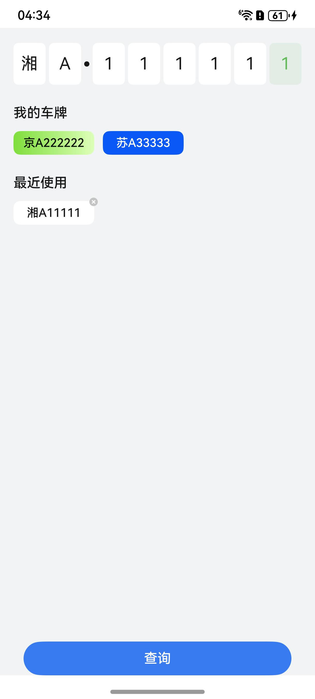

# 车牌查询组件快速入门

## 目录

- [简介](#简介)
- [约束与限制](#约束与限制)
- [快速入门](#快速入门)
- [API参考](#API参考)
- [示例代码](#示例代码)

## 简介

本组件提供了车牌号快速输入、点击查询等功能，包括我的车牌和最近使用车牌分类。




## 约束与限制

### 环境

* DevEco Studio版本：DevEco Studio 5.0.0 Release及以上
* HarmonyOS SDK版本：HarmonyOS 5.0.0 Release SDK及以上
* 设备类型：华为手机（直板机）
* HarmonyOS版本：HarmonyOS 5.0.0 Release及以上

### 权限

无

## 快速入门

1. 安装组件。

   如果是在DevEvo Studio使用插件集成组件，则无需安装组件，请忽略此步骤。

   如果是从生态市场下载组件，请参考以下步骤安装组件。

   a. 解压下载的组件包，将包中所有文件夹拷贝至您工程根目录的XXX目录下。

   b. 在项目根目录build-profile.json5添加module_license_keyboard模块。

   ```
   // 项目根目录下build-profile.json5填写module_license_keyboard路径。其中XXX为组件存放的目录名
   "modules": [
      {
      "name": "module_license_keyboard",
      "srcPath": "./XXX/module_license_keyboard"
      }
   ]
   ```

   ```
   // 在项目根目录oh-package.json5中添加依赖
   "dependencies": {
      "module_license_keyboard": "file:./XXX/module_license_keyboard"
   }
   ```

2. 引入组件句柄。

   ```
   import { QueryKeyboard } from 'module_license_keyboard';
   ```

3. 车牌查询显示。详细入参配置说明参见[API参考](#API参考)。

   ```
   QueryKeyboard({
      myLicenses: this.vm.licenseInfo.all,
      click: (license) => {
         RouterModule.push({ url: RouterMap.PAY_PAGE, param: license });
      },
   })
   ```

## API参考

### 子组件

无

### 接口

QueryKeyboard(options?: QueryKeyboardOptions)

车牌查询组件。

**参数：**

| 参数名     | 类型                                                | 必填 | 说明           |
|---------|---------------------------------------------------|----|--------------|
| options | [QueryKeyboardOptions](#QueryKeyboardOptions对象说明) | 否  | 配置车牌查询组件的参数。 |

### QueryKeyboardOptions对象说明

| 参数         | 类型                          | 是否必填 | 说明                 |
|------------|-----------------------------|------|--------------------|
| myLicenses | string[]                    | 否    | 我的车牌号码数组           |
| click      | (carNumber: string) => void | 否    | 查询按钮回调事件。车牌号码完整时触发 |
| curLicense | string                      | 否    | 初始显示车牌号码           |


### CommonKeyboard

通用车牌组件。

| 参数             | 类型                                                 | 是否必填 | 说明       |
|----------------|----------------------------------------------------|------|----------|
| intFocus       | boolean                                            | 否    | 初始是否激活键盘 |
| defaultNumbers | string                                             | 否    | 设置默认车牌显示 |
| onChange       | (carNumber: string[], isComplete: boolean) => void | 否    | 变化时回调操作  |


## 示例代码

本示例通过组件实现车牌号码的快速输入以及查询操作。

```
import { QueryKeyboard } from 'module_license_keyboard';

@Entry
@ComponentV2
struct Index {
  build() {
    Column() {
      QueryKeyboard({
        curLicense: '湘A111111',
        myLicenses: ['京A222222', '苏A33333'],
        click: (curLicense) => {
          AlertDialog.show({ alignment: DialogAlignment.Center, message: JSON.stringify(curLicense) })
        },
      })
    }
    .width('100%')
    .height('100%')
  }
}
```
