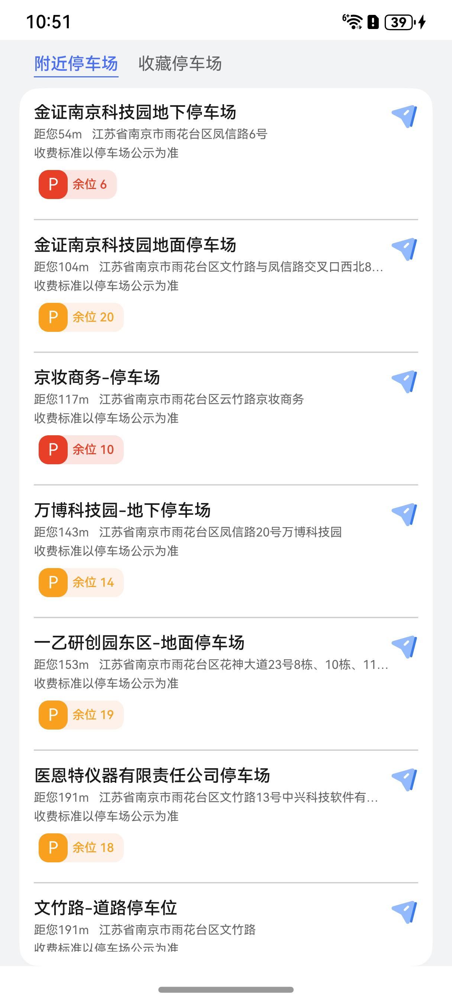

# 附近停车场组件快速入门

## 目录

- [简介](#简介)
- [约束与限制](#约束与限制)
- [快速入门](#快速入门)
- [API参考](#API参考)
- [示例代码](#示例代码)

## 简介

本组件提供了展示附近停车场和收藏停车场的功能，可通过下拉刷新、获取当前位置的附近停车场。



## 约束与限制

### 环境

* DevEco Studio版本：DevEco Studio 5.0.0 Release及以上
* HarmonyOS SDK版本：HarmonyOS 5.0.0 Release SDK及以上
* 设备类型：华为手机（直板机）
* HarmonyOS版本：HarmonyOS 5.0.0 Release及以上

### 权限

* 位置权限：ohos.permission.LOCATION
* 模糊位置权限：ohos.permission.APPROXIMATELY_LOCATION

## 快速入门

1. 安装组件。

   如果是在DevEvo Studio使用插件集成组件，则无需安装组件，请忽略此步骤。

   如果是从生态市场下载组件，请参考以下步骤安装组件。

   a. 解压下载的组件包，将包中所有文件夹拷贝至您工程根目录的XXX目录下。

   b. 在项目根目录build-profile.json5添加module_parking_base和module_parking_spots模块。

   ```
   // 项目根目录下build-profile.json5填写module_parking_spots路径。其中XXX为组件存放的目录名
   "modules": [
      {
      "name": "module_parking_base",
      "srcPath": "./XXX/module_parking_base"
      },
      {
      "name": "module_parking_spots",
      "srcPath": "./XXX/module_parking_spots"
      }
   ]
   ```

   ```
   // 在项目根目录oh-package.json5中添加依赖
   "dependencies": {
      "module_parking_spots": "file:./XXX/module_parking_spots"
   }
   ```

2. 引入组件句柄。

   ```
   import { SpotsTab } from 'module_parking_spots';
   ```

3. 展示停车场Tab。详细入参配置说明参见[API参考](#API参考)。

   ```
   SpotsTab({cardClick: (item) => {}})
   ```

## API参考

### 子组件

无

### 接口

SpotsTab(options?: SpotsTabOptions)

附近停车场组件。

**参数：**

| 参数名     | 类型                                      | 必填 | 说明            |
|---------|-----------------------------------------|----|---------------|
| options | [SpotsTabOptions](#SpotsTabOptions对象说明) | 否  | 配置附近停车场组件的参数。 |

### SpotsTabOptions对象说明

| 参数         | 类型                                              | 是否必填 | 说明        |
|------------|-------------------------------------------------|------|-----------|
| cardClick  | (item: [BasicParkInfo](#BasicParkInfo)) => void | 否    | 点击回调事件    |
| start      | boolean                                         | 否    | 页签左对齐或者居中 |
| space      | number                                          | 否    | 页签间隙      |
| offsetLeft | number                                          | 否    | 页签左对齐时左边距 |

### BasicParkInfo

停车场基本信息类型。

| 字段名             | 类型                                                                                                                     | 说明     |
|-----------------|------------------------------------------------------------------------------------------------------------------------|--------|
| siteId          | string                                                                                                                 | ID     |
| name            | string                                                                                                                 | 简称     |
| addr            | string                                                                                                                 | 全称     |
| location        | [mapCommon.LatLng](https://developer.huawei.com/consumer/cn/doc/harmonyos-references/map-common#section20691173773810) | 经纬度    |
| distance        | number                                                                                                                 | 距离     |
| totalSpots      | number                                                                                                                 | 总车位数   |
| leftSpots       | number                                                                                                                 | 剩余车位数  |
| chargeSpots     | number                                                                                                                 | 总充电位数  |
| leftChargeSpots | number                                                                                                                 | 剩余充电位数 |


## 示例代码

本示例通过本组件实现停车场的附近以及收藏分类显示。

```
import { SpotsTab } from 'module_parking_spots';

@Entry
@ComponentV2
struct Index {
  build() {
    Column() {
      SpotsTab({
        start: true,
        space: 16,
        offsetLeft: 28,
        cardClick: (item) => {
          AlertDialog.show({ alignment: DialogAlignment.Center, message: JSON.stringify(item, null, 2) })
        },
      })
    }
    .width('100%')
    .height('100%')
  }
}
```
