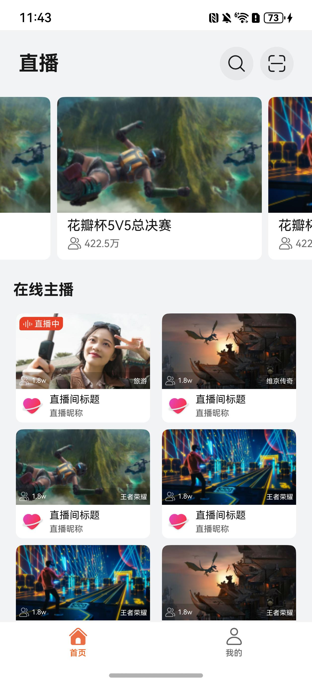
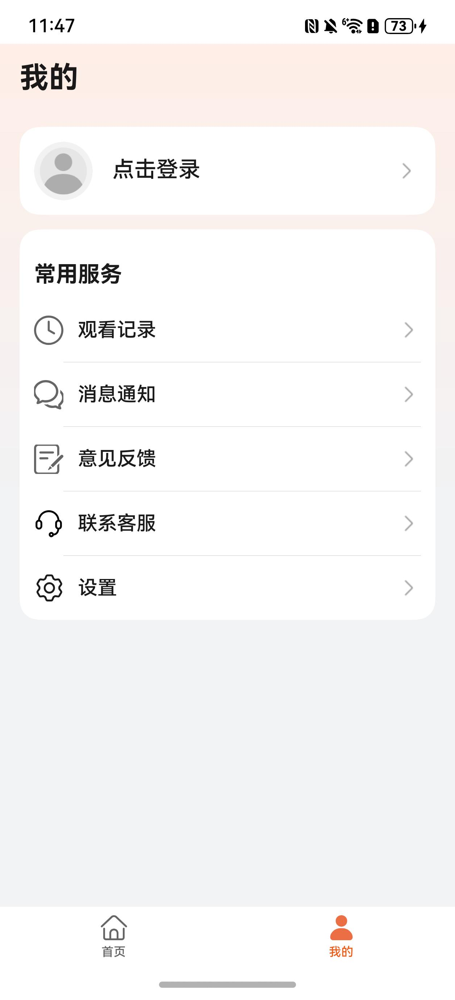
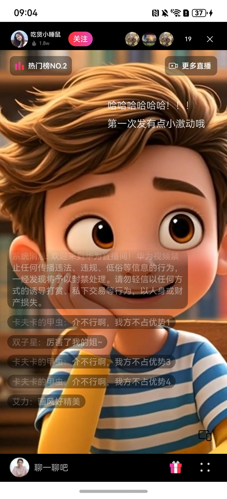
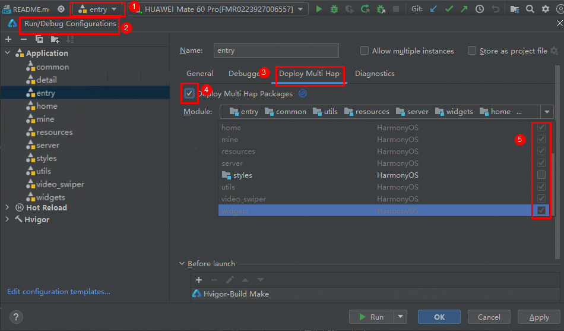

# 影视与直播（直播）应用模板快速入门

## 目录

- [功能介绍](#功能介绍)
- [约束和限制](#约束和限制)
- [快速入门](#快速入门)
- [示例效果](#示例效果)
- [开源许可协议](#开源许可协议)

## 功能介绍

您可以基于此模板直接定制应用，也可以挑选此模板中提供的多种组件使用，从而降低您的开发难度，提高您的开发效率。

此模板提供如下组件，所有组件存放在工程根目录的components下，如果您仅需使用组件，可参考对应组件的指导链接；如果您使用此模板，请参考本文档。

| 组件                       | 描述              | 使用指导                                             |
|--------------------------|-----------------|--------------------------------------------------|
| 直播互动(live_interaction)   | 包括直播信息，弹幕，聊天互动等 | [使用指导](components/live_interaction/README.md)    |


本模板为直播类应用提供了常用功能的开发样例，模板主要分首页、我的及详情播放页三大模块：

* 首页：提供直播推荐卡片功能，支持搜索和扫一扫。

* 我的：支持账号的管理和常用服务(消息通知/意见反馈)。

* 详情: 沉浸式观看直播，支持直播常用功能(上下滑切换直播，发送评论，赠送礼物等)

本模板已集成华为账号等服务，只需做少量配置和定制即可快速实现华为账号的登录功能。

| 首页                         | 我的                         | 详情                         |
|----------------------------|----------------------------|----------------------------|
|  |  |  |

本模板主要页面及核心功能如下所示：

```ts
直播模板
 |-- 首页
 |    |-- 轮播图
 |    |-- 卡片流
 |    |-- 搜索
 |    └-- 扫一扫
 |-- 我的
 |    |-- 用户登录
 |    |-- 用户主页
 |    |-- 观看记录
 |    |-- 消息通知
 |    |-- 意见反馈
 |    |-- 联系客服
 |    └-- 设置
 |         |-- 个人信息
 |         |-- 后台播放设置
 |         |-- 默认清晰度设置
 |         |-- 清除缓存
 |         |-- 版本检测
 |         |-- 关于我们
 |         └-- 退出登录
 └-- 详情
      |-- 直播信息
      |    |-- 主播信息
      |    |-- 更多直播
      |    └-- 观众人数
      |-- 互动信息
      |    |-- 点赞
      |    |-- 分享
      |    |-- 送礼
      |    └-- 评论
      └-- 更多设置
           |-- 切换全屏
           |-- 弹幕设置
           |-- 画中画
           |-- 清晰度
           |-- 举报
           └-- 清屏

```

本模板工程代码结构如下所示：

```ts
LiveStreaming
  |- commons                                       // 公共组件层
  |   |- common                                    // 公共层
  |   |- resources                                 // 资源管理层
  |   |- router_module                             // 路由管理层
  |   |- server                                    // 接口管理层
  |   |- styles                                    // 风格统一管理层
  |   |- utils                                     // 工具类层
  |   └- widgets                                   // 基础控件类层
  |
  |- components                                    // 组件       
  |   |- aggregated_payment                        // 支付组件
  |   |- feed_back                                 // 反馈组件
  |   |- live_interaction                          // 直播互动组件
  |   |- module_login                              // 登录组件
  |   |- module_share                              // 分享组件
  |   └- video_swiper                              // 滑动视频组件     
  |                      
  |- features    
  |   |- detail/src/main/ets                        // 详情播放功能(hsp)
  |   |        |- components                        // 抽离组件   
  |   |        |- models                            // class类型定义     
  |   |        |- page                                
  |   |        |    DetailPage.ets                  // 直播详情页面
  |   |        |- view                              // view组件   
  |   |        └- viewmodels                        // 与页面一一对应的vm层 
  |   | 
  |   |- home/src/main/ets                          // home主页组合(hsp)
  |   |        |- components                        // 抽离组件   
  |   |        |- models                            // 类型定义
  |   |        |- pages                               
  |   |        |    HomeMainPage.ets                // 主页页面
  |   |        |    SearchPage.ets                  // 搜索页面
  |   |        └- viewmodels                        // 与页面一一对应的vm层 
  |   | 
  |   └- mine/src/main/ets                          // 我的组合(hsp)
  |            |- component                         // 抽离组件   
  |            |- pages                               
  |            |    AboutPage.ets                   // 关于页面
  |            |    AuthenticationPage.ets          // 认证协议页面
  |            |    EditPersonalCenterPage.ets      // 个人信息修改页面
  |            |    FeedbackPage.ets                // 反馈页面
  |            |    FeedbackRecordPage.ets          // 反馈记录页面
  |            |    MessageCenterPage.ets           // 消息页面
  |            |    MinePage.ets                    // 我的页面
  |            |    NewFansMessagePage.ets          // 新增粉丝消息页面
  |            |    PrivacyAgreementPage.ets        // 隐私协议同意页面
  |            |    PrivacyPage.ets                 // 隐私协议页面
  |            |    PrivacyStatementPage.ets        // 隐私声明页面
  |            |    SetupPage.ets                   // 版本更新页面
  |            |    SystemMessagePage.ets           // 系统消息页面
  |            |    TermsOfServicePage.ets          // 用户服务协议页面
  |            |- utils                             // 抽离工具
  |            └- viewModel                         // 与页面对应的vm层
  |
  └- products/entry                                 // 应用层主包(hap)  
      └-  src/main/ets                                               
           |- common
           |    TabConstants.ets                    // 导航路由页面 
           |- entryability                          // Ability入口页面
           |- entryformability                      // 卡片Ability入口页面   
           |- model                                 // TabModel页面  
           |- pages                              
           |    Index.ets                           // 入口页面  
           |    LoginPage.ets                       // 登录页面  
           └- viewmodels                            // TabViewModel页面 
```
## 约束和限制

### 环境

- DevEco Studio版本：DevEco Studio 5.0.1 Release及以上
- HarmonyOS SDK版本：HarmonyOS 5.0.1 Release SDK及以上
- 设备类型：华为手机（直板机）
- HarmonyOS版本：HarmonyOS 5.0.0 Release及以上

### 权限

- 网络权限：ohos.permission.INTERNET

### 调试

本模板不支持模拟器调试，请使用真机调试

## 快速入门

### 配置工程

1. 在AppGallery Connect创建应用，将包名配置到模板中。

   a. 参考[创建HarmonyOS应用](https://developer.huawei.com/consumer/cn/doc/app/agc-help-create-app-0000002247955506)为应用创建APP ID，并将APP ID与应用进行关联。

   b. 返回应用列表页面，查看应用的包名。

   c. 将模板工程根目录下AppScope/app.json5文件中的bundleName替换为创建应用的包名。

2. 配置华为账号服务。

   a. 将应用的client ID配置到products/entry/src/main路径下的module.json5文件中，详细参考：[配置Client ID](https://developer.huawei.com/consumer/cn/doc/harmonyos-guides/account-client-id)。

   b. 申请华为账号一键登录所需的quickLoginMobilePhone权限，详细参考：[配置scope权限](https://developer.huawei.com/consumer/cn/doc/harmonyos-guides/account-config-permissions)。

3. 配置支付服务。

   华为支付当前仅支持商户接入，在使用服务前，需要完成商户入网、开发服务等相关配置，本模板仅提供了端侧集成的示例。详细参考：[支付服务接入准备](https://developer.huawei.com/consumer/cn/doc/harmonyos-guides/payment-preparations)。

4. 对应用进行[手工签名](https://developer.huawei.com/consumer/cn/doc/harmonyos-guides/ide-signing#section297715173233)。

5. 添加手工签名所用证书对应的公钥指纹。详细参考：[配置应用签名证书指纹](https://developer.huawei.com/consumer/cn/doc/app/agc-help-cert-fingerprint-0000002278002933)

### 运行调试工程

1. 连接调试手机和PC。

2. 配置多模块调试：由于本模板存在多个模块，运行时需确保所有模块安装至调试设备。

   a. 运行模块选择“entry”。

   b. 下拉框选择“Edit Configurations”，在“Run/Debug Configurations”界面，选择“Deploy Multi Hap”页签，勾选上模板中所有模块。

   

   c. 点击"Run"，运行模板工程。

## 示例效果

[功能展示录屏](./screenshots/功能展示录屏.mp4)

## 开源许可协议

该代码经过[Apache 2.0 授权许可](http://www.apache.org/licenses/LICENSE-2.0)。