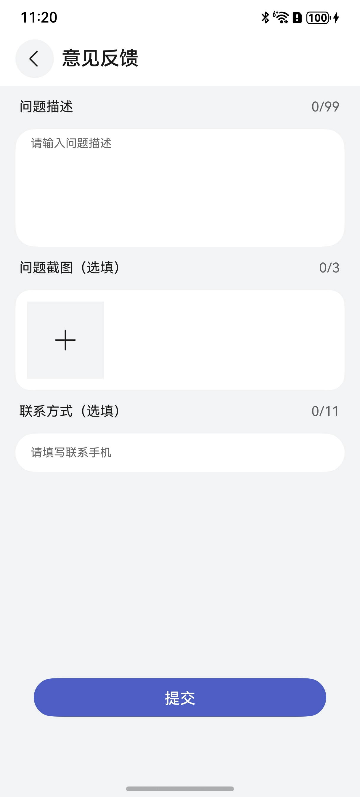

# 意见反馈组件快速入门

## 目录

- [简介](#简介)
- [使用](#使用)
- [API参考](#API参考)
- [示例代码](#示例代码)

## 简介

本组件提供了通用的自定义的意见反馈功能，数据有问题描述、多张问题截图、联系电话号码、提交时间，四种数据。
使用时可以传入想要的最大问题描述长度和最大问题截图数量，在使用处点提交按钮直接获取一条意见反馈的总数据，电话号码长度为11。开发者可以根据业务需要快速实现意见反馈功能。




## 使用

1. 安装组件。将模板根目录的components下feed_back目录拷贝至您的工程相应目录，在以下文件中增加配置。
   ```
   // 在项目根目录build-profile.json5填写feed_back路径
      "modules": [
         {
            "name": "feed_back",
            "srcPath": "./feed_back",
         }
      ]
   ```
   ```
   // 在entry目录下oh-package.json5填写依赖情况
   "dependencies": {
      "feed_back": "file:../feed_back"
   }
   ```

2. 引入组件。
   ```typescript
   import { Feedback } from 'feed_back';
   ```

3. 调用组件，详细参数配置说明参见[API参考](#API参考)
   ```typescript
   import { Feedback } from "feed_back"
    @Entry
    @ComponentV2
    export struct Index {
      build() {
        Column() {
          Feedback()
        }
        .width('100%')
        .height('100%')
      }
    }

## API参考

### 子组件

1、问题描述
FeedDes(){}

2、问题截图
FeedPic(){}

3、联系电话
FeedPhone(){}

### 接口

1、Feedback({ des?:string, num?:string , butOnClick: () => void = () => {} })

**参数：**

| 参数名 | 类型     | 必填 | 说明       |
|:----|:-------|:---|:---------|
| des | number | 否  | 最大问题描述长度 |
| num | number | 否  | 最大问题截图数量 | | 否  | 应用路由栈                                                                                                                           | 是  | 应用隐私协议名称                                                                                                                        | | 否  | 应用路由栈                                                                                                                           |

### 事件

支持以下事件：

#### butOnClick

butOnClick:  () => void = () => {}

点击提交按钮时返回一条完整的意见反馈数据。

## 示例代码

   ```
   import { Feedback } from "feed_back"
    @Entry
    @ComponentV2
    export struct Index {
      build() {
        Column() {
          Feedback()
        }
        .width('100%')
        .height('100%')
      }
    }
   ```
