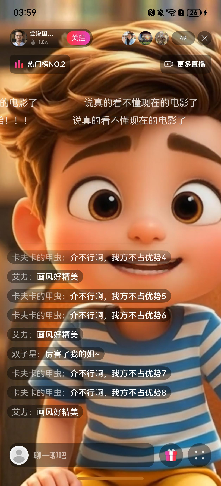
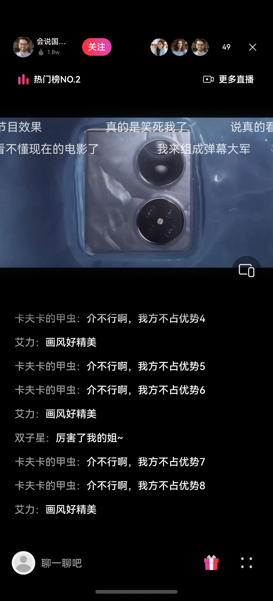
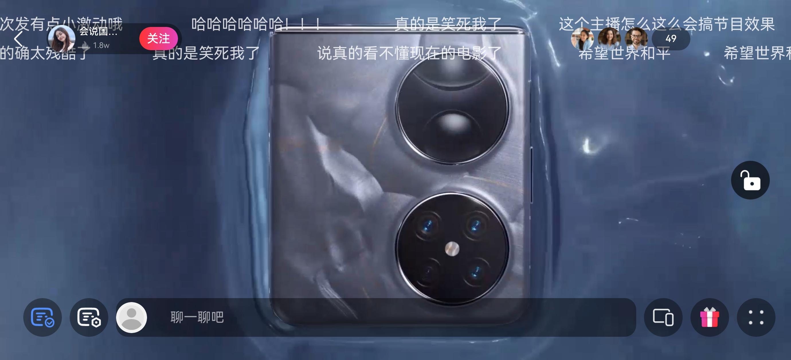

# 直播互动组件快速入门

## 目录

- [简介](#简介)
- [约束与限制](#约束与限制)
- [快速入门](#快速入门)
- [API参考](#API参考)
- [示例代码](#示例代码)

## 简介

本组件提供了显示和查看直播信息、弹幕、聊天互动、点赞、送礼、分享、清晰度设置、画中画、举报、清屏等相关的能力，通过将直播页面划分为顶部功能区、
运营区、直播画面、消息互动区、底部功能区五个部分，开发者可以根据业务需要快速集成直播互动相关的能力。



## 约束与限制

### 环境

* DevEco Studio版本：DevEco Studio 5.0.0 Release及以上
* HarmonyOS SDK版本：HarmonyOS 5.0.0 Release SDK及以上
* 设备类型：华为手机（直板机）
* HarmonyOS版本：HarmonyOS 5.0.0 Release及以上

### 权限

无

## 快速入门

1. 安装组件。

   如果是在DevEvo Studio使用插件集成组件，则无需安装组件，请忽略此步骤。

   如果是从生态市场下载组件，请参考以下步骤安装组件。

   a. 解压下载的组件包，将包中所有文件夹拷贝至您工程根目录的XXX目录下。

   b. 在项目根目录build-profile.json5添加live_interaction和module_share模块。

   ```
   // 在项目根目录build-profile.json5填写live_interaction和module_share路径。其中XXX为组件存放的目录名
      "modules": [
         {
            "name": "live_interaction",
            "srcPath": "./XXX/live_interaction",
         },
         {
            "name": "module_share",
            "srcPath": "./XXX/module_share",
         }
      ]
   ```

   c. 在entry模块oh-package.json5填写live_interaction依赖。

   ```
   // 在entry模块oh-package.json5填写live_interaction依赖。其中XXX为组件存放的目录名
   "dependencies": {
      "live_interaction": "../../XXX/live_interaction"
   }
   ```

2. 引入组件。
   ```typescript
   
   import { FullScreenLayer, LiveInteractionMgr, VerticalScreenLayer } from 'live_interaction';
   
   ```

3. 调用组件，详细参数配置说明参见[API参考](#API参考)。
   ```typescript
   import { FullScreenLayer, LiveInteractionMgr } from "live_interaction"
    @Entry
    @ComponentV2
    export struct Index {
      liveInteractionMgr: LiveInteractionMgr = new LiveInteractionMgr()
      build() {
        Column() {
          FullScreenLayer({ interactionMgr: this.liveInteractionMgr })
        }
        .width('100%')
        .height('100%')
      }
    }
   ```

## API参考

### 接口

VerticalScreenLayer({ interactionMgr: LiveInteractionMgr })

FullScreenLayer({ interactionMgr: LiveInteractionMgr })

**参数：**

| 参数名 | 类型                                        | 是否必填 | 说明    |
|:----|:------------------------------------------|:---|:------|
| interactionMgr | [LiveInteractionMgr](#LiveInteractionMgr) | 是  | 接口数据类 |

### LiveInteractionMgr

**参数说明：**

| 参数名                    | 类型                                        | 是否必填 | 说明                  |
|:-----------------------|:------------------------------------------|:---|:--------------------|
| onComment              | onComment: Function = () => {} | 否  | 消息互动发送消息或评论事件       |
| onLiveClick            | onLiveClick: Function = (card: LiveCard) => {} | 否  | 点击更多直播页面卡片进入其他直播间事件 |
| onExit                 | onExit: Function = () => {} | 否  | 返回上一个页面事件           |
| onProfileClick         | onProfileClick: Function = (id: string): void => {} | 否  | 点击进入用户个人主页事件        |
| onFullScreen           | onFullScreen: Function = () => {} | 否  | 直播横屏与直播竖屏切换事件       |
| onAddFollowingClick    | onAddFollowingClick: Function = (id: string) => {} | 否  | 添加一个我的关注事件          |
| onDeleteFollowingClick | onDeleteFollowingClick: Function = (id: string) => {} | 否  | 删除一个我的关注事件          |
| onLike                 | onLike: Function = () => {} | 否  | 用户点赞事件              |
| onGetMoreAudience      | onGetMoreAudience: Function = () => {} | 否  | 获取房间观众列表事件          |
| onGetMoreLives          | onGetMoreLives: Function = () => {} | 否  | 获取更多直播列表事件          |
| onChangeResolution     | onChangeResolution: Function = () => {} | 否  | 切换直播画面清晰度事件         |
| onReport               | onReport: Function = () => {} | 否  | 举报当前直播内容并获取举报原因事件   |
| onClearScreen          | onClearScreen: Function = () => {} | 否  | 清屏事件                |
| onPip                  | onPip: Function = () => {} | 否  | 进入画中画播放模式事件         |
| onCheckLogin           | onCheckLogin: Function = () => {} | 否  | 检查用户是否登录事件          |
| onGetLoginUserInfo     | onGetLoginUserInfo: Function = () => {} | 否  | 获取用户登录信息事件          |
| onLogin                | onLogin: Function = () => {} | 否  | 用户登录事件              |
| onPay                  | onPay: Function = (item: GiftModel) => {} | 否  | 用户送礼物拉起支付事件         |
| setPresenter           | setPresenter(presenter: Audience) | 否  | 获取当前直播信息            |
| setAudience            | setAudience(audiences: Audience[]) | 否  | 获取当前直播观众列表          |
| addSystemChat          | addSystemChat(message: string) | 否  | 设置系统消息              |
| addNormalChat          | addNormalChat(chat: BaseChatMessage) | 否  | 设置聊天互动消息            |

## 示例代码

   ```
   import { common } from '@kit.AbilityKit';
   import { promptAction, window } from '@kit.ArkUI';
   import {
     Audience,
     FullScreenLayer,
     GiftModel,
     LiveInteractionMgr,
     LiveItem,
     MoreLiveCard,
     PreferType,
     VerticalScreenLayer
   } from 'live_interaction';
   import { hilog } from '@kit.PerformanceAnalysisKit';
   import { SimpleChat } from 'live_interaction';
   
   const TAG = '[VerticalScreenComponent]'
   const PORTRAIT = 0
   const LANDSCAPE = 1
   
   @Entry
   @ComponentV2
   export struct Index {
     liveInteractionMgr: LiveInteractionMgr = new LiveInteractionMgr()
     @Local showControl: boolean = true // 用于控制清屏
     @Local screenDirection: number = 0 // 0：竖屏 1：横屏
     @Local isShowMoreSettings: boolean = false
     private context = this.getUIContext().getHostContext() as common.UIAbilityContext;
     private windowClass = (this.context as common.UIAbilityContext).windowStage.getMainWindowSync()
     @Local payItem: GiftModel = new GiftModel('', '', 0, 0)
     @Local preferType: PreferType = PreferType.LANDSCAPE
     restoreDirection: number = 0
   
     setOrientation(orientation: number) {
       this.windowClass.setPreferredOrientation(orientation)
     }
   
     changeOrientation() {
       if (this.screenDirection === PORTRAIT) {
         this.setOrientation(window.Orientation.USER_ROTATION_LANDSCAPE)
         this.windowClass.setWindowSystemBarEnable([])
         this.screenDirection = LANDSCAPE
       } else {
         this.setOrientation(window.Orientation.USER_ROTATION_PORTRAIT)
         this.windowClass.setWindowSystemBarEnable(['status', 'navigation'])
         this.screenDirection = PORTRAIT
         this.liveInteractionMgr.addSystemChat('欢迎来到华为直播间！华为视频禁止任何传播违法、违规、低俗等信息的行为，' +
           '一经发现将予以封禁处理。请勿轻信以任何方式的诱导打赏、私下交易等行为，以人身或财产损失。')
         let chat1 = new SimpleChat('卡夫卡的甲虫', '介不行啊，我方不占优势1')
         chat1.like = true
         chat1.fans = true
         chat1.fanName = '无限荣耀'
         chat1.fanLevel = 10
         chat1.pay = true
         chat1.payLevel = 3
         this.liveInteractionMgr.addNormalChat(chat1)
         this.liveInteractionMgr.addNormalChat(new SimpleChat('双子星', '厉害了我的姐~'))
         this.liveInteractionMgr.addNormalChat(new SimpleChat('卡夫卡的甲虫', '介不行啊，我方不占优势3'))
         this.liveInteractionMgr.addNormalChat(new SimpleChat('卡夫卡的甲虫', '介不行啊，我方不占优势4'))
         this.liveInteractionMgr.addNormalChat(new SimpleChat('艾力', '画风好精美'))
         this.liveInteractionMgr.addNormalChat(new SimpleChat('双子星', '厉害了我的姐~'))
       }
     }
   
     aboutToAppear() {
       this.liveInteractionMgr.presenter = new Audience('1', '', '离离原上草', '喜欢旅游', [], [], 10, 0, false)
       this.liveInteractionMgr.setAudience([
         new Audience('2', '', '苏苏', '吃吃吃', [], [], 20, 1, true),
         new Audience('3', '', '李白', '诗人', [], [], 10, 0, false)
       ])
       this.liveInteractionMgr.onComment = () => {
         // 用户在这里自定义实现发送消息或评论
         promptAction.showToast({ message: '用户自定义实现发送消息或评论' })
         hilog.info(0x000, TAG, 'onComment')
       }
       this.liveInteractionMgr.onLiveClick = () => {
         // 用户在这里自定义实现点击更多直播页面卡片进入其他直播间
         promptAction.showToast({ message: '用户自定义实现进入其他直播间' })
         hilog.info(0x000, TAG, 'onLiveClick')
       }
       this.liveInteractionMgr.onExit = () => {
         // 用户在这里自定义实现点击返回上一个页面
         promptAction.showToast({ message: '用户自定义实现返回上一个页面' })
         hilog.info(0x000, TAG, 'onExit')
       }
       this.liveInteractionMgr.onProfileClick = () => {
         // 用户在这里自定义实现点击进入个人主页
         promptAction.showToast({ message: '用户自定义实现进入个人主页' })
         hilog.info(0x000, TAG, 'onProfileClick')
       }
       this.liveInteractionMgr.onFullScreen = () => {
         // 横竖屏切换，用户也可以自定义实现效果
         this.changeOrientation()
       }
       this.liveInteractionMgr.onAddFollowingClick = () => {
         hilog.info(0x000, TAG, 'onAddFollowingClick')
       }
       this.liveInteractionMgr.onDeleteFollowingClick = () => {
         hilog.info(0x000, TAG, 'onDeleteFollowingClick')
       }
       this.liveInteractionMgr.onLike = () => {
         hilog.info(0x000, TAG, 'onLike')
       }
       this.liveInteractionMgr.onGetMoreLives = (): MoreLiveCard[] => {
         return this.getMoreLives()
       }
       this.liveInteractionMgr.onChangeResolution = (resolution: string) => {
         this.liveInteractionMgr.resolution = resolution
         hilog.info(0x000, TAG, 'onChangeResolution')
       }
       this.liveInteractionMgr.onReport = (reasons: Array<string>) => {
         this.liveInteractionMgr.reason = reasons
         hilog.info(0x000, TAG, 'onReport')
       }
       this.liveInteractionMgr.onClearScreen = (isClear: boolean) => {
         hilog.info(0x000, TAG, 'onClearScreen:' + isClear)
       }
       this.liveInteractionMgr.onPip = () => {
         // 用户在这里自定义实现点击进入画中画播放模式
         promptAction.showToast({ message: '用户自定义实现进入画中画播放模式' })
         hilog.info(0x000, TAG, 'onPip')
       }
       this.liveInteractionMgr.onCheckLogin = () => {
         // 用户在这里自定义实现点击检查用户是否登录
         promptAction.showToast({ message: '用户自定义实现检查用户是否登录' })
         return true
       }
       this.liveInteractionMgr.onGetLoginUserInfo = () => {
         // 用户在这里自定义实现获取用户登录信息
         promptAction.showToast({ message: '用户自定义实现获取用户登录信息' })
         hilog.info(0x000, TAG, 'onGetLoginUserInfo')
       }
       this.liveInteractionMgr.onLogin = () => {
         // 用户在这里自定义实现登录
         promptAction.showToast({ message: '用户自定义实现登录' })
         hilog.info(0x000, TAG, 'onLogin')
       }
       this.liveInteractionMgr.onPay = (item: GiftModel) => {
         // 用户在这里自定义实现送礼物拉起支付
         promptAction.showToast({ message: '用户自定义实现送礼物拉起支付' })
         hilog.info(0x000, TAG, 'onPay')
       }
       this.liveInteractionMgr.defaultResolution = '1080P 原画（高帧率）'
       this.liveInteractionMgr.rankList = this.getRankList()
       this.liveInteractionMgr.rankId = 2
       this.liveInteractionMgr.addSystemChat('欢迎来到华为直播间！华为视频禁止任何传播违法、违规、低俗等信息的行为，' +
         '一经发现将予以封禁处理。请勿轻信以任何方式的诱导打赏、私下交易等行为，以人身或财产损失。')
       let chat1 = new SimpleChat('卡夫卡的甲虫', '介不行啊，我方不占优势1')
       chat1.like = true
       chat1.fans = true
       chat1.fanName = '无限荣耀'
       chat1.fanLevel = 10
       chat1.pay = true
       chat1.payLevel = 3
       this.liveInteractionMgr.addNormalChat(chat1)
       this.liveInteractionMgr.addNormalChat(new SimpleChat('双子星', '厉害了我的姐~'))
       this.liveInteractionMgr.addNormalChat(new SimpleChat('卡夫卡的甲虫', '介不行啊，我方不占优势3'))
       this.liveInteractionMgr.addNormalChat(new SimpleChat('卡夫卡的甲虫', '介不行啊，我方不占优势4'))
       this.liveInteractionMgr.addNormalChat(new SimpleChat('艾力', '画风好精美'))
       this.liveInteractionMgr.addNormalChat(new SimpleChat('卡夫卡的甲虫', '介不行啊，我方不占优势5'))
       this.liveInteractionMgr.addNormalChat(new SimpleChat('卡夫卡的甲虫', '介不行啊，我方不占优势6'))
       this.liveInteractionMgr.addNormalChat(new SimpleChat('艾力', '画风好精美'))
       this.liveInteractionMgr.addNormalChat(new SimpleChat('双子星', '厉害了我的姐~'))
       this.liveInteractionMgr.addNormalChat(new SimpleChat('卡夫卡的甲虫', '介不行啊，我方不占优势7'))
       this.liveInteractionMgr.addNormalChat(new SimpleChat('卡夫卡的甲虫', '介不行啊，我方不占优势8'))
       this.liveInteractionMgr.addNormalChat(new SimpleChat('艾力', '画风好精美'))
       this.liveInteractionMgr.setGiftData(giftData)
     }
   
   
     build() {
       Stack() {
         if (this.screenDirection === PORTRAIT) {
           VerticalScreenLayer({
             preferType: this.preferType,
             interactionMgr: this.liveInteractionMgr
           })
         } else {
           FullScreenLayer({
             interactionMgr: this.liveInteractionMgr
           })
         }
       }
       .backgroundColor('#000')
       .height('100%')
       .width('100%')
     }
   
     showToast(message: string) {
       try {
         this.getUIContext().getPromptAction().showToast({
           message: message,
           duration: 2000
         });
       } catch (error) {
         //在此处进行异常处理
       }
     }
   
     getMoreLives() {
       let cardsData: Array<MoreLiveCard> = [
         {
           cover: 'app.media.cover_3',
           title: '旅行vlog直播',
           watching: 10000,
           category: '旅游',
           streamer: 'Leo在路上',
         } as MoreLiveCard,
         {
           cover: 'app.media.cover_4',
           title: '新版本BOSS速通',
           watching: 16666,
           category: '维京传奇',
           streamer: '暴躁桃子',
         } as MoreLiveCard,
         {
           cover: 'app.media.cover_1',
           title: '游戏冲榜',
           watching: 18100,
           category: '王者荣耀',
           streamer: '轩哥开黑',
         } as MoreLiveCard,
         {
           cover: 'app.media.cover_2',
           title: '美食速递',
           watching: 666,
           category: '美食',
           streamer: '小雅吃',
         } as MoreLiveCard,
         {
           cover: 'app.media.cover_2',
           title: '外卖盲盒挑战',
           watching: 1800,
           category: '美食',
           streamer: '姜姜吃不胖',
         } as MoreLiveCard,
         {
           cover: 'app.media.cover_4',
           title: '弹唱网友点歌',
           watching: 1314,
           category: '唱歌',
           streamer: '吉他老张',
         } as MoreLiveCard,
         {
           cover: 'app.media.cover_3',
           title: '监狱跑刀',
           watching: 78787878,
           category: '三角洲行动',
           streamer: '老飞鱼66',
         } as MoreLiveCard,
         {
           cover: 'app.media.cover_3',
           title: 'Excel函数速成',
           watching: 1919,
           category: '学习',
           streamer: '职场小达人',
         } as MoreLiveCard,
         {
           cover: 'app.media.cover_4',
           title: '15分钟燃脂训练',
           watching: 999,
           category: '运动',
           streamer: '健身小熊',
         } as MoreLiveCard,
         {
           cover: 'app.media.cover_1',
           title: '学生党闭眼入评测',
           watching: 114514,
           category: '数码',
           streamer: '赛博阿力',
         } as MoreLiveCard
       ]
       return cardsData
     }
   
     getRankList() {
       let rankList: Array<LiveItem> = [
         new LiveItem(1, $r('app.media.image_bai'), '李苏苏', '美食', 88000, 750000),
         new LiveItem(2, $r('app.media.image_hui'), '扎克王', '英雄联盟', 79000, 700000),
         new LiveItem(3, $r('app.media.image_yu'), '不知名网友', '炉石传说', 66000, 600000),
         new LiveItem(4, $r('app.media.image_ti'), '山山而川', '旅游', 50000, 500000),
         new LiveItem(5, $r('app.media.image_labubu'), '止戈', '英雄联盟', 42000, 400000),
         new LiveItem(6, $r('app.media.image_chi'), '枪王之王', '和平精英', 30000, 360000),
         new LiveItem(7, $r('app.media.image_yu'), '世界之大', '旅游', 18000, 300000),
         new LiveItem(8, $r('app.media.image_bai'), '小白兔奶糖', '二次元', 12000, 200000),
         new LiveItem(9, $r('app.media.image_hui'), '上分哥', '王者荣耀', 9888, 120000),
         new LiveItem(10, $r('app.media.image_ti'), '我是小白', '和平精英', 6550, 50000),
       ]
       return rankList
     }
   }
   
   export const giftData: Array<GiftModel> = [
     new GiftModel('小心心', $r('app.media.likes'), 1, 0),
     new GiftModel('奖励撒花', $r('app.media.celebrate'), 5, 1),
     new GiftModel('小心心', $r('app.media.likes'), 1, 2),
     new GiftModel('小心心', $r('app.media.likes'), 1, 3),
     new GiftModel('小心心', $r('app.media.likes'), 1, 4),
     new GiftModel('奖励撒花', $r('app.media.celebrate'), 5, 5),
     new GiftModel('小心心', $r('app.media.likes'), 1, 6),
     new GiftModel('小心心', $r('app.media.likes'), 1, 7)
   ];
   ```

直播竖屏模式如下图所示。



直播横屏模式如下图所示。


