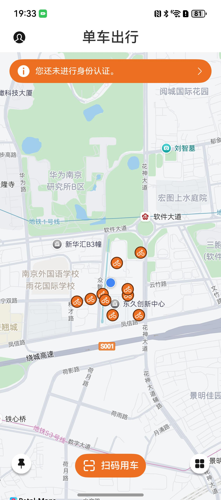
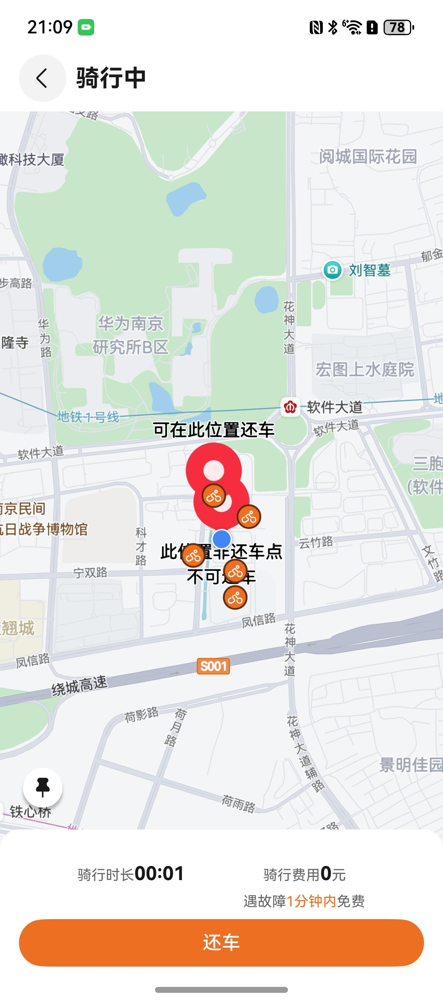

# 出行导航（单车）应用模板快速入门

## 目录

- [功能介绍](#功能介绍)
- [环境要求](#环境要求)
- [快速入门](#快速入门)
- [示例效果](#示例效果)
- [权限要求](#权限要求)
- [开源许可协议](#开源许可协议)

## 功能介绍

本模板为单车出行应用提供了常用功能的开发样例，模板主要分主页、我的两大模块：

- 主页：主要提供地图定位、扫码用车、更多服务等功能。

- 我的：登录/退出登录、编辑个人信息、查看骑行记录等功能。

本模板已集成华为账号、地图导航、定位、原生扫码等服务，只需做少量配置和定制即可快速实现华为账号的登录、位置定位等功能，从而快速完成相关功能的实现。


| 主页                                                  | 我的                                                     |
|-----------------------------------------------------|--------------------------------------------------------|
|  |  |


本模板主要页面及核心功能如下所示：

```ts
单车出行模板
 |-- 主页
 |    |-- 地图定位
 |    |-- 扫码用车
 |    |     |-- 扫描二维码
 |    |     └-- 手动输入
 |    └-- 更多服务
 |          |-- 故障申报
 |          |-- 电话客服
 |          |-- 意见反馈
 |          └-- 用户指南
 └-- 我的
      |-- 用户信息
      |     |-- 编辑个人信息
      |     └-- 实名认证
      └-- 骑行记录
      └-- 设置
            └-- 隐私政策
```

本模板工程代码结构如下所示：

```ts
BikeTravel
├── commons
│   └── common/src/main/ets
│       ├── constant
│       │   └── BikeConstants.ets          // 单车常量
│       ├── enum
│       │   └── CommonEnum.ets             // 枚举常量
│       ├── model
│       │   ├── BikeState.ets              // 单车状态模型
│       │   ├── MoreServicesModel.ets      // 更多服务模型
│       │   └── UserInfo.ets               // 用户信息模型
│       └── utils
│           ├── ActionSheet.ets            // 底部弹窗
│           ├── DayFormat.ets              // 日期格式
│           ├── GlobalContext.ets          // 全局上下文
│           ├── Logger.ets                 // 日志
│           ├── MapUtils.ets               // 地图工具
│           ├── PermissionUtil.ets         // 权限
│           ├── ScanUtils.ets              // 扫码
│           ├── Toast.ets                  // 提示
│           ├── bufferToString.ets         // 缓冲转字符串
│           └── getDataFromJSON.ets        // JSON解析
├── entry
│   └── src/main/ets
│       ├── entryability
│       │   └── Entryability.ets           // UIAbility实例
│       ├── entrybackupability
│       │   └── Entrybackupability.ets     // 备份实例
│       └── pages
│           └── Index.ets                  // 页面路由
└── feature
    ├── bike_home/src/main/ets
    │   ├── components
    │   │   ├── UserGuideContent.ets       // 用户指南内容
    │   │   └── UserGuideItem.ets          // 用户指南项
    │   ├── model
    │   │   └── GuidePageModel.ets         // 引导模型
    │   ├── pages
    │   │   ├── CustomScanPage.ets         // 自定义扫码
    │   │   ├── Cycling.ets                // 骑行页
    │   │   ├── HomePage.ets               // 主页
    │   │   └── ManualInput.ets            // 手动输入
    │   └── views
    │       ├── FaultReportingPage.ets     // 故障反馈页面
    │       ├── FeedbackPage.ets           // 问题反馈页面
    │       └── UserGuidePage.ets          // 用户指南页面
    └── bike_mine/src/main/ets
        ├── components
        │   ├── CardID.ets                 // 身份证数据
        │   ├── CycleRecordCard.ets        // 骑行记录
        │   ├── PrivacyCard.ets            // 隐私政策卡片
        │   ├── SelectAvatarCard.ets       // 头像选择图标
        │   └── UserInfoCard.ets           // 用户信息卡片
        ├── mockData
        │   └── CycleRecordData.ets        // 骑行记录数据
        └── pages
            ├── BackID.ets                 // 身份证背面
            ├── CycleRecord.ets            // 骑行记录
            ├── DataCollectionPage.ets     // 第三方数据收集页面
            ├── DataSharingPage.ets        // 用户数据共享页面
            ├── FrontID.ets                // 身份证正面
            ├── LoginWithHuaweiIDComponent.ets   // 华为账号登录组件
            ├── MinePage.ets               // 我的页面
            ├── PersonalInfo.ets           // 个人资料
            ├── PrivacyPolicyPage.ets      // 隐私政策页面
            ├── RealNameAuth.ets           // 实名认证
            ├── SettingPage.ets            // 设置页面
            ├── TripDetail.ets             // 行程详情
            └── UserAgreementPage.ets      // 用户协议页面
```

## 约束与限制

### 环境

* DevEco Studio版本：DevEco Studio 5.0.1 Release及以上
* HarmonyOS SDK版本：HarmonyOS 5.0.1 Release SDK及以上
* 设备类型：华为手机（直板机）
* HarmonyOS版本：HarmonyOS 5.0.1 Release及以上

### 调试

本模板不支持使用模拟器调试，请使用真机进行调试。

## 快速入门

### 配置工程

在运行此模板前，需要完成以下配置：

1. 在AppGallery Connect创建应用，将包名配置到模板中。

   a. 参考[创建HarmonyOS应用](https://developer.huawei.com/consumer/cn/doc/app/agc-help-create-app-0000002247955506)为应用创建APP ID，并将APP ID与应用进行关联。

   b. 返回应用列表页面，查看应用的包名。

   c. 将模板工程根目录下AppScope/app.json5文件中的bundleName替换为创建应用的包名。

2. 配置华为账号服务。

   a. 将应用的client ID配置到entry/src/main路径下的module.json5文件中，详细参考：[配置Client ID](https://developer.huawei.com/consumer/cn/doc/harmonyos-guides/account-client-id)。

   b. 申请华为账号一键登录所需的quickLoginMobilePhone权限，详细参考：[配置scope权限](https://developer.huawei.com/consumer/cn/doc/harmonyos-guides/account-config-permissions)。

3. 配置地图服务。

   a. 将应用的client ID配置到entry/src/main路径下的module.json5文件，如果华为账号服务已配置，可跳过此步骤。

   b. 添加公钥指纹，如果华为账号服务已配置，可跳过此步骤。

   c. [开通地图服务](https://developer.huawei.com/consumer/cn/doc/harmonyos-guides/map-config-agc)。

4. 对应用进行[手工签名](https://developer.huawei.com/consumer/cn/doc/harmonyos-guides/ide-signing#section297715173233)。

5. 添加手工签名所用证书对应的公钥指纹。详细参考：[配置应用签名证书指纹](https://developer.huawei.com/consumer/cn/doc/app/agc-help-cert-fingerprint-0000002278002933)

### 运行调试工程

1. 连接调试手机和PC。

2. 菜单选择“Run > Run 'entry' ”或者“Run > Debug 'entry' ”，运行或调试模板工程。

## 示例效果

1. 主页

| 地图定位                                                  | 骑行中                                                |
|-------------------------------------------------------|----------------------------------------------------|
|  |  |

2. 我的

| 我的                                                     | 个人信息                                                |
|--------------------------------------------------------|-----------------------------------------------------|
|  |  |


## 权限要求

- 网络权限：ohos.permission.INTERNET、ohos.permission.GET_NETWORK_INFO
- 位置权限：ohos.permission.LOCATION、ohos.permission.APPROXIMATELY_LOCATION
- 摄像头权限：ohos.permission.CAMERA

## 开源许可协议

该代码经过[Apache 2.0 授权许可](http://www.apache.org/licenses/LICENSE-2.0)。
