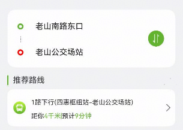
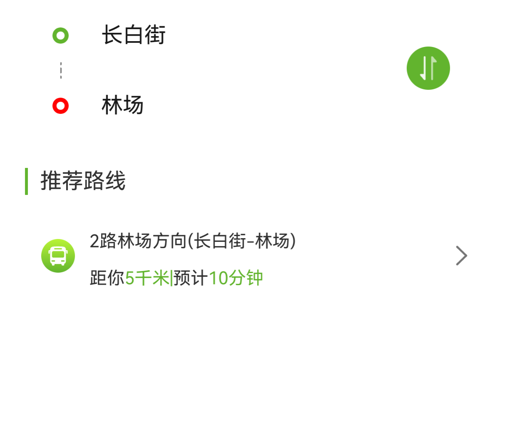

# 公交路线搜索组件快速入门

## 目录

- [简介](#简介)
- [约束与限制](#约束与限制)
- [快速入门](#快速入门)
- [API参考](#API参考)
- [示例代码](#示例代码)

# 简介

本组件提供了展示公交路线搜索结果的相关功能。



# 约束与限制

## 环境

* DevEco Studio版本：DevEco Studio 5.0.0 Release及以上
* HarmonyOS SDK版本：HarmonyOS 5.0.0 Release SDK及以上
* 设备类型：华为手机（直板机）
* HarmonyOS版本：HarmonyOS 5.0.0 Release及以上

# 快速入门

1. 安装组件。

   如果是在DevEvo Studio使用插件集成组件，则无需安装组件，请忽略此步骤。

   如果是从生态市场下载组件，请参考以下步骤安装组件。

   a. 解压下载的组件包，将包中所有文件夹拷贝至您工程根目录的XXX目录下。

   b. 在项目根目录build-profile.json5添加route_search模块。

   ```typescript
   // 在项目根目录build-profile.json5填写route_search路径。其中XXX为组件存放的目录名
   "modules": [
    { 
      "name": "route_search",
      "srcPath": "./xxx/route_search",
    }
   ]
   ```
   c. 在项目根目录oh-package.json5中添加依赖。

   ```typescript
   // XXX为组件存放的目录名称
   "dependencies":
   {
      "route_search": "file:../xxx/route_search"
   }
   ```

2. 引入组件与公交路线搜索组件句柄。

   ```typescript
   import { LineInfo, RouteSearch } from 'route_search'
   ```
3. 调用组件，详细参数配置说明参见[API参考](#API参考)。

   ```typescript
   RouteSearch({
     defaultStartText: this.startText,
     defaultEndText: this.endText,
     lineInfo: this.lineInfo,
     onInputChange: (value: string, index: number) => {
       this.inputChange(value, index)
      },
     clickInput: (index: number) => {
       this.clickInput(index)
      },
     clickListItem: (lineItem: LineInfo) => {
       this.clickListItem(lineItem)
      }
   })
   ```

# API参考

## 接口

RouteSearch(options?: RouteSearchOptions)

公交路线搜索组件。

**参数：**

| 参数名     | 类型                                            | 必填 | 说明                 |
|---------|-----------------------------------------------|----|--------------------|
| options | [RouteSearchOptions](#RouteSearchOptions对象说明) | 否  | 提供公交路线搜索的事件和结果展示功能 |

### RouteSearchOptions对象说明

| 名称               | 类型                          | 必填 | 说明             |
|------------------|-----------------------------|----|----------------|
| defaultStartText | string                      | 否  | 起点输入框默认值，默认值'' |
| defaultEndText   | string                      | 否  | 终点输入框默认值，默认值'' |
| lineInfo         | [LineInfo[]](#LineInfo对象说明) | 否  | 公交路线信息列表       |

### LineInfo对象说明

| 名称           | 类型     | 必填 | 说明        |
|--------------|--------|----|-----------|
| lineName     | string | 否  | 线路名称，比如1路 |
| direction    | string | 否  | 行车方向      |
| startStation | string | 否  | 起始站点      |
| endStation   | string | 否  | 终点站       |
| distance     | string | 否  | 与当前位置距离   |
| countDown    | string | 否  | 到站倒计时     |

### 事件

支持以下事件：

#### 1. onInputChange

```typescript
// value为输入框的值，index为输入框索引值
onInputChange: (value: string, index: number) => {
}
```

搜索框输入变化的回调。

#### 2. clickInput

```typescript
// index为输入框的索引值
clickInput: (index: number) => {
}
```

点击搜索框的回调。

#### 3. clickListItem

```typescript
// lineItem为推荐路线信息
clickListItem: (lineItem: LineInfo) => {
}
```

点击推荐路线卡片的回调

# 示例代码

```
import { LineInfo, RouteSearch } from 'route_search'

interface BusLine {
  name: string,
  direction: string
  stations: string[]
}

const Lines: BusLine[] = [
  {
    name: '1路',
    direction: '河道路方向',
    stations: ['长白街', '杨公井', '新街口东', '新街口南', '观音里', '河道路']
  },
  {
    name: '11路',
    direction: '河道路方向',
    stations: ['长白街', '新街口东', '新街口南', '观音里', '河道路']
  },
  {
    name: '2路',
    direction: '林场方向',
    stations: ['长白街', '杨公井', '新街口东', '观音里', '河道路', '林场']
  }
]

@Entry
@Component
struct Index {
  @State lineInfo: LineInfo[] = []
  @State startText: string = ''
  @State endText: string = ''
  @State inputStart: string = ''
  @State inputEnd: string =''

  build() {
    Column() {
      RouteSearch({
        defaultStartText: this.startText,
        defaultEndText: this.endText,
        lineInfo: this.lineInfo,
        onInputChange: (value: string, index: number) => {
          this.lineInfo = []
          if(index === 0){
            this.inputStart = value
          }
          if(index === 1){
            this.inputEnd = value
          }
          if (this.inputStart.length && this.inputEnd.length) {
            Lines.forEach((item: BusLine) => {
              if (item.stations.indexOf(this.inputStart) !== -1 && item.stations.indexOf(this.inputEnd) !== -1) {
                let len: number = item.stations.length
                this.lineInfo.push(new LineInfo(item.name, item.direction, item.stations[0], item.stations[len-1],'5','10'))
              }
            })
          }
        },
        clickInput: (index: number) => {
          console.log(`input change index: ${index}`)
        },
        clickListItem: (lineItem: LineInfo) => {
          this.getUIContext().getPromptAction().showToast({
            message: '点击了路线卡片，暂无路线详情',
            duration: 2000
          });
        }
      })
    }
  }
}
```



