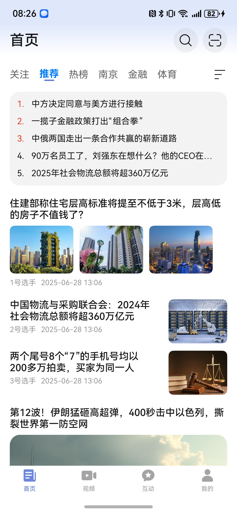
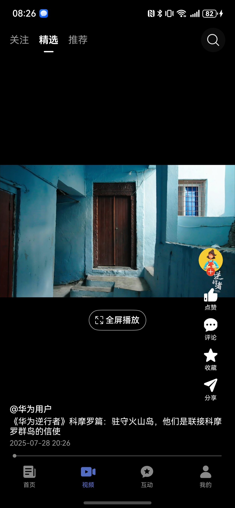
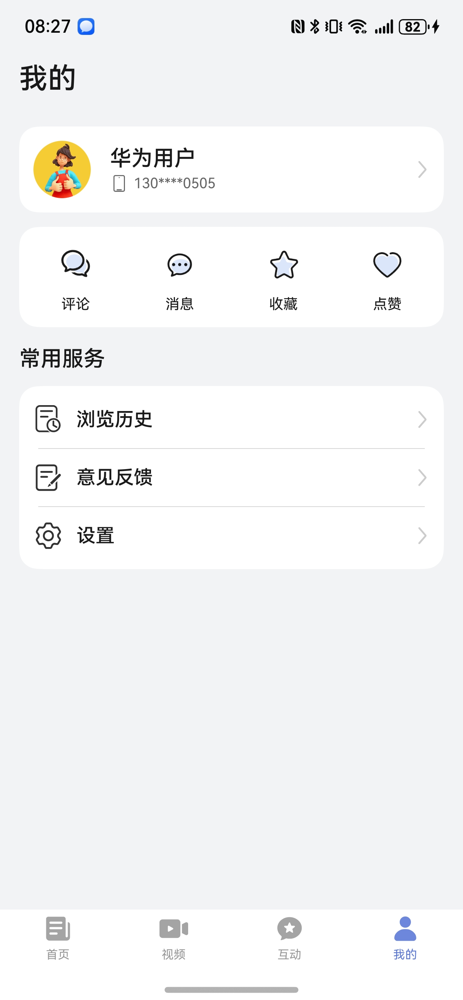
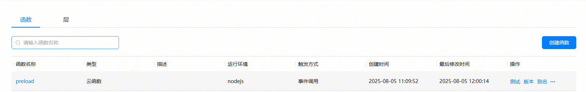
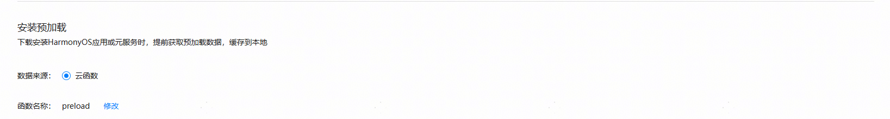

# 新闻（新闻）应用模板快速入门

## 目录

- [功能介绍](#功能介绍)
- [约束与限制](#约束与限制)
- [快速入门](#快速入门)
- [示例效果](#示例效果)
- [开源许可协议](#开源许可协议)

## 功能介绍

您可以基于此模板直接定制应用，也可以挑选此模板中提供的多种组件使用，从而降低您的开发难度，提高您的开发效率。

此模板提供如下组件，所有组件存放在工程根目录的components下，如果您仅需使用组件，可参考对应组件的指导链接；如果您使用此模板，请参考本文档。

| 组件                           | 描述                              | 使用指导                                              |
|:-----------------------------|:--------------------------------|:--------------------------------------------------|
| 新闻广告组件（module_advertisement） | 支持全屏广告、横幅广告                     | [使用指导](components/module_advertisement/README.md) |
| 频道编辑组件（module_channeledit）   | 支持频道添加、删除、拖拽排序                  | [使用指导](components/module_channeledit/README.md)   |
| 意见反馈组件（module_feedback）      | 支持提交问题反馈、查看反馈记录                 | [使用指导](components/module_feedback/README.md)      |
| 高亮组件（module_highlight）       | 支持根据关键字高亮显示文本中命中关键词的部分          | [使用指导](components/module_highlight/README.md)     |
| 图片预览组件（module_imagepreview）  | 支持预览图片、双指放大、缩小，滑动预览             | [使用指导](components/module_imagepreview/README.md)  |
| 发帖组件（module_post）            | 支持编辑互动发帖                        | [使用指导](components/module_post/README.md)          |
| 字体大小调节组件（module_setfontsize） | 支持实时查看字体大小调整效果                  | [使用指导](components/module_setfontsize/README.md)   |
| 分享组件（module_share）           | 支持微信、qq、系统分享                    | [使用指导](components/module_share/README.md)         |
| 短视频滑动组件（module_swipeplayer）  | 支持短视频上下滑动、横竖屏切换、长按倍速、播放进度条拖动等能力 | [使用指导](components/module_swipeplayer/README.md)   |
| 朗读组件（module_text_reader）     | 支持文本朗读                          | [使用指导](components/module_text_reader/README.md)   |

本模板为新闻类应用提供了常用功能的开发样例，模板主要分首页、视频、互动和我的四大模块：

* 首页：提供推荐新闻信息流、搜索、扫码、热榜、本地等功能。

* 视频：提供关注、精选、推荐短视频等功能。

* 互动：支持查看关注、推荐、附近博主发文、支持一键发帖。

* 我的：提供个人主页查看、评论、消息、管理收藏/点赞/浏览历史、意见反馈、设置等功能。

本模板已集成华为账号、推送、预加载、广告、朗读、微信登录等服务，只需做少量配置和定制即可快速实现华为账号的登录、新闻阅读等功能。

| 首页                                             | 视频                                              | 互动                                                    | 我的                                             |
|------------------------------------------------|-------------------------------------------------|-------------------------------------------------------|------------------------------------------------|
|  |  |  |  |

本模板主要页面及核心功能如下所示：

```text
综合新闻模板
  ├──首页                           
  │   ├──顶部栏-搜索  
  │   │   ├── 历史搜索                          
  │   │   └── 热门搜索                      
  │   │         
  │   ├──顶部栏-扫码         
  │   │                    
  │   ├──顶部栏-导航栏    
  │   │   ├── 关注、推荐、热榜、本地等                                             
  │   │   └── 频道编辑、顺序调整
  │   │
  │   ├──新闻列表    
  │   │   ├── 动态布局                                             
  │   │   ├── 信息流                         
  │   │   └── 广告 
  │   │
  │   └──新闻详情    
  │       ├── 图文                                             
  │       ├── 视频文                         
  │       ├── 听新闻
  │       ├── 收藏、点赞、评论                         
  │       ├── 分享（微信、朋友圈、QQ、生成海报、复制链接等）
  │       └── 相关推荐 
  │
  ├──视频                           
  │   ├──顶部栏  
  │   │   ├── 关注 
  │   │   ├── 精选
  │   │   ├── 推荐                         
  │   │   └── 搜索                      
  │   │         
  │   └──视频详情页         
  │       ├── 竖屏播放
  │       ├── 横屏播放
  │       ├── 暂停、播放、进度调节、倍速
  │       └── 关注、点赞、收藏、评论、分享                            
  │                        
  ├──互动                           
  │   ├──顶部栏  
  │   │   ├── 搜索                          
  │   │   ├── 发帖                                                   
  │   │   ├── 关注
  │   │   ├── 推荐                       
  │   │   └── 附近                      
  │   │         
  │   ├──帖子列表         
  │   │   ├── 图文                               
  │   │   └── 关注、点赞、评论、分享                            
  │   │                    
  │   └──帖子详情    
  │       ├── 图文                                             
  │       ├── 语音播报                         
  │       ├── 收藏/点赞/评论/分享                                 
  │       └── 相关推荐                       
  │
  └──我的                           
      ├──登录  
      │   ├── 华为账号一键登录                          
      │   ├── 微信登录                                                   
      │   ├── 账密登录
      │   └── 用户隐私协议同意                       
      │         
      ├──个人主页         
      │   ├── 头像、昵称、简介
      │   ├── 关注、粉丝、获赞
      │   └── 文章、视频、动态
      │                    
      ├──分类导航栏    
      │   ├── 评论                                        
      │   ├── 消息                   
      │   ├── 收藏                             
      │   └── 点赞
      │
      └──常用服务    
          ├── 浏览历史                                        
          ├── 意见反馈                   
          └── 设置
               ├── 编辑个人信息             
               ├── 隐私设置           
               ├── 通知开关  
               ├── 播放与网络设置             
               ├── 清理缓存           
               ├── 夜间模式 
               ├── 字体大小 
               ├── 检测版本 
               ├── 关于我们 
               └── 退出登录                               
```

本模板工程代码结构如下所示：

```text
ComprehensiveNews
├──commons
│  ├──lib_account/src/main/ets                            // 账号登录模块             
│  │    ├──components
│  │    │   └──AgreePrivacyBox.ets                        // 隐私同意勾选                  
│  │    ├──pages  
│  │    │   ├──HuaweiLoginPage.ets                        // 华为账号登录页面
│  │    │   ├──OtherLoginPage.ets                         // 其他方式登录页面
│  │    │   └──ProtocolWebView.ets                        // 协议H5                  
│  │    └──utils  
│  │        ├──HuaweiAuthUtils.ets                        // 华为认证工具类
│  │        ├──LoginSheetUtils.ets                        // 统一登录半模态弹窗
│  │        └──WXApiUtils.ets                             // 微信登录事件处理类 
│  │
│  ├──lib_common/src/main/ets                             // 基础模块             
│  │    ├──constants                                      // 通用常量 
│  │    ├──datasource                                     // 懒加载数据模型
│  │    ├──dialogs                                        // 通用弹窗 
│  │    ├──models                                         // 状态观测模型
│  │    ├──push                                           // 推送
│  │    └──utils                                          // 通用方法     
│  │
│  ├──lib_flex_layout/src/main/ets                        // 动态布局模块             
│  │    ├──components
│  │    │   ├──AddPlateComp.ets                           // 添加车牌组件
│  │    │   └──GuideListComp.ets                          // 指南列表组件                  
│  │    ├──sdk                                            // 动态布局核心sdk        
│  │    └──views
│  │        └──FlexLayout.ets                             // 动态布局列表页 
│  │
│  ├──lib_native_components/src/main/ets                  // 动态布局-原生模块             
│  │    ├──components
│  │    │   ├──AdvertisementCard.ets                      // 广告卡片
│  │    │   ├──FeedDetailsCard.ets                        // 动态卡片
│  │    │   ├──HotListServiceSwitchCard.ets               // 热榜切换组件
│  │    │   ├──HotNewsServiceCard.ets                     // 热榜新闻
│  │    │   ├──LeftTextRightImageCard.ets                 // 左文右图卡片
│  │    │   ├──TopTextBottomBigImageCard.ets              // 上文下图大卡
│  │    │   ├──TopTextBottomImageCard.ets                 // 上文下图卡片
│  │    │   ├──TopTextBottomVideoCard.ets                 // 上文下视频卡片
│  │    │   └──VerticalBigImageCard.ets                   // 上下布局大图
│  │    └─utils 
│  │        ├──Modifier.ets                               // 样式modifier
│  │        ├──NodeBuilderConfig.ets                      // node配置类
│  │        └──Utils.ets                                  // 工具方法             
│  │
│  ├──lib_news_api/src/main/ets                           // 服务端api模块             
│  │    ├──constants                                      // 常量文件    
│  │    ├──database                                       // 数据库 
│  │    ├──observedmodels                                 // 状态模型  
│  │    ├──params                                         // 请求响应参数 
│  │    ├──services                                       // 服务api  
│  │    └──utils                                          // 工具utils 
│  │
│  ├──lib_news_feed_details/src/main/ets                  // 新闻详情模块             
│  │    ├──components
│  │    │   ├──ArticleDetailsFooter.ets                   // 文章底部区域
│  │    │   ├──NewsContent.ets                            // 新闻主体内容
│  │    │   └──RecommendArea.ets                          // 相关推荐                  
│  │    └──views  
│  │        └──ArticleFeedDetails.ets                     // 新闻详情页      
│  │ 
│  └──lib_widget/src/main/ets                             // 通用UI模块             
│       └──components
│           ├──ButtonGroup.ets                            // 组合按钮
│           ├──CustomBadge.ets                            // 自定义信息标记组件
│           ├──EmptyBuilder.ets                           // 空白组件
│           └──NavHeaderBar.ets                           // 自定义标题栏
│
├──components
│  ├──module_advertisement                                // 广告组件                     
│  ├──module_channeledit                                  // 频道编辑组件
│  ├──module_feedback                                     // 意见反馈组件 
│  ├──module_feedcomment                                  // 评论组件
│  ├──module_highlight                                    // 高亮组件
│  ├──module_imagepreview                                 // 图片预览组件
│  ├──module_newsfeed                                     // 动态卡片组件
│  ├──module_post                                         // 发帖组件
│  ├──module_setfontsize                                  // 字体大小调节组件
│  ├──module_share                                        // 分享组件
│  ├──module_swipeplayer                                  // 视频组件
│  └──module_text_reader                                  // 朗读组件            
│      
├──features
│  ├──business_home/src/main/ets                          // 首页模块             
│  │    ├──components
│  │    │   └──NewsSearch.ets                             // 搜索页面                  
│  │    └──pages
│  │        └──HomePage.ets                               // 首页页面
│  │
│  ├──business_interaction/src/main/ets                   // 互动模块             
│  │    ├─components
│  │    │   ├──InteractionFeedCard.ets                    // 动态卡片
│  │    │   ├──InterActionTabContent.ets                  // 动态列表
│  │    │   ├──NoWatcher.ets                              // 暂无关注
│  │    │   └──TopBar.ets                                 // 顶部Tab                  
│  │    └──pages 
│  │        ├──InteractionPage.ets                        // 互动主页面
│  │        └──PublishPostPage.ets                        // 发帖页面                  
│  │
│  ├──business_mine/src/main/ets                          // 我的模块             
│  │    ├──components
│  │    │   ├──BaseMarkLikePage.ets                       // 收藏点赞基础页面
│  │    │   ├──CancelDialogBuilder.ets                    // 取消收藏点赞弹窗
│  │    │   ├──CommentRoot.ets                            // 主评论
│  │    │   ├──CommentSub.ets                             // 从属评论
│  │    │   ├──FanItem.ets                                // 粉丝单元
│  │    │   ├──IMItem.ets                                 // 私信单元
│  │    │   ├──MessageItem.ets                            // 消息单元
│  │    │   ├──SetReadIcon.ets                            // 标记已读
│  │    │   └──UniformNewsCard.ets                        // 统一新闻卡片                
│  │    └──pages 
│  │        ├──CommentPage.ets                            // 评论页面
│  │        ├──HistoryPage.ets                            // 我的历史
│  │        ├──LikePage.ets                               // 我的点赞
│  │        ├──MarkPage.ets                               // 我的收藏
│  │        ├──MessageCommentReplyPage.ets                // 评论与回复
│  │        ├──MessageFansPage.ets                        // 新增粉丝
│  │        ├──MessageIMChatPage.ets                      // 聊天页面
│  │        ├──MessageIMListPage.ets                      // 私信列表
│  │        ├──MessagePage.ets                            // 消息页面
│  │        ├──MessageSingleCommentList.ets               // 全部回复页面
│  │        ├──MessageSystemPage.ets                      // 系统消息
│  │        └──MinePage.ets                               // 我的页面              
│  │
│  ├──business_profile/src/main/ets                       // 个人主页模块             
│  │    ├──components
│  │    │   ├──AuthorItem.ets                             // 作者单元
│  │    │   ├──BaseFollowWatchPage.ets                    // 关注粉丝基础页面
│  │    │   ├──DialogLikeNum.ets                          // 获赞弹窗
│  │    │   ├──TabBar.ets                                 // 顶部Tab
│  │    │   ├──UniformNews.ets                            // 统一新闻卡片
│  │    │   ├──UserIntro.ets                              // 用户信息
│  │    │   └──WatchButton.ets                            // 关注按钮                
│  │    └──pages
│  │        ├──FollowerPage.ets                           // 粉丝页面
│  │        ├──PersonalHomePage.ets                       // 个人主页
│  │        └──WatchPage.ets                              // 关注页面  
│  │
│  ├──business_setting/src/main/ets                       // 设置模块             
│  │    ├──components
│  │    │   ├──SettingCard.ets                            // 设置卡片
│  │    │   └──SettingSelectDialog.ets                    // 设置选项弹窗               
│  │    └──pages
│  │        ├──SettingAbout.ets                           // 关于页面
│  │        ├──SettingFont.ets                            // 字体大小设置页面
│  │        ├──SettingH5.ets                              // H5页面
│  │        ├──SettingNetwork.ets                         // 播放与网络设置页面
│  │        ├──SettingPage.ets                            // 设置页面
│  │        ├──SettingPersonal.ets                        // 编辑个人信息页面
│  │        └──SettingPrivacy.ets                         // 隐私设置页面   
│  │ 
│  └──business_video/src/main/ets                         // 视频模块             
│       ├──components
│       │   ├──CommentView.ets                            // 评论视图
│       │   ├──Sidebar.ets                                // 侧边栏视图
│       │   ├──TabHeaderView.ets                          // 顶部Tab视图
│       │   └──VideoLayerView.ets                         // 视频外层操作层视图
│       ├──pages
│       │   ├──CommentViewPage.ets                        // 评论页面
│       │   ├──VideoDetailPage.ets                        // 视频详情页
│       │   └──VideoPage.ets                              // 视频首页
│       └──views
│           ├──FeaturedPage.ets                           // 精选页面               
│           ├──FollowPage.ets                             // 关注页面
│           ├──RecommendPage.ets                          // 推荐页面
│           └──VideoSwiperPage.ets                        // 短视频轮播页面
│
└──products
   └──phone/src/main/ets                                  // phone模块
        ├──common                        
        │   ├──AppTheme.ets                               // 应用主题色
        │   ├──Constants.ets                              // 业务常量
        │   ├──FormUtils.ets                              // 卡片Utils
        │   └──Types.ets                                  // 数据模型
        ├──components                    
        │   └──CustomTabBar.ets                           // 应用底部Tab
        ├──pages   
        │   ├──AgreeDialogPage.ets                        // 隐私同意弹窗
        │   ├──Index.ets                                  // 入口页面
        │   ├──IndexPage.ets                              // 应用主页面
        │   ├──PrivacyPage.ets                            // 查看隐私协议页面
        │   ├──SafePage.ets                               // 隐私同意页面
        │   ├──SplashPage.ets                             // 开屏广告页面
        │   └──StartPage.ets                              // 应用启动页面
        └──widget                                         // 服务卡片
 
```

## 约束与限制

### 环境

- DevEco Studio版本：DevEco Studio 5.0.3 Release及以上
- HarmonyOS SDK版本：HarmonyOS 5.0.3 Release SDK及以上
- 设备类型：华为手机（包括双折叠和阔折叠）
- 系统版本：HarmonyOS 5.0.1(13)及以上

### 权限

- 网络权限: ohos.permission.INTERNET, ohos.permission.GET_NETWORK_INFO, ohos.permission.GET_WIFI_INFO
- 跨应用关联权限: ohos.permission.APP_TRACKING_CONSENT

## 快速入门

### 配置工程

在运行此模板前，需要完成以下配置：

1. 在AppGallery Connect创建应用，将包名配置到模板中。

   a. 参考[创建HarmonyOS应用](https://developer.huawei.com/consumer/cn/doc/app/agc-help-create-app-0000002247955506)
   为应用创建APP ID，并将APP ID与应用进行关联。

   b. 返回应用列表页面，查看应用的包名。

   c. 将模板工程根目录下AppScope/app.json5文件中的bundleName替换为创建应用的包名。

2. 配置华为账号服务。

   a. 将应用的Client ID配置到products/phone/src/main路径下的module.json5文件中，
   详细参考：[配置Client ID](https://developer.huawei.com/consumer/cn/doc/harmonyos-guides/account-client-id)。

   b. 申请华为账号一键登录所需的quickLoginMobilePhone权限，详细参考：[配置scope权限](https://developer.huawei.com/consumer/cn/doc/harmonyos-guides/account-config-permissions)。

3. 配置推送服务。

   a. [开启推送服务](https://developer.huawei.com/consumer/cn/doc/harmonyos-guides/push-config-setting)。

   b. 按照需要的权益[申请通知消息自分类权益](https://developer.huawei.com/consumer/cn/doc/harmonyos-guides/push-apply-right)。

   c. [端云调试](https://developer.huawei.com/consumer/cn/doc/harmonyos-guides/push-server)。

4. 配置广告服务。

   a. 如果仅调测广告，可使用测试广告位ID：开屏广告：testd7c5cewoj6、横幅广告：testw6vs28auh3。

   b. 申请正式的广告位ID。
   登录[鲸鸿动能媒体服务平台](https://developer.huawei.com/consumer/cn/service/ads/publisher/html/index.html?lang=zh)
   进行申请，具体操作详情请参见[展示位创建](https://developer.huawei.com/consumer/cn/doc/distribution/monetize/zhanshiweichuangjian-0000001132700049)。

5. 配置预加载服务。

   a. [开通预加载](https://developer.huawei.com/consumer/cn/doc/harmonyos-guides/cloudfoundation-enable-prefetch)。

   b. [开通云函数](https://developer.huawei.com/consumer/cn/doc/harmonyos-guides/cloudfoundation-enable-function)。

   c. 打包云函数包：进入工程preload目录，将目录下的文件压缩为zip文件，注意进入文件夹中，全选文件，右击压缩。

   d. [创建云函数](https://developer.huawei.com/consumer/cn/doc/harmonyos-guides/cloudfoundation-create-and-config-function)。

    * “函数名称”为“preload”
    * “触发方式”为“事件调用”
    * “触发器类型”为“HTTP触发器”，其他保持默认
    * “代码输入类型”为“*.zip文件”，代码文件上传上一步打包的zip文件

    

   e. [配置安装预加载](https://developer.huawei.com/consumer/cn/doc/harmonyos-guides/cloudfoundation-prefetch-config)

   安装预加载函数名称配置为上一步创建的云函数

    

6. 接入微信SDK。
   前往微信开放平台申请AppID并配置鸿蒙应用信息，详情参考：[鸿蒙接入指南](https://developers.weixin.qq.com/doc/oplatform/Mobile_App/Access_Guide/ohos.html)。

7. 接入QQ。
   前往QQ开放平台申请AppID并配置鸿蒙应用信息，详情参考：[鸿蒙接入指南](https://wiki.connect.qq.com/sdk%e4%b8%8b%e8%bd%bd)。

8. 对应用进行[手工签名](https://developer.huawei.com/consumer/cn/doc/harmonyos-guides/ide-signing#section297715173233)。

9. 添加手工签名所用证书对应的公钥指纹，详细参考：[配置应用签名证书指纹](https://developer.huawei.com/consumer/cn/doc/app/agc-help-cert-fingerprint-0000002278002933)

### 运行调试工程

1. 连接调试手机和PC。

2. 菜单选择“Run > Run 'phone' ”或者“Run > Debug 'phone' ”，运行或调试模板工程。

## 示例效果

1. [首页](./screenshots/home.mp4)
2. [视频](./screenshots/video.mp4)
3. [互动](./screenshots/interaction.mp4)
4. [我的](./screenshots/mine.mp4)
5. [深色模式](./screenshots/dark.mp4)
6. [字体设置](./screenshots/fontsetting.mp4)

## 开源许可协议

该代码经过[Apache 2.0 授权许可](http://www.apache.org/licenses/LICENSE-2.0)。
