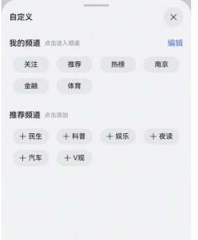

# 频道编辑组件快速入门

## 目录

- [简介](#简介)
- [约束与限制](#约束与限制)
- [快速入门](#快速入门)
- [API参考](#API参考)
- [示例代码](#示例代码)

## 简介

本组件支持添加分类、拖拽分类排序等。



## 约束与限制

### 环境

- DevEco Studio版本：DevEco Studio 5.0.3 Release及以上
- HarmonyOS SDK版本：HarmonyOS 5.0.3 Release SDK及以上
- 设备类型：华为手机（包括双折叠和阔折叠）
- 系统版本：HarmonyOS 5.0.1(13)及以上

## 快速入门

1. 安装组件。

   如果是在DevEvo Studio使用插件集成组件，则无需安装组件，请忽略此步骤。

   如果是从生态市场下载组件，请参考以下步骤安装组件。

   a. 解压下载的组件包，将包中所有文件夹拷贝至您工程根目录的XXX目录下。

   b. 在项目根目录build-profile.json5添加module_channeledit模块。

   ```
   // 项目根目录下build-profile.json5填写module_channeledit路径。其中XXX为组件存放的目录名
   "modules": [
     {
       "name": "module_channeledit",
       "srcPath": "./XXX/module_channeledit"
     }
   ]
   ```

   c. 在项目根目录oh-package.json5添加依赖。

   ```
   // XXX为组件存放的目录名称
   "dependencies": {
     "module_channeledit": "file:./XXX/module_channeledit"
   }
   ```

2. 引入组件。

   ```
   import { ChannelEdit } from 'module_channeledit';
   ```

## API参考

### 接口

ChannelEdit(option: [ChannelEditOptions](#ChannelEditOptions对象说明))

频道编辑组件参数。

**参数：**

| 参数名     | 类型                                            | 是否必填 | 说明       |
|---------|-----------------------------------------------|------|----------|
| options | [ChannelEditOptions](#ChannelEditOptions对象说明) | 否    | 频道编辑组件参数 |


#### ChannelEditOptions对象说明

| 参数名           | 类型                                   | 是否必填 | 说明      |
|:--------------|:-------------------------------------|:-----|:--------|
| channelsList  | [TabInfo](#TabInfo对象说明)[] | 否    | 数据源     |
| currentIndex  | number                               | 否    | 当前选择的索引 |
| fontSizeRatio | number                               | 否    | 文字缩放倍率  |

#### TabInfo对象说明

| 参数名        | 类型          | 是否必填 | 说明      |
|:-----------|:------------|:-----|:--------|
| id         | string      | 是    | 数据源枚举id |
| text       | ResourceStr | 是    | 数据源文本   |
| selected   | boolean     | 是    | 是否被选中   |
| order      | number      | 是    | 顺序      |
| disabled   | boolean     | 是    | 是否被禁用   |
| visibility | Visibility  | 是    | 是否显示    |

### 事件

支持以下事件：

#### onSave

onSave: (select: [TabInfo](#TabInfo对象说明)[], unselect: [TabInfo](#TabInfo对象说明)[]) => void

拖拽，删除增加的回调

#### onChange

onChange: (index: number, item: [TabInfo](#TabInfo对象说明)) => void

顶部栏切换的回调

## 示例代码

```ts
import { ChannelEdit, TabInfo } from 'module_channeledit';

@Entry
@ComponentV2
export struct Index {
  @Local currentIndex:number =1
  @Local channelsList:TabInfo[] = [{
    'text': '关注',
    'id': 'follow',
    'selected': true,
    'order': 1,
    'disabled': true,
  }, {
    'text': '推荐',
    'id': 'recommend',
    'selected': true,
    'order': 2,
    'disabled': true,
  }, {
    'text': '热榜',
    'id': 'hotService',
    'selected': true,
    'order': 3,
    'disabled': true,
  }, {
    'text': '南京',
    'id': 'location',
    'selected': true,
    'order': 4,
  }, {
    'text': '金融',
    'id': 'finance',
    'selected': true,
    'order': 5,
  }, {
    'text': '体育',
    'id': 'sports',
    'selected': true,
    'order': 6,
  }, {
    'text': '民生',
    'id': 'people',
    'selected': false,
    'order': 6,
  }, {
    'text': '科普',
    'id': 'science',
    'selected': false,
    'order': 6,
  }, {
    'text': '娱乐',
    'id': 'fun',
    'selected': false,
    'order': 6,
  }, {
    'text': '夜读',
    'id': 'read',
    'selected': false,
    'order': 6,
  }, {
    'text': '汽车',
    'id': 'car',
    'selected': false,
    'order': 6,
  }, {
    'text': 'V观',
    'id': 'view',
    'selected': false,
    'order': 6,
  }]

  build() {
    Column(){
      ChannelEdit({
        channelsList: this.channelsList,
        fontSizeRatio: 1,
        currentIndex: this.currentIndex,
        onChange: (index: number, item: TabInfo) => {
          this.currentIndex = index
          console.log('index',index)
        },
        onSave: () => {
          console.log('save')
        },
      })
    }
  }
}
```