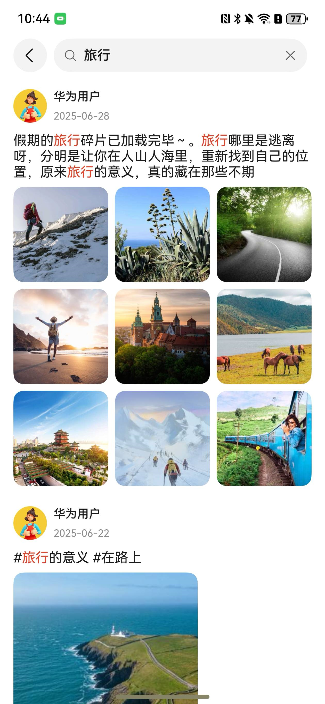

# 高亮组件快速入门

## 目录

- [简介](#简介)
- [约束与限制](#约束与限制)
- [快速入门](#快速入门)
- [API参考](#API参考)
- [示例代码](#示例代码)

## 简介

本组件支持根据关键词实现文本高亮。



## 约束与限制

### 环境

- DevEco Studio版本：DevEco Studio 5.0.3 Release及以上
- HarmonyOS SDK版本：HarmonyOS 5.0.3 Release SDK及以上
- 设备类型：华为手机（包括双折叠和阔折叠）
- 系统版本：HarmonyOS 5.0.1(13)及以上

## 快速入门

1. 安装组件。

   如果是在DevEvo Studio使用插件集成组件，则无需安装组件，请忽略此步骤。

   如果是从生态市场下载组件，请参考以下步骤安装组件。

   a. 解压下载的组件包，将包中所有文件夹拷贝至您工程根目录的XXX目录下。

   b. 在项目根目录build-profile.json5添加module_highlight模块。

   ```
   // 项目根目录下build-profile.json5填写module_highlight路径。其中XXX为组件存放的目录名
   "modules": [
     {
       "name": "module_highlight",
       "srcPath": "./XXX/module_highlight"
     }
   ]
   ```

   c. 在项目根目录oh-package.json5添加依赖。

   ```
   // XXX为组件存放的目录名称
   "dependencies": {
     "module_highlight": "file:./XXX/module_highlight"
   }
   ```

2. 引入组件。

   ```
   import { Highlight } from 'module_highlight';
   ```

## API参考

### 接口

Highlight(option: [HighlightOptions](#HighlightOptions对象说明))

文本高亮组件的参数

**参数：**

| 参数名     | 类型                                                    | 是否必填 | 说明         |
|:--------|:------------------------------------------------------|:-----|:-----------|
| options | [HighlightOptions](#HighlightOptions对象说明) | 否    | 配置文本高亮组件的参数。 |


#### HighlightOptions对象说明

| 参数名               | 类型               | 是否必填 | 说明                               |
|:------------------|:-----------------|:-----|:---------------------------------|
| keywords          | string[]         | 否    | 高亮关键字                            |
| sourceString      | string           | 否    | 源文本                              |
| textColor         | ResourceColor    | 否    | 文字颜色，默认 sys.color.font_primary   |
| highLightColor    | ResourceColor    | 否    | 高亮文字颜色，默认 sys.color.font_primary |
| textFontSize      | string \| number | 否    | 文字大小                             |
| textFontWeight    | FontWeight       | 否    | 高亮文本weight                       |
| highLightFontSize | string \| number | 否    | 高亮文字大小                           |
| maxLines          | number           | 否    | 最大行数                             |
| overflow          | TextOverflow     | 否    | 超出隐藏                             |

## 示例代码

```ts
import { Highlight } from 'module_highlight'

@Entry
@ComponentV2
export struct Index {

  build() {
    Column(){
      Highlight({
        keywords: ['旅行'],
        sourceString: '假期的旅行碎片已加载完毕～。旅行哪里是逃离呀，分明是让你在人山人海里，重新找到自己的位置',
        highLightColor: '#E84026',
        textColor: $r('sys.color.font_primary'),
      })
    }
  }
}
```