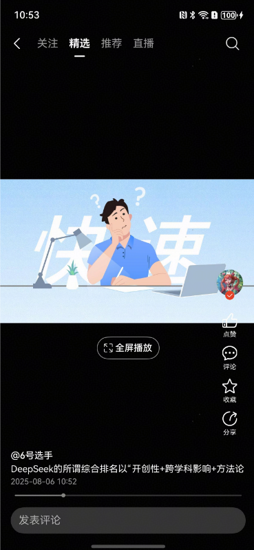
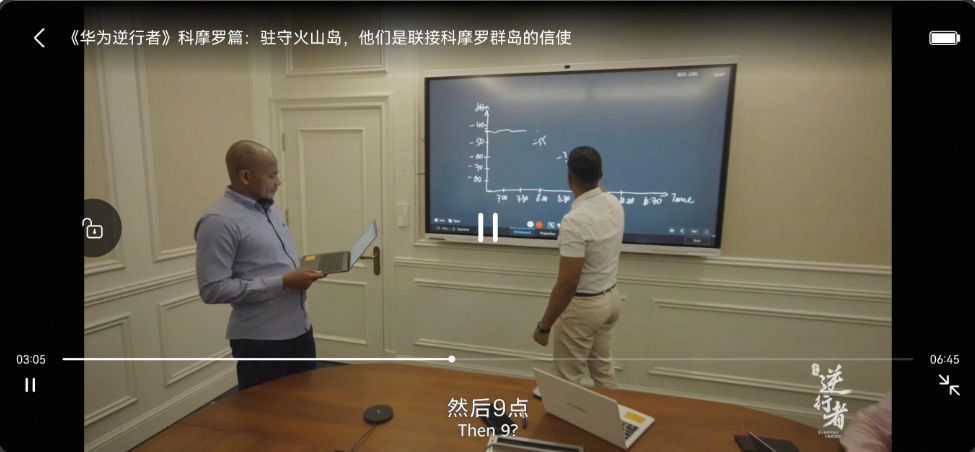

# 短视频滑动组件快速入门

## 目录

- [简介](#简介)
- [约束与限制](#约束与限制)
- [快速入门](#快速入门)
- [API参考](#API参考)
- [示例代码](#示例代码)

## 简介

本组件实现短视频切换场景，提供了短视频上下滑动、横竖屏切换、长按倍速、播放进度条拖动等能力。

| 竖屏                                                         | 横屏                                                         |
| ------------------------------------------------------------ | ------------------------------------------------------------ |
|  |  |

## 约束与限制

### 环境

- DevEco Studio版本：DevEco Studio 5.0.3 Release及以上
- HarmonyOS SDK版本：HarmonyOS 5.0.3 Release SDK及以上
- 设备类型：华为手机（包括双折叠和阔折叠）
- 系统版本：HarmonyOS 5.0.1(13)及以上

### 权限

- 网络权限：ohos.permission.INTERNET、ohos.permission.GET_NETWORK_INFO、ohos.permission.GET_WIFI_INFO

## 快速入门

1. 安装组件。

   如果是在DevEvo Studio使用插件集成组件，则无需安装组件，请忽略此步骤。

   如果是从生态市场下载组件，请参考以下步骤安装组件。

   a. 解压下载的组件包，将包中所有文件夹拷贝至您工程根目录的XXX目录下。

   b. 在项目根目录build-profile.json5添加module_swipeplayer模块。

   ```
   // 项目根目录下build-profile.json5填写module_swipeplayer路径。其中XXX为组件存放的目录名
   "modules": [
     {
       "name": "module_swipeplayer",
       "srcPath": "./XXX/module_swipeplayer"
     },
   ]
   ```

   c. 在项目根目录oh-package.json5添加依赖。
   ```
   // XXX为组件存放的目录名称
   "dependencies": {
      "module_swipeplayer": "file:./XXX/module_swipeplayer"
   }
   ```
   
2. 引入组件。

    ```typescript
    import { VideoSwipePlayer, SwipePlayerController, AVPlayerManager, AVPlayerSession, PlayerDataSource } from 'module_swipeplayer';
    ```

## API参考

### VideoSwipePlayer(option: [VideoSwipePlayerOptions](#VideoSwipePlayerOptions对象说明))

#### VideoSwipePlayerOptions对象说明

| 参数名                | 类型                                                         | 是否必填 | 说明                                                       |
| :-------------------- | :----------------------------------------------------------- | :------- | :--------------------------------------------------------- |
| datasource            | IDataSource                                                  | 是       | 视频列表的懒加载数据源                                     |
| swipePlayerController | [SwipePlayerController](#SwipePlayerController对象说明)      | 是       | 视频滑动播放控制器                                         |
| options               | [SwipePlayerOptions](#SwipePlayerOptions对象说明)            | 是       | 配置的信息                                                 |
| videoLayerBuilder     | WrappedBuilder<[ESObject, [AVPlayerSession](#AVPlayerSession对象说明), [SwipePlayerController](#SwipePlayerController对象说明), [PlayerLayoutSize](#PlayerLayoutSize对象说明)]> | 否       | 视频外层的操作层，可自定义，如果不传，则只显示进度条       |
| fullBtnBuilder        | () => CustomBuilder                                          | 否       | 全屏播放按钮，可以自定义，如果不传，使用默认样式           |
| pathStack             | NavPathStack                                                 | 是       | 全局Navigation的路由栈                                     |
| playerStateCallback   | (state: string, id: string) => void                          | 否       | 播放状态回调。state：视频的播放状态，id： 当前播放视频的id |

#### SwipePlayerController对象说明

| 参数名           | 类型                                        | 是否必填 | 说明                 |
| :--------------- | :------------------------------------------ | :------- | :------------------- |
| avPlayerMgr      | [AVPlayerManager](#AVPlayerManager对象说明) | 是       | 播放器管理           |
| curentIndex      | number                                      | 是       | 当前播放视频的索引   |
| swiperController | SwiperController                            | 是       | 限制资源选择最大大小 |

#### SwipePlayerOptions对象说明

| 参数名          | 类型                                      | 是否必填 | 说明                                             |
| :-------------- | :---------------------------------------- | :------- | :----------------------------------------------- |
| cachedCount     | number                                    | 否       | 懒加载缓存的个数。默认2个                        |
| autoPlay        | boolean                                   | 否       | 视频是否自动播放                                 |
| swiperCallback  | [SwiperCallback](#SwiperCallback对象说明) | 否       | Swiper组件的onChange、onAnimationStart的回调事件 |
| bottomTabHeight | number                                    | 否       | 底部tab栏的高度                                  |
| totalCount      | number                                    | 否       | 视频列表的总数，用来判断是否滑动最后一个         |

#### PlayerLayoutSize对象说明

| 参数名                     | 类型                               | 说明                 |
| :------------------------- | :--------------------------------- | :------------------- |
| updateXComponentWidth      | (xComponentWidth: Length) => void  | 更新XComponent的宽度 |
| getXComponentWidth         | () => Length                       | 获取XComponent的宽度 |
| updateXComponentHeight     | (xComponentHeight: Length) => void | 更新XComponent的高度 |
| getXComponentHeight        | () => Length                       | 获取XComponent的高度 |
| updateLayoutSizeChangeFlag | (flag: boolean) => void            | 设置尺寸的变化标识   |
| getLayoutSizeChangeFlag    | () => boolean                      | 获取尺寸的变化标识   |

#### SwiperCallback对象说明

| 参数名           | 类型                                                         | 说明                                   |
| :--------------- | :----------------------------------------------------------- | :------------------------------------- |
| onChange         | (index: number) => void                                      | Swiper组件的onChange事件的回调         |
| onAnimationStart | (index: number, targetIndex: number, extraInfo: SwiperAnimationEvent) => void | Swiper组件的onAnimationStart事件的回调 |

#### AVPlayerManager对象说明

| 参数名         | 类型                                                | 说明                                    |
| :------------- | :-------------------------------------------------- | :-------------------------------------- |
| getInstance    | () => AVPlayerManager                               | 获取AVPlayerManager单实例对象           |
| createAVPlayer | () => Promise<media.AVPlayer \|undefined>           | 创建AVPlayer对象                        |
| getAVPlayer    | (index: number) => media.AVPlayer \| undefined      | 根据索引获取AVPlayer对象                |
| play           | (index: number) => Promise<void>                    | 播放某个index的视频                     |
| pause          | (index: number) => Promise<void>                    | 暂停某个index的视频                     |
| release        | (index: number) => Promise<void>                    | 释放某个index的视频                     |
| seek           | (index: number, timeMs: number) => void             | 设置某个index视频跳转到某个时间位置播放 |
| setSpeed       | (index: number, speed: media.PlaybackSpeed) => void | 设置播放速度                            |

#### AVPlayerSession对象说明

| 参数名           | 类型                        | 说明                       |
| :--------------- | :-------------------------- | :------------------------- |
| avPlayer         | media.AVPlayer \| undefined | AVPlayer对象               |
| avPlayerCallback | Map                         | AVPlayer对象的事件监听回调 |
| play             | () => Promise<void>         | 播放AVplayer               |
| pause            | () => Promise<void>         | 暂停AVPlayer               |


## 示例代码

该示例由Index.ets 和 SwipeVideoPage.ets两个文件组成，主要演示从Index页面使用Navigation跳转到SwipeVideoPage视频滑动页面。滑动页跳转到横屏页时，通过自定义转场动画，实现一镜到底的效果。

横屏页面是组件内部的页面。不需要自行实现。

示例代码使用Navigation，运行示例代码之前需要进行系统路由表的配置，具体操作如下：
在entry/src/main目录下的工程配置文件[module.json5](https://developer.huawei.com/consumer/cn/doc/harmonyos-guides/module-configuration-file)中的module字段里配置 "routerMap": "$profile:route_map"，

在entry/src/main/resources/base/profile目录下新增route_map.json文件，文件内容如下：

```typescript
{
  "routerMap": [
    {
      "name": "SwipeVideoPage",
      "pageSourceFile": "src/main/ets/pages/SwipeVideoPage.ets",
      "buildFunction": "SwipeVideoPageBuilder"
    }
  ]
}
```

```typescript
// Index.ets
import { AnimateCallback, CustomTransition } from 'module_swipeplayer';

@Entry
@Component
struct Index {
  // 全局navigation的路由栈
  pageStack: NavPathStack = new NavPathStack();
  // 运行自定义转场动画的路由页面 From、To，主要是针对滑动页跳转到横屏页时，实现一镜到底的效果
  allowedCustomTransitionFromPageNames: string[] = ['SwipeVideoPage'];
  allowedCustomTransitionToPageNames: string[] = ['LandscapeVideo'];

  aboutToAppear(): void {
    this.pageStack.pushPathByName('SwipeVideoPage', '')
  }

  // 通过from和to的name对自定义转场路由进行管控，判断页面是否需要进行自定义转场动画
  isCustomTransitionEnabled(fromName: string, toName: string): boolean {
    if ((this.allowedCustomTransitionFromPageNames.includes(fromName) &&
    this.allowedCustomTransitionToPageNames.includes(toName)) ||
      (this.allowedCustomTransitionFromPageNames.includes(toName) &&
      this.allowedCustomTransitionToPageNames.includes(fromName))) {
      return true;
    }
    return false;
  }

  // 注册自定义转场动画
  customNavContentTransitionCallback(
    from: NavContentInfo,
    to: NavContentInfo,
    operation: NavigationOperation
  ): NavigationAnimatedTransition | undefined {
    if ((!from || !to) || (!from.name || !to.name)) {
      return undefined;
    }
    // 通过from和to的name对自定义转场路由进行管控
    if (!this.isCustomTransitionEnabled(from.name, to.name)) {
      return undefined;
    }
    // 需要对转场页面是否注册了animation进行判断，来决定是否进行自定义转场
    let fromParam: AnimateCallback = CustomTransition.getInstance().getAnimateParam(from.index);
    let toParam: AnimateCallback = CustomTransition.getInstance().getAnimateParam(to.index);
    if (!fromParam.animation || !toParam.animation) {
      return undefined;
    }
    // 构造customAnimation给系统侧调用，执行自定义转场动画
    let customAnimation: NavigationAnimatedTransition = {
      onTransitionEnd: (isSuccess: boolean) => {
      },
      timeout: 2000,
      transition: (transitionProxy: NavigationTransitionProxy) => {
        if (fromParam.animation) {
          fromParam.animation(operation === NavigationOperation.PUSH, true, transitionProxy);
        }
        if (toParam.animation) {
          toParam.animation(operation === NavigationOperation.PUSH, false, transitionProxy);
        }
      }
    };
    return customAnimation;
  }

  build() {
    Navigation(this.pageStack) {
    }
    .hideNavBar(true)
    .hideTitleBar(true)
    .customNavContentTransition((from: NavContentInfo, to: NavContentInfo, operation: NavigationOperation) => {
      return this.customNavContentTransitionCallback(from, to, operation)
    })
  }
}
```


```ts
// SwipeVideoPage.ets
import {
  VideoSwipePlayer,
  AVPlayerManager,
  AVPlayerSession,
  PlayerDataSource,
  SwipePlayerController,
  PlayerLayoutSize,
  VideoPlayerData,
  CustomTransition,
} from 'module_swipeplayer';

interface VideoInfo {
  // 视频id
  id: string
  // 标题
  title: string
  // 视频url
  videoUrl: string
  // 封面图
  coverUrl: string
  // 视频时长(单位: 毫秒)
  videoDuration: number
}

class VideoData implements VideoInfo, VideoPlayerData {
  // 视频id
  id: string = ''
  // 标题
  title: string = ''
  // 视频url
  videoUrl: string = ''
  // 封面图
  coverUrl: string = ''
  // 视频时长(单位: 毫秒)
  videoDuration: number = 0

  constructor(data: VideoInfo) {
    this.id = data.id
    this.title = data.title
    this.videoUrl = data.videoUrl
    this.coverUrl = data.coverUrl
    this.videoDuration = data.videoDuration
  }

  getVideoId(): string {
    return this.id;
  }

  getVideoUrl(): string {
    return this.videoUrl;
  }

  getCoverUrl(): string {
    return this.coverUrl;
  }

  getVideoTitle(): string {
    return this.title;
  }

  getVideoDuration(): number {
    return this.videoDuration;
  }
}

// 视频外层控制层视图
@ComponentV2
struct VideoLayer {
  // 视频数据
  @Param @Require videoData: ESObject;
  // 播放会话
  @Param @Require playerSession: AVPlayerSession;
  // 滑动播放控制器
  @Param @Require swipePlayerController: SwipePlayerController
  // 评论页面出现时，改变播放页面的尺寸
  @Param @Require playerLayoutSize: PlayerLayoutSize

  // 播放、暂停切换
  switchPlayOrPause() {
    let avPlayer = this.swipePlayerController.getAVPlayer()
    let state = avPlayer?.state
    if (state === 'playing') {
      avPlayer?.pause()
    } else {
      avPlayer?.play()
    }
  }

  build() {
    Stack({ alignContent: Alignment.Center }) {
      Text('这是自定义的外层操作层')
        .fontSize(30)
        .fontColor($r('sys.color.white'))
    }.height('100%')
    .width('100%')
    .onClick(() => {
      this.switchPlayOrPause()
    })
  }
}

@Builder
function VideoLayerViewBuilder(
  videoData: ESObject,
  playerSession: AVPlayerSession,
  swipePlayerController: SwipePlayerController,
  playerLayoutSize: PlayerLayoutSize
) {
  VideoLayer({
    videoData,
    playerSession,
    swipePlayerController,
    playerLayoutSize,
  })
}

// 滑动视频页
@Builder
export function SwipeVideoPageBuilder() {
  SwipeVideoPage()
}

@ComponentV2
export struct SwipeVideoPage {
  // 数据源
  videoDataSources = new PlayerDataSource<VideoData>()
  // 播放控制器
  swipePlayerController: SwipePlayerController = new SwipePlayerController();
  // 播放管理
  avPlayerManager: AVPlayerManager = new AVPlayerManager();
  // 路由栈
  pathStack = new NavPathStack()
  // 自定义转场动画 页面id
  private pageId: number = -1;

  aboutToAppear() {
    // 设置播放管理
    this.swipePlayerController.setAVPlayerMgr(this.avPlayerManager)

    // 初始化数据
    let data1 = {
      id: 'video1',
      title: '新通话，让每一次连接超越想象',
      videoUrl: 'https://www-file.huawei.com/admin/asset/v1/pro/view/a20e0965e56a4dc498fc33ee23750c0d.mp4',
      coverUrl: 'https://www-file.huawei.com/admin/asset/v1/pro/view/6c813cb0874744f4b54fd61f1f9e8f24.jpg',
      videoDuration: 134506
    } as VideoInfo

    let data2 = {
      id: 'video2',
      title: '星联光模块',
      videoUrl: 'https://e-file.huawei.com/mediares/MarketingMaterial_MCD/EBG/PUBLIC/zh/2025/04/5feb8457-d5e9-4949-a181-795e4d873af9.mp4',
      coverUrl: 'https://e-file.huawei.com/mediares/Video_MCD/EBG/PUBLIC/zh/2025/04/3c04b872-197d-4551-a353-0eb99def6ca2.png',
      videoDuration: 48234
    } as VideoInfo

    let list: VideoData[] = [
      new VideoData(data1),
      new VideoData(data2),
    ]
    this.videoDataSources.setData(list)
  }

  // 注册自定义动画协议
  private registerCustomTransition(): void {
    CustomTransition.getInstance().registerNavParam(this.pageId,
      (isPush: boolean, isExit: boolean, transitionProxy: NavigationTransitionProxy) => {}, 500);
  }

  build() {
    NavDestination() {
      Stack() {
        Column() {
          VideoSwipePlayer({
            // 数据源
            datasource: this.videoDataSources,
            // 滑动播放控制器
            swipePlayerController: this.swipePlayerController,
            // 视频外层控制层，需要实现一个WrappedBuilder组件
            videoLayerBuilder: wrapBuilder(VideoLayerViewBuilder),
            pathStack: this.pathStack,
            options: {
              autoPlay: true,
              bottomTabHeight: 56,
              totalCount: 2,
              swiperCallback: {
                onAnimationStart: (_index: number, targetIndex: number, extraInfo: SwiperAnimationEvent) => {
                  // TODO 处理切换动画开始的业务逻辑，如：加载更多
                },
                onChange: (index: number) => {
                  // TODO 子组件索引变化时的回调
                }
              }
            }
          })
        }
        .layoutWeight(1)
      }
      .width('100%')
      .height('100%')
    }
    .hideTitleBar(true)
    .onReady((context: NavDestinationContext) => {
      this.pathStack = context.pathStack
      // 自定义动画所需的pageId
      if (context.pathStack.getAllPathName()?.length) {
        this.pageId = context.pathStack.getAllPathName().length - 1;
      }
      this.registerCustomTransition();
    })
    .onDisAppear(() => {
      CustomTransition.getInstance().unRegisterNavParam(this.pageId);
    })
  }
}
```
