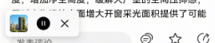

# 朗读组件快速入门

## 目录

- [简介](#简介)
- [约束与限制](#约束与限制)
- [快速入门](#快速入门)
- [API参考](#API参考)
- [示例代码](#示例代码)

## 简介

本组件支持新闻类文章阅读。



## 约束与限制

### 环境

- DevEco Studio版本：DevEco Studio 5.0.3 Release及以上
- HarmonyOS SDK版本：HarmonyOS 5.0.3 Release SDK及以上
- 设备类型：华为手机（包括双折叠和阔折叠）
- 系统版本：HarmonyOS 5.0.1(13)及以上

### 权限

- 网络权限：ohos.permission.INTERNET

## 快速入门

1. 安装组件。

   如果是在DevEvo Studio使用插件集成组件，则无需安装组件，请忽略此步骤。

   如果是从生态市场下载组件，请参考以下步骤安装组件。

   a. 解压下载的组件包，将包中所有文件夹拷贝至您工程根目录的XXX目录下。

   b. 在项目根目录build-profile.json5添加module_text_reader模块。

   ```
   // 项目根目录下build-profile.json5填写module_text_reader路径。其中XXX为组件存放的目录名
   "modules": [
     {
       "name": "module_text_reader",
       "srcPath": "./XXX/module_text_reader"
     }
   ]
   ```

   c. 在项目根目录oh-package.json5添加依赖。

   ```
   // XXX为组件存放的目录名称
   "dependencies": {
     "module_text_reader": "file:./XXX/module_text_reader"
   }
   ```

2. 引入组件。

   ```
   import { ReadNewsComponent } from 'module_text_reader';
   ```

## API参考

### 接口

ReadNewsComponent(option: [ReadNewsComponentOptions](#ReadNewsComponentOptions对象说明))

文本阅读组件的参数

**参数：**

| 参数名     | 类型                                                    | 是否必填 | 说明         |
|:--------|:------------------------------------------------------|:-----|:-----------|
| options | [ReadNewsComponentOptions](#ReadNewsComponentOptions对象说明) | 否    | 配置文本阅读组件的参数。 |

#### ReadNewsComponentOptions对象说明

| 参数名        | 类型     | 是否必填 | 说明      |
|:-----------|:-------|:-----|:--------|
| currentId  | string | 是    | 数据源id   |
| body       | string | 是    | 当前阅读文本  |
| title      | string | 是    | 当前文本标题  |
| author     | string | 是    | 当前文本作者  |
| date       | string | 是    | 当前文本日期  |
| bundleName | string | 是    | 项目包名    |
| coverImage | string | 是    | 当前阅读器封面 |


### 事件

支持以下事件：

#### stateChange

stateChange: () => void = () => {}

阅读器状态切换的回调

## 示例代码

```ts
import { ReadNewsComponent } from 'module_text_reader';

@Entry
@ComponentV2
export struct Index {
  build() {
    Column(){
        ReadNewsComponent({
         author: '1号选手',
         date: '2025-8-4 10:26',
         title: '住建部称住宅层高标准将提至不低于3米，层高低的房子不值钱了？',
         coverImage: 'https://agc-storage-drcn.platform.dbankcloud.cn/v0/news-hnp2d/news_1.jpg',
         bundleName: '综合新闻模板',
         currentId: 'article_6',
         body: '住建部称住宅层高标准将提至不低于3米，层高低的房子不值钱了？在十四届全国人大三次会议民生主题记者会上，住房城乡建设部部长倪虹表示，要加快建设“好房子”，并将住宅层高标准提高到不低于3米。这一政策不仅顺应了百姓对居住品质日益提高的需求，更标志着我国住宅建设从“住有所居”迈向“宜居优居”的新阶段。提高住宅的层高，可以显著提升居住空间的舒适度，增加净空高度，缓解大户型的空间压抑感，同时也为建筑立面增大开窗采光面积提供了可能性，有利于自然通风，让室内阳光更加充足，让居住环境更加健康舒适。随着人们对居住品质追求的不断提升，地暖、新风系统、中央空调等设备逐渐成为改善型住宅的“标配”。“3米层高”，能为这些设备提供充足的安装空间，确保设备高效运行，进一步提升室内环境的舒适度。可以说，“将住宅层高标准提高到不低于3米”，是通过政策引领推动技术创新的重要举措，将鼓励开发企业、设计师探索更人性化的居住空间解决方案，进而推动住宅品质的提升。事实上，层高对于房子价值的影响，不能一概而论。房子的价值，受到地段、配套、交通、环境等多种因素的综合影响。即使层高较低，但如果房子位于城市核心地段，周边配套设施完善，交通便利，环境优美，那么其价值依然可能较高。',
       })
    }
  }
}
```